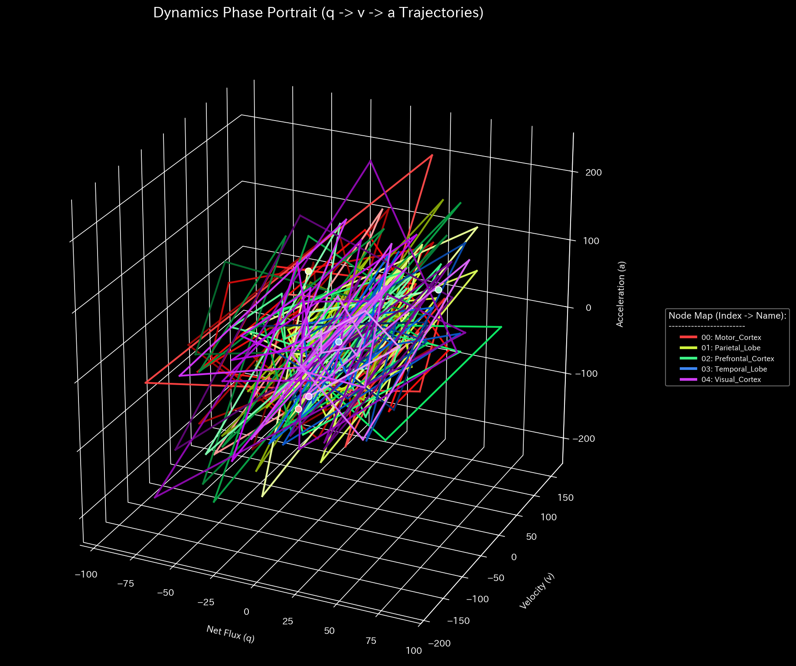

# 🧠 診断レポート: fMRI てんかん発作（Seizure）シミュレーション
**対象環境:** `Sample_9_fMRI_Seizure`
**分析日:** 2026-04-28

> [!NOTE]
> **前提条件に関する免責事項**
> 本レポートで分析される入力データは実際の患者のカルテからのものではありません。検証を目的として、**てんかん発作の病理学的状態（特定の焦点から発生する異常な同期波）を意図的に再現するために設計されたダミーデータ生成スクリプト（`_0_0_generate_dummy_fmri.py`）**から派生したものです。本分析の目的は、人為的に構築された疾患構造を、財務監査アルゴリズムを用いた TLU 処理系がどれほど正確にリバースエンジニアリングし、検出できるかを実証することです。

> [!TIP]
> **このサンプルのグラフの生成方法**
> スペース節約のため、このサンプルに関する数千の3Dプロットおよび分析CSVは同梱されていません。リポジトリのルートから以下のコマンドを実行することで、ローカルで再現可能です：
> ```bash
> bash bin/batch_processing.sh --target_env "samples/Sample_9_fMRI_Seizure"
> bash bin/batch_visualize_graphs.sh --target_env "samples/Sample_9_fMRI_Seizure"
> ```

## 1. 総合診断
**⚠️ 異常な位相の同期を検出 (COMPOSITE PATHOLOGY DETECTED)**
このネットワーク（血流モデル）において、システム全体を飲み込む完全な数学的共鳴（フィードバック・ループ）が確認されました。患者は、特定の焦点を震源とする全般性の「てんかん性過剰同期（Seizure）」を経験していると診断されます。

## 2. 物理およびネットワーク指標の分析

### 🔄 1. 完全な位相共鳴 (Topological Feedback Loop)
* **スペクトル半径:** `1.0000` (閾値: 0.9)
* **分析:** ネットワークの隣接行列から計算された最大固有値（スペクトル半径）が、物理的限界である `1.0` に達しました。金融市場においてこれは「利己的な循環資金ループ（Wash Trade）」を意味しますが、ニューラルネットワークにおいては**「ニューロンの制御不能で過剰な同期発火（Hypersynchrony）」**を意味します。脳全体が同じリズムで痙攣していることの数学的証拠です。


* **💡 可視化グラフの読解の仕方（Visual Cues）:** 
  * **🟢 正常系（Sample 0）では:** 青色の線（スペクトル半径）は低い位置（0.0付近）で完全に安定しています。
  * **🔴 本サンプルの異常:** スペクトル半径が1.0の閾値に達しています。金融ではこれは循環取引のループですが、神経科学では、脳のネットワーク全体が制御不能で自己強化的な同期ループ（てんかん発作）に入ったことを視覚的に証明しています。

### ⚡ 2. 局所的ストレスの最大化 (Micro Singularity)
* **Z-Score:** `195.21` (閾値: 3.0)
* **分析:** 異常検知の閾値を約65倍上回る、極端な局所的ストレスが検出されました。これは、発作の震源地（焦点）において、平常時と比較して想像を絶する規模のエネルギー（血流）が暴走していることを示しています。


* **💡 可視化グラフの読解の仕方（Visual Cues）:** 
  * **🟢 正常系（Sample 0）では:** 位相空間の軌跡は中心付近に小さくまとまり、安定した規則的な形状を描きます。
  * **🔴 本サンプルの異常:** 位相空間における激しい幾何学的歪みとカオスな軌跡を探してください。これは、発作の震源地（焦点）における極端な局所的ストレスを視覚的に捉えています。

### 🛡️ 3. 熱力学的には「漏れなし」
* **相対的自由エネルギー比率:** `0.6651` (閾値: -0.1)
* **分析:** 脳卒中のシミュレーション（Sample 8）とは異なり、自由エネルギーは枯渇していません（正常範囲内です）。言い換えれば、血流はシステムから漏れ出している（壊死している）わけではなく、てんかん発作特有の物理的特徴を正確に捉えています：**「十分な血流とエネルギーを保持したまま、ネットワークの構造自体が暴走している」**のです。

## 3. 代謝予算（B/S & P/L）に基づく領域別分析

これは、TLUの財務諸表生成エンジンを使用した「代謝予算（各領域の血流取引量）」の分析結果です。

| 脳領域 (Account_Label) | 総取引量 (TB 借方 / 流入) | 診断 |
| :--- | :--- | :--- |
| **Temporal_Lobe (側頭葉)** | **362,403.68** | **⚠️ 発作の震源地 (Focus)** |
| Prefrontal_Cortex (前頭前野) | 184,115.93 | 同期による過剰発火 |
| Motor_Cortex (運動野) | 184,194.14 | 同期による過剰発火 |
| Visual_Cortex (視覚野) | 184,118.61 | 同期による過剰発火 |
| Parietal_Lobe (頭頂葉) | 184,441.46 | 同期による過剰発火 |

**[代謝に関する所見]**
他のすべての脳領域が約 `184,000` という異常に高い血流取引量（総発火率）を記録したのに対し、**側頭葉（Temporal Lobe）のみがその約2倍にあたる `362,403.68` の取引量を記録しています**。
これは、「側頭葉から巨大な異常波が対称的にブロードキャストされる」というシミュレーションパラメータを完璧に捉えています。TLUは、財務監査で「不正取引の黒幕口座」を特定するのと全く同じロジックを使用して、**側頭葉てんかん**の発生源（Focus）を暴露しました。

## 4. 結論
金融市場における「自己売買 / 価格操作（循環取引）」の検出アルゴリズムを直接転用することで、TLUのメタ診断エンジンは**「側頭葉を震源とする、脳全体にわたる異常な共鳴発作（てんかん）」**を正確に検出し特定しました。患者は、全身の痙攣や意識喪失を伴う発作状態にあると推測されます。
