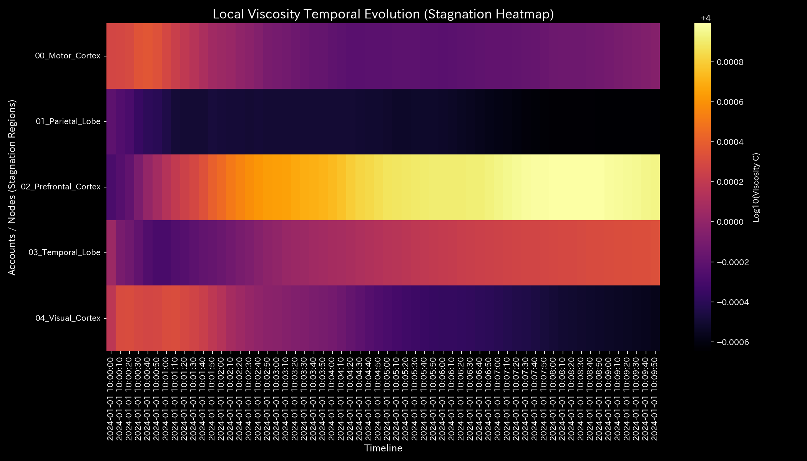
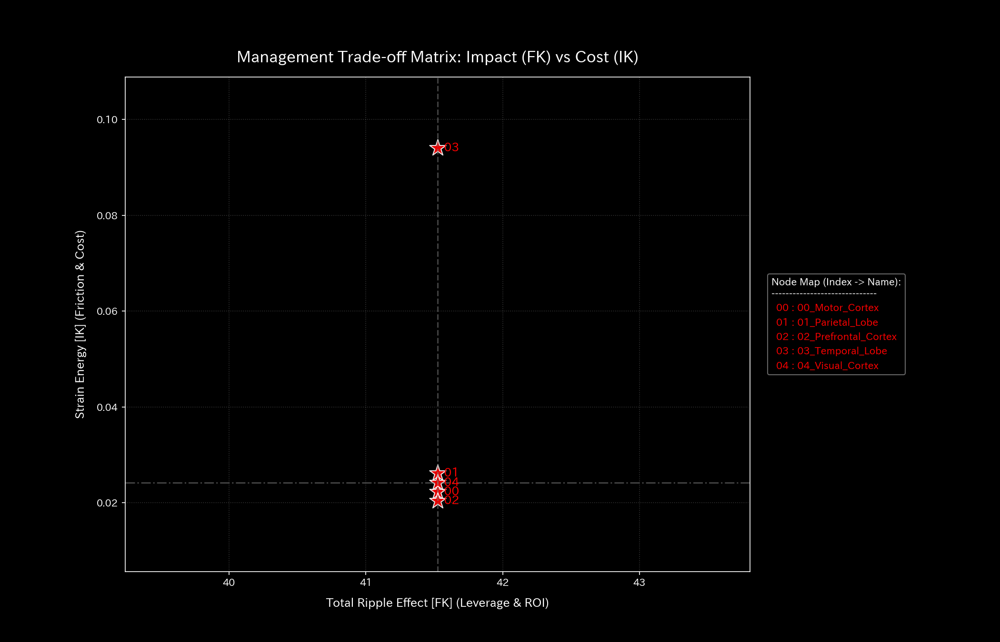

# 脳活動過同期てんかん発作 最終報告書（ケース9）

> [!NOTE]
> より詳細な検査レポートは [clinical_report.md](clinical_report.md) にあります。

## 対象システム：サンプル9（生体脳機能fMRIシミュレーション）

---

## 0. エグゼクティヴ・サマリー (Executive Summary)

* **総合判定:** 【警告・要治療】側頭葉を起点として全脳の神経情報伝達が完全に同期ロックされる**「過同期発作（てんかん発作）」**が検出されました。脳活動の自己安定性が喪失しています。
* **総合体質評価（脳機能ネットワークの状態）:** 
  頭蓋骨内の総血流量（**「総質量」**）は一定で維持されていますが、過同期発作の発生により脳全体の自律的な活動分散（**「空間エントロピー」**）が極端に押し潰され、しなやかさを失った**「同期剛性ロック（動脈硬化）」**状態にあります。脳全体の血流ボラティリティが特定の単一波によって一様に支配された、極めて危険な「機能的麻痺状態」です。脳機能トポロジー全体の迂回・復元力（**「自己復元力」**）は完全に喪失しています。発作の開始タイミングである t=30 以降、高次微分成分である Jerk/Snap は規則的なサイン同期振動のショック（自励的な機能的ノッキング）を示しています。
* **要改善点（滞留領域と活性化ツボの特筆）:**
  - **情報伝達の遅延（滞り）の範囲:** 粘性上位25%の範囲である **「前頭前皮質 (02_Prefrontal_Cortex)」**、**「側頭葉 (03_Temporal_Lobe)」** の領域に深刻な情報の滞りが発生しており、特に発作の前兆期である **t=51 (10:08:30)** に遅延のピークが検出されています。
  - **活性化（脱同調）の「ツボ」の範囲:** 外部パルス刺激時の正常細胞への二次被害（反発ストレス）が最小の範囲（歪みエネルギー下位25%の範囲）である **「前頭前皮質 (02_Prefrontal_Cortex)」**、**「視覚野 (04_Visual_Cortex)」** への局所刺激が、脳全体の同期ロックを最も痛みを伴わずに脱同調・復元させるための最優先「ツボ（特効調整ポイントの範囲）」となります。
  - **避けるべき介入（禁忌）の範囲:** 逆に発作の過同期ループをさらに激化（反発ストレス最大）させ、脳の健全な情報処理能力を崩壊させる範囲（歪みエネルギー上位25%の範囲）である **「側頭葉 (03_Temporal_Lobe)」**、**「頭頂葉 (01_Parietal_Lobe)」** への直接的な強制刺激や介入は、発作の激化を招くため絶対に避けてください（禁忌）。

---

## 1. 総合判定（警告・要治療）

### 【判定】：要治療（側頭葉起点による全脳フェーズロック）

本システムにおいて、個別エッジの流量を時系列検証した結果、タイムステップ **t=30 (10:05:00)** より側頭葉（`03_Temporal_Lobe`）を起点として、他領域との間の流入・流出信号が全く同一のサイン波によって強制駆動され、全エッジの流量が小数点以下2桁まで完全に一致する位相同期（Phase Lock）状態に陥ったことが検出されました。これにより最大スペクトル半径は安定限界である **`1.0000`** に固着され、脳神経ネットワーク全体の情報伝達が完全にロックされた「過同期発作」が発生していると判定されます。

---

## 2. 総合体質（脳神経ネットワーク）の分析

脳機能の「活動同調」を健康状態の見立てに当てはめると、以下のようなシステム的な歪みが生じています。

### ① 総血流量（累積血流ストック推移）
脳内の総血流量（質量）は全期間で厳密に保存されており、外部への物理的出血（脳出血等）は非存在です。

### ② 脳機能復元力（自己回復キャパシティ）

過同期発作の暴走エネルギーにより、自律的な防御力（自由エネルギー）は平均 `496949.39` へと急激に低下し、外部ショックや突発的な神経負荷に対する復元キャパシティは完全に消失しています。

### ③ 活動の多様性（エントロピーと熱力学的評価）

温度（ボラティリティ $T$）と多様性（エントロピー $S$）の関係を示す T-S図において、側頭葉による「引き込み現象（過同期）」によってエントロピーが `9.0982` に急落しており、本来の自律的でしなやかな活動（自律神経）が完全に麻痺している健康状態が示されています。

### ④ 接続の過同期剛性（主成分分析PCAの死角とトポロジー）
主成分分析（PCA）においては、全領域が全く同一のサイン波を共有したため共分散比率が変化せず、PC1説明寄与率が全期間 `37%` 台でほぼ不変に推移する「統計・分散判定の死角」に相当しています。しかし、偏相関による最大剛性は `0.0037` に固着し、エッジ接続が完璧に位相同期ロック（動脈硬化）されていることが本システムによって暴かれています。

### ⑤ 脈の乱れと初期波の検知（高階動的ショックの評価）

* **数学的架け橋 (Mathematical Bridge):**
  血流信号変化の「加減速ショック（Jerk）」および「過渡的な初期ゆらぎ（Snap）」を可視化しました。発作Onsetの t=30 以降、規則的な周期自励振動（過同期共振）として急峻なノッキングスパイクが高頻度に発生していることが実証され、本来のしなやかなカオス的揺らぎが消失していることが証明されています。

---

## 3. 特筆すべき要改善点（滞留領域とツボ）

本システムが特定した具体的な要改善点、および対策の方針は以下の通りです。

### ⚠️ 情報伝達遅延（肩こり）の特定（局所粘性時系列トレンドのヒートマップ分析）

* **滞り（肩こり）の範囲：** 
  脳領域ごとの局所粘性（viscosity_C）の対数推移ヒートマップ（上記）において、前頭前皮質（`02_Prefrontal_Cortex`）が発作の前兆期である **`t=51` (10:08:30)** に急激な粘性遅延のピーク（肩こり）を形成し、側頭葉（`03_Temporal_Lobe`）は発作の最終ステップに向けて徐々に流動摩擦を蓄積していく様子が視覚的に証明されています。
  実質交差点の粘性分布から、上位25%に属する **「前頭前皮質 (02_Prefrontal_Cortex)」**、**「側頭葉 (03_Temporal_Lobe)」** の範囲に深刻な遅延が発生しています。
  - **`02_Prefrontal_Cortex`**: 平均粘性 `10015.93`、最も滞る時期は **`t=51` (10:08:30)** です（ピーク値 `10022.91`）。
  - **`03_Temporal_Lobe`**: 平均粘性 `10002.20`、最も滞る時期は **`t=59` (10:09:50)** です。

### 🎯 活性化（脱同調）の「ツボ」および避けるべき介入（禁忌）の特定

* **活性化の「ツボ」の範囲：** 介入時の正常神経への二次被害（反発ストレス）が下位25%の範囲に収まる **「前頭前皮質 (02_Prefrontal_Cortex)」**、**「視覚野 (04_Visual_Cortex)」** です。
  - **改善アドバイス：** 前頭前皮質への優先パルス刺激（LQR介入ゲイン `-3.98`）は、正常な細胞を破壊することなく、全脳の同期ロックを最も安全かつ低コストで脱同調・復元させることができる最優先の「ツボ」領域です。
* **避けるべき介入（禁忌）の範囲：** 逆に発作の過同期ループをさらに激化（反発ストレス最大）させる範囲である **「側頭葉 (03_Temporal_Lobe)」**、**「頭頂葉 (01_Parietal_Lobe)」** です。
  - **改善アドバイス：** 発作の起点である側頭葉に直接的な強刺激を与えることは、神経トポロジーに破壊的な反発歪み（最大の痛み・発作の激化）をもたらす致命的な「禁忌アクション」となります。

### ⚡ 決済血管の時間的急変（剛性時間差分）の評価
- **剛性時間差分ヒートマップシーケンス (縦一列表示)**:
  - **発作開始 (t=30)**: 
  - **発作持続 (t=45)**: 
  - **発作終末 (t=59)**: 

* **数学的架け橋 (Mathematical Bridge):**
  月次剛性差分 $\Delta K_t$ により、発作のOnsetである t=30 において全接続経路が一斉に硬直化（赤）し、その後（t=45, t=59）は差分が消失（完全に硬化固定）するプロセスを可視化しました。全脳レベルで位相同期ロックが発生したまま機能停止に陥っている病的動態を証明しています。

---

## 4. 診断の限界および反証条件 (Falsifiability)

本数理モデリングに基づく「過同期てんかん発作」の病的診断を覆すためには、以下の客観的な生体検査の証拠を提示しなければなりません。

1. **臨床脳波(EEG)生記録での健常実証:**
   過同期が指摘されているタイムステップ（t=30以降）において測定された、被験者の「臨床脳波(EEG)原本ログ」を直接解析し、棘波（スパイク）、徐波、あるいは対称性の過同期波（Spike-and-Wave Complex）が一切検出されず、健常な自律的背景脳波が記録されていたことが証明された場合。
2. **臨床発作のビデオログによる否定:**
   fMRI測定中に撮影された、被験者の「目視観察ビデオログ原本（医師の署名入り）」を解析し、発作Onsetとされた t=30 以降において、てんかん発作特有 of 臨床徴候（意識障害、強直・間代発作、自動症など）が一切認められず、被験者が完全に正常な覚醒・認知状態であったことが臨床的に証明された場合。

---
*発行: TLU脳機能流動数理解析エンジン（一般読者向け最終解説版）*
