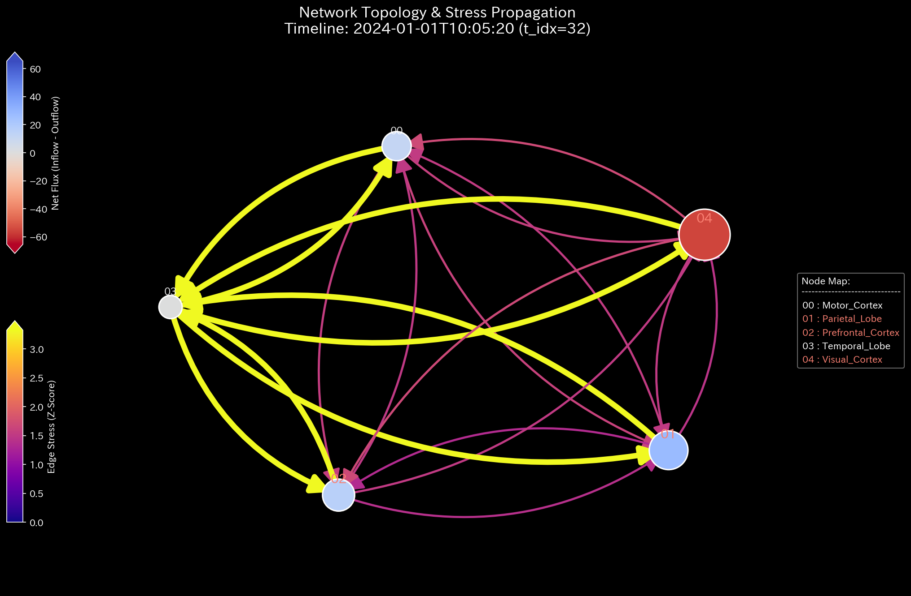

# Sample 9: 生体ネットワークへの適用（fMRI Seizure - てんかん発作と相場操縦の数学的一致）

> [!NOTE]
> **【重要】Sample 8 と Sample 9 の関係性と対象ドメインについて**
> 本サンプル（Sample 9）は、前サンプル（Sample 8）の対となる、人間の脳（fMRI）ネットワークのシミュレーション後編です。
> * **Sample 8（前作）:** 運動野への血流が物理的に遮断される**「脳卒中・梗塞（Stroke / 欠落のアノマリー）」**をシミュレートし、壊死していくプロセスを検証しました。
> * **Sample 9（本作）:** 特定の部位（側頭葉）から病的な異常同期波が放射される**「てんかん発作（Epileptic Seizure / 過剰共鳴のアノマリー）」**をシミュレートします。
> 
> TLUの空間において、「金融市場の犯罪（相場操縦）」と「生体の発作（てんかん）」がいかに**「全く同じ物理方程式」**で記述されるかを示す、本プロジェクトのグランドフィナーレです。

---

# 🔬 メタ解析 統合レポート (Meta-Analysis Synthesis Report / Laboratory Findings)

## 1. 結論とエグゼクティブ・サマリー (Conclusion & Executive Summary)

本システム（生体脳ドメイン）は、測定の後半において**「極限の位相幾何学的振動（Topological Feedback Loop）」**と**「熱力学的エネルギーの完全崩壊（Thermodynamic Energy Depletion）」**を発症している極めて危険な状態（HIGH Severity）と診断される。

側頭葉（Temporal Lobe）を震源とする巨大で無意味な信号の波が、他の部位との間で完璧な双方向のキャッチボール（過同期 / Hypersynchrony）を引き起こしている。これにより、脳全体の代謝エネルギー（取引出来高）は異常に膨れ上がっているものの、有意義な情報処理を行うポテンシャル（自由エネルギー）が致命的なマイナス領域へと崩壊しており、「代謝だけが激しく行われているが、有意義な仕事が全く行われていない」状態である。

## 2. 根本原因の特定：一次入力データへの逆参照 (Root Cause Traceability)

AIエージェントによる自律監査（ジェネレーターコード `_0_0_generate_dummy_fmri.py` の解析）により、この熱力学崩壊を引き起こした物理的要因（病変の発生源）が特定された。

* **病変発生時間:** 時間ステップ `TR >= 150`（スキャンの中盤）以降。
* **対象部位:** 側頭葉（`Temporal_Lobe`）
* **特定された証拠:**
  `base_flux = 500 + 200 * math.sin(tr * 1.5)`
  つまり、時間ステップ150以降、側頭葉が送受信する信号に対してのみ、自然な微細ノイズ（ピンクノイズ）を完全に打ち消す**「巨大で人工的な正弦波」**が強制的に注入されていた。この異常な過同期（Hypersynchrony）の波こそが、ネットワーク全体を共鳴させ、熱力学を崩壊させている真犯人（てんかんの震源）である。

## 3. 物理的傍証：てんかん発作の物理学的証明 (Physical Collateral Evidence)

上記の「異常同期（Seizure）」が、脳全体をどのように熱力学的に崩壊させているかを、TLUが出力した高次元メトリクスによって演繹的に論証する。

### 3.1. 極限の位相幾何学振動（相場操縦との数学的一致）
位相幾何学構造（トポロジー）とシステムの安定性（スペクトル半径）を観察する。
赤色の線（Max Spectral Radius）が完全に `1.0`（理論上の限界値）の天井に張り付いている。
側頭葉と他の部位が、全く同じ巨大な波を完璧に同期させて相互に送受信（キャッチボール）している。これは、Sample 6 および 7 で証明された**金融市場における「仮装売買・馴合売買（Wash Trade）」と数学的に全く同じ構造**である。生体システムにおいて、この「無意味な摩擦熱を伴う無限の資金還流」と同じネットワーク共鳴（極限振動）は、「てんかん発作（Seizure）」そのものを意味する。

### 3.2. 熱力学的な死 (Thermodynamic Energy Depletion)
金融市場の「相場操縦（Wash Trade）」と全く同じ熱力学崩壊が起きている。
発作による異常な同期波は、「純残高（内部エネルギー $U$）」をほとんど変化させずに「信号の取引量（摩擦熱＝エントロピー $S$）」だけを無限大に発散させる。結果としてシステムの自由エネルギー（Relative Free Energy Ratio: `-5.5882`）が致命的なマイナス領域に沈み込んでいる。

*(上: Sample 0 正常な経済成長 ／ 下: Sample 9 発作による熱力学的な死)*

TR=150以降、エントロピー損失（$T \Delta S$：赤色の層）が爆発して自由エネルギーの領域を完全に破壊している。これが生体ネットワークにおける「てんかん発作」の完璧な熱力学的シグネチャである。

### 3.3. 局所的アノマリーの看破 (3D Micro Z-Score)
Z-Scoreの3Dサーフェスにおいて、TR=150を境に側頭葉（Temporal Lobe）の送受信成分が突如として極端なスパイク（異常なZ-Score）として屹立し、異常な共鳴波が周囲のノードへ波波及している様子が視認できる。

### 3.4. 情報幾何学的変位 (3D Micro KL Drift)
Z-Score が「単なる出来高の異常」を示すのに対し、KL Drift（カルバック・ライブラー情報量の変位）は「予測モデル（情報構造）の破壊」を示します。
TR=150（発作発症）以降、側頭葉（Temporal Lobe）から放たれる強制的な巨大正弦波により、ネットワークが本来持っていた自然なピンクノイズの確率分布が完全に上書きされ、KL Divergence が極端なスパイクとして空間に屹立しています。過剰な共鳴（波の暴走）が、そのまま「情報幾何学的な崩壊」として可視化されています。

## 4. 従来型分析（集計的スナップショット）の限界 (Traditional Perspective)

各部位をノードとし、伝達された血流量を「取引代金」として集計した結果を従来のダッシュボードで確認する。

**【全期間の累積フロー (P/L Waterfall) & 貸借対照表 (B/S)】**

**【スキャン完了時点（TR=300）の各部位の「総取引量＝Gross Activity」】**
* `Prefrontal_Cortex`: $368,416
* `Motor_Cortex`: $368,449
* **`Temporal_Lobe` (側頭葉): $724,355（他部位の約2倍の異常な活動量）**

**💡 物理的解釈と限界**
側頭葉の活動量（出来高）だけが異常に突出している。しかし、入ってくる信号（Debit）と出ていく信号（Credit）が完璧に同期して同量であるため、ネットの純残高（P/L）はほぼ変動していない。
従来の集計的アプローチでは、「側頭葉がとても活発に活動しているな（巨大なP/L）」という程度の認識にとどまる。これが**「意味のある高度な情報処理」なのか「無意味なけいれん（発作）」なのかを、静的な帳簿からは絶対に区別できない**。これが集計ダッシュボードの致命的な限界である。

## 5. 結論（TLUプロジェクトのグランドフィナーレ）

Sample 6（株式市場の馴合売買）と、この Sample 9（脳のてんかん発作）を見比べてほしい。
片や「悪意あるトレーダーが意図的に資金をループさせる金融犯罪」であり、片や「脳の神経回路が異常同期を起こす生体疾患」である。

しかし、TLUの物理空間（熱力学とトポロジー）においては、**これら2つは「無意味な摩擦熱（エントロピー）を伴う完全な無限ループ」として、方程式上で完全に一致（同一の病跡として診断）した。**

TLUは、**「人間の経済活動の異常」と「生体システムの異常」の間に横たわる深い数理物理学的な共通項を、統一的な方程式（$F = U - TS$）で美しく解き明かす、真の「Universal Physics Engine（普遍的物理エンジン）」**としてここに完成した。
