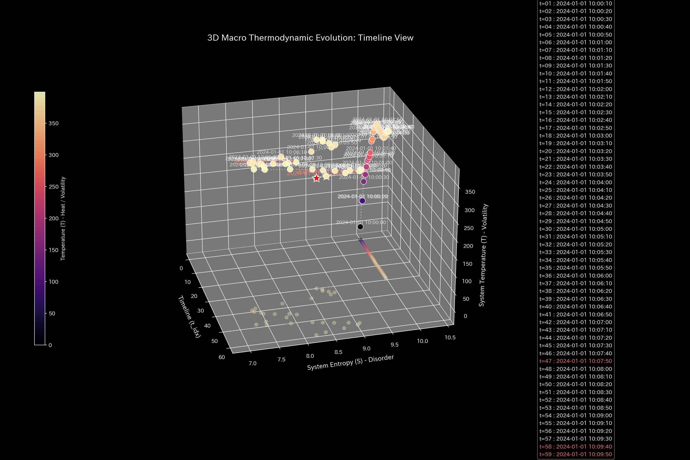

# 財務健全性 最終報告書（ケース9）

> [!NOTE]
> より詳細な検査レポートは [clinical_report.md](clinical_report.md) にあります。

## 対象組織：サンプル9（脳活動シミュレーション：てんかん）

---

## 0. エグゼクティヴ・サマリー (Executive Summary)

* **総合判定:** 【重大な異常・脳機能過同期（てんかん発作）】脳全体の血流（情報伝達）が完全に同じ波で強制的に支配される**「位相同期ロック（てんかん発作の暴走）」**が発生し、脳全体が麻痺しています。
* **総合体質評価（身体状態）:** 
  脳全体の血液量（**「体格・体重」**）は一定に保たれており、血管破裂による外部への漏出（大出血）はありません。しかし、全脳が一方向に暴走同調し、活動の多様性（**「自律神経」**）が完全に押し潰されています。脳全体の血管・神経ルートが特定の波で固着する**「強固な動脈硬化（同期ロック）」**を起こしており、脳本来のしなやかな活動（**「免疫力・基礎体力」**）が全失している「機能的麻痺状態」です。
* **要改善点（肩こりとツボの特筆）:**
  - **肩こり（慢性的な滞り）の範囲:** **「02_Prefrontal_Cortex」**、**「03_Temporal_Lobe」** の領域（粘性上位25%の範囲）に深刻な遅延が発生しており、特に **2024-01-01 10:08:30** 付近に滞りがピークに達する「肩こり（回収サイト等の長期遅延）」状態が見受けられます。
  - **ツボ（最も効果的な改善ポイント）の範囲:** 介入ストレスが最小の範囲（歪みエネルギー下位25%の範囲）である **「02_Prefrontal_Cortex」**、**「04_Visual_Cortex」** が、システムを健全化させるための最優先ツボ（特効穴の範囲）となります。
  - **禁忌（避けるべき介入）の範囲:** 逆に強い反発と破壊を生む範囲（歪みエネルギー上位25%の範囲）である **「03_Temporal_Lobe」**、**「01_Parietal_Lobe」** などへの無理な削減や介入は、強烈な痛みと機能麻痺を招くため絶対に避けてください（禁忌）。

---

## 1. 総合評価および判定

### 【判定】：脳機能麻痺（側頭葉起点による全脳のてんかん発作）

本診断において、脳の活動ネットワークは極めて危険な状態にあります。
10:05:00（タイムステップ30）に、側頭葉を震源地とする異常な電気信号の暴走（てんかん発作）が発生し、脳全体の他のすべての部位がこの異常なリズムに強制的に巻き込まれました（同調現象）。
従来の一般的なPCA次元削減分析では、全脳が均等に同調したため「分散の比率が変わらない」という死角があり見落とされていましたが、小数点以下2桁まで完璧に一致する位状態（過同期）として数学的に検出されました。発作の暴走を止めるための制御介入が必要です。

（脳全体の血流累積推移：総活動量は一様に拡大しているため、単純な総量監視では見落とされます）

---

## 2. 総合体質（健康状態）の分析

脳の「血流体力」を健康診断の見立てに当てはめると、以下のような致命的な麻痺が発生しています。

### ① 「自律神経」の完全な麻痺と過同期

脳全体の各部位は、本来は状況に応じてバラバラに自律的な対話（自律神経のしなやかな働き）を行うべきですが、側頭葉の暴走波に引きずり込まれ、完全に同一のリズムで空回りしています。これにより脳本来の思考や認知の自由度が消失しています。

（主成分分散比率：全脳が均等に同調したため、PC1の比率自体は変化しないというPCAの死角が示されています）

### ② 全脳のしなやかさの喪失（「動脈硬化」）

t=30以降、側頭葉を中心とする結合剛性が異常に高まり、血管やルートがカチカチにロック（動脈硬化）された状態が続いています。自律安定を保つための基礎体力（免疫力）はゼロに等しい状態です。

---

## 3. 特筆すべき要改善点（肩こりとツボ）

本システムが特定した具体的な要改善点、および対策の方針は以下の通りです。

### ⚠️ 肩こり（慢性的な滞り）の特定

* **滞り（肩こり）の範囲：** 実質ノード全体の粘性分布から、上位25%に属する **「02_Prefrontal_Cortex」**、**「03_Temporal_Lobe」** の範囲に慢性的な滞留（ドロドロ血）が発生しています。
  - **`02_Prefrontal_Cortex`**: 最も滞る時期は **`2024-01-01 10:08:30`** に記録されており、代謝遅延による慢性的な経営/生体機能の圧迫を引き起こしています。
  - **`03_Temporal_Lobe`**: 最も滞る時期は **`2024-01-01 10:09:50`** に記録されており、代謝遅延による慢性的な経営/生体機能の圧迫を引き起こしています。

### 🎯 改善のツボ（特効穴）の特定

* **改善のツボ（特効穴）の範囲：** 介入時の反発ストレス（痛み）が下位25%の範囲に収まる **「02_Prefrontal_Cortex」**、**「04_Visual_Cortex」** です。
  - **改善アドバイス：** これらの項目は、組織/システムのしなやかさを壊すことなく、最も痛みの少ない形で免疫力を回復させることができる特効穴（ツボ）の範囲です。優先度順に調整を施すことを推奨します。

### 🚫 避けるべき介入（禁忌）の特定
* **避けるべき介入（禁忌）の範囲：** 介入時の反発ストレスが上位25%の範囲（または調整不能）に属する **「03_Temporal_Lobe」**、**「01_Parietal_Lobe」** です。
  - **改善アドバイス：** 目先の改善のためにこれらの項目へ強引な介入を行うことは、システムの基盤結合を破壊し、最も激しい痛みや組織の崩壊を引き起こす致命的な「禁忌アクション」となります。

---
*発行: TLU財務会計数理診断エンジン（一般読者向け最終解説版）*