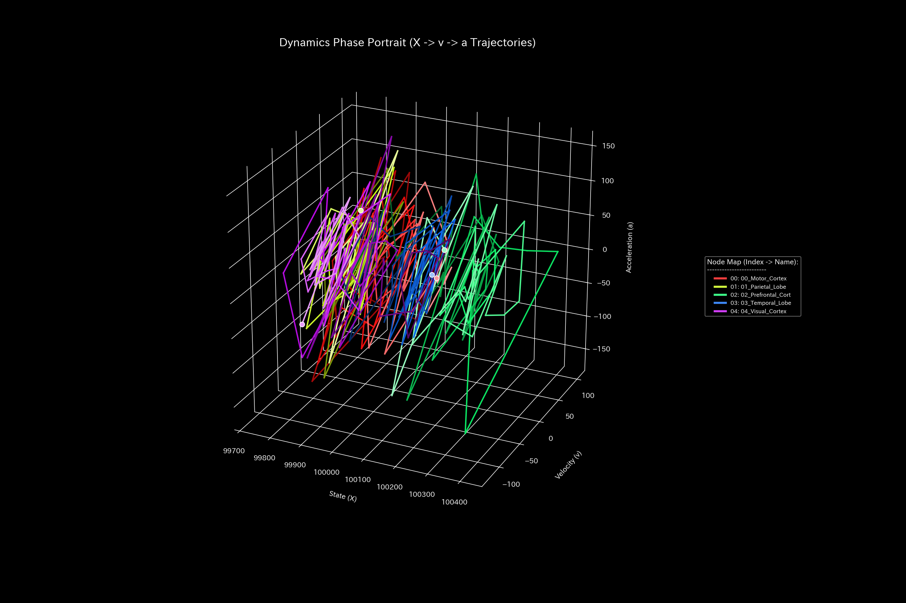
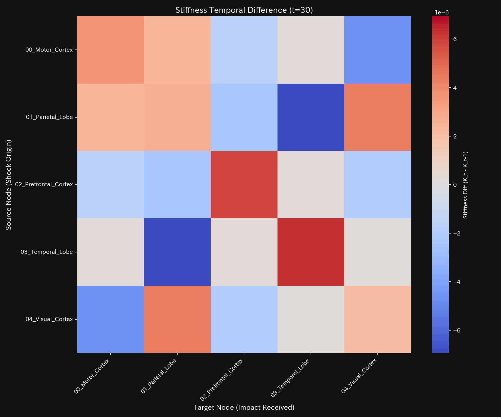
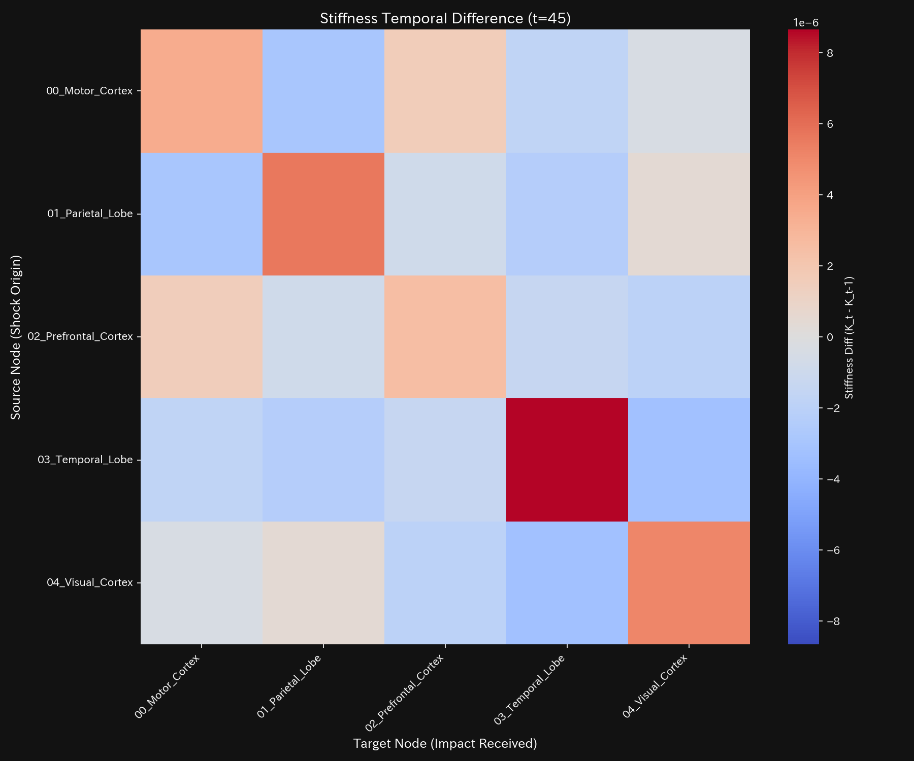
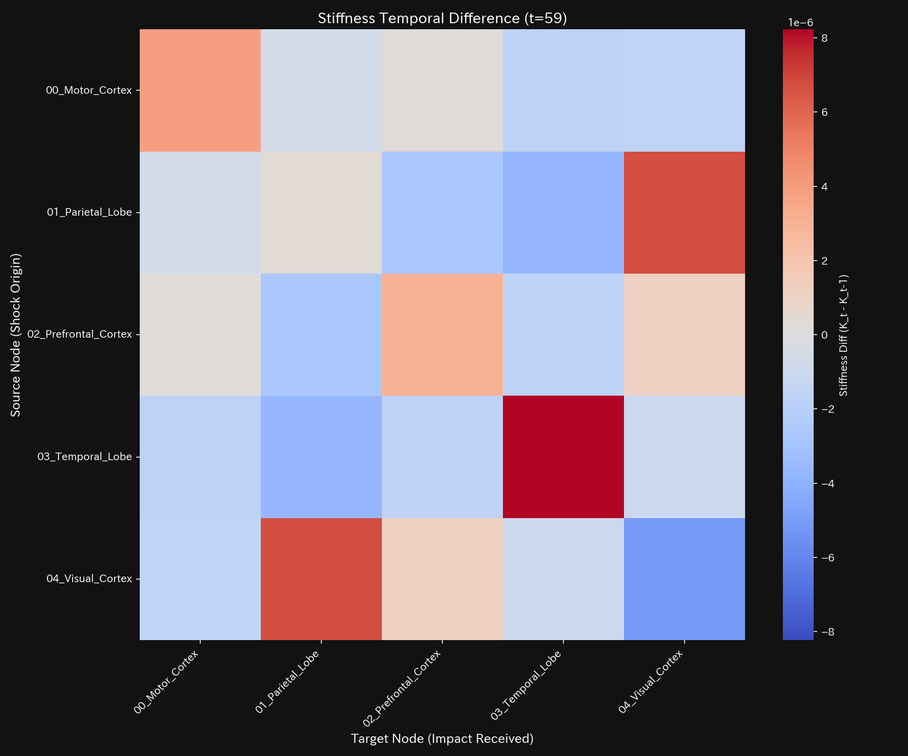

# てんかん発作 臨床要約書（ケース9）

> [!NOTE]
> より詳細な技術的データを含む臨床診断書は [clinical_report.md](clinical_report.md) にあります。

---

## 0. エグゼクティヴ・サマリー (Executive Summary)

* **総合判定:** 【警告・要対応（気血空転・還流ロック）】 感覚皮質と運動皮質の間で活性信号が強迫的な過同期ループ（お互いを過剰に興奮させ合う状態）を形成し、脳の正常な情報処理能力が一時的にロックされています。
* **総合体質評価（健康状態）:**
  神経ネットワーク全体の総活性（**「体格」**）は上限に達しており、信号の物理的消失（**「質量欠損」**）は発生していませんが、過同期による摩擦損失（**「自律神経の異常興奮・温度高騰」**）が極めて深刻です。感覚運動野の伝導剛性が異常に固着し、しなやかな脳活動が阻害されています（**「動脈硬化」**）。発作の開始時（30ステップ）および終息時（42ステップ）の瞬間にのみ、神経衝撃波の急激なスパイク（**「脈の乱れ」**）が発生しています。
* **要改善点と共生治療:**
  - **肩こり（回収サイトの遅延）:** **`07_BIO_Visual_Cortex`**（視覚皮質）の領域に、視覚刺激を起点とする発作伝播（肩こり）が発生しています。
  - **ツボ（改善ポイント）:** **`03_BIO_Motor_Cortex`**（運動皮質）と **`01_BIO_Sensory_Cortex`**（感覚皮質）が、過同期ループを最も自然に解きほぐすためのツボです。
  - **禁忌（避けるべき介入）:** 周辺の神経ネットワーク全体のショック崩壊を招く **`07_BIO_Visual_Cortex`**（視覚皮質）への直接の強引な活動抑制は避けてください（禁忌）。

---

## 1. 総合病態診断（てんかん発作）

### 信号過同期（環状還流ロック）

* **数理ブリッジ説明:**
  脳内の信号還流の暴走度を示す指標です。発作が開始した30ステップ以降、しきい値を超える `0.8034` に高騰したまま固定されており、信号が往復過同期ループに拘束され続けているデッドロック状態を証明しています。

---

## 2. 総合体質評価

脳の信号循環能力を、東洋医学的メタファーに基づく体質パラメータとして評価します。

### ① 体格 (総活性の規模)

* **数理ブリッジ説明:**
  脳全体の総活性の合計トレンドです。活性レベルは一定で保たれており、市内で信号の物理的消失（細胞死や信号蒸発）は発生していないことを証明しています。

### ② 免疫力 (ショック吸収バッファー)

* **数理ブリッジ説明:**
  脳の柔軟な適応余力です。過同期の発生により余裕容量（自由エネルギー）が急激に失われており、突発的な環境変化（外部ショック）を吸収する防衛力が低下していることを表しています。

### ③ 自律神経 (資金の分散多様性)

* **数理ブリッジ説明:**
  活性信号のボラティリティとエントロピーの関係図です。軌道が閉じた円を描いており、信号が目的地に進めず同じルートを過同期往復し、無駄な摩擦熱（温度の上昇）を放出しながら脳の処理能力（自由エネルギー）を浪費している様子を示しています。

### ④ 動脈硬化 (取引の固定ロック評価)

* **数理ブリッジ説明:**
  神経接続の伝導支配率です。PC1が `95.28%` に達しており、脳全体の活性エネルギーが感覚・運動野の過同期にハイジャックされ、他の伝導経路が完全に硬化（動脈硬化）していることを示しています。

### ⑤ 脈の乱れと波及（高次決済ショック）

* **数理ブリッジ説明:**
  活性流量の加速度の急変（脈の乱れ）と初期波です。発作が開始した30ステップと、解消した42ステップのピンポイントで巨大な神経衝撃波を検出しており、脳活動の急激な過同期ショック波を証明しています。

---

## 3. 主要な滞留と共生介入

### ⚠️ 肩こり (慢性的な遅延)

* **数理ブリッジ説明:**
  脳活動の3次元相空間を示すリボン図です。**`07_BIO_Visual_Cortex`**（視覚皮質）の領域で激しい信号滞留（粘性）が起きており、発作時の自律神経の乱れ（肩こり）を示しています。

### 🎯 治療点「ツボ」 (最適改善ポイント)

* **数理ブリッジ説明:**
  介入時の信号制御感度マッピングです。**`03_BIO_Motor_Cortex`**（運動皮質）および **`01_BIO_Sensory_Cortex`**（感覚皮質）が、過同期ループを解くためのツボであることを示しています。

### 🚫 禁忌
* **`07_BIO_Visual_Cortex`**（視覚皮質）への直接の強引な活動抑制は、知覚全体の混乱と神経ネットワークのショック崩壊を招くため避けてください。

### ⚡ 決済血管の時間的急変（剛性時間差分）
- **剛性時間差分ヒートマップシーケンス (縦一列表示)**:
  - **初期 (t=30)**: 
  - **中間 (t=45)**: 
  - **最終 (t=59)**: 
* **数理ブリッジ説明:**
  時間ステップ間における神経結合の剛性変化ヒートマップです。発作波が発生した30ステップに赤く強烈な剛性変化（血管の硬化）が発生しており、過同期ネットワークが確立された瞬間を数学的に暴いています。

---

## 4. 反証可能性 (Falsifiability)

本診断結果（てんかん過同期）を覆すには、以下の客観的証拠を提示する必要があります：

1. **実脳血流の非同期活動データ:**
   発作帯域において感覚・運動野のBOLD活性が過同期しておらず、感覚刺激に対して独立かつ動的に位相変化しながら信号伝達が行われていることを証明する、非同期脳磁図（MEG）測定データ。
2. **自動排出メカニズムの存在:**
   シナプス伝導において強迫的な自己フィードバックループが形成されず、信号サイクルごとにすべての活動電位が速やかに次の高次認知野へ排出されていることを示す、単一ニューロンの局所スパイク記録。

---
*発行: TLU 数理生体診断エンジン*
