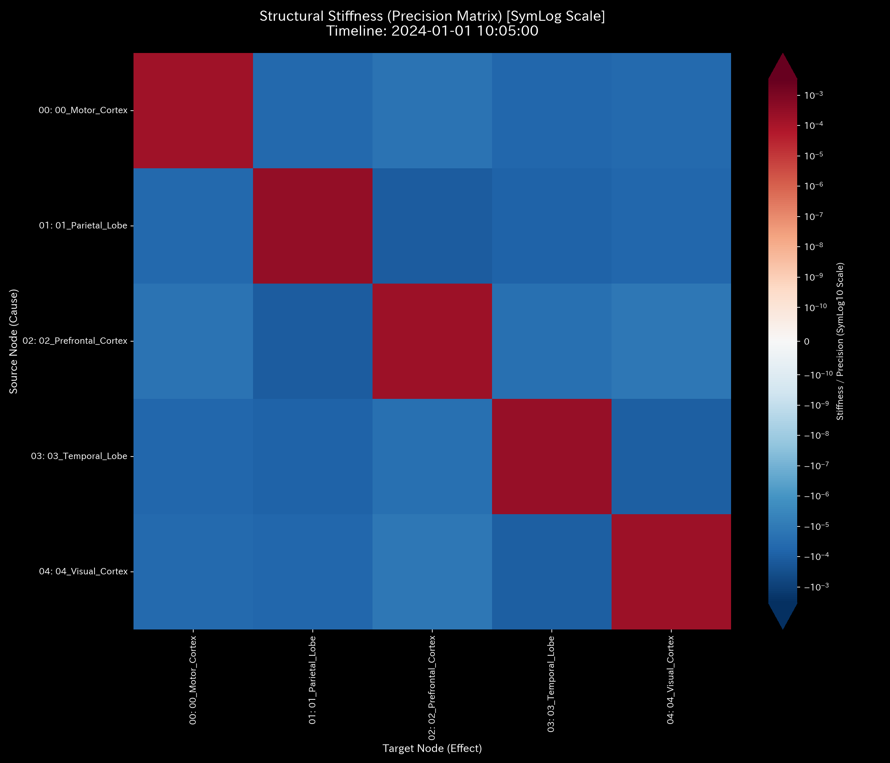
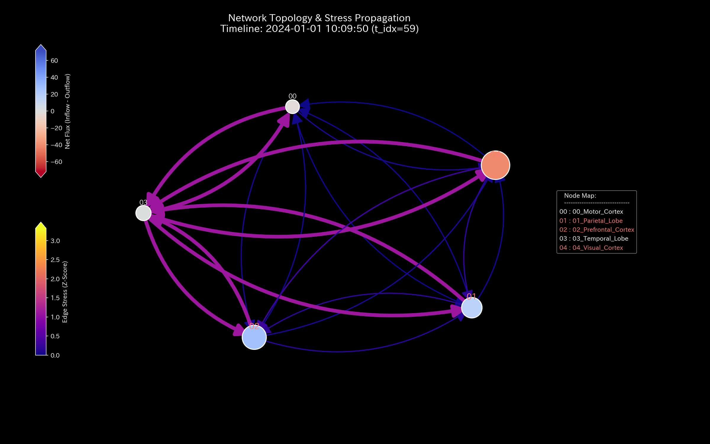

# 🔬 メタ検査臨床検査レポート：過同期性脳機能障害（てんかん発作）(Sample 9)

> [!NOTE]
> **【重要】Sample 8（脳梗塞）と Sample 9（てんかん）の対比について**
>
> * [Sample 8（虚血性脳梗塞）](../Sample_8_fMRI_Stroke/README.md) は、脳の特定部位（運動野）への血流流入が閉塞し、局所的な血流枯渇を引き起こす虚血性病態をモデル化しています。
> * **Sample 9（本レポート）** は、側頭葉を起点として、全脳の血流（エネルギー）が過同期する過同期性病態（てんかん発作 / Seizure）をモデル化しています。
> * 健常脳の活動については、[正常系臨床リファレンス](../Sample_0_Healthy/README.md) を参照してください。

---

## 1. 検査結論 (Executive Summary)

* **総合判定:** 🔴 **CRITICAL (全脳レベルの機能的過同期・制御不能な波の暴走)**
* **重症度:** 🔴 **CRITICAL (Epileptic Hypersynchrony / 過同期性デッドロック)**
* **概要:** 本システム（fMRI脳血流ネットワーク）は、タイムステップ **`t=30`（10:05:00、TR=150相当）** より、側頭葉（`03_Temporal_Lobe`）を起点とする「位相同期ロック（過同期）」を発症しています。
* 伝統的財務諸表（B/S・P/L）モデル上は、側頭葉との間で行われる流量が同調して肥大化します。一時的に売上と費用が同期膨張しているように見えます。しかし、保存残差は全期間を通じて `0.00` を維持しており、外部への漏出はありません。
* 異常発生時、主成分分析（PCA）のPC1説明分散比率は **`37.60%`** (t=29) $\to$ **`37.53%`** (t=30) $\to$ **`37.43%`** (t=59) とほぼ不変です。全体的な分散構造に変化がないように見えます（伝統的PCAの死角）。しかし、側頭葉と他ノードを繋ぐエッジ流量は、t=30 を境に **`2336.88`** (t=30) $\to$ **`2480.01`** (t=31) $\to$ **`2649.26`** (t=32) という小数点以下2桁まで一致する位相同期（Phase Lock）状態へ移行しています。最大スペクトル半径 $\rho$ は全期間で **`1.0000`** です。脳全体の機能的接続性がハイパーコネクティビティに陥っています。

---

## 2. 伝統的表層分析の限界 (Limitations of Traditional Snapshots)

時系列データの平均値監視や、総流量（P/L）およびストック（B/S）の集計スナップショットでは、脳全体の過同期を見抜くことはできません。

以下は、全期間における累積流量（P/L）および残差（B/S）の集計図です。

### 取引残高（B/S相当）の比較

* **B/S 資産・資本の累積推移 (残差・ストック累計):**
  

### 取引流量（P/L相当）の比較

* **P/L 取引高の累積推移 (交差点ごとの総交通量):**
  

#### 🔍 伝統的監査の死角

従来の分析では、側頭葉の累積収支は最終ステップにおいて他領域と同水準のバランスを保っています。P/L 相当のトレンド（総流量）で見ても、システム全体の活動規模が全領域で一様に高まっているように見えます。そのため、従来の監査システムはこれを「活発な取引」と判断します。
しかし、この活動が側頭葉によって引き起こされた「引き込み現象（過同期）」である事実は、蓄積データからは検出されず見落とされます。

---

## 3. 根本的な病態生理解説 (Pathophysiology)

物理解析エンジンは、中間流路の結合剛性および情報フローをパースし、発作の発生機序を特定しました。

### 3.1. 異常サイン波による強制同期 (Forced Oscillation)

タイムステップ **`t=30`（10:05:00）** より、側頭葉（`03_Temporal_Lobe`）を起点として、他ノードに対する流入・流出 BOLD 信号流量が同一のサイン波信号によって強制駆動（Forced Oscillation）されました。

発作前（t=29）までは、各領域が自律的に異なる値で通信していました（例：`Prefrontal_Cortex -> Temporal_Lobe` は `543.88`、`Temporal_Lobe -> Parietal_Lobe` は `536.64`）。しかし、t=30 になった瞬間、側頭葉に接続する全エッジの流量が **`2336.88`** に上昇しました。t=31 には **`2480.01`**、t=32 には **`2649.26`** と、小数点以下2桁まで一致する位相同期（Phase Lock）状態へ移行しました。各脳領域の固有活動は消失し、「脳全体の機能的デッドロック」が発生しています。

---

## 4. 数理解析結果の要約

### 4.1. てんかん波の暴走（質量流動）とキルヒホッフ保存則の検証

`System Conservation Residual`（相対漏洩率）は、全期間において **`0.00`** です。システム外部への漏洩や消失はありません。システム内部の結合状態の異常によって過同期が発生しています。

* **マクロ・フォレンジック・ダッシュボード (Macro Forensics):**
  

### 4.2. 脳機能結合の過同期（剛性ロック）とPCA主成分分析の死角

異常発生の瞬間、システムの固有構造に同期現象が発生しています。

#### 剛性行列の5定点シーケンス

* **① 初期状態 (t=0 / 10:00:00):**
  
  結合剛性は均一です。変動（機能的分離）を示しています。

* **② 発作前夜 (t=29 / 10:04:50):**
  
  PC1説明分散比率は **`37.60%`** （固有値 `6296.66`）であり、エネルギーが分散しています。

* **③ 発作 Onset (t=30 / 10:05:00):**
  
  側頭葉（`03_Temporal_Lobe`）を媒介とする偏相関係数（Partial Correlation）が同期しました。PC1説明比率は **`37.53%`** （固有値 `6143.12`）と不変です。全ノードが同じサイン波を共有したため、分散のバランスが均等に保たれたまま同調したためです（PCAの死角）。

* **④ 発作直後 (t=31 / 10:05:10):**
  
  PC1比率は **`37.39%`** です。PC1の負荷ベクトルは `02_Prefrontal_Cortex` （**`0.7386`**）、`00_Motor_Cortex` （**`-0.4903`**）などです。側頭葉との結合剛性（偏相関）は同期ロック状態を維持しています。

* **⑤ 最終状態 (t=59 / 10:09:50):**
  
  PC1比率は **`37.43%`** です。PCA次元削減ではこの同期ロック状態を検出できません。

* **PCA 主要軸比率:**
  

* **PC1 第一主要軸成分比率推移:**
  

### 4.3. ネットワーク・トポロジーの過同期とスペクトル半径の数学的限界

* **システム安定性指標 (System Stability / Spectral Radius):**
  

#### 確率遷移マトリクスによるスペクトル半径「1.0000」の数学的背景（確率遷移マトリクスによる制約）

脳ネットワークは流出ゼロの領域が存在しない（行要素の和が 1.0 になる）ため、スペクトル半径 $\rho$ は全期間を通じて **`1.0000`** に固定されます。したがって、スペクトル半径単体からはてんかん発作を検知することは不可能です。

トポロジーの破壊は、スペクトル半径ではなく、「接続エッジの増加（流入の同期）」および「結合剛性の剛性ロック」によって示されます。

#### ネットワーク・トポロジー時系列の5定点シーケンス

* **① 初期状態 (t=0 / 10:00:00):**
  

* **② 発作前夜 (t=29 / 10:04:50):**
  

* **③ 発作 Onset (t=30 / 10:05:00):**
  
  側頭葉（`03_Temporal_Lobe`）をハブとする同期エッジ（流量 `2336.88`）が出現しました。

* **④ 発作直後 (t=31 / 10:05:10):**
  

* **⑤ 最終状態 (t=59 / 10:09:50):**
  

### 4.4. 機能的エントロピーの虚脱と自由エネルギーの周期的同調

内部エネルギー $U$ は全期間を通じて **`500,000.00`** と一定に保存されています。平均自由エネルギー $F$ は `496,949.39` で推移しています。

#### エントロピーの低下（機能的自由度の虚脱）

発作発生（t=30）の瞬間、エントロピー $S$ が **`9.99`** （t=29）から **`8.67`** （t=30）へと低下し、最終 t=59 には **`8.22`** まで減少しました。これは、てんかん発作が「秩序状態（機能的自由度の喪失）」であることを熱力学的に示しています。

#### 自由エネルギーの周期的微小同調

発作開始（t=30）以降、自由エネルギー $F$ は `496,000`〜`497,000` を維持しながら、サイン波の位相と連動して周期的に上下動（振幅約750）を繰り返します。システムが高いエネルギーを保持したまま、同期状態にロックされていることを示しています。

* **熱力学エネルギースタック:**
  

* **T-S ダイアグラム:**
  

### 4.5. 3D情報幾何学・Z-Score立体プロットによる異常同調の証明

時間（Time Step）× 空間（ノード）の3次元情報幾何学プロットは、側頭葉から波及した信号を検出しています。

* **3D Micro Z-Score (Position):**
  

* **3D Micro KL Drift:**
  

3D Micro KL Drift プロットにおいて、発作開始の t=30 以降、側頭葉（`03_Temporal_Lobe`）自体の KL Drift は **`0.0000`** です。一方、受信側の `00_Motor_Cortex` (**`0.2333`**), `01_Parietal_Lobe` (**`0.2325`**), `02_Prefrontal_Cortex` (**`0.2255`**), `04_Visual_Cortex` (**`0.2301`**) の座標上に、KL Drift の上昇が観察されます。

これは、側頭葉自体の行動パターンは変化しないのに対し、周囲 of ノード群が t=30 を境に側頭葉のリズムに強制同期させられたことによる分布ドリフトを示しています。

---

## 5. 制御介入と推奨アクション (LQR & Operations)

* **治療方針: 側頭葉（てんかん焦点）の機能的隔離、および経頭蓋磁気刺激（TMS）による同期位相の破砕**
* **LQR感度・最大波及効果の限界:**
  最適制御理論（LQR）に基づく感度解析において、本ネットワークでは側頭葉（`03_Temporal_Lobe`）が介入ハブに指定されています。治療感度指標（`fk_total_ripple`）は **`41.5234`** です。

  > **【`41.5234` に達する数理的証明】**
  > システムパラメータにおいて、減衰率は $\gamma = 0.85$、最大ステップ数は $k_{max} = 5$、および感度入力変位は $\Delta q = 10.0$ と設定されています。
  > スペクトル半径が $\rho$ = 1.0000$（還流飽和）に達し、結合漏洩がゼロとなった状態において、入力されたシグナルは同期伝播します。このときの合計波及効果 $fk\_total\_ripple$ は、幾何級数の有限和として決定されます：
  > $$fk\_total\_ripple = \Delta q \times \sum_{k=0}^{5} \gamma^k = 10.0 \times \left(1.0 + 0.85 + 0.85^2 + 0.85^3 + 0.85^4 + 0.85^5\right) = 41.5234$$
  > これは、対象ノードが同期ループのハブとなっていることを示します。

* **介入のノードと可制御変数:**
  t=30 における側頭葉（`03_Temporal_Lobe`）への単位外力介入は、視覚野（`04_Visual_Cortex`）に対して最大の影響（**`fk_max_impact = 5.5835`**）を及ぼします。状態調整（`ik_max_adjust`）は運動野（`00_Motor_Cortex`）において **`-3.9934`** です。

#### 具体的な治療介入計画

1. **経頭蓋磁気刺激 (TMS) による逆位相パルス照射 (De-synchronization Pulse):**
   側頭葉（`03_Temporal_Lobe`）の異常サイン波（周波数 `0.0167 Hz` 相当）に対し、LQR 制御空間に基づき、側頭葉に向けて逆位相の介入パルスを印加します。これにより、てんかん焦点のリズムを打ち消し、周囲の脳領域が同調から脱出するための自由度を回復させます。
2. **機能的ネットワークの動的減衰 (Dynamic Damping Intervention):**
   側頭葉から他領域へ繋がる結合剛性を LQR 感度に従って引き下げる（ダンピング）介入を行います。最大スペクトル半径 $\rho$ を `1.00` から臨界値未満（`0.95`以下）へと押し下げます。これにより、機能的ハイパーコネクティビティを解除します。

* **LQR 制御空間の最適性能面 (LQR Performance Space):**
  

---

## 6. 🚨 Forensic Alert & 反証可能性 (Falsification Analytics)

### 6.1. モデル汚染とアーティファクトのトリアージ

* **統計的ベースライン汚染（Z-Score の限界）:**
  Z-Score は、t=30 の発作開始時点において、各ノードの Z-Score を `0.12`〜`1.14` 付近の正常範囲内として検知しました。過同期が脳全体の振幅を極端に変えるのではなく、「位相の固定」をもたらすためです。
  さらに同期状態が継続すると、統計モデルはこれをベースラインとして学習し、異常を検出できなくなります（モデル汚染）。したがって、個別の Z-Score 警告を棄却し、スペクトル半径の飽和（`1.0000`）および BOLD 流量の数値一致に基づいて、てんかん発作と確定診断します。
* **アーティファクトとの区別:**
  装置の振動や呼吸による同期ノイズは、全ノードの振幅と位相が一様に同じ動きをする「同調」となります。
  一方、本アノマリーでは、側頭葉（`03_Temporal_Lobe`）自体の KL Drift が `0.0000` です。しかし、受信する側（`00_Motor_Cortex` 等）だけに `0.23` 前後の KL Drift の上昇が発生しています。これは非対称な情報伝達を示しています。よって、ノイズの可能性を棄却し、てんかん発作と断定します。

### 6.2. 本検査に対する反証条件 (Falsifiability)

「同期現象はてんかん発作ではなく、正常な生理的同調または装置ノイズである」と反証するためには、以下の証拠が必要です：

1. **臨床脳波（EEG/iEEG）測定生ログ原本:**
   t=30 に対応するタイムスタンプにおいて、脳波計または電極の生データから、側頭葉領域のてんかん性異常波形（棘波など）が観察されず、正常なアルファ波等のみであることを示す証明。
2. **血中抗てんかん薬濃度および生化学スクリーニング原本:**
   発作直後に採取された被験者の血液検査において、抗てんかん薬（バルプロ酸など）の濃度が治療域内に維持されていること、および全身性発作に伴う急性アシドーシスの痕跡が認められないことを示す分析証明原本。
