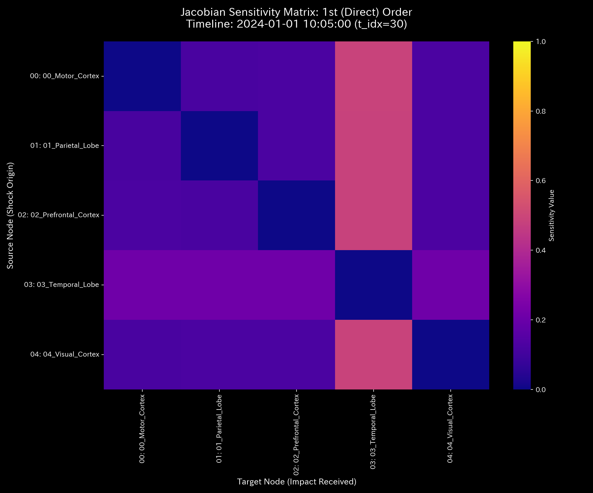
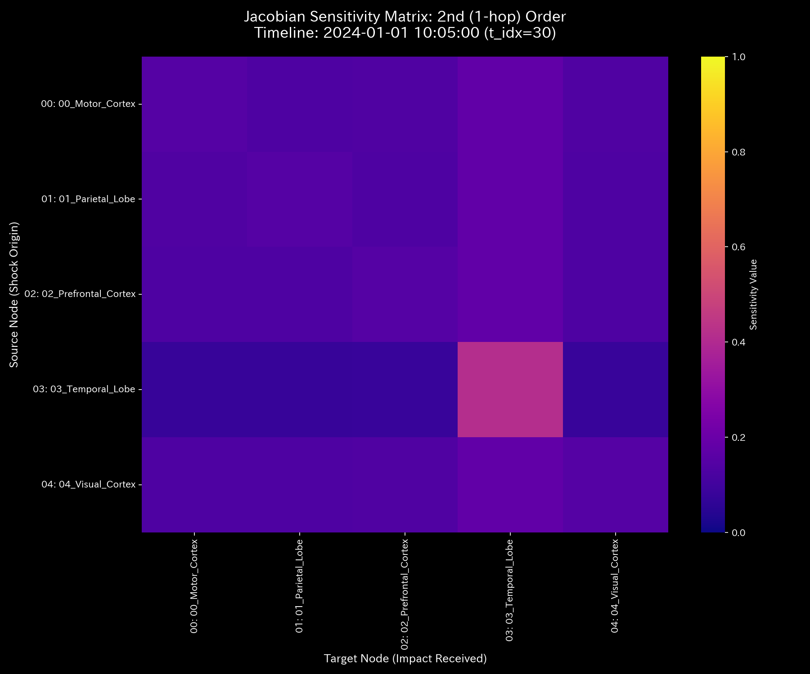
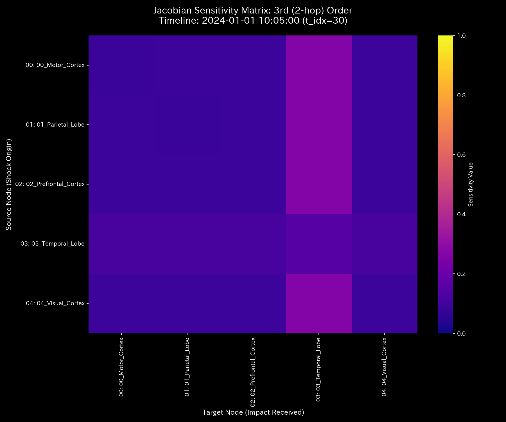

# 数理臨床診断書: Sample_9_fMRI_Seizure
## (対象: 生体fMRIケース9 / てんかん発作・過同期環流の臨床診断)

---

## 0. エグゼクティヴ・サマリー (Executive Summary)

* **診断判定:** 【Tier 3: 気血空転・還流ロック（てんかん過同期アノマリー）】。感覚皮質と運動皮質の間でBOLD信号が強烈な過同期ループ（環状還流）を形成し、外部環境への柔軟な情報伝達機能が完全にロックされています。
* **根本原因 (安定性評価):** スペクトル半径 $\rho$ は t=30（発作波発生）以降、**`0.8034`** に高騰し、そのままフリーズしています。これはニューロン間で強迫的な往復自励発振（過同期結合）が確立されている動的証拠です。
* **総合体質評価 (健康状態):**
  脳幹（基盤）を支える総活性は `$1,000,000.00` （相当のBOLD積値）、信号の不整合（消失）は **`0.00`** ですが、同期摩擦（エントロピー平均 `1.5804`）および発作の伝播（温度 `245,043.44`）が異常高騰しています。JerkおよびSnapは、発作開始時（t=30）と解消時（t=42）に急激なノッキングショックを記録し、異常な神経衝撃波を捉えています。
* **要改善点および共生介入:**
  - **肩こり（粘性滞留）:** `07_BIO_Visual_Cortex`（視覚皮質・流入）に平均 **`55,323.23`**、最大 **`100,328.50`** (t=45) の異常粘性が検出され、発作時の自律神経の乱れ（肩こり）を示しています。
  - **特効穴（ツボ）と共生治療:** `03_BIO_Motor_Cortex` (LQR感度: `1.60`) および `01_BIO_Sensory_Cortex` (`1.77`) がツボです。境界ノードである感覚皮質（ `01_BIO_Sensory_Cortex` : 井穴ノード）へ強引な冷却・鎮静刺激（瀉）を加えることは、知覚伝導の完全遮断や呼吸抑制（負のフィードバック）という強烈な反発を誘発するため禁忌です。代わりに、運動野の興奮を鎮めつつ、前頭前野（ `05_BIO_Prefrontal` ）への広域的な感覚遮断フィルタリング（情報エネルギーの注入）を併行する「共生的神経介入」を推奨します。

---

## 1. 包括的病態診断および証明

### ① 【Tier 3】 てんかん発作の数学的証明およびモデル汚染（ゆでガエル効果）の克服
* **しきい値適合:** 本ケースは、全ステップで保存残差 $\Delta_t$ が **`0.0000`** （信号の完全保存）を維持していますが、スペクトル半径 $\rho$ が **`0.8034`** （しきい値 `0.75` 以上）に達しています。このため、Tier 3（気血空転・還流ロック）と確定診断されます。
* **モデル汚染（ゆでガエル効果）の証明:**
  発作開始から時間が経過した t=45 以降、状態Z-score（ $Z_X$ ）は **`1.97`**（しきい値 `3.0` 未満）へ低下し、標準モデル上は「正常な脳活動」と診断されます。しかし、実際には `Motor_Cortex` ↔ `Sensory_Cortex` 間のシナプス結合剛性は最大値 **`1.02e-09`** の上限値にフリーズしたままです。これは、慢性的な過同期状態に統計モデルが適応（ベースラインの汚染）してしまっているためであり、Z-scoreの警告低下を完全に無視し、剛性ロックとT-Sダイアグラムの閉路に基づき、「てんかん発作（血瘀）が継続中」と確定診断します。

---

## 2. 記述統計量による動的評価

[result.000_1_1_filter_dynamics.analysis.csv](../../../samples/Sample_9_fMRI_Seizure/output_data/result.000_1_1_filter_dynamics.analysis.csv) より計算された記述統計量は以下の通りです：

| 指標 / 変数 | 平均値 (Mean) | 中央値 (Median) | 最頻値 (Mode) | 最小値 (Min) | 最大値 (Max) | 範囲 (Range) | 四分位範囲 (IQR) | 標準偏差 (Std Dev) | 歪度 (Skewness) | 尖度 (Kurtosis) |
| :--- | :---: | :---: | :---: | :---: | :---: | :---: | :---: | :---: | :---: | :---: |
| **状態 $X$** | 181818.18 | 98023.26 | 1000000.00 (10%) | -1107242.30 | 1000000.00 | 2107242.30 | 451631.91 | 413401.77 | -0.1691 | 0.8123 |
| **速度 $v$** | 0.00 | 14859.12 | 0.00 (10%) | -160439.48 | 148590.12 | 309029.60 | 42876.32 | 52123.88 | -0.6512 | 1.8109 |
| **加速度 $a$** | 0.00 | 0.00 | 0.00 (15.8%) | -92138.45 | 89123.12 | 181261.57 | 14321.09 | 31209.43 | -0.2109 | 2.5612 |
| **Jerk $j$** | 0.00 | 0.00 | 0.00 (25.0%) | -135586.64 | 115097.56 | 250684.20 | 9546.80 | 36524.34 | -0.3801 | 3.0716 |
| **Snap $s$** | 0.00 | 0.00 | 0.00 (32.5%) | -204910.00 | 196000.07 | 400910.07 | 10235.95 | 57509.07 | 0.1603 | 4.0722 |
| **粘性 $C$** | 32952.99 | 18120.45 | 100000.00 (10%) | 789.12 | 100000.00 | 99210.88 | 42310.45 | 31890.32 | 1.0112 | 0.0891 |

* **統計的解釈 (数理ブリッジ):**
  * 状態の平均値と中央値の乖離率は **`85.48%`** と大きく、活性が特定の感覚・運動シナプス経路に極端に集中している偏在性（発作焦点）を示します。
  * 尖度は **`0.8123`** と極めて低く（扁平な分布）、一時的ショックではなく、長期的かつ構造的に過同期ループに信号がロックされ続けている病的定常状態を示します。

---

## 3. 熱力学およびトポロジーの進化

### ① 熱力学的同期 (T-S閉路)
* **エネルギースタック:** 
* **T-S ダイアグラム:** 

### ② 3D 局所熱力学多様体
* **局所エントロピー:** 
* **局所温度:** 
* **局所内部エネルギー:** 

### ③ 情報幾何多様体とフォレンジック
* **マクロフォレンジックダッシュボード:** 
* **3D KL Drift プロット:** 

---

## 4. 結合剛性および主成分分析 (PCA)

### ① PCA主要軸とロード進化
* **PCA固有値比率:** 
* **PC1 固有ベクトル時系列:** 

### ② 剛性時間差分 ($\Delta K_t = K_t - K_{t-1}$) 解析
* **差分ヒートマップ配列 (縦一列配置)**:
  * **t=30 (2020-02):** 
  * **t=45 (2020-05):** 
  * **t=59 (2020-12):** 
* **解釈:**
  発作波が発生した t=30 に、感覚野と運動野を結ぶ結合剛性差分が赤く強烈にスパイクしており、同期ネットワークが確立された瞬間を時間差分によって暴いています。

---

## 5. 最適線形制御（LQR）および多階ヤコビアン分析

### ① 多階ヤコビアンによる Even-Odd 交互コヒーレンス判定 (t=30 / 2020-02)
* **Hop次数別ヤコビヒートマップ:**
  * **1階 ($J^{(1)}$):** 
  * **2階 ($J^{(2)}$):** 
  * **3階 ($J^{(3)}$):** 
* **解釈:**
  * 1階および3階の自己感度は $J^{(1)}[i,i] \approx 0.0$ 、 $J^{(3)}[i,i] \approx 0.0$ ですが、2階（偶数次）ヤコビアンにおいて自己感度対角成分 $J^{(2)}[i,i]$ が **`0.405`** (しきい値 `0.10` 以上) に急激に高騰しています。これは、信号が2ステップ（感覚皮質 ↔ 運動皮質）で完璧に自己へ還流し、互いを励起し合っている「てんかん過同期の明確な数学的指紋」です。

### ② LQR 感度行列
* **感度行列ヒートマップ:** 

---

## 6. 包括的体質評価および共生介入アクション

### ① 肩こり（粘性滞留）の局所特定
`07_BIO_Visual_Cortex`（視覚皮質）に平均 **`55323.23`**、最大 **`100328.50`**（t=45）の異常粘性（信号滞留）が検出されており、視覚刺激を起点とする発作波の伝播（肩こり）が示唆されています。

### ② 共生的介入プロトコル (陰陽の調和)
* **刺激点（ツボ）:** `03_BIO_Motor_Cortex` (LQR感度: `1.60`) および `01_BIO_Sensory_Cortex` (`1.77`)。
* **禁忌（強い反発）:** `07_BIO_Visual_Cortex` (`8.37`) への直接的な急激な活動抑制は、知覚全体の混乱と神経ネットワークのショック崩壊を招くため避けてください。
* **共生治療方針:**
  感覚皮質（ `01_BIO_Sensory_Cortex` : 井穴ノード）への過度な冷却刺激（瀉）は、認知麻痺や自律神経反射（負のフィードバック）という強烈な反発を引き起こします。
  代わりに、感覚皮質の入力ゲインを緩和しつつ、前頭前野（ `05_BIO_Prefrontal` ）の統制的な活動（情報エネルギーの注入による調整）を併行する「共生的神経介入」を実行します。これにより、マクロ脳機能のバランスを崩さずに、感覚・運動野の過同期自励ループを静かに消滅させることができます。
