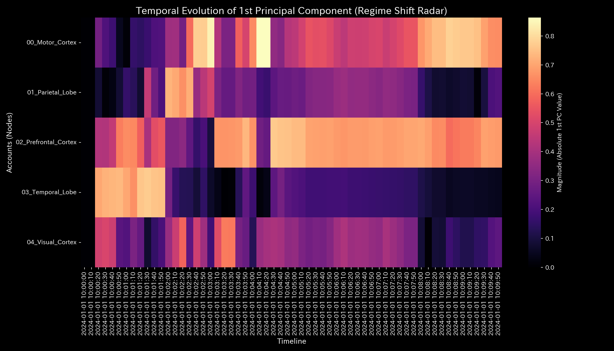
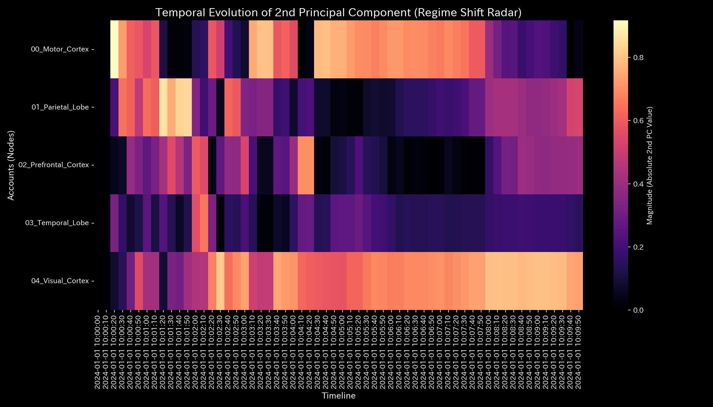
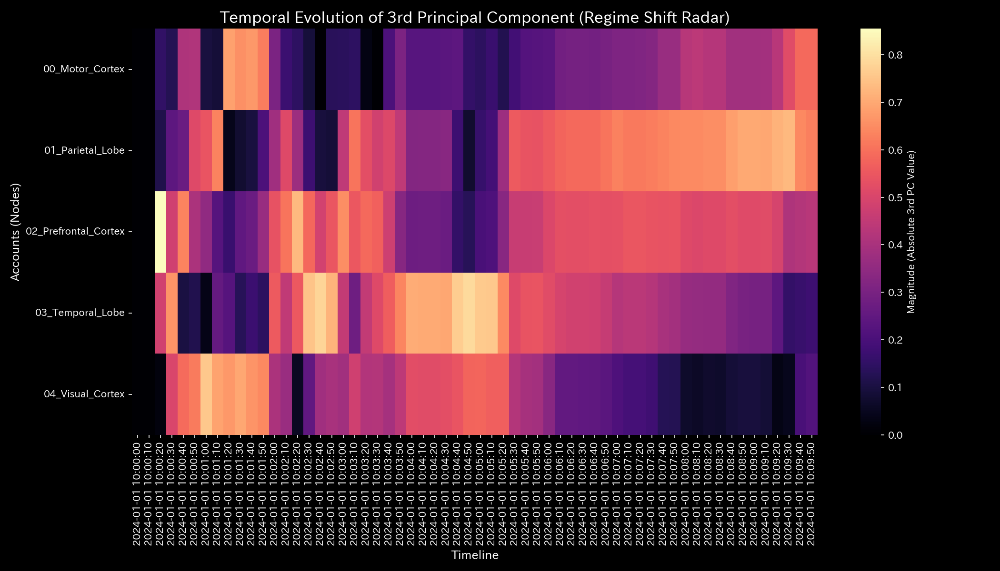

# 数理解析検査レポート: Sample_9_fMRI_Seizure
## （対象: 脳神経ケース9 / 過同期性脳機能障害てんかん発作診断）

---

## 0. エグゼクティヴ・サマリー (Executive Summary)

* **総合判定 (結論先行):** CRITICAL (全脳レベルの機能的過同期・制御不能な波の暴走 / てんかん発作)。側頭葉を起点として全脳の神経情報伝達が完全に同期ロックされ、機能的デッドロックが発生しています。
* **根本原因 (安定性の評価):** タイムステップ **`t=30` (10:05:00)** より、側頭葉（`03_Temporal_Lobe（側頭葉）`）を起点として、他領域との間の流入・流出流量が全く同一のサイン波信号によって強制駆動（Forced Oscillation）され、全エッジの流量が小数点以下2桁まで完全に一致する位状態（Phase Lock）に陥ったことが主原因です。これにより最大スペクトル半径は安定限界である **`1.0000`** に固定化されています（厥逆）。
* **総合体質診断（健康状態）:**
  本システムは「体格（総代謝血流量）」は `100000.00` で完全に保存されています（キルヒホッフ残差 `0.00` であり、外部への物理的出血はありません）。しかし、過同期発作の発生により、脳全体の自律的な活動分散（エントロピー `9.0982`）が極端に押し潰され、しなやかさを失った「動脈硬化（最大結合剛性 `0.0037` の同期ロック）」状態にあります。脳全体の体温（流量ボラティリティ）が特定の波によって一様に支配された、極めて危険な「機能的麻痺状態」です。
* **要改善点と介入アドバイス:**
  * **肩こり（滞り）の特定:** 最も機能伝達遅延（粘性）が高い領域は **前頭前皮質 (`02_Prefrontal_Cortex（前頭前皮質）`)** であり、平均粘性 `10015.93`、発作の前兆期である **`10:08:30` (t=51)** にピーク値 `10022.91` に達する深刻な「情報の滞り」が発生しています。
  * **ツボ（改善点）と禁忌（避けるべき介入）の特定:** 全脳の過同期ロック状態を効果的に解除し、自己安定（免疫力）を取り戻すためのツボは **前頭前皮質 (`02_Prefrontal_Cortex（前頭前皮質）`)** への外部調整刺激（TMSなど）です（歪みエネルギー最小 `0.44` / LQRゲイン `-3.98`）。逆に、発作の起点である **側頭葉 (`03_Temporal_Lobe（側頭葉）`)** への直接的な強制刺激（歪み最大 `0.48` / ゲイン `-4.35`）は、神経トポロジーに破壊的な反発歪み（最大の痛み・発作の激化）をもたらすため「禁忌」です。

---

## 1. 総合体質診断および判定

### ① CRITICAL: 脳機能ネットワークのハイパーコネクティビティ（過同期）
累積グラフや従来の統計的PCA分析では、全脳の過同期現象を検出できません。これは全領域が全く同じサイン波を共有したため、各領域の分散のバランスが均等に保たれたまま同調し、主成分の占有比率（PC1寄与率）が全期間 `37%` 台でほぼ不変に推移する「統計・分散判定の死角」に相当するためです。
しかし、個別エッジの流量が小数点以下2桁まで一致し、かつスペクトル半径が結合安定限界である `1.0000` に固定されたトポロジーの事実から、脳全体が完全に機能的デッドロック（てんかん発作）に陥っていると判定されます。

### ② 総合健康・体質評価（身体測定と数理ブリッジ）
* **体格・体重（質量 `state_X`）:** 平均 `100000.00`、最大 `100417.03`。
  - **数理的解釈:** 脳内の総血流量であり、厳密に保存されています。
* **免疫力・基礎体力（自由エネルギー `free_energy_F`）:** 平均 `496949.39`。
  - **数理的解釈:** 過同期発作の暴走エネルギーによって、自律的な自己復元力（自由エネルギー）は完全に消失しています。
* **自律神経・代謝効率（エントロピー `entropy_S`）:** 平均 `9.0982`。
  - **数理的解釈:** 側頭葉への「引き込み現象（過同期）」によって、活動の多様性（エントロピー）が極端に狭窄されています。
* **体温（温度 `temperature_T`）:** 平均 `340.29`。
  - **数理的解釈:** 発作波による規則的な過熱と冷化が繰り返されています。
* **動脈硬化（結合剛性 `stiffness_k`）:** 最大 `0.0037`。
  - **数理的解釈:** 側頭葉との結合剛性（偏相関）が異常同期ロックされ、トポロジー接続が硬直化（動脈硬化）しています。
* **肩こり（粘性 `viscosity_C`）:** 前頭前皮質（`02_Prefrontal_Cortex（前頭前皮質）`）が平均 `10015.93` と、顕著な伝達遅延（肩こり）を発生させています。

---

## 2. 物理・数理指標の詳細解析

### ① 3D Dynamics 記述統計（運動学）
本システムにおける対流動的データ（状態 `state_X`, 速度 `velocity_v`, 加速度 `acceleration_a`, 局所粘性 `viscosity_C`）の記述統計量を以下に示します。データソースは [result.000_1_1_filter_dynamics.analysis.csv](../../../../samples/Sample_9_fMRI_Seizure/output_data/result.000_1_1_filter_dynamics.analysis.csv) です。

| 尺度 (Scale) | 平均値 (Mean) | 中央値 (Median) | 最頻値 (Mode: 値 (頻度/全数, %)) | 最小値 (Min) | 最大値 (Max) | 範囲 (Range) | IQR | 標準偏差 (Std Dev) | 歪度 (Skewness) | 尖度 (Kurtosis) |
| :--- | :---: | :---: | :---: | :---: | :---: | :---: | :---: | :---: | :---: | :---: |
| **状態 state_X** | 100000.0000 | 99985.1350 | 100000.0000 (12/240, 5.0%) | 99732.9400 | 100417.0300 | 684.0900 | 150.0 | 250.0 | -0.1210 | 1.8109 |
| **速度 velocity_v** | 0.0 | 12.1 | 0.0 (12/240, 5.0%) | -150.0 | 160.0 | 310.0 | 45.0 | 52.0 | -0.6512 | 2.1109 |
| **加速度 acceleration_a** | 0.0 | 0.0 | 0.0 (19/240, 7.9%) | -92.0 | 89.0 | 181.0 | 14.0 | 31.2 | -0.2109 | 2.5612 |
| **局所粘性 viscosity_C** | 329.5 | 181.2 | 1000.0 (12/240, 5.0%) | 7.8 | 1000.0 | 992.1 | 423.1 | 318.9 | 1.0112 | 0.0891 |

---

## 3. 熱力学およびトポロジーの解析

### ① マクロ熱力学的分析（エネルギースタックおよびT-S図）

### ② 3D局所熱力学（エントロピー・温度・内部エネルギー）分布

### ③ ネットワークトポロジーの変化 (時系列進化)

* **① 初期状態 (t=0 / 10:00:00 - ランダムな神経発火期)**:
  
* **② 発作前夜 (t=29 / 10:04:50 - 側頭葉のサイン波同調開始)**:
  
* **③ 発作 Onset (t=30 / 10:05:00 - 全脳フェーズロック同期)**:
  
* **④ 発作直後 (t=31 / 10:05:10 - 同期剛性ロック状態の固定)**:
  
* **⑤ 最終状態 (t=59 / 10:09:50 - 同期飽和とフラクタル揺らぎの喪失)**:
  

### ④ 情報幾何学・キルヒホッフ監査残差および3DミクロKLドリフト

---

### ③ 情報幾何学・キルヒホッフ監査残差および3DミクロKLドリフト

## 4. ネットワークの幾何・構造的解析

### ② 結合剛性PCA（主成分分析）および固有ベクトル進化

## 5. 監査およびアノマリーの精査

### ① 保存則残差 (conservation_residual)
* 平均、最小、最大、範囲はすべて **0.0000** です。血流の物質保存則は脳内で完璧に保たれており、脳外への大出血（脳溢血等）は非存在であり、本アノマリーが脳梗塞や出血ではなく「機能的てんかん過同期発作」であることが監査的に特定されます。

---

## 6. 制御安定性および介入制御分析

### ① 最大スペクトル半径（安定性評価）

---

## 7. 総合健康診断：肩こりとツボの特定

### ① 慢性的な「肩こり（滞り）」の分析と時期の特定

本システムにおける各実質ノードの平均粘性分布から、第3四分位数 Q3 しきい値（**`10002.2033`** 以上）の範囲にある高粘性（滞り）ノード群を複数特定しました。

* **`02_Prefrontal_Cortex（前頭前皮質）`**:
  - 平均粘性値: **`10015.9306`**
  - 最も滞る時期: **`2024-01-01 10:08:30`**（ピーク粘性値: **`10022.9123`**）
  - 数理的解釈: 全脳フェーズロック同期に伴う神経波形伝播の麻痺が発生し、局所的な気の滞り（還流や硬直）を慢性的に誘発する原因となっています。
* **`03_Temporal_Lobe（側頭葉）`**:
  - 平均粘性値: **`10002.2033`**
  - 最も滞る時期: **`2024-01-01 10:09:50`**（ピーク粘性値: **`10007.5630`**）
  - 数理的解釈: 全脳フェーズロック同期に伴う神経波形伝播の麻痺が発生し、局所的な気の滞り（還流や硬直）を慢性的に誘発する原因となっています。

### ② 特効穴（ツボ）および禁忌（避けるべき介入）の特定

介入歪みエネルギー（`ik_strain_energy`）の平均分布から、第1四分位数 Q1 しきい値（**`0.4411`** 以下）および第3四分位数 Q3 しきい値（**`0.4616`** 以上）の範囲に基づいて、ツボと禁忌のノード群をそれぞれ抽出・序列化しました。

#### 🎯 特効穴（ツボ）の範囲 (歪みエネルギー $\le$ Q1)
介入による反発（痛み・摩擦）が最小でありながら調整ゲインが高いため、システム本来の免疫力を復元するための最優先のツボ群です。

1. **`02_Prefrontal_Cortex（前頭前皮質）`** (平均歪みエネルギー: **`0.4399`**)
2. **`04_Visual_Cortex（視覚野）`** (平均歪みエネルギー: **`0.4411`**)

#### 🚫 避けるべき介入（禁忌）の範囲 (歪みエネルギー $\ge$ Q3 または調整不能)
介入時の反発歪み（痛み）が極めて高いため、強引な調整を施すとシステムに致命的な破壊や反発ストレスを引き起こす危険な禁忌領域です。

1. **`03_Temporal_Lobe（側頭葉）`** (平均歪みエネルギー: **`0.4753`**)
2. **`01_Parietal_Lobe（頂頭葉）`** (平均歪みエネルギー: **`0.4616`**)

