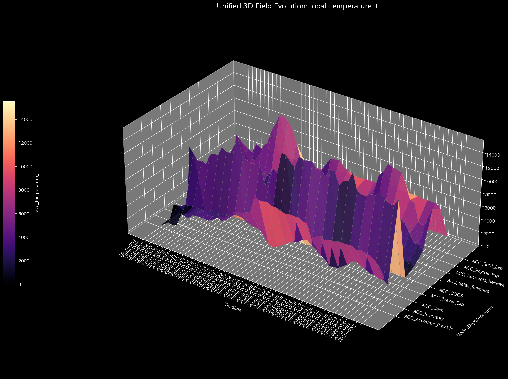
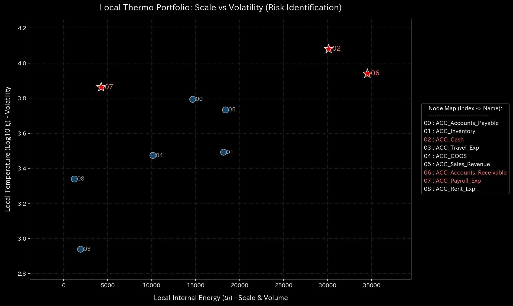
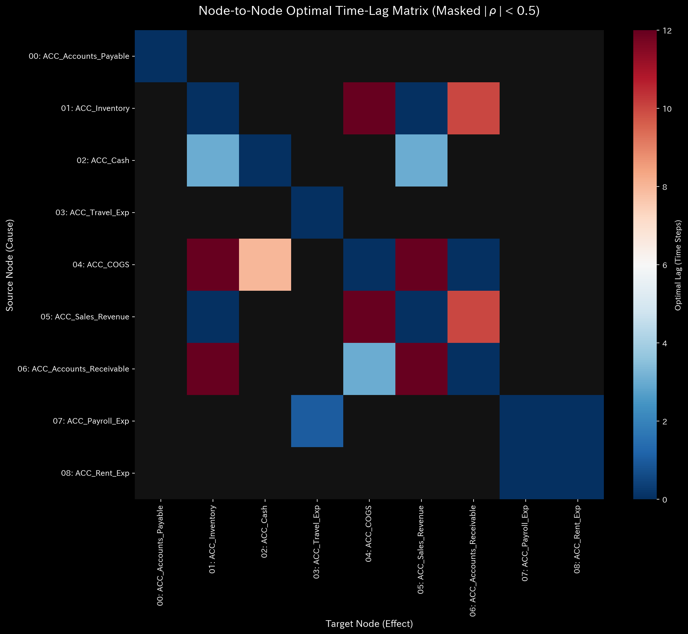

# 001. Thermodynamics & Statistical Mechanics

> **"Activity does not equal progress. We must distinguish between the energy that drives the system forward and the energy lost to chaos and friction."**

While Classical Mechanics (000) measures the mass and stiffness of individual components, Category **001** zooms out to view the entire network as a "Thermodynamic Ensemble."

It calculates the conservation, transformation, and inevitable dissipation of energy across the system. This layer acts as the ultimate "Health Check," identifying whether an organization is operating efficiently or burning itself out through hidden friction and volatility.

---

## 1. Macro Thermodynamics (001_1_1)
*Implementation: `src/filters/_001_1_1_filter_macro_thermodynamics.py`*

To understand the systemic health of the organization, TLU calculates four global state variables that define its thermodynamic profile.

* **Internal Energy ($U$):** The total absolute flux moving through the entire system. This represents the sheer volume of activity or "heat" generated by the organization, regardless of whether it is productive or wasteful.
* **Temperature ($T$):** The aggregate volatility of the system. **[Ver 8.0.0 Dimensional Consistency Pivot]** Temperature is now strictly defined as the sum of the *standard deviations* of flux across all nodes, ensuring it shares the same dimensional units as Internal Energy. High temperature means the system is vibrating unpredictably.
* **Entropy ($S$):** Calculated using Shannon Entropy on the distribution of flux. It measures the "disorder" or complexity of the allocation rules. A sudden spike in Entropy often precedes a structural regime shift or a breakdown of established processes.
* **Free Energy ($F$):** Defined as $F = U - T \cdot S$. This is the most critical metric for leadership. It represents the actual potential of the system to do *useful work*, after subtracting the energy lost to chaos ($S$) and volatility ($T$). An organization with high Internal Energy but low Free Energy is highly active but highly inefficient—it is essentially a space heater.

## 2. Local Thermodynamics (001_1_2)
*Implementation: `src/filters/_001_1_2_filter_local_thermodynamics.py`*

The macro state variables can be projected down to individual nodes to identify local hotspots.

* **Local Energy ($u_i$):** The total volume of transactions passing through a specific department.
* **Local Complexity ($s_i$):** Does this node distribute its outputs to 2 predictable targets, or 50 random ones? High local entropy indicates a node burdened with complex, scattered responsibilities.
* **Local Volatility ($t_i$):** How erratic is the flow through this specific node? Nodes with high local temperature are often bottlenecks suffering from inconsistent inputs.

## 3. Statistical Fluctuations and Time Lag (001_2_1 & 001_2_2)
*Implementation: `src/filters/_001_2_1_filter_lag_matrix.py`*

In complex systems, cause and effect are rarely instantaneous. A marketing investment today might not manifest as revenue for several months. TLU uses statistical mechanics to measure the "impedance" (delay) of these waves.

* **Cross-Correlation Lag:** By calculating the Pearson correlation coefficient between two time-series signals while shifting one along the time axis (lag), TLU identifies the exact "phase shift" where the two waveforms align perfectly.
* **The Full Lag Matrix:** TLU computes this optimal time lag for every single possible node pair ($N \times N$) in the network. This uncovers the true causal delays across the organization, distinguishing between immediate operational impacts and long-term strategic echoes.

## 4. Business Implications

By monitoring the Thermodynamic and Fluctuation metrics, decision-makers can answer:

1. **Is the organization burning out?** (High $U$, High $T$, but shrinking $F$).
2. **Are processes becoming dangerously chaotic?** (A steady upward drift in global $S$).
3. **What is the true ROI timeline?** (Using the Lag Matrix to know exactly *when* an investment will hit the target node, rather than just assuming it happens instantly).

## 5. CAUTION - Epistemological and Operational Limits

The application of macroscopic thermodynamic models to microscopic social systems (nodes, departments, accounts) provides a powerful heuristic for anomaly detection. However, users MUST strictly acknowledge the following epistemological limitations and operational hazards.

### 1. Strong Dependence on Coarse-Graining (Observation Time Scales)

The calculated Temperature ($T$) and Entropy ($S$) are highly dependent on the chosen time window for data aggregation (e.g., Daily, Weekly, Monthly, Quaterly).
A violent micro-fluctuation (high temperature) observed in a short-term window may appear as a smooth, steady flow (low temperature) from a long-term macroscopic perspective. **These indicators are not absolute truths; they are strictly relative landscapes bound by the configured time scale.**

### 2. Conflation of "State Variables" and "Process (Flow) Variables"

This thermodynamic filter evaluates the **fluid characteristics of transactions** passing through a node, not the internal structure of the node itself.
Do not erroneously equate "high entropy" with "the organization is in chaos." Instead, accurately interpret it as "the destinations of the resources passing through this organization are highly diverse and complex." Confusing a flow metric with an internal state metric will lead to misguided interventions.

### 3. Absolute Prohibition of KPI-ization (Avoiding Goodhart's Law)

**It is strictly prohibited to set the "Maximization of Free Energy ($F$)" or "Minimization of $T$ and $S$" as organizational goals or KPIs.**
Unlike physical particles, human beings and organizations possess agency. If they know they are being evaluated by these metrics, they will artificially alter their behavior to optimize the numbers (Goodhart's Law).
Artificially suppressing friction ($T$) or diversity ($S$) to improve the score will lead to the cessation of experimental transactions, innovation, and network exploration—ultimately resulting in the "Thermal Death" of the organization.

**This system is exclusively an early-warning radar for anomalies. It is NEVER a target to be optimized.**
