# 000_0. Basic Statistics & Foundations

This guide explains basic statistics in Tensor-Link Utility (TLU).

---

## 000_0: Basic Statistics

### 1. Financial Statement Structure (B/S & P/L)

The B/S block total chart (`000_0_1__BS_Block_Total.png`) visualizes the B/S balance. The P/L waterfall chart (`000_0_1__PL_Waterfall_Total.png`) shows the profit structure. We compare these charts to evaluate the macro structure of the system.

#### 🟢 Sample 0 (Healthy Metabolism)
**Clinical Interpretation:**
Assets, liabilities, and equity balance symmetrically. Expenses subtract from revenues, leaving net income. The basic structure is healthy.
- 
- 

#### 🟡 Sample 1 (Wash Trade)
**Clinical Interpretation:**
Accounts receivable are bloated. The P/L displays large revenues but minimal expenses. This indicates circular matched trades to create sham profits.
- 
- 

#### 🔴 Sample 2 (Embezzlement Leak)
**Clinical Interpretation:**
Revenues are recorded normally. However, cash vanishes off-book during recovery. Cash on hand is depleted. A dummy `UNKNOWN_LEAK` asset node replaces the lost cash.
- 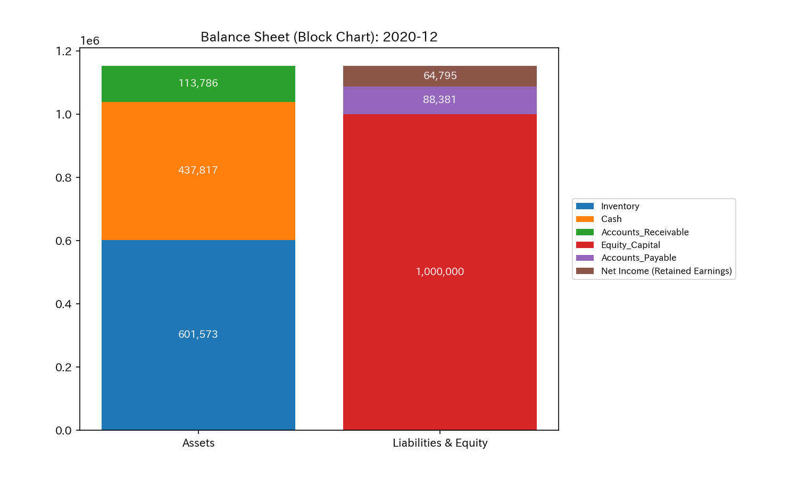
- 

#### 🟡 Sample 3 (Unbalanced Bookkeeping Mistake)
**Clinical Interpretation:**
A transient bookkeeping mistake where only one side of a transaction is entered. The B/S is unbalanced, leaving a residual. Operating revenues remain normal.
- 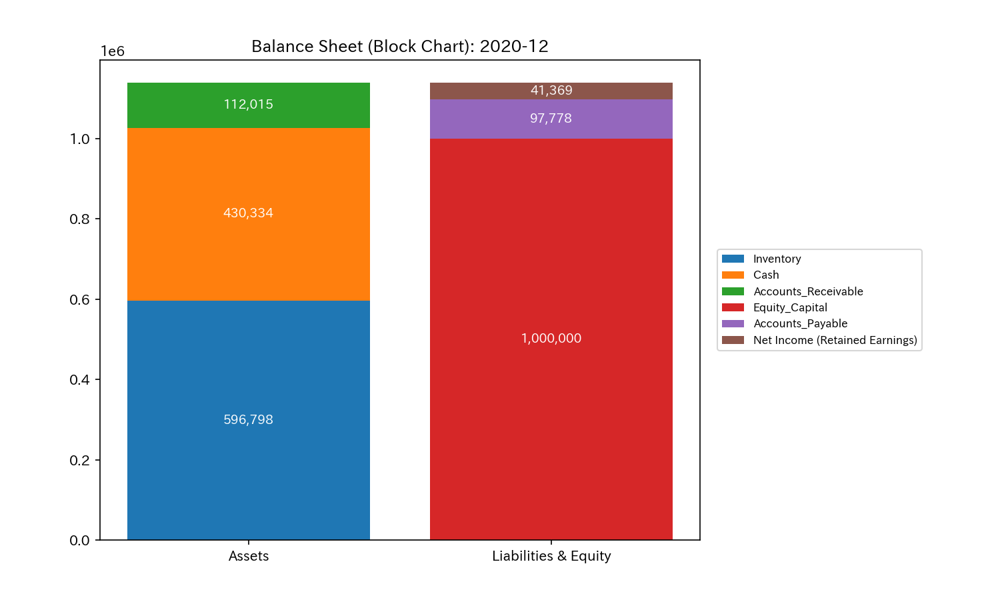
- 

#### 🔴 Sample 4 (Composite Chaos)
**Clinical Interpretation:**
Circular wash trading inflates receivables, while embezzlement drains cash. System bloat and active bleeding occur simultaneously.
- 
- 

#### 🔴 Sample 5 (Kyoto Traffic)
**Clinical Interpretation:**
Shows vehicle accumulation and flow balance at intersections. Vehicles concentrate at major intersections. The flow capacity collapsed due to blockages.
- 
- 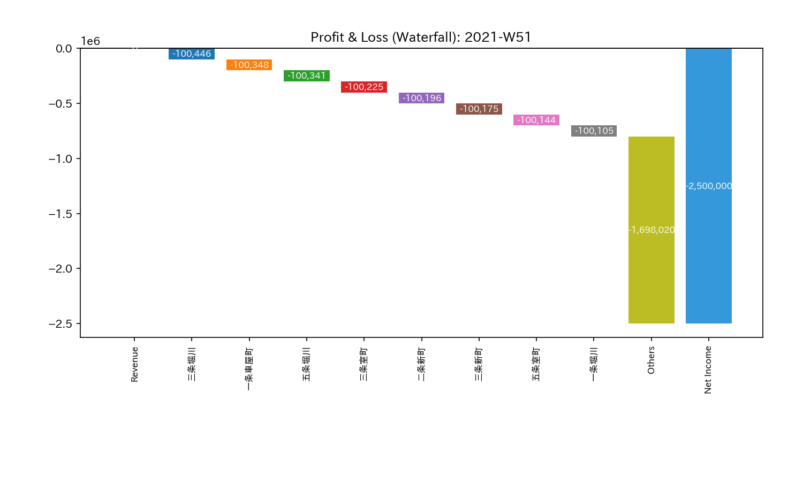

#### 🟢 Sample 6 (Market Stock Flow)
**Clinical Interpretation:**
Shows stock holding balances and trading volume. Volume is high, but real stock transfers are close to zero. Convection remains stable among USRs.
- 
- 

#### 🟢 Sample 7 (Market Cash Flow)
**Clinical Interpretation:**
Shows cash holding balances and direct cash flow volume. Media of exchange function is stable between accounts. There are no residuals.
- 
- 

#### 🔴 Sample 8 (fMRI Stroke)
**Clinical Interpretation:**
Shows BOLD signals and activity balance across brain regions. Signals in the motor cortex drop severely. This localized loss pulls down the total brain activity balance.
- 
- 

#### 🔴 Sample 9 (fMRI Seizure)
**Clinical Interpretation:**
Shows neural activity intensity and balance. Activity in the temporal lobe dominates the total oxygen resource. Pathological synchrony depletes overall cognitive potential.
- 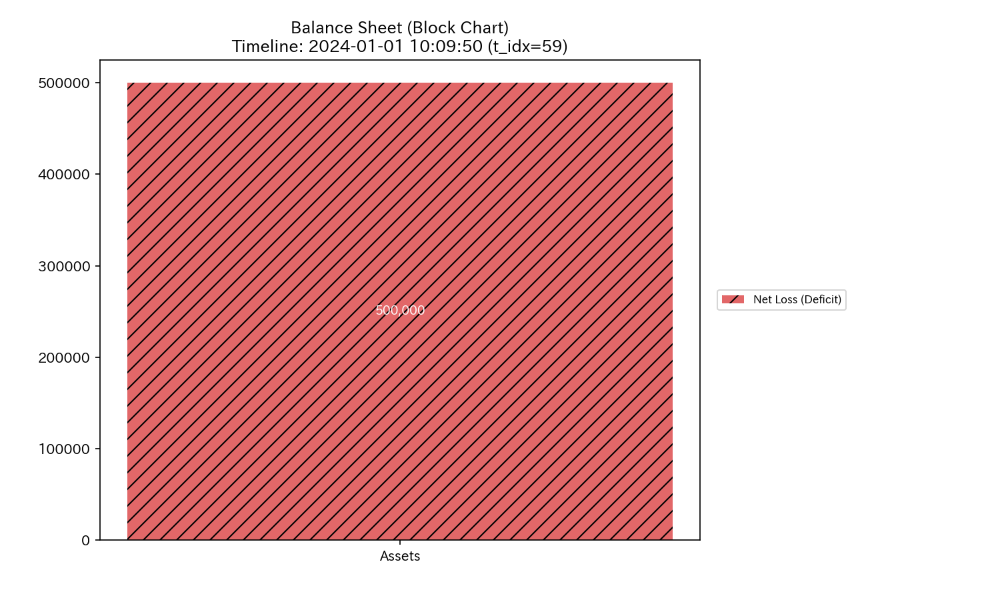
- 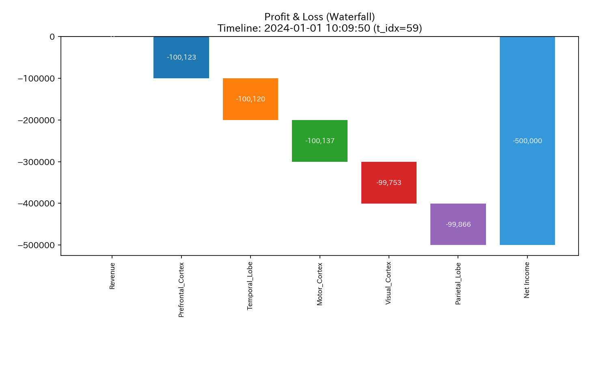

---

### 2. Time-Series Trends (B/S & P/L Trends)

We compare cumulative trends (`BS_Trend` / `PL_Trend`) with periodic changes (`BS_Trend_Periodic` / `PL_Trend_Periodic`).

#### 🟢 Sample 0 (Healthy Metabolism)
**Clinical Interpretation:**
Revenues and expenses change in sync. Net income grows steadily over time.
- 
- 
- 
- 

#### 🟡 Sample 1 (Wash Trade)
**Clinical Interpretation:**
Revenues and receivables grow linearly. However, periodic expenses stay completely flat. The natural volatility of commercial transactions is missing.
- 
- 
- 
- 

#### 🔴 Sample 2 (Embezzlement Leak)
**Clinical Interpretation:**
Cash decreases steadily over time. The P/L shows cumulative profits. Cash increases are abnormally low during receivable collection steps. Capital leaks off-book repeatedly.
- 
- 
- 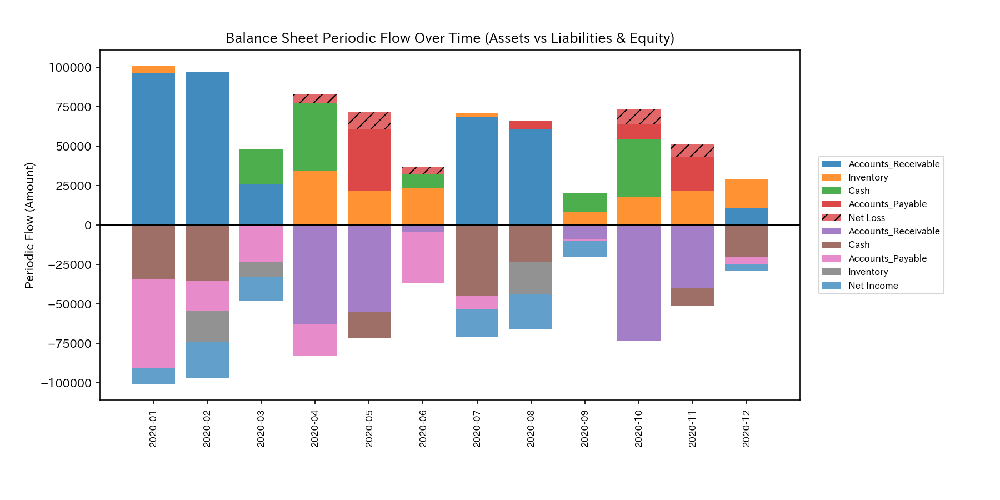
- 

#### 🟡 Sample 3 (Unbalanced Bookkeeping Mistake)
**Clinical Interpretation:**
At $t=1$ (2020-02), an unbalanced entry error occurs. Periodic trends display sudden spikes. The error is corrected in the next step, absorbing the transient impact.
- 
- 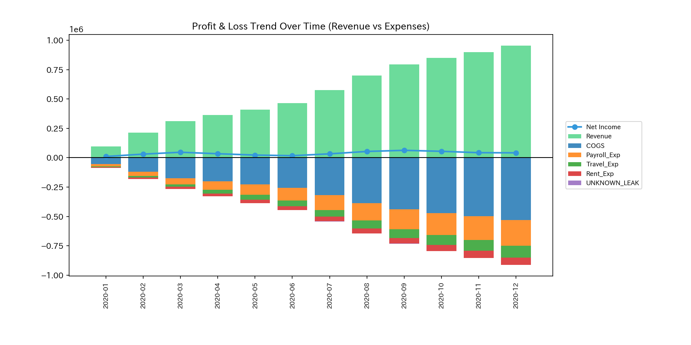
- 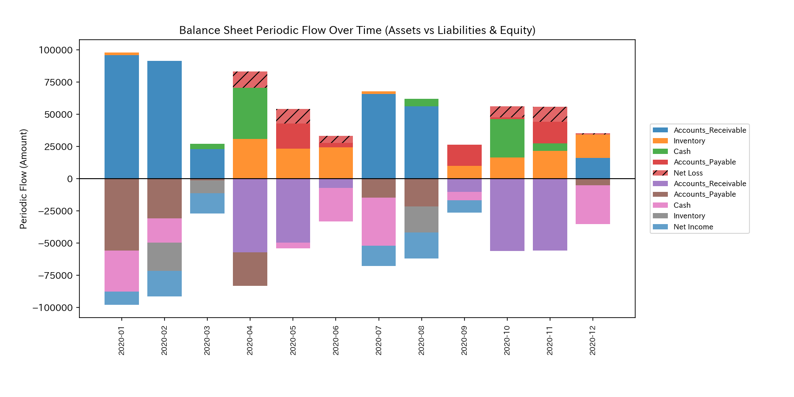
- 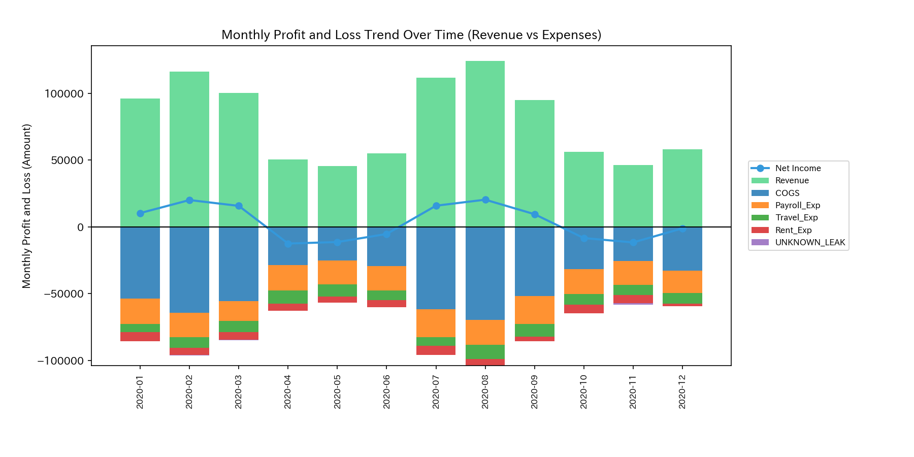

#### 🔴 Sample 4 (Composite Chaos)
**Clinical Interpretation:**
Receivables and profits accumulate from wash trades. At the same time, cash leaks off-book. Window-dressing and real cash drain contrast sharply.
- 
- 
- 
- 

#### 🔴 Sample 5 (Kyoto Traffic)
**Clinical Interpretation:**
Shows vehicle inflow and congestion losses. When the anomaly is injected, vehicle counts rise, and periodic delays expand. The flow potential drops.
- 
- 
- 
- 

#### 🟢 Sample 6 (Market Stock Flow)
**Clinical Interpretation:**
Shows trade volumes and stock holdings. Cumulative volume rises. Convection occurs periodically, and stock balances stay stable.
- 
- 
- 
- 

#### 🟢 Sample 7 (Market Cash Flow)
**Clinical Interpretation:**
Shows cash holdings and direct cash transfer volumes. Both cumulative and periodic trends show no abnormalities or sudden drops. Convection balances remain stable.
- 
- 
- 
- 

#### 🔴 Sample 8 (fMRI Stroke)
**Clinical Interpretation:**
BOLD signal cumulative trends turn negative after `t=30` (TR=150). Periodic charts show a sharp drop in blood flow during the stroke, remaining flat thereafter.
- 
- 
- 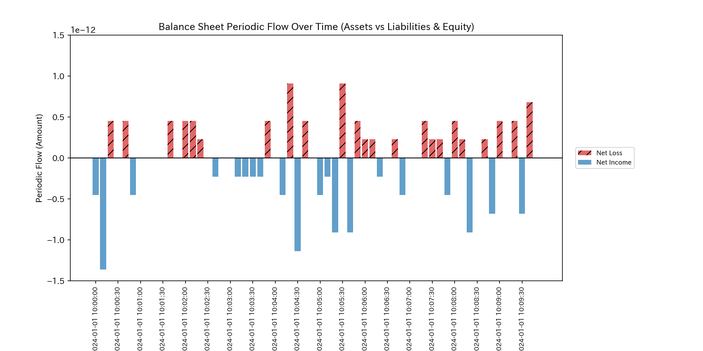
- 

#### 🔴 Sample 9 (fMRI Seizure)
**Clinical Interpretation:**
Shows BOLD signal intensities during epilepsy. The cumulative potential decreases. Periodic trends show continuous signal oscillations matching the seizure cycles.
- 
- 
- 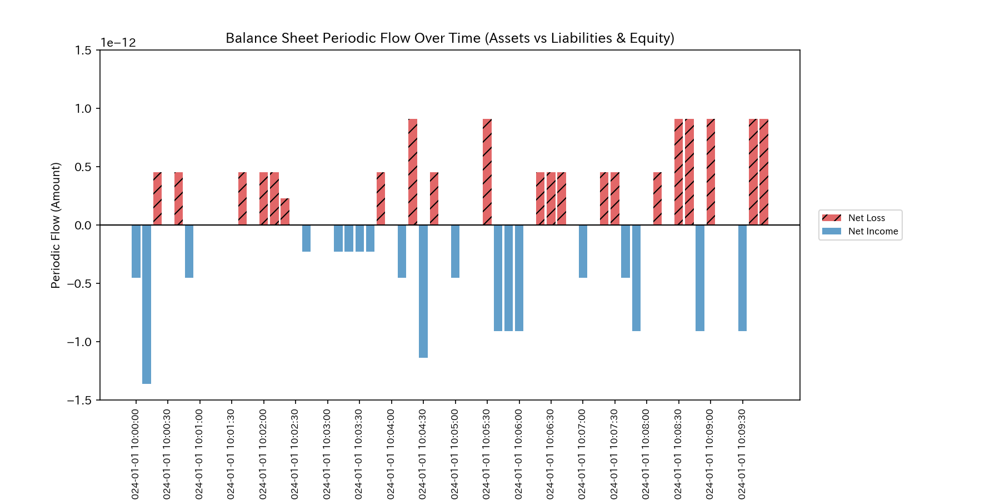
- 
