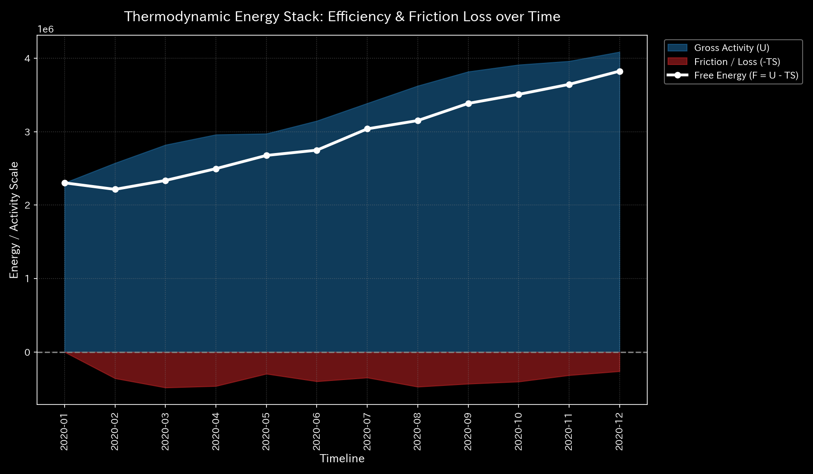
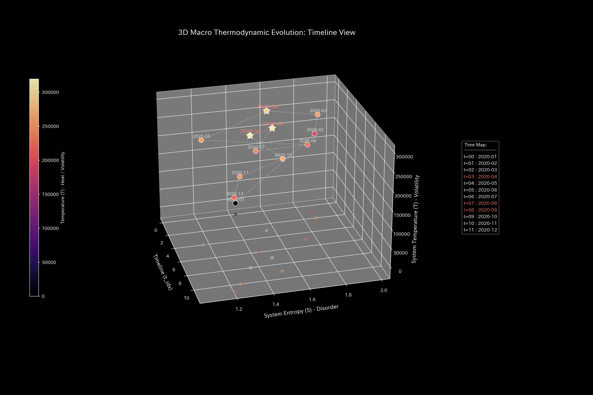
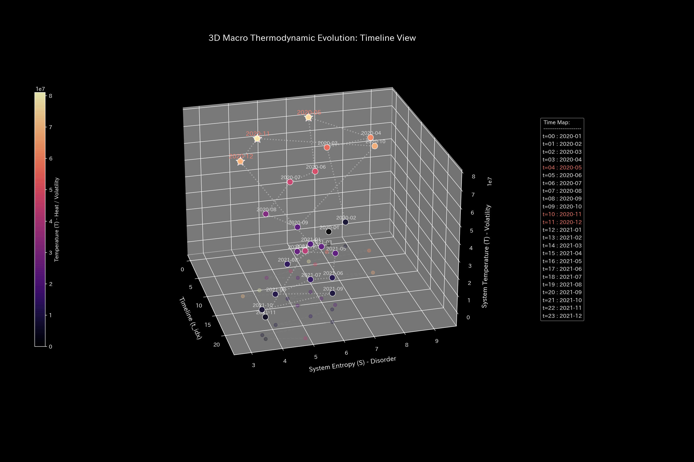

# 001. Thermodynamics & Entropy

This guide explains thermodynamics and entropy analysis modules (`001_1`, `001_2`) in Tensor-Link Utility (TLU).

---

## 🔬 Mathematical Physics of Thermodynamics

TLU defines system activity as "internal energy $U$," disorder as "entropy $S$," and volatility as "temperature $T$." We use these variables to calculate the remaining available potential of the system, "free energy $F$":

$$F = U - T \cdot S$$

In a healthy system, activity generates moderate frictional heat loss ($T \times S$), and free energy is consumed productively. When a pathological closed loop forms, the internal energy $U$ remains high. However, since it lacks real activity, the energy is entirely offset by the expansion of frictional heat ($TS$). As a result, the free energy $F$ collapses and is depleted.

---

## 📊 Macro Thermodynamics & Case Study Findings

### 1. Thermodynamic Energy Stack (`001_1_2__thermodynamics_energy_stack.png`)

This stack graph shows the cumulative composition of internal energy $U$, frictional heat loss $TS$, and free energy $F$.

#### 🟢 Sample 0 (Healthy Metabolism)
**Clinical Interpretation:**
Free energy $F$ (solid white line) grows steadily. It is not compressed by frictional heat loss $TS$ (burgundy area).
- 

#### 🟡 Sample 1 (Wash Trade)
**Clinical Interpretation:**
In the execution months of wash trading (Jan, Feb, May), balance volatility causes local temperature to spike. Frictional heat loss $TS$ expands rapidly and compresses the free energy $F$.
- 

#### 🔴 Sample 2 (Embezzlement Leak)
**Clinical Interpretation:**
Active cash (mass) leaves the system. The internal energy $U$ itself decreases steadily over time.
- 

#### 🟡 Sample 3 (Unbalanced Bookkeeping Mistake)
**Clinical Interpretation:**
At the moment of the one-sided entry mistake at $t=1$ (Feb), temperature and entropy spike as transient noise. Friction is recorded on the stack.
- 

#### 🔴 Sample 4 (Composite Chaos)
**Clinical Interpretation:**
Temperature spikes from circular trades, and asset drain from embezzlement occur together. Frictional heat expands, and free energy $F$ is compressed to the bottom.
- 

#### 🔴 Sample 5 (Kyoto Traffic)
**Clinical Interpretation:**
After a deadlock occurs, vehicle progress stops while inflows continue. Frictional heat loss from velocity volatility spikes. Macro free energy (flow potential) collapses.
- 

#### 🟢 Sample 6 (Market Stock Flow)
**Clinical Interpretation:**
Internal energy $U$ stays stable at an appropriate level. Frictional heat loss $TS$ remains low, and free energy $F$ maintains positive activity potential.
- 

#### 🟢 Sample 7 (Market Cash Flow)
**Clinical Interpretation:**
Frictional heat loss $TS$ remains mild under cash convection. Free energy $F$ is conserved normally, maintaining capital efficiency.
- 

#### 🔴 Sample 8 (fMRI Stroke)
**Clinical Interpretation:**
Directly after the stroke onset ($t=30$), BOLD signal inflow to the motor cortex stops. Energy production collapses, and free energy plummets.
- 

#### 🔴 Sample 9 (fMRI Seizure)
**Clinical Interpretation:**
Abnormal synchronization forces volatility (temperature) to spike. However, the brain loses its capacity for information search, and free energy collapses.
- 

---

### 2. Temperature-Entropy (T-S) Diagram (`001_1_3__thermodynamics_ts_diagram.png`)

This graph plots temperature $T$ against entropy $S$ to display irreversible thermodynamic cycles.

#### 🟢 Sample 0 (Healthy Metabolism)
**Clinical Interpretation:**
The T-S curve does not close. It displays an open path that releases entropy to the external environment.
- 

#### 🟡 Sample 1 (Wash Trade)
**Clinical Interpretation:**
The T-S diagram displays a closed oval track (circular loop). This mathematically proves the existence of wasted frictional heat.
- 

#### 🔴 Sample 2 (Embezzlement Leak)
**Clinical Interpretation:**
The overall scale of temperature and entropy shrinks as mass (cash) leaves the system. The T-S curve irreversibly contract toward the origin.
- 

#### 🟡 Sample 3 (Unbalanced Bookkeeping Mistake)
**Clinical Interpretation:**
The curve spikes at the mistake step. However, it returns to the open T-S path after correction, indicating no permanent loop.
- 

#### 🔴 Sample 4 (Composite Chaos)
**Clinical Interpretation:**
Wash trade loops and mass dissipation occur together. The T-S curve departs from the healthy path and spirals toward infinite shrinkage.
- 

#### 🔴 Sample 5 (Kyoto Traffic)
**Clinical Interpretation:**
When the bottleneck occurs, the T-S curve shifts to a closed, clockwise loop. Flow capacity is locked locally, paralyzing the system.
- 

#### 🟢 Sample 6 (Market Stock Flow)
**Clinical Interpretation:**
The T-S curve does not form a closed loop. It displays an open convection process linked with the environment.
- 

#### 🟢 Sample 7 (Market Cash Flow)
**Clinical Interpretation:**
The T-S curve fluctuates gently along an open path. TLU detects no loop locks or synchronizations.
- 

#### 🔴 Sample 8 (fMRI Stroke)
**Clinical Interpretation:**
After the stroke onset ($t=30$), the T-S curve separates completely from the healthy orbit. It freezes irreversibly near the origin.
- 

#### 🔴 Sample 9 (fMRI Seizure)
**Clinical Interpretation:**
Abnormal synchronization deprives the brain of state search capacity. The T-S curve collapses into a simple flat line reflecting a single oscillation cycle.
- 
