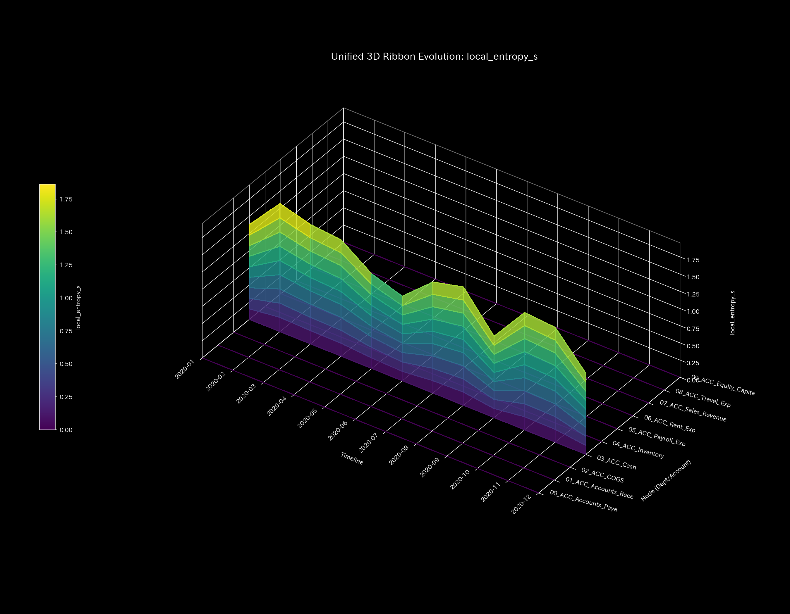
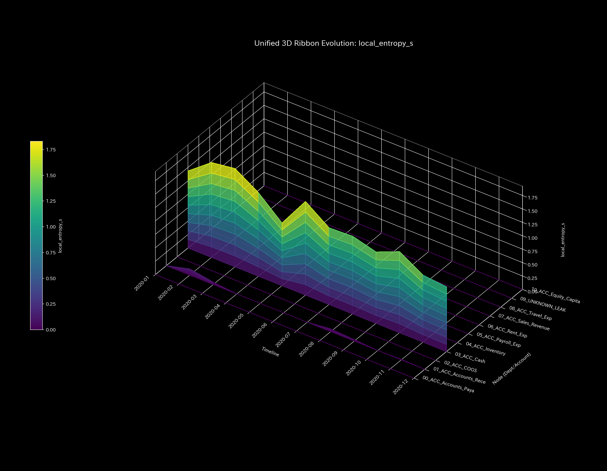
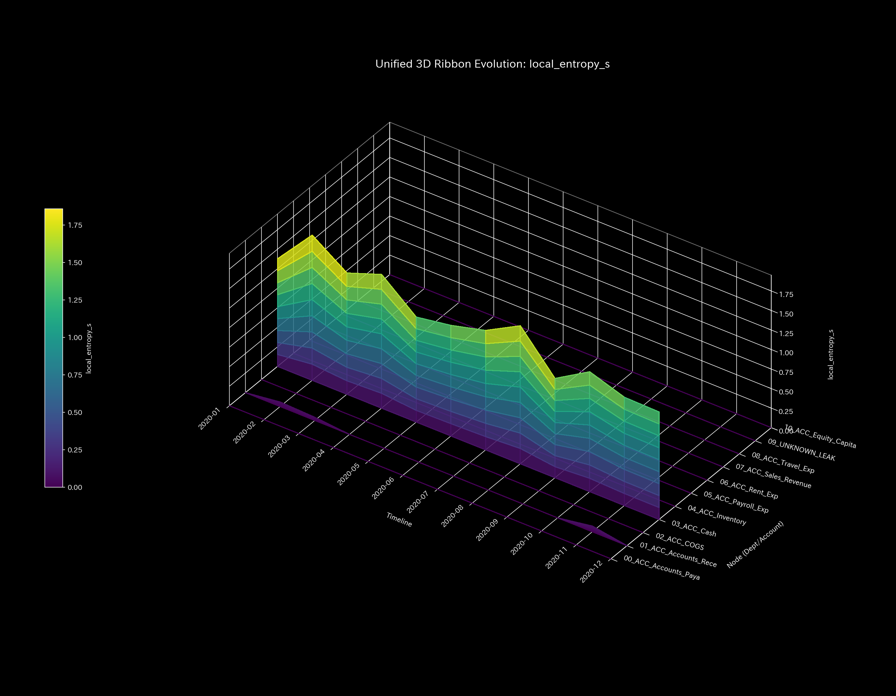
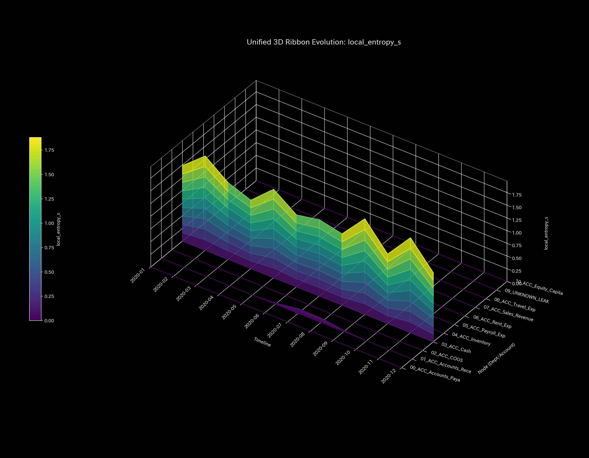
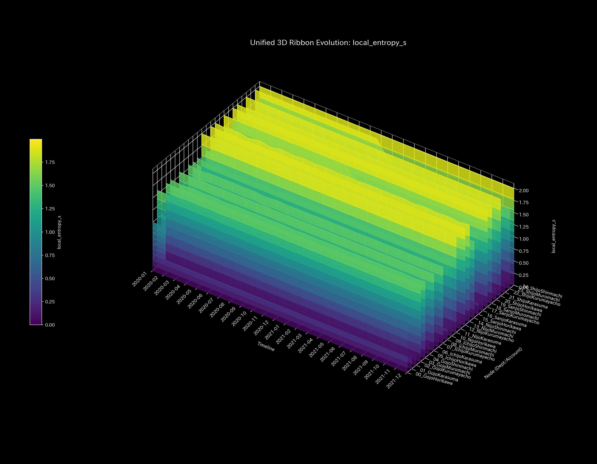
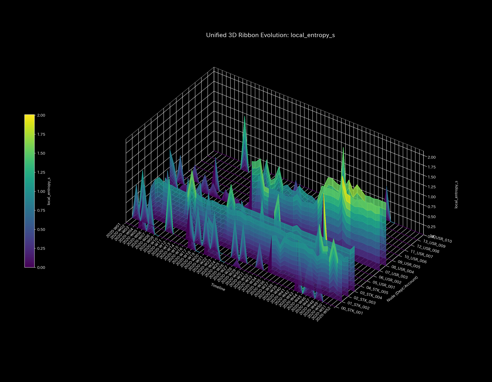
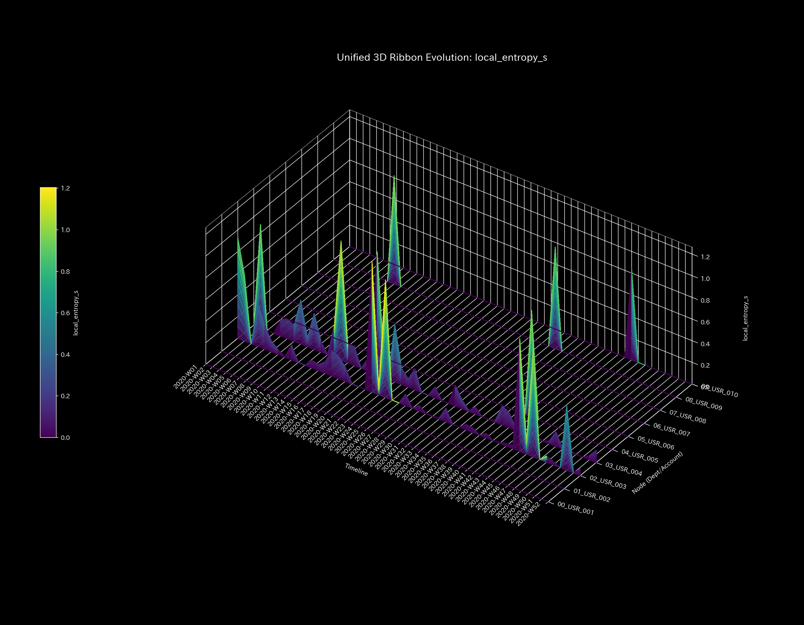

# 001_2. Local Entropy

This guide explains the "3D local entropy manifold (`001_1_2_1__3d_local_entropy.png`)" in Tensor-Link Utility (TLU).

---

## 🔬 Mathematical Physics of Local Entropy $s_i$

TLU defines the disorder at each node $i$ as "local entropy $s_i$." This metric measures how dispersed the outflow from a node is across its connections:

$$s_i = -\sum_{j} P_{ij} \log P_{ij}$$

If flow routes become fixed to specific connections or are blocked, the local entropy $s_i$ drops.

---

## 📊 3D Local Entropy & Case Study Findings

This 3D plot displays the spatiotemporal changes in entropy (flow dispersion) for each node.

#### 🟢 Sample 0 (Healthy Metabolism)

**Clinical Interpretation:**
Local entropy is distributed uniformly across all regions. No localized flow blocks or stasis occur.

- 

#### 🟡 Sample 1 (Wash Trade)

**Clinical Interpretation:**
During wash trades (Jan, Feb, May), `ACC_Cash` forms a circular loop with accounts receivable. A rise in local entropy is detected at these nodes.

- 

#### 🔴 Sample 2 (Embezzlement Leak)

**Clinical Interpretation:**
The cash flow becomes fixed toward a single outflow node `UNKNOWN_LEAK`. Local entropy rises around this node, indicating the leak path.

- 

#### 🟡 Sample 3 (Unbalanced Bookkeeping Mistake)

**Clinical Interpretation:**
At the error step ( $t=1$ ), a sharp, single spike forms in local entropy around the accounts receivable node. It disappears and returns to flat in the next step.

- 

#### 🔴 Sample 4 (Composite Chaos)

**Clinical Interpretation:**
Local entropy increases occur around both the circular wash trade nodes and the embezzlement leak node. Double routing distortion is detected.

- 

#### 🔴 Sample 5 (Kyoto Traffic)

**Clinical Interpretation:**
An entropy drop ( $s_i = 1.674$ ) is logged around the bottleneck `21_Shijo_Muromachi`, indicating vehicle stagnation.

- 

#### 🟢 Sample 6 (Market Stock Flow)

**Clinical Interpretation:**
Stock flow cycles symmetrically and stably. Local entropy remains uniform and high (around $s_i = 2.0$ ) across all steps and nodes.

- 

#### 🟢 Sample 7 (Market Cash Flow)

**Clinical Interpretation:**
Cash does not stagnate in specific accounts or loops. Liquidity is dispersed across diverse connections, maintaining high local entropy.

- 

#### 🔴 Sample 8 (fMRI Stroke)

**Clinical Interpretation:**
After the stroke onset ( $t=30$ ), BOLD activity in the necrotic motor cortex region vanishes. Local entropy around the focus collapses to flat.

- 

#### 🔴 Sample 9 (fMRI Seizure)

**Clinical Interpretation:**
During hyper-synchrony, all brain regions synchronize to the maximum. Since all regions mirror the same pattern, local entropy plummets. The entire manifold flattens (freezes) at a low level.

- 
