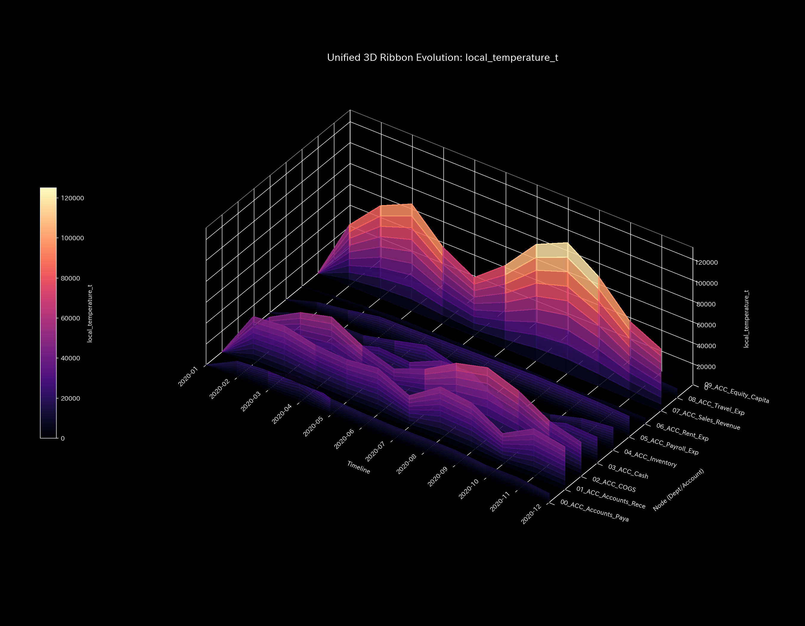
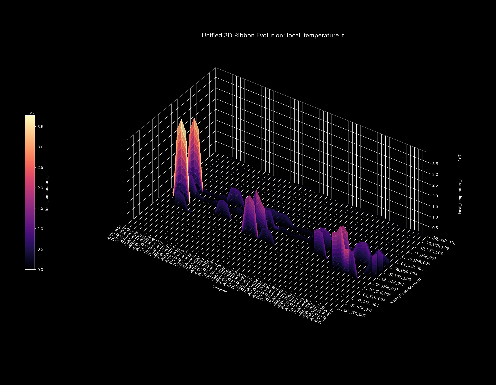
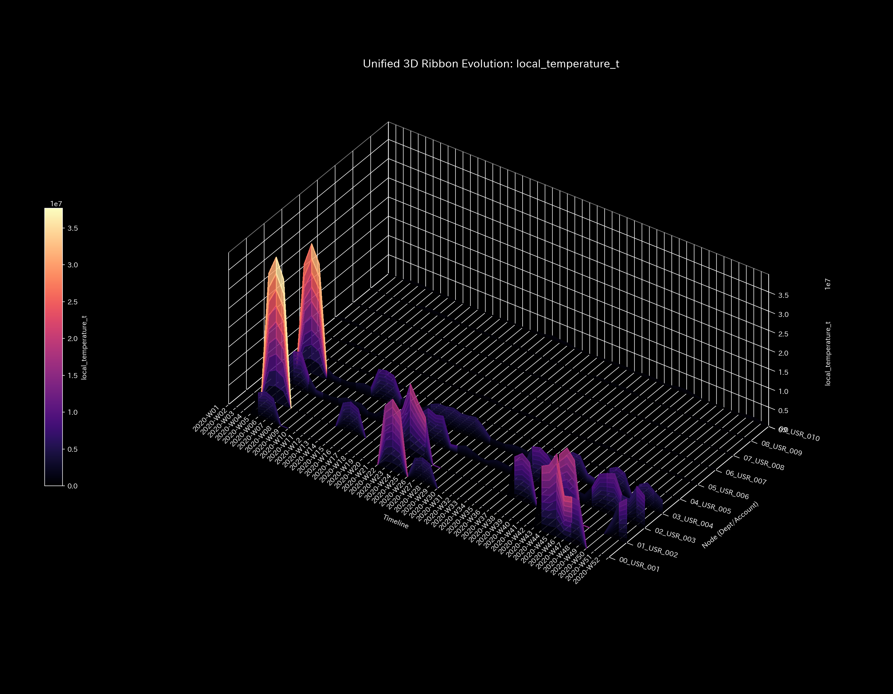
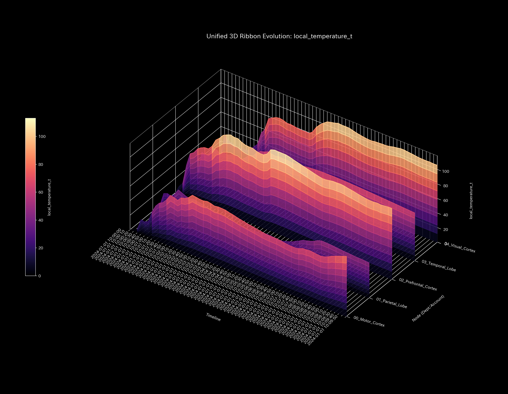

# 001_3. Local Temperature

This guide explains the "3D local temperature manifold (`001_1_2_2__3d_local_temperature.png`)" in Tensor-Link Utility (TLU).

---

## 🔬 Mathematical Physics of Local Temperature $T_i$

TLU defines the volatility (standard deviation of temporal fluctuations) of flows at node $i$ as "local temperature $T_i$." This measures the intensity of activity and balance fluctuations at the node:

$$T_i \propto \text{StdDev}(X_i(t))$$

When activity overheats, the local temperature rises. When activity freezes, the temperature drops.

---

## 📊 3D Local Temperature & Case Study Findings

This 3D plot displays the spatiotemporal changes in BOLD signal/balance volatility (standard deviation) for each node.

#### 🟢 Sample 0 (Healthy Metabolism)

**Clinical Interpretation:**
There is no local temperature bias. The entire system maintains a uniform metabolic flow (healthy temperature).

- 

#### 🟡 Sample 1 (Wash Trade)

**Clinical Interpretation:**
In sync with the circular trading cycles, the three loop nodes (`ACC_Cash`, `ACC_Accounts_Receivable`, and `ACC_Sales_Revenue`) overheat together, indicating a sharp rise in volatility.

- 

#### 🔴 Sample 2 (Embezzlement Leak)

**Clinical Interpretation:**
During embezzlement steps, the activity volatility (temperature) of the bank cash accounts remains overheated. TLU captures the dynamic balance spikes from off-book transfers.

- 

#### 🟡 Sample 3 (Unbalanced Bookkeeping Mistake)

**Clinical Interpretation:**
At the error step ( $t=1$ ), standard deviation rises transiently, forming a temperature spike. The temperature cools back to normal in the next step.

- 

#### 🔴 Sample 4 (Composite Chaos)

**Clinical Interpretation:**
Overheating from circular trades and overheating from embezzlement leaks occur together. Volatility rises across multiple locations.

- 

#### 🔴 Sample 5 (Kyoto Traffic)

**Clinical Interpretation:**
At the bottleneck `23_Shijo_Karasuma`, complete deadlock freezes flow, showing blue (temperature drops to $T_i = 1.87$ ) as a "cold island effect."

- 

#### 🟢 Sample 6 (Market Stock Flow)

**Clinical Interpretation:**
Stock holdings are controlled. No local overheating or volatility biases are detected, keeping spatial temperatures within a healthy range.

- 

#### 🟢 Sample 7 (Market Cash Flow)

**Clinical Interpretation:**
In the cash payment network, accounts balance stably. Local temperatures remain normal across all steps and nodes.

- 

#### 🔴 Sample 8 (fMRI Stroke)

**Clinical Interpretation:**
After the stroke onset ( $t=30$ ), BOLD signal standard deviations (volatility) vanish. The local temperature cools down rapidly, forming a blue "cold island" (thermal collapse).

- 

#### 🔴 Sample 9 (fMRI Seizure)

**Clinical Interpretation:**
BOLD signal volatility spikes across all regions. The entire brain overheats, turning the manifold red (brain-wide thermal overheating).

- 
