# 001_4. Local Energy & Gradient

This guide explains the "3D local internal energy manifold (`001_1_2_7__3d_local_internal_energy.png`)," the "3D local temperature gradient manifold (`001_1_2_3__3d_local_gradient.png`)," and the "local thermal gradient scatter plot (`001_1_2_6__local_thermo_gradient.png`)" in Tensor-Link Utility (TLU).

---

## 🔬 Mathematical Physics of Scale (Energy) & Friction (Gradient)

The local thermodynamic analysis evaluates the relationship between the scale of activity at each node and its spatial friction (imbalance) with neighbors.

### 1. Local Internal Energy $u_i$ (Scale & Volume)

Defined as the absolute sum of directed flows through node $i$. This represents transaction volume and activity:
$$u_i(t) = \sum_{j \in \text{neighbors}(i)} ( |F_{ji}(t)| + |F_{ij}(t)| )$$

### 2. Local Temperature Gradient $\nabla T_i$ (Friction & Force)

Defined as the spatial difference (gradient) in temperature (volatility $T_i$ ) between adjacent nodes:
$$\nabla T_i = \sum_{j \in \text{neighbors}(i)} W_{ij} (T_i - T_j)$$
High gradients indicate localized imbalances. This points to bottlenecks or boundaries with high flow impedance.

### 3. Local Thermal Gradient Scatter Plot (`local_thermo_gradient.png`)

Plots local internal energy $u_i$ on the horizontal axis and local temperature gradient $\nabla T_i$ on the vertical axis.

* **Healthy Nodes:** Cluster at the bottom (low gradient), regardless of flow volume.
* **Pathological Anomalies (starred):** Diverge to the top-right (high energy and high gradient), indicating systemic blocks or biases.

---

## 📊 3D Ribbon & Scatter Plot Findings

#### 🟢 Sample 0 (Healthy Metabolism)

**Clinical Interpretation:**
Activity is uniform. No flow concentration (energy bias) or volatility differences (temperature gradient) occur. All nodes cluster in the low gradient area in the scatter plot. No anomalies are detected.
* **3D Local Internal Energy:**
  * 
* **3D Local Temperature Gradient:**
  * 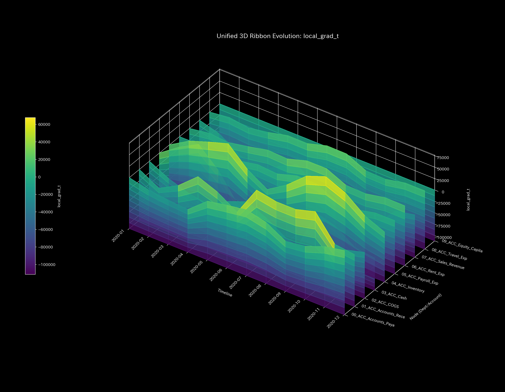
* **Local Thermal Gradient Scatter Plot:**
  * 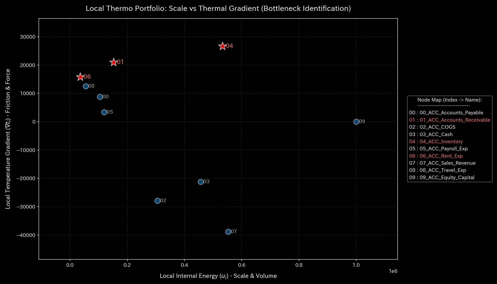

#### 🟡 Sample 1 (Wash Trade)

**Clinical Interpretation:**
Circular wash trading occurs. Volumes (internal energy) spike at the three loop nodes (`ACC_Cash`, `ACC_Accounts_Receivable`, and `ACC_Sales_Revenue`). High temperature gradients form at the boundaries with inactive expense and liability accounts. In the scatter plot, the three nodes are isolated in the top-right (high energy, high gradient).
* **3D Local Internal Energy:**
  * 
* **3D Local Temperature Gradient:**
  * 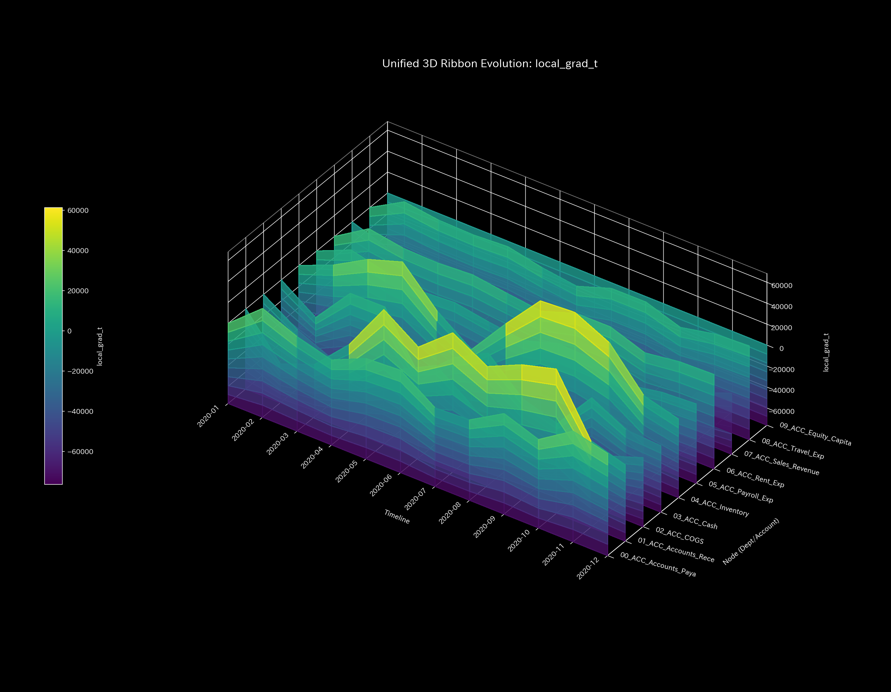
* **Local Thermal Gradient Scatter Plot:**
  * 

#### 🔴 Sample 2 (Embezzlement Leak)

**Clinical Interpretation:**
During embezzlement, volume (internal energy) spikes at cash accounts and the bypass leak node (`UNKNOWN_LEAK`). A sharp temperature gradient forms along the bypass route. The affected nodes isolate as outliers in the scatter plot.
* **3D Local Internal Energy:**
  * 
* **3D Local Temperature Gradient:**
  * 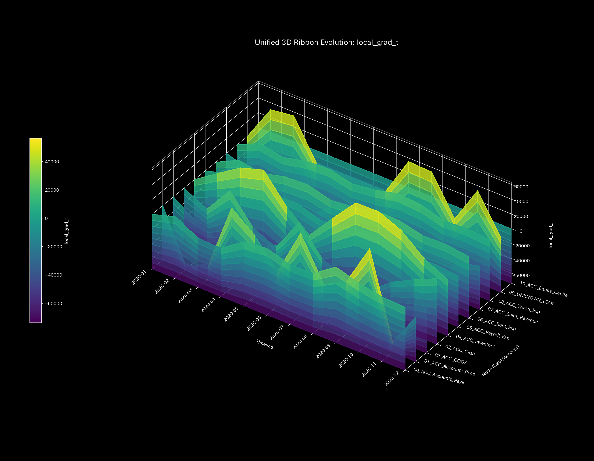
* **Local Thermal Gradient Scatter Plot:**
  * 

#### 🟡 Sample 3 (Unbalanced Bookkeeping Mistake)

**Clinical Interpretation:**
A one-sided bookkeeping error occurs at $t=1$. The adjustment flows trigger transient spikes in internal energy and temperature gradients at the affected nodes. The error is corrected in the next step, keeping the impact local. Average node locations remain normal in the scatter plot.
* **3D Local Internal Energy:**
  * 
* **3D Local Temperature Gradient:**
  * 
* **Local Thermal Gradient Scatter Plot:**
  * 

#### 🔴 Sample 4 (Composite Chaos)

**Clinical Interpretation:**
Volume spikes from circular trade loops and volume spikes from embezzlement leaks occur together in different areas. Multiple peaks appear in internal energy and temperature gradients. Outlier nodes split in different directions on the scatter plot.
* **3D Local Internal Energy:**
  * 
* **3D Local Temperature Gradient:**
  * 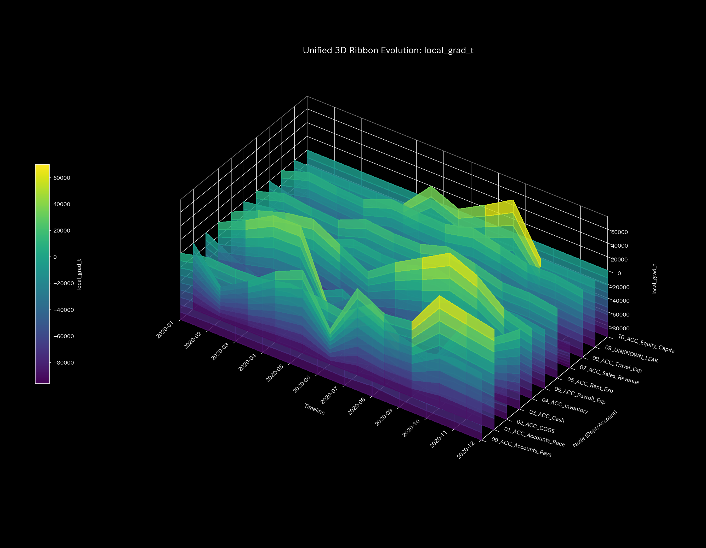
* **Local Thermal Gradient Scatter Plot:**
  * 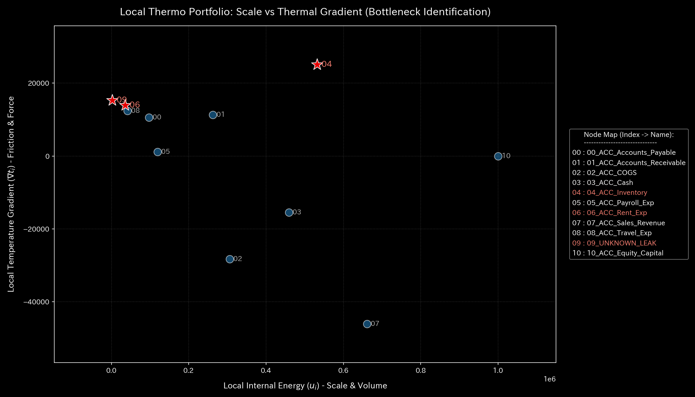

#### 🔴 Sample 5 (Kyoto Traffic)

**Clinical Interpretation:**
Intersection `23_Shijo_Karasuma` deadlocks (cold spot). A sharp temperature gradient forms between this bottleneck and upstream intersections where vehicles accumulate (hot spots). The bottleneck intersection is plotted as a starred outlier (high energy, high gradient) in the scatter plot.
* **3D Local Internal Energy:**
  * 
* **3D Local Temperature Gradient:**
  * 
* **Local Thermal Gradient Scatter Plot:**
  * 

#### 🟢 Sample 6 (Market Stock Flow)

**Clinical Interpretation:**
Circular stock trading occurs symmetrically among USRs. Total internal energy is high. Since flows disperse uniformly among USR accounts, no spatial temperature gradients form. All nodes lie in the bottom-right (high energy, low gradient) on the scatter plot.
* **3D Local Internal Energy:**
  * 
* **3D Local Temperature Gradient:**
  * 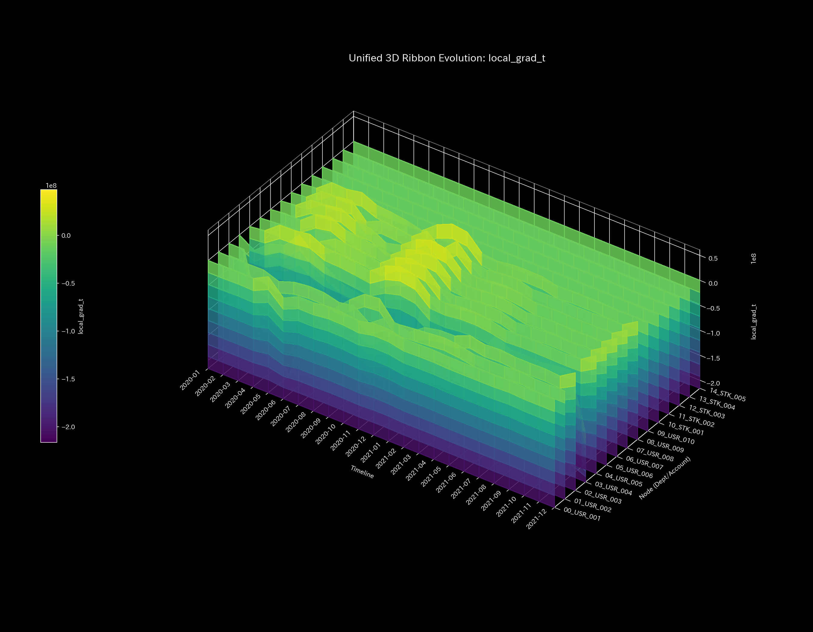
* **Local Thermal Gradient Scatter Plot:**
  * 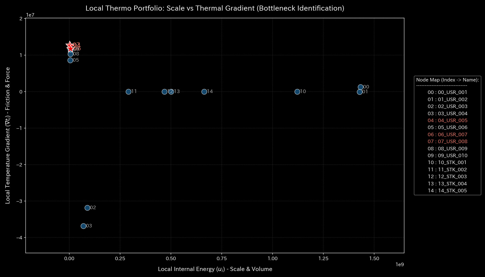

#### 🟢 Sample 7 (Market Cash Flow)

**Clinical Interpretation:**
Organic cash flows among general users. Energy disperses throughout the network. No temperature gradients form. Nodes cluster in the low-gradient, medium-energy area in the scatter plot.
* **3D Local Internal Energy:**
  * 
* **3D Local Temperature Gradient:**
  * 
* **Local Thermal Gradient Scatter Plot:**
  * 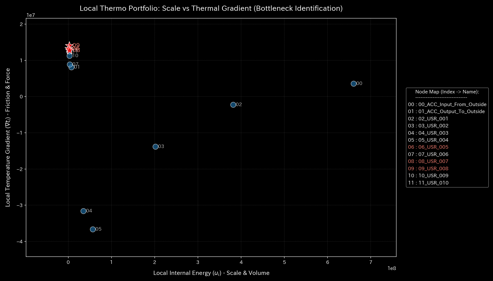

#### 🔴 Sample 8 (fMRI Stroke)

**Clinical Interpretation:**
The motor cortex region loses blood flow, and its activity volume (internal energy) drops. Upstream penumbra regions display compensatory overactivity. A sharp temperature gradient wall forms between the necrotic focus and the penumbra. The necrotic focus nodes shift left (low energy) in the scatter plot. Penumbra boundary nodes shift upward (high gradient).
* **3D Local Internal Energy:**
  * 
* **3D Local Temperature Gradient:**
  * 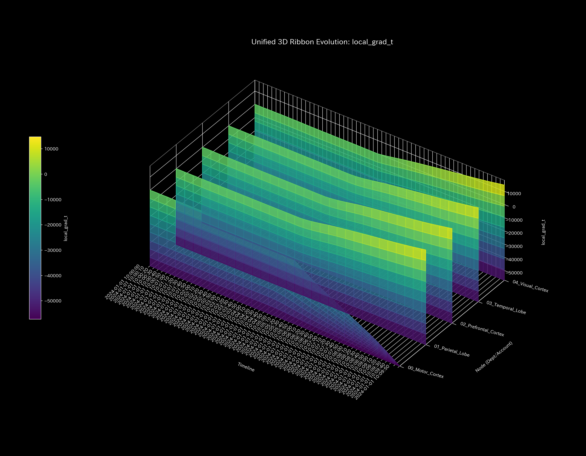
* **Local Thermal Gradient Scatter Plot:**
  * 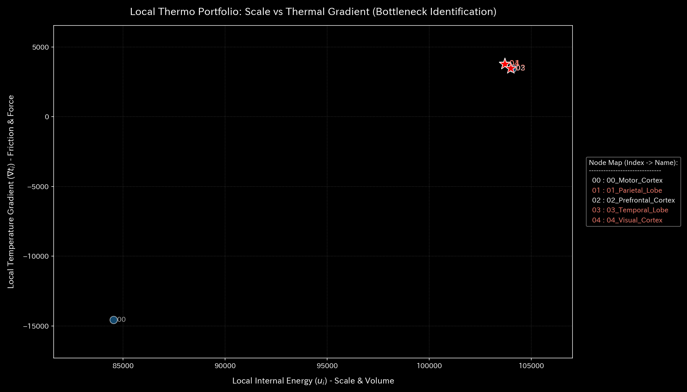

#### 🔴 Sample 9 (fMRI Seizure)

**Clinical Interpretation:**
Brain-wide overactivity occurs during the seizure. Activity volumes (internal energy) spike across all regions. Since the entire brain synchronizes and overheats, temperature differences (gradients) between regions vanish. All nodes freeze in the bottom-right (high energy, low gradient) on the scatter plot.
* **3D Local Internal Energy:**
  * 
* **3D Local Temperature Gradient:**
  * 
* **Local Thermal Gradient Scatter Plot:**
  * 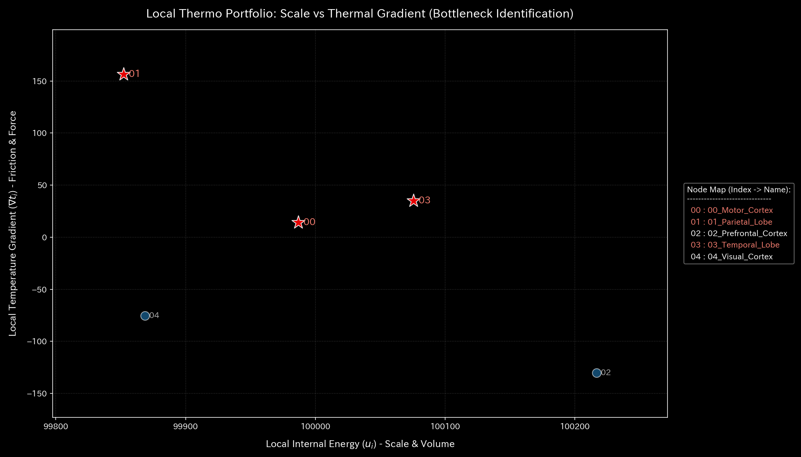
