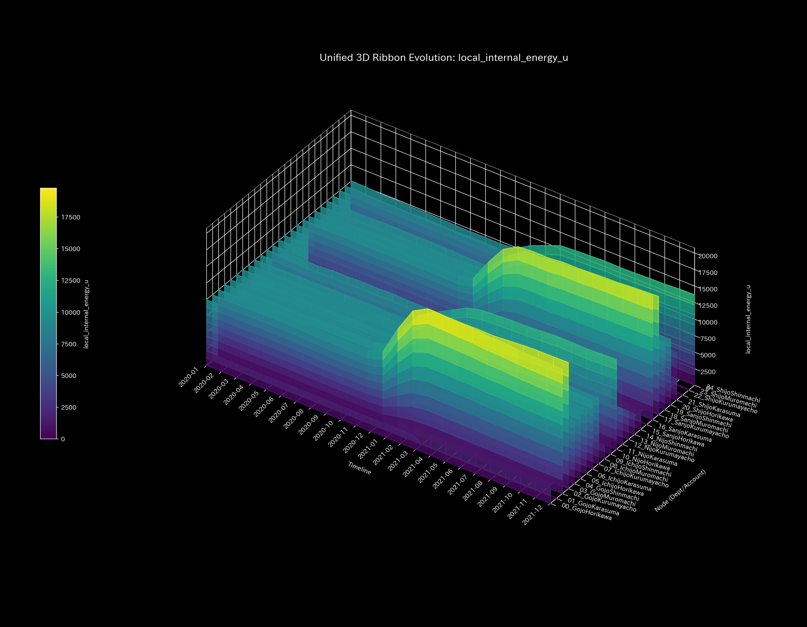
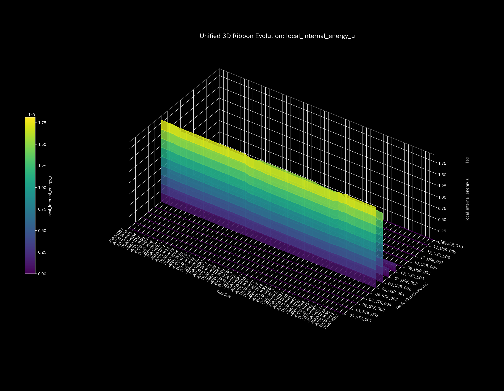
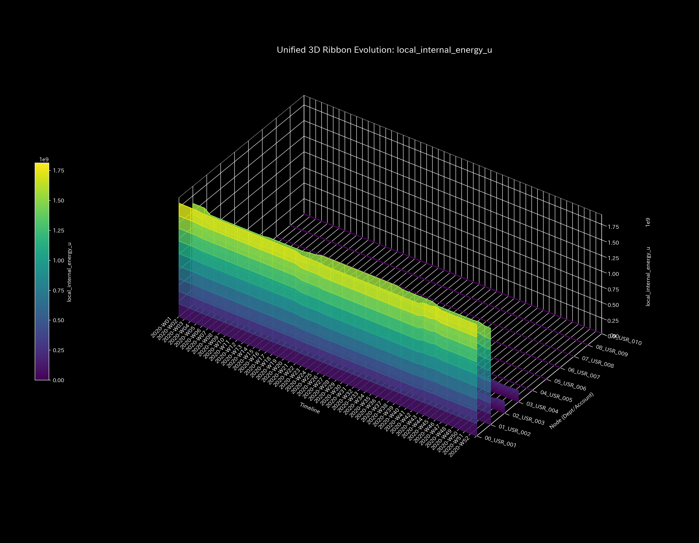
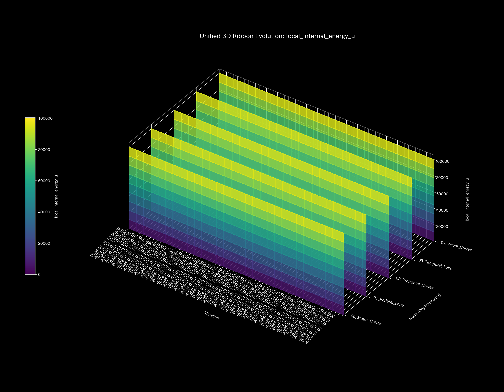

# 001_5. Local Internal Energy

This guide organizes the clinical commentary based on outputs and numbers for each validation sample. It explains the "3D local internal energy" (`001_1_2_7__3d_local_internal_energy.png`) in the Tensor-Link Utility (TLU).

---

## 🔬 Physico-Mathematical Theory: Local Internal Energy $u_i$

TLU defines the total volume passing through each node $i$ (the sum of the absolute values of inflows and outflows) as the "local internal energy $u_i$". This represents the scale and volume of nodes in the network topology.

$$u_i(t) = \sum_{j \in \text{neighbors}(i)} ( |F_{ji}(t)| + |F_{ij}(t)| )$$

Here, $F_{ij}(t)$ is the directed flow from node $j$ to node $i$. When flow concentrates on specific paths, accounts, or intersections, the local internal energy of that node spikes. It forms an energy wall.

---

## 📊 3D Local Internal Energy and Findings of Each Sample

This is a 3D plot showing spatiotemporal changes in spatial flow volume (internal energy) for each node.

#### 🟢 Sample 0 (Healthy Metabolism)

**Clinical Commentary:**
Flow volume is distributed evenly across all areas. No abnormal flow concentration occurs at specific nodes. No extreme overload is observed. The energy maintains a calm and appropriate distribution.

- 

---

#### 🟡 Sample 1 (Wash Trade)

**Clinical Commentary:**
Wash trading occurs. As a result, active flow concentrates on the three nodes that form the loop. These nodes are `ACC_Cash`, `ACC_Accounts_Receivable`, and `ACC_Sales_Revenue`. A massive energy wall forms, dwarfng general expense accounts.

- 

---

#### 🔴 Sample 2 (Embezzlement Leak)

**Clinical Commentary:**
Receivables are not collected normally. Funds leak one-way to a specific bypass account `UNKNOWN_LEAK`. During this period, energy concentrates on the source cash account and the leak node. It is detected as a persistent rise in active volume.

- 

---

#### 🟡 Sample 3 (Unbalanced Bookkeeping Mistake)

**Clinical Commentary:**
A one-sided entry error occurs at $t=1$. TLU generates temporary flows to balance the unadjusted ledger. This occurs around the receivables node. Therefore, a single sharp energy tower rises at that step. It disappears in the next step when corrected.

- 

---

#### 🔴 Sample 4 (Composite Chaos)

**Clinical Commentary:**
The loop increases system energy. Meanwhile, the embezzlement leaks also concentrate flow. These events occur simultaneously in different parts of the network. As a result, multiple energy spikes rise. This visualizes multi-layer flow distortion.

- 

---

#### 🔴 Sample 5 (Kyoto Traffic)

**Clinical Commentary:**
Vehicle inflows and stasis concentrate around the bottlenecks `21_Shijo_Muromachi` and `23_Shijo_Karasuma`. This significantly increases the local internal energy near these intersection nodes. It physically identifies the areas reaching their capacity limits.

- 

---

#### 🟢 Sample 6 (Market Stock Flow)

**Clinical Commentary:**
Trading bots and stock tickers execute high-frequency matched trades. Therefore, the total internal energy of the system remains high. However, the energy is distributed symmetrically and flatly among the bot accounts.

- 

---

#### 🟢 Sample 7 (Market Cash Flow)

**Clinical Commentary:**
This is a healthy transfer and payment network among retail users. Funds do not accumulate in specific accounts or loops. Liquidity diffuses across diverse targets. Therefore, local entropy stays stable at high levels.

- 

---

#### 🔴 Sample 8 (fMRI Stroke)

**Clinical Commentary:**
A stroke occurs starting at $t=30$. The activity potential in the motor cortex completely disappears due to lost blood flow. The local internal energy of this ischemic region drops to a flat floor. This clearly maps the extent of the functional loss.

- 

---

#### 🔴 Sample 9 (fMRI Seizure)

**Clinical Commentary:**
A seizure occurs. BOLD activity across all brain regions synchronizes and runs wild. The energy of all regions rises to peak levels. Spatial energy differences disappear. The entire graph freezes into a flat, high-level ceiling.

- 
