# 002. Information Geometry and Relative Conservation Laws (Information Geometry & Forensics)

This guide describes the accounting and logistics forensics monitoring module (`002_2`) in the Tensor-Link Utility (TLU). It provides explanations based on the outputs and values of each validation sample.

---

## 🔬 Theory of Information Geometry and Mass Conservation

Kirchhoff's first law (current law = mass conservation) holds in closed physical networks. The difference between total inflow and outflow at a node is defined as the "Conservation Residual" or "Relative Leak Ratio":

$$Residual_i = \sum Flux_{in} - \sum Flux_{out}$$

Under double-entry constraints in normal accounting or physical distribution, this residual is always `0.00`. If a positive residual persists over time, it indicates that mass (funds or vehicles) is leaking out of the system (e.g., off-book embezzlement).

The displacement of the system's probability distribution (velocity of structural change) is measured as "KL Divergence Drift" on the information manifold. This detects structural disruptions (phase transitions) that standard Z-Scores cannot detect.

---

## 📊 Findings of Forensics Monitoring Charts

### 2. Macro Forensics Monitoring Dashboard (`002_2_1__macro_forensics_dashboard.png`)

This audit and forensics dashboard shows time-series changes of the "Conservation Residual" based on Kirchhoff's first law.

#### 🟢 Sample 0 (Healthy Metabolism)
**Clinical Commentary:**
The conservation residual maintains `0.00` throughout. There is no leak out of the system. Structural drift (KL) reaches `1.61` at $t=2$ and stays low otherwise, ending at `0.07` at $t=11$. The statistical Z-Score exceeds the threshold at $t=6$ with state $Z_X$ at `4.14` and velocity $Z_v$ at `4.90`. Since residual and drift do not rise, this is a normal seasonal rise in volatility, not a phase transition to an abnormal structure.
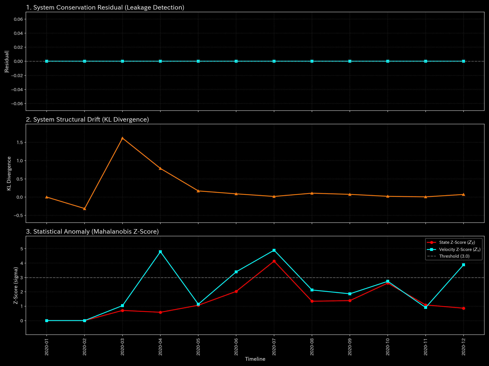

#### 🟡 Sample 1 (Wash Trade)
**Clinical Commentary:**
Debits and credits match due to wash trades. The conservation residual remains `0.00` throughout. The statistical Z-Score stays near the threshold, with state $Z_X$ reaching `1.97` and velocity $Z_v$ reaching `3.87`. Standard monitoring does not detect this as a clear anomaly. However, the structural drift (KL) peaks at `1.22` at $t=2$ and continues to capture the distortion in transaction patterns. Structural drift detects wash trades that residuals and Z-Scores miss.
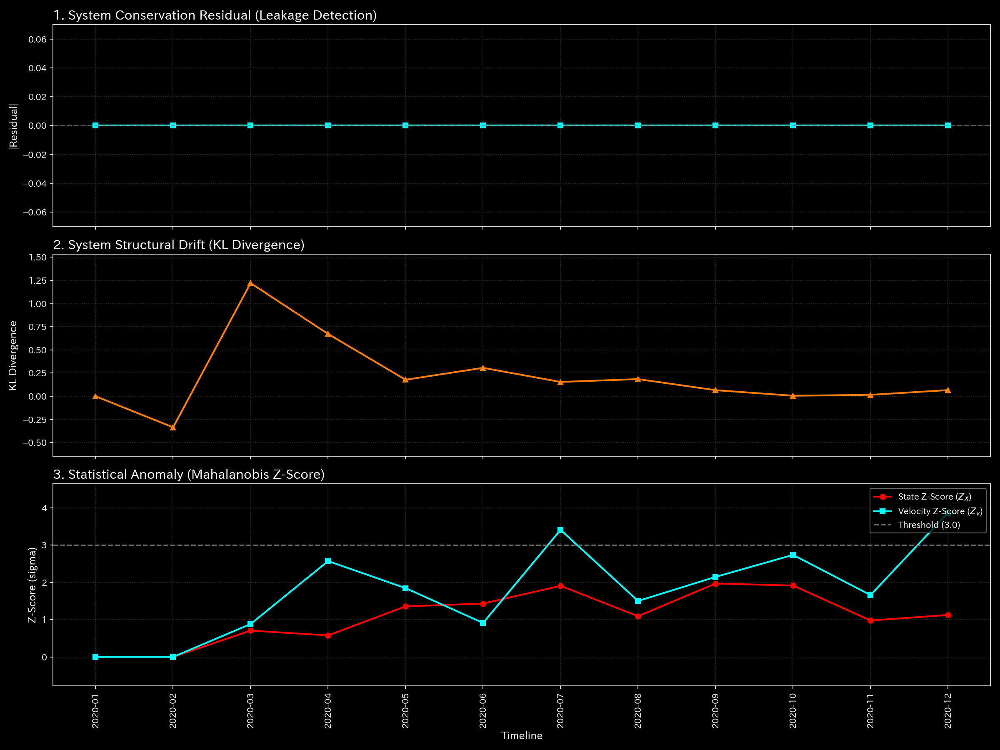

#### 🔴 Sample 2 (Embezzlement Leak)
**Clinical Commentary:**
Residuals of `307.30` to `359.73` are detected at $t=1, 2$ when leaks to `UNKNOWN_LEAK` begin. Residuals reach up to `364.53` at $t=7, 8, 10$. Structural drift (KL) rises to `1.18` at $t=2$ and decreases as the leak pattern stabilizes. The statistical Z-Score peaks at $t=6$ ($Z_X$=`3.82`, $Z_v$=`3.71`). However, the model learns the leakage as a baseline, and Z-Scores drop to around `0.65` to `1.00` at $t \ge 7$. Tracking the residual and initial KL drift detects this embezzlement.
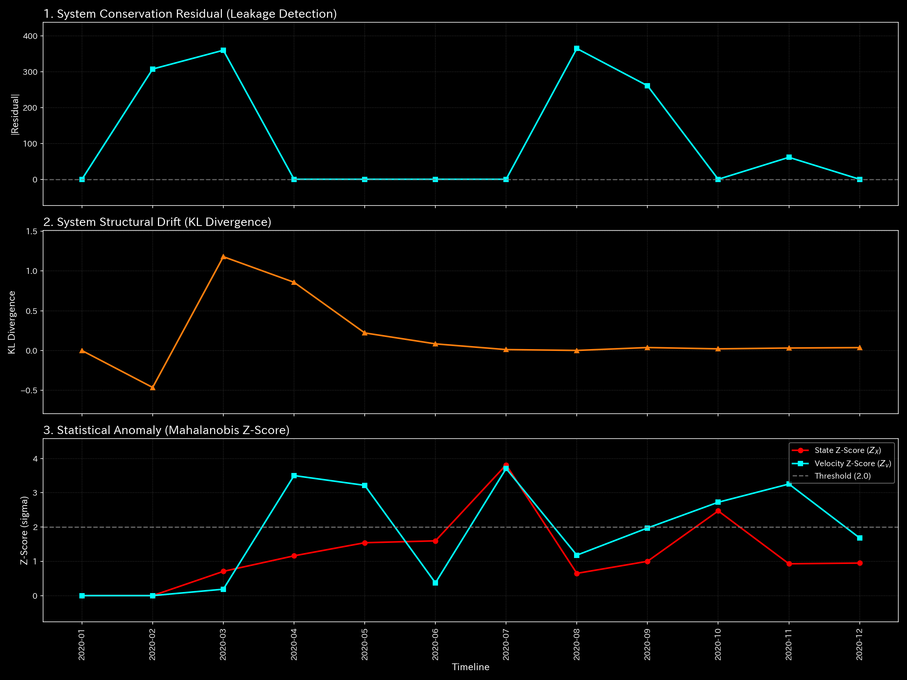

#### 🟡 Sample 3 (Unbalanced Mistake)
**Clinical Commentary:**
Conservation residuals spike during single-sided errors at $t=1, 2$ (max `340.01`) and $t=10$ (max `906.29`). They return to `0.00` at the next steps ($t=3, 11$) after manual correction. Structural drift (KL) spikes to `1.87` at $t=2$. Z-Scores rise to a maximum of `5.29`, but the anomaly is transient. All metrics spike in sync when the error occurs and return to normal in the next step. This shows a temporary error followed by a correction.
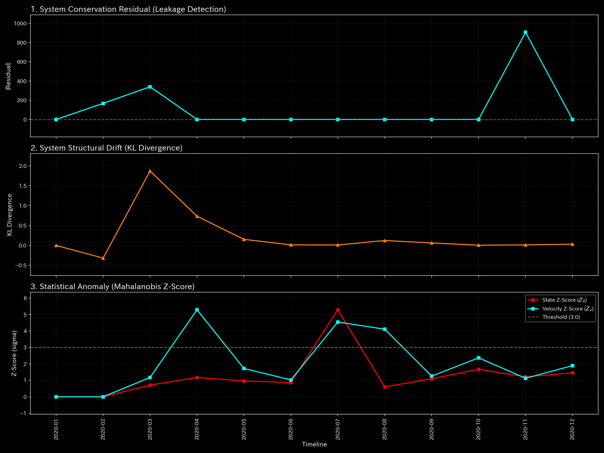

#### 🔴 Sample 4 (Composite Chaos)
**Clinical Commentary:**
Wash trade synchronization and off-book embezzlement progress together. The conservation residual appears at $t=5$ and spikes to `4,773.57` at $t=8$, indicating funds are leaving the system. Structural drift (KL) reaches `1.59` at $t=2$ and remains high. The velocity Z-Score ($Z_v$) reaches `3.42` at $t=6$ but falls below `1.52` at $t \ge 8$ due to baseline learning pollution. Both conservation residuals and KL drift expose the full scale of this composite failure.

#### 🔴 Sample 5 (Kyoto Traffic)
**Clinical Commentary:**
Vehicles stay stuck in intersections, so the conservation residual remains `0.00`. At the deadlock transition ($t=12$), structural drift (KL) reaches `1.76` and Z-Scores peak at $Z_X$=`7.25` and $Z_v$=`9.86`. At $t=23$, movement stops, volatility becomes zero, and Z-Scores drop ($Z_X$=`0.62`, $Z_v$=`0.43`). Only structural drift (KL) detects the frozen topology of congested and dry streets.
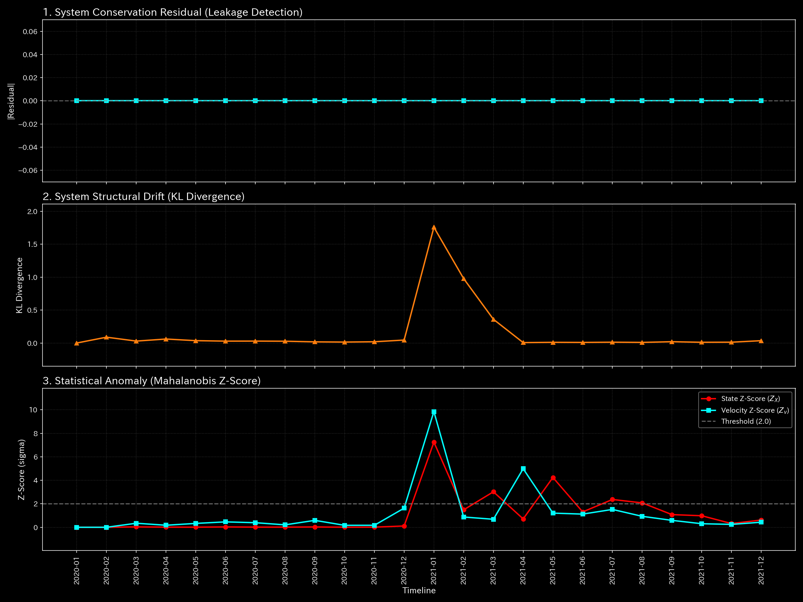

### 3. 3D Micro KL Drift (`002_2_2_1__3d_micro_kl_drift.png`)
This 3D graph shows time-space transitions of probability distribution changes (KL divergence) on the information manifold. It indicates the velocity of structural change.

#### 🟢 Sample 0 (Healthy Metabolism)
**Clinical Commentary:**
The spatio-temporal distribution of KL Drift remains low and has no spikes throughout the period.

#### 🟡 Sample 1 (Wash Trade)
**Clinical Commentary:**
Displacement rises at wash trade nodes during the anomaly steps (January, February, and May).
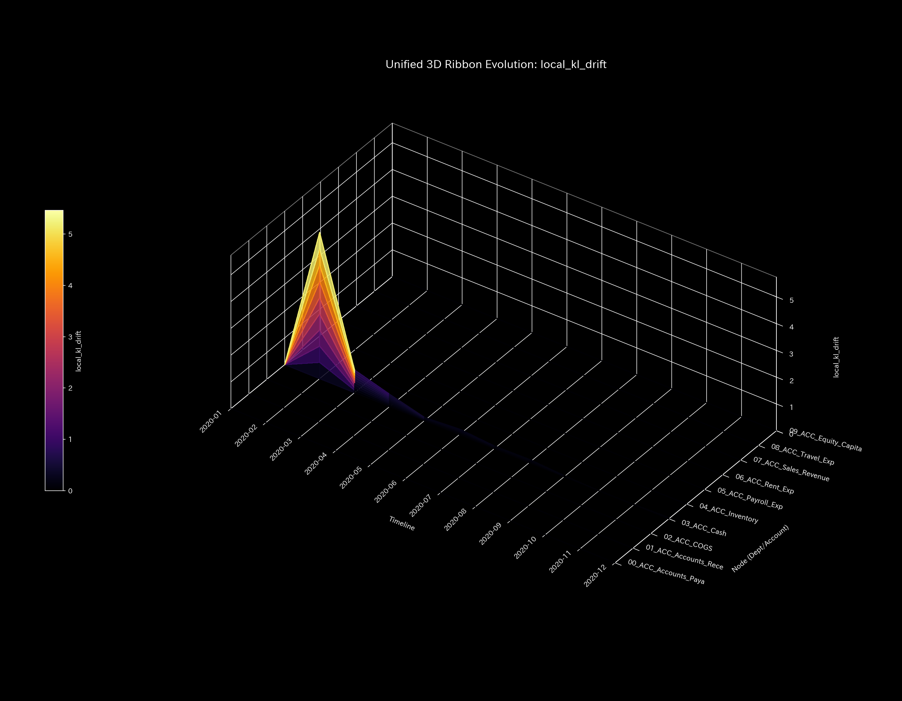

#### 🔴 Sample 2 (Embezzlement Leak)
**Clinical Commentary:**
Information displacement forms around `UNKNOWN_LEAK` and related cash accounts along the time axis.

#### 🟡 Sample 3 (Unbalanced Mistake)
**Clinical Commentary:**
At the error step $t=1$ (2020-02), spikes of `20.68` at `Accounts_Receivable` and `5.01` at `Cash` occur.

#### 🔴 Sample 4 (Composite Chaos)
**Clinical Commentary:**
Spatio-temporal displacement forms from both wash trade synchronization and leak routes.

#### 🔴 Sample 5 (Kyoto Traffic)
**Clinical Commentary:**
Traffic deadlock occurs. KL Drift spikes form along the time axis at the Shijo-Karasuma coordinates.
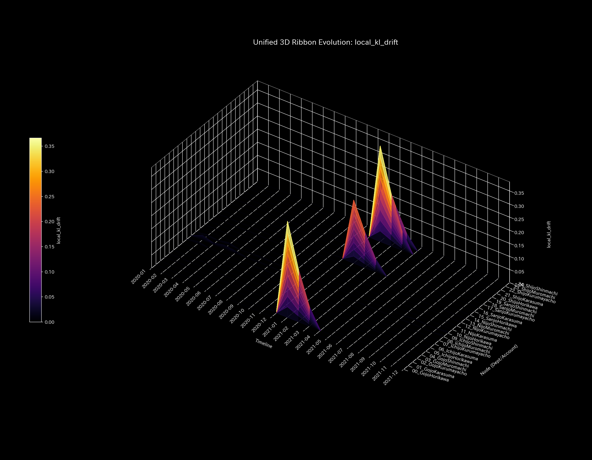

#### 🟢 Sample 6 (Market Stock Flow)
**Clinical Commentary:**
Spatio-temporal KL Drift remains low and stable throughout the period without spikes.
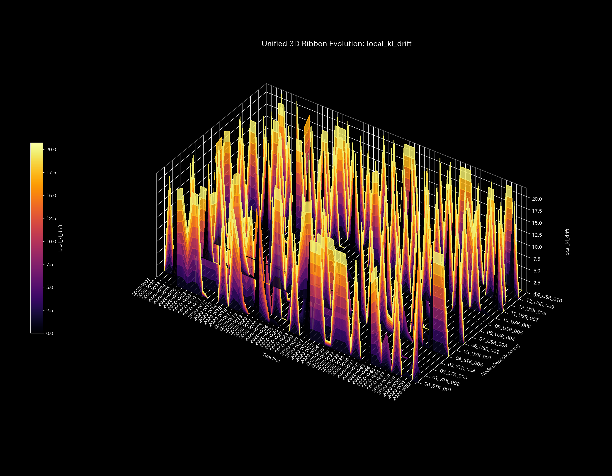

#### 🟢 Sample 7 (Market Cash Flow)
**Clinical Commentary:**
The KL Drift plot stays stable and has no large displacements.

#### 🔴 Sample 8 (fMRI Stroke)
**Clinical Commentary:**
A stroke occurs at $t=30$. KL Drift rises on the information manifold around `Motor_Cortex` coordinates, identifying the necrotic area.

#### 🔴 Sample 9 (fMRI Seizure)
**Clinical Commentary:**
A seizure burst occurs. Hyper-synchronous displacement propagates from the temporal lobe to the entire brain.

### 4. 3D Micro Z-Score (`002_2_2_2__3d_micro_z_score_X.png`)
This 3D graph shows time-space transitions of Z-Scores based on a statistical model. It is used to compare with KL Drift.

#### 🟢 Sample 0 (Healthy Metabolism)
**Clinical Commentary:**
Seasonal transaction concentration (July) causes a temporary Z-Score rise (max `4.14`), but residuals and stiffness are normal.

#### 🟡 Sample 1 (Wash Trade)
**Clinical Commentary:**
Wash trades raise Z-Scores up to `3.87` during anomaly periods. Later, the wash trade is learned as the baseline, and Z-Scores drop.

#### 🔴 Sample 2 (Embezzlement Leak)
**Clinical Commentary:**
Leaks cause a temporary Z-Score rise (`3.82`) at the start. When the leak persists, Z-Scores drop. Information geometry metrics are required.

#### 🟡 Sample 3 (Unbalanced Mistake)
**Clinical Commentary:**
Input errors cause a Z-Score spike up to `5.29` on the affected account, which disappears in the next step.

#### 🔴 Sample 4 (Composite Chaos)
**Clinical Commentary:**
Z-Scores rise up to `3.42` in wash trade months. As leaks drain cash, baseline learning reduces warnings.
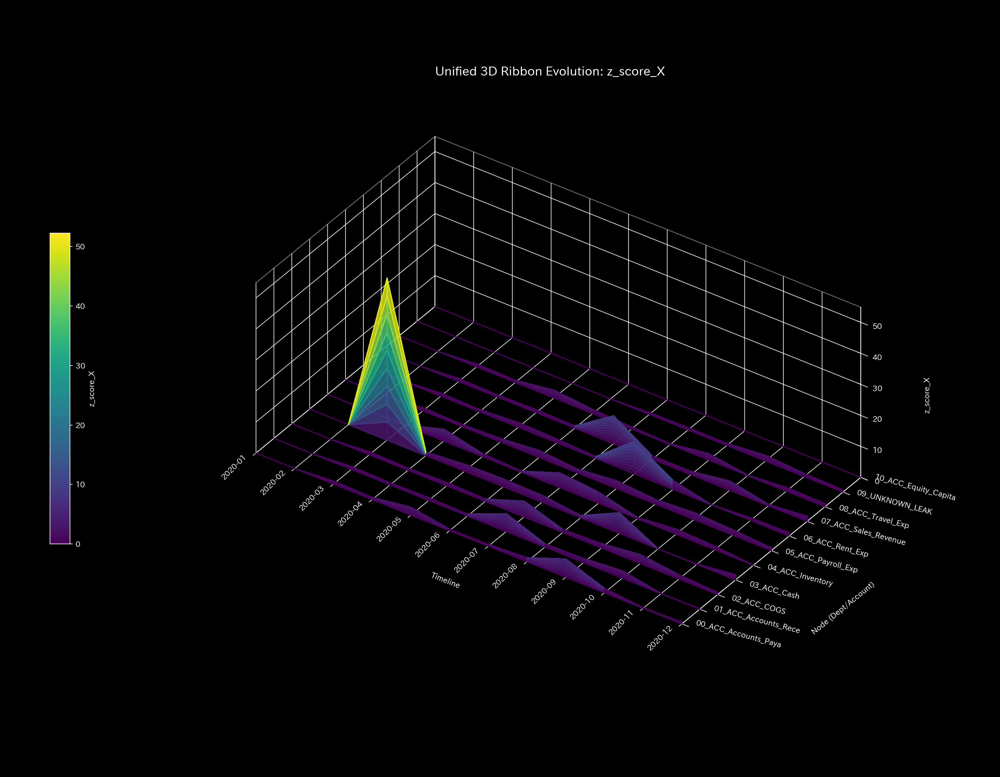

#### 🔴 Sample 5 (Kyoto Traffic)
**Clinical Commentary:**
After deadlock, vehicles stop moving and volatility becomes zero. Z-Scores flatten to `0.00`.
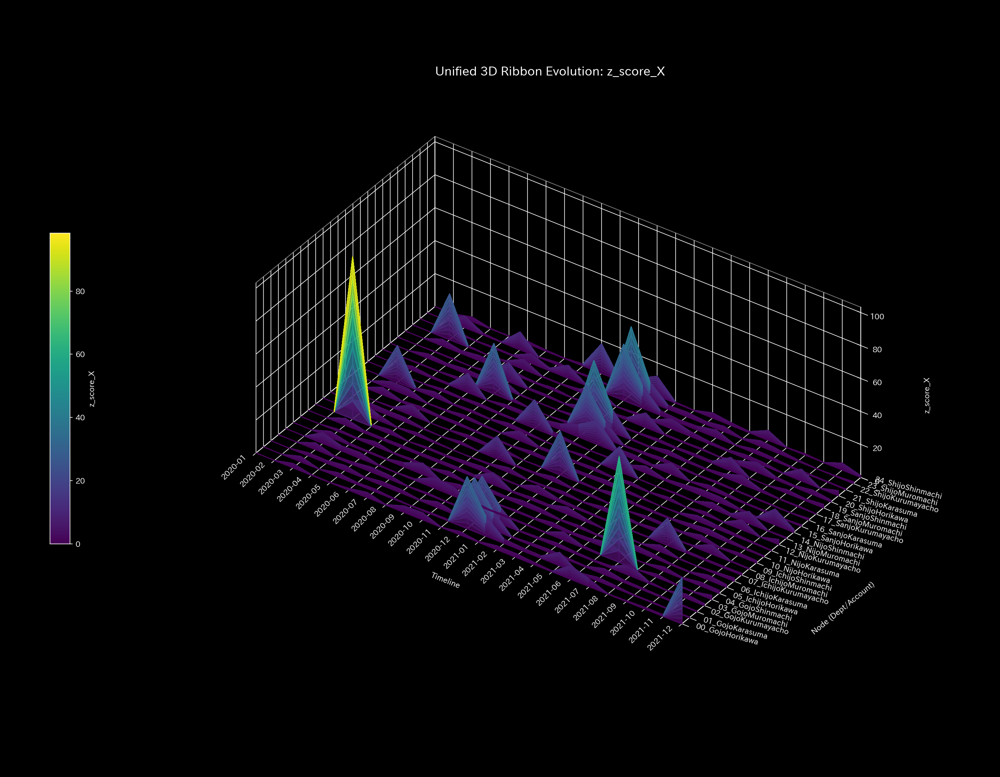

#### 🟢 Sample 6 (Market Stock Flow)
**Clinical Commentary:**
There is no excessive Z-Score rise and no baseline learning drop. The system stays stable.

#### 🟢 Sample 7 (Market Cash Flow)
**Clinical Commentary:**
No Z-Score spikes or baseline learning drops are detected. The system stays stable.
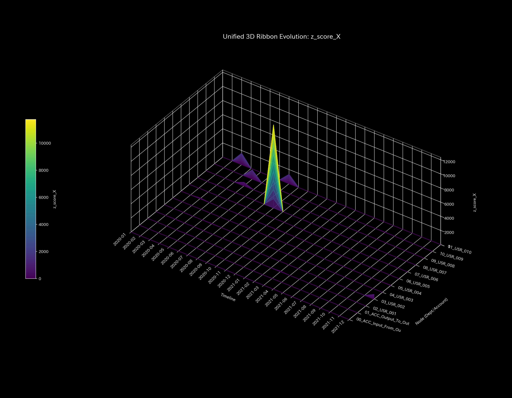

#### 🔴 Sample 8 (fMRI Stroke)
**Clinical Commentary:**
A stroke occurs at $t=30$. Z-Scores rise to `0.07` during blood flow drop, then flatten as activity stops.
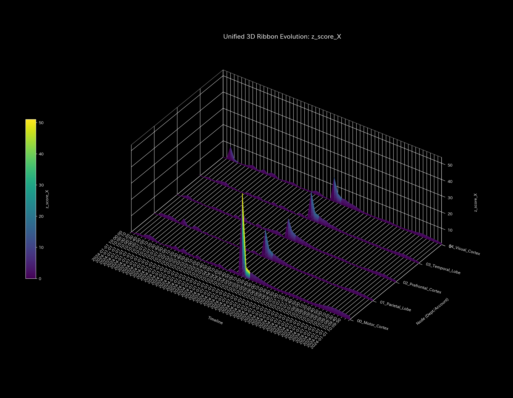

#### 🔴 Sample 9 (fMRI Seizure)
**Clinical Commentary:**
Z-Scores remain low during seizures because regular sine wave BOLD signals reduce volatility. This highlights a statistical dead zone.
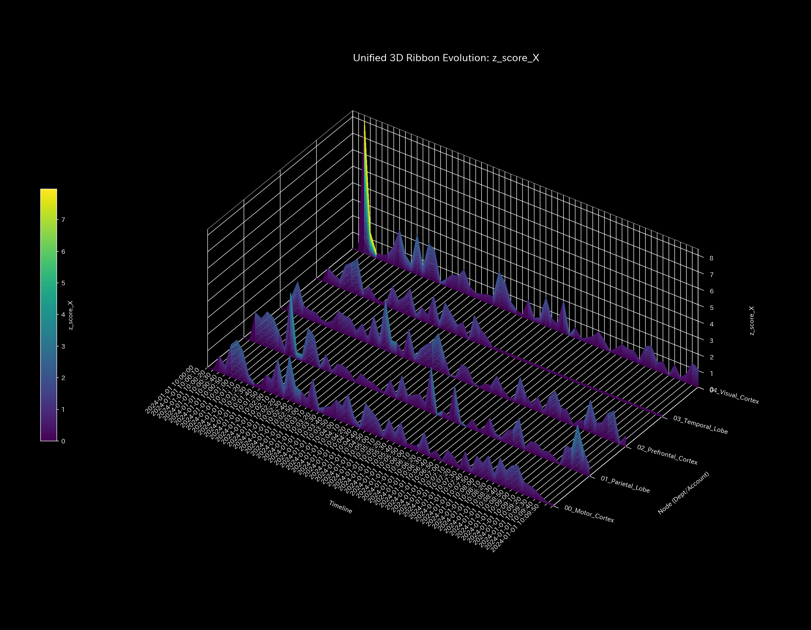

#### 🔴 Sample 8 (fMRI Stroke)
**Clinical Commentary:**
Ischemia cuts off blood flow to the motor area, but blood does not leave the brain, so the conservation residual is `0.00`. At $t=30$, blood flow changes cause a velocity Z-Score ($Z_v$) spike of `51.44`. The state Z-Score ($Z_X$) remains flat at `0.06`. At $t \ge 30$, the motor area stops changing, and $Z_v$ drops back into normal thresholds. Structural drift (KL) rises to `1.29` at $t=30$ and stays above `0.54` until $t=59$, indicating necrosis and permanent functional disconnection.

#### 🔴 Sample 9 (fMRI Seizure)
**Clinical Commentary:**
Epileptic discharge causes self-sustained oscillation, but signal mass stays in the brain, so the residual is `0.00`. At $t=30$, structural drift (KL) rises to `1.33` and peaks at `1.77` at $t=38$, detecting global topological changes. In contrast, the state Z-Score ($Z_X$) remains flat at `0.0001` and velocity Z-Score ($Z_v$) stays around `1.3` at $t \ge 30$. BOLD signals become regular sine waves, causing statistical models to falsely assume a stable state. Structural drift detects the hyper-synchronous burst that standard Z-Scores miss.
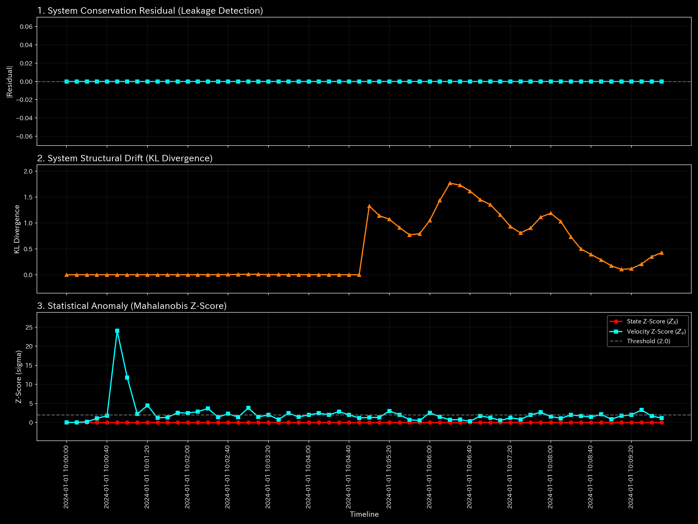

### 3. 3D Micro KL Drift (`002_2_2_1__3d_micro_kl_drift.png`)
This 3D graph shows time-space transitions of probability distribution changes (KL divergence) on the information manifold. It indicates the velocity of structural change.

#### 🟢 Sample 0 (Healthy Metabolism)
**Clinical Commentary:**
The spatio-temporal distribution of KL Drift remains low and stable without extreme spikes.

#### 🟡 Sample 1 (Wash Trade)
**Clinical Commentary:**
Information displacement rises at wash trade nodes during the anomaly steps (January, February, and May).

#### 🔴 Sample 2 (Embezzlement Leak)
**Clinical Commentary:**
After the embezzlement begins, a massive information cliff forms around `UNKNOWN_LEAK` and related deposit accounts along the time axis.

#### 🟡 Sample 3 (Unbalanced Mistake)
**Clinical Commentary:**
At the error step $t=1$ (2020-02), a sharp single spike reaches `20.68` at `Accounts_Receivable` and `5.01` at `Cash`.

#### 🔴 Sample 4 (Composite Chaos)
**Clinical Commentary:**
A massive information wall forms in space-time from both wash trade synchronization and leak routes.

#### 🔴 Sample 5 (Kyoto Traffic)
**Clinical Commentary:**
At the deadlock ($t=51$), a large KL Drift wall spikes along the time axis at the Shijo-Karasuma coordinates.

#### 🟢 Sample 6 (Market Stock Flow)
**Clinical Commentary:**
The spatio-temporal distribution of KL Drift remains low and stable without geometric spikes.

#### 🟢 Sample 7 (Market Cash Flow)
**Clinical Commentary:**
The KL Drift plot has no large displacements and stays stable.

#### 🔴 Sample 8 (fMRI Stroke)
**Clinical Commentary:**
A stroke occurs at $t=30$. A large KL Drift cliff rises around `Motor_Cortex` coordinates on the information manifold, identifying the necrotic area.

#### 🔴 Sample 9 (fMRI Seizure)
**Clinical Commentary:**
A seizure burst occurs. A wave of hyper-synchronous displacement propagates from the temporal lobe to the entire brain.

### 4. 3D Micro Z-Score (`002_2_2_2__3d_micro_z_score_X.png`)
This 3D graph shows time-space transitions of Z-Scores based on a statistical model. It is used to compare with KL Drift.

#### 🟢 Sample 0 (Healthy Metabolism)
**Clinical Commentary:**
Seasonal transaction concentration (July) causes a temporary Z-Score rise (max `4.14`), but residuals and stiffness are normal.

#### 🟡 Sample 1 (Wash Trade)
**Clinical Commentary:**
Wash trades raise accounts receivable and volume Z-Scores up to `3.87` during anomaly periods. Later, the wash trade is learned as the baseline, and Z-Scores drop (boiled frog phenomenon).

#### 🔴 Sample 2 (Embezzlement Leak)
**Clinical Commentary:**
Leaks cause a temporary Z-Score rise (`3.82`) at the start. When the leak persists, Z-Scores drop, requiring information geometry metrics.

#### 🟡 Sample 3 (Unbalanced Mistake)
**Clinical Commentary:**
Input errors cause a Z-Score spike up to `5.29` on the affected accounts receivable and cash accounts, which disappears in the next step.

#### 🔴 Sample 4 (Composite Chaos)
**Clinical Commentary:**
Z-Scores rise up to `3.42` in wash trade months. As leaks drain cash, baseline learning reduces warnings.

#### 🔴 Sample 5 (Kyoto Traffic)
**Clinical Commentary:**
After deadlock, vehicles stop moving and volatility becomes zero. Z-Scores flatten to `0.00`.

#### 🟢 Sample 6 (Market Stock Flow)
**Clinical Commentary:**
There is no excessive Z-Score rise and no baseline learning drop. The system stays stable.

#### 🟢 Sample 7 (Market Cash Flow)
**Clinical Commentary:**
No Z-Score spikes or baseline learning drops are detected. The system stays stable.

#### 🔴 Sample 8 (fMRI Stroke)
**Clinical Commentary:**
A stroke occurs at $t=30$. Z-Scores rise to `0.07` during blood flow drop, then flatten as activity stops.

#### 🔴 Sample 9 (fMRI Seizure)
**Clinical Commentary:**
Z-Scores remain low during seizures because regular sine wave BOLD signals reduce volatility. This highlights a statistical dead zone.

