# 003_1. Robot Kinematics & Reachability

## 🔬 Physico-Mathematical Theory of the Robot Kinematics Model

TLU maps management goals (KPIs) or network control targets to the "end-effector (hand position)" of a multi-joint robot arm. It models the operation potential of each department or account as "arm joint angles (joints)."

Forward Kinematics (FK) calculates the reachable performance space from the current structure. Inverse Kinematics (IK) solves for the required joint vectors (department workload allocation) given a target KPI:

$$Target\_KPI = FK(Joint\_Angles)$$
$$Joint\_Angles_{required} = IK(Target\_KPI)$$

IK might fail due to geometric limits of the arm (singularities or workspace boundaries). In other cases, the reachability error may rise. Under these conditions, the target is unreachable unless you modify the current structure.

---

## 📊 Kinematics Simulation Results of Each Validation Sample

This section presents the analysis of the FK reachable potential space (`003_1_1__3d_kinematics_fk.png`) and the IK trajectory ribbon (`003_1_2__3d_kinematics_ik.png`) for all 10 validation samples. It explains their physico-mathematical characteristics.

### 🟢 Sample 0 (Healthy Metabolism: Healthy)

* **Forward Kinematics (FK) Reachable Potential Space (`003_1_1__3d_kinematics_fk.png`)**
  * **Clinical Commentary:** The reachable potential space is wide and symmetric. It expands smoothly into a sphere, providing a sufficient safety margin for target changes.
  * 

* **Inverse Kinematics (IK) Trajectory Ribbon (`003_1_2__3d_kinematics_ik.png`)**
  * **Clinical Commentary:** The joint trajectory ribbon is smooth. The system finds connectivity solutions without hitting singularities. Distortion energy remains low, indicating the target is reachable.
  * 

---

### 🟡 Sample 1 (Wash Trade: Wash Trade)

* **Forward Kinematics (FK) Reachable Potential Space (`003_1_1__3d_kinematics_fk.png`)**
  * **Clinical Commentary:** The reachability space is similar to healthy metabolism. A wash trade path forms. Output capacity concentrates at specific nodes.
  * 

* **Inverse Kinematics (IK) Trajectory Ribbon (`003_1_2__3d_kinematics_ik.png`)**
  * **Clinical Commentary:** Joints twist to maintain wash trade synchronization. Distortion energy rises during the anomaly period, capturing the limits of maintaining this artificial balance.
  * 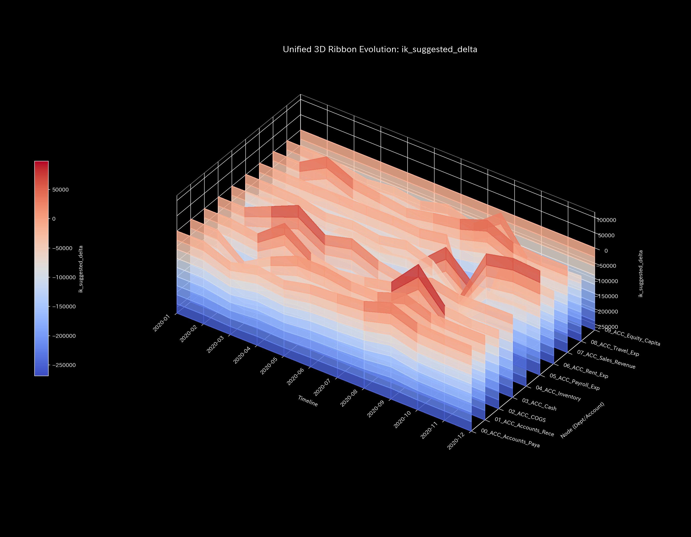

---

### 🔴 Sample 2 (Embezzlement Leak: Embezzlement Leak)

* **Forward Kinematics (FK) Reachable Potential Space (`003_1_1__3d_kinematics_fk.png`)**
  * **Clinical Commentary:** Leaks to external bypasses occur. Node stiffness decreases. The arm loses output capacity, and the reachable potential space caves in asymmetrically.
  * 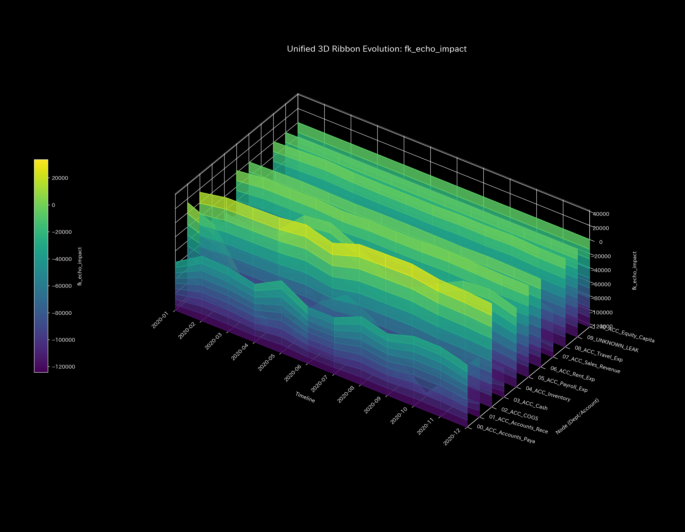

* **Inverse Kinematics (IK) Trajectory Ribbon (`003_1_2__3d_kinematics_ik.png`)**
  * **Clinical Commentary:** Cash becomes depleted or unevenly distributed. Distortion energy rises in the second half of the path to reach the target KPI. The system approaches a singularity.
  * 

---

### 🟡 Sample 3 (Unbalanced Mistake: Unbalanced Mistake)

* **Forward Kinematics (FK) Reachable Potential Space (`003_1_1__3d_kinematics_fk.png`)**
  * **Clinical Commentary:** A single-sided entry error occurs. An arm joint experiences temporary discontinuity. Geometric distortion appears in the reachability space, which disappears in the next period after correction.
  * 

* **Inverse Kinematics (IK) Trajectory Ribbon (`003_1_2__3d_kinematics_ik.png`)**
  * **Clinical Commentary:** Distortion energy spikes only at the step when the entry error occurs. It returns to normal after the correction. This shows temporary local stress followed by self-repair.
  * 

---

### 🔴 Sample 4 (Composite Chaos: Composite Chaos)

* **Forward Kinematics (FK) Reachable Potential Space (`003_1_1__3d_kinematics_fk.png`)**
  * **Clinical Commentary:** Wash trade synchronization and embezzlement leak overlap. The reachability space displays asymmetric caving and distortion. The envelope collapses.
  * 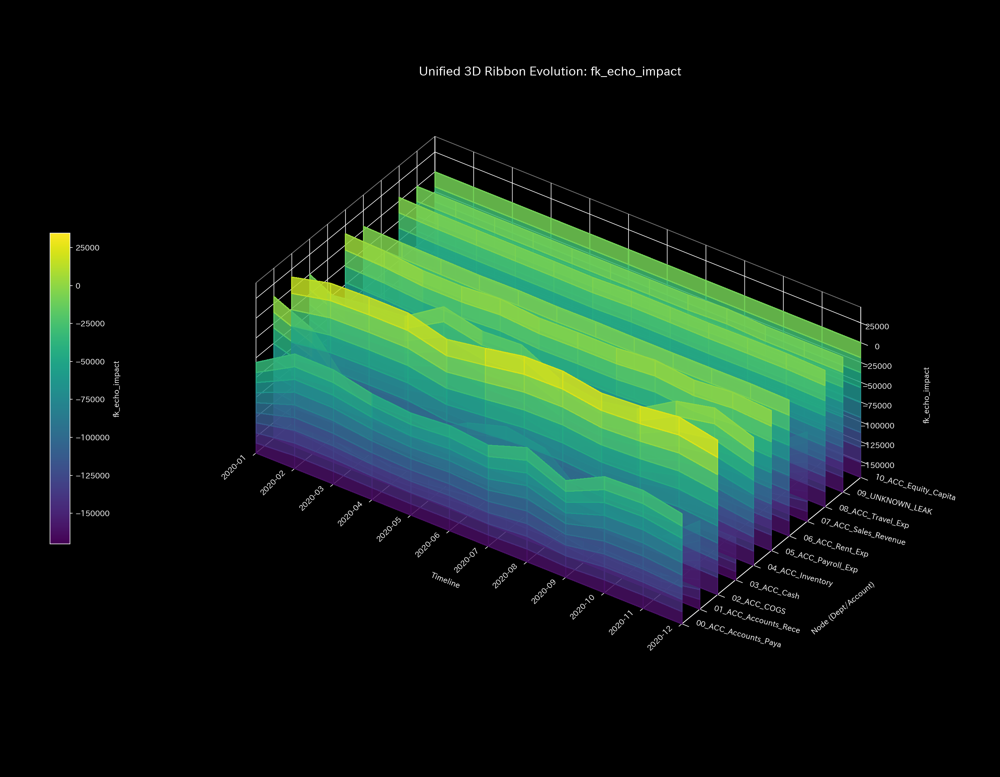

* **Inverse Kinematics (IK) Trajectory Ribbon (`003_1_2__3d_kinematics_ik.png`)**
  * **Clinical Commentary:** Joints experience a double load from wash trades and off-book leaks. Distortion energy rises in the middle and later periods. The system is drawn into a singularity, and the target is unreachable.
  * 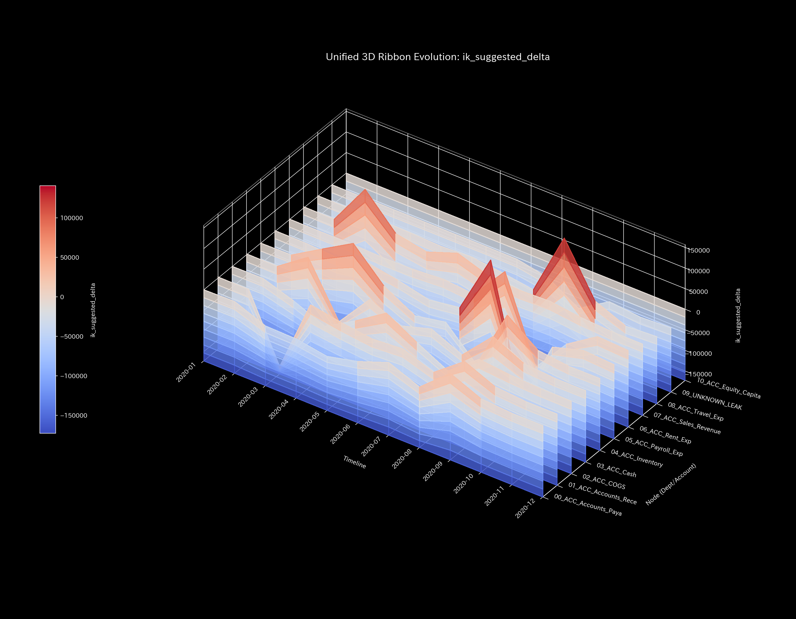

---

### 🔴 Sample 5 (Kyoto Traffic: Kyoto Traffic)

* **Forward Kinematics (FK) Reachable Potential Space (`003_1_1__3d_kinematics_fk.png`)**
  * **Clinical Commentary:** As congestion leads to a deadlock, the reachability space shrinks rapidly. The envelope eventually collapses into a needle-like shape, indicating a near-complete loss of arm mobility.
  * 

* **Inverse Kinematics (IK) Trajectory Ribbon (`003_1_2__3d_kinematics_ik.png`)**
  * **Clinical Commentary:** Capacity saturation (singularity) at key intersections flattens the trajectory ribbon. Joint degrees of freedom are completely lost. Distortion energy rises, indicating target unreachability.
  * 

---

### 🟢 Sample 6 (Market Stock Flow: Market Stock Flow)

* **Forward Kinematics (FK) Reachable Potential Space (`003_1_1__3d_kinematics_fk.png`)**
  * **Clinical Commentary:** Colluding USR accounts cause abnormal volume expansion. The reachability space stretches extremely toward target stock nodes, showing a highly asymmetric shape.
  * 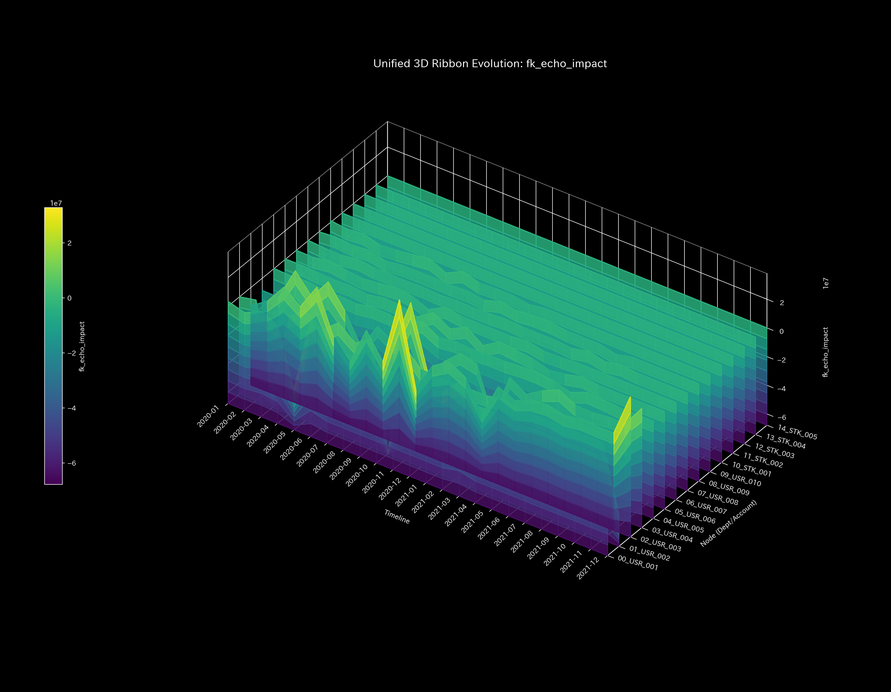

* **Inverse Kinematics (IK) Trajectory Ribbon (`003_1_2__3d_kinematics_ik.png`)**
  * **Clinical Commentary:** Collusive trading artificially locks liquidity. Distortion energy spikes to an astronomical level early on. This severely hinders free flow allocation in the market.
  * 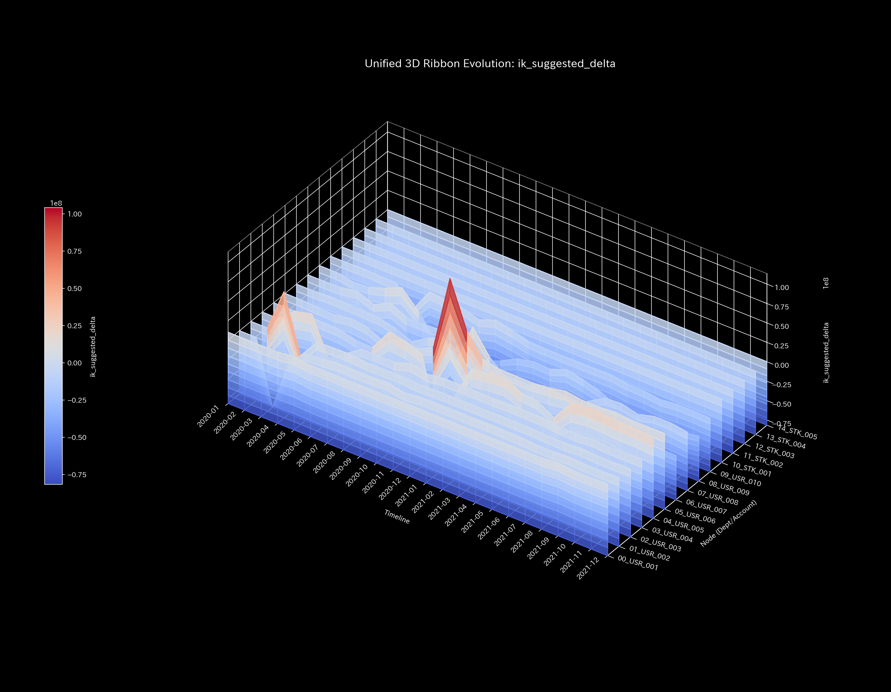

---

### 🟢 Sample 7 (Market Cash Flow: Market Cash Flow)

* **Forward Kinematics (FK) Reachable Potential Space (`003_1_1__3d_kinematics_fk.png`)**
  * **Clinical Commentary:** Liquidity is locked due to transactions between specific accounts. A "local pocket structure" forms in the reachability space. Echoes circulate only around these locked accounts.
  * 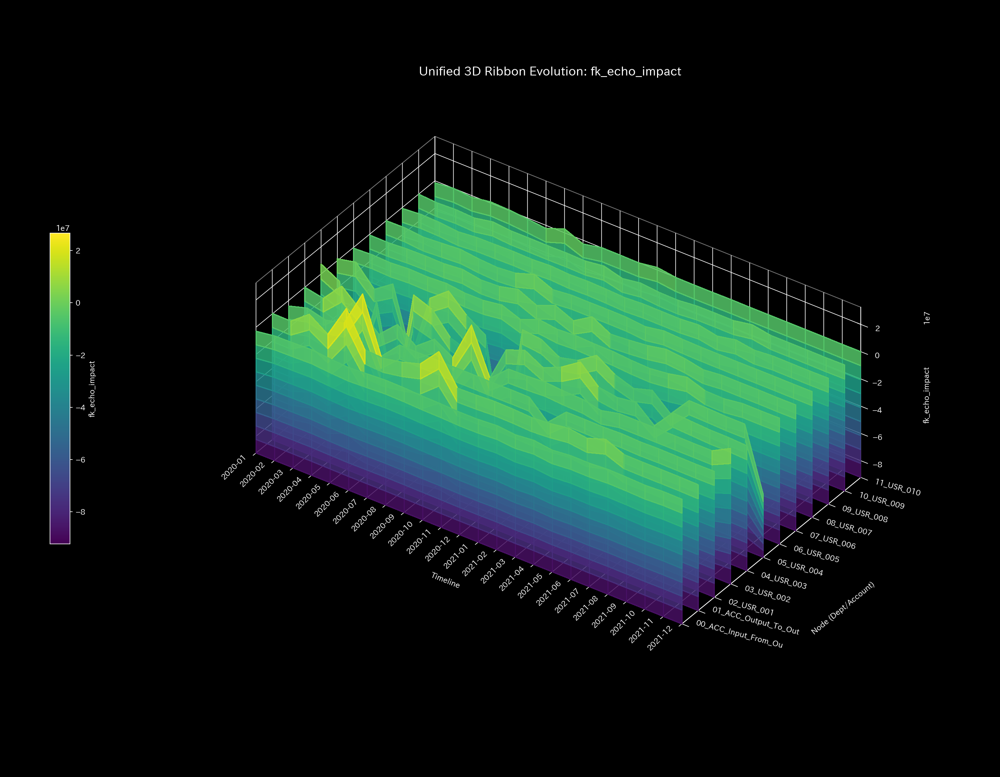

* **Inverse Kinematics (IK) Trajectory Ribbon (`003_1_2__3d_kinematics_ik.png`)**
  * **Clinical Commentary:** Inter-account trading locks liquidity. Distortion energy rises during specific periods. Joint stiffness is distorted, preventing efficient target allocation across the payment network.
  * 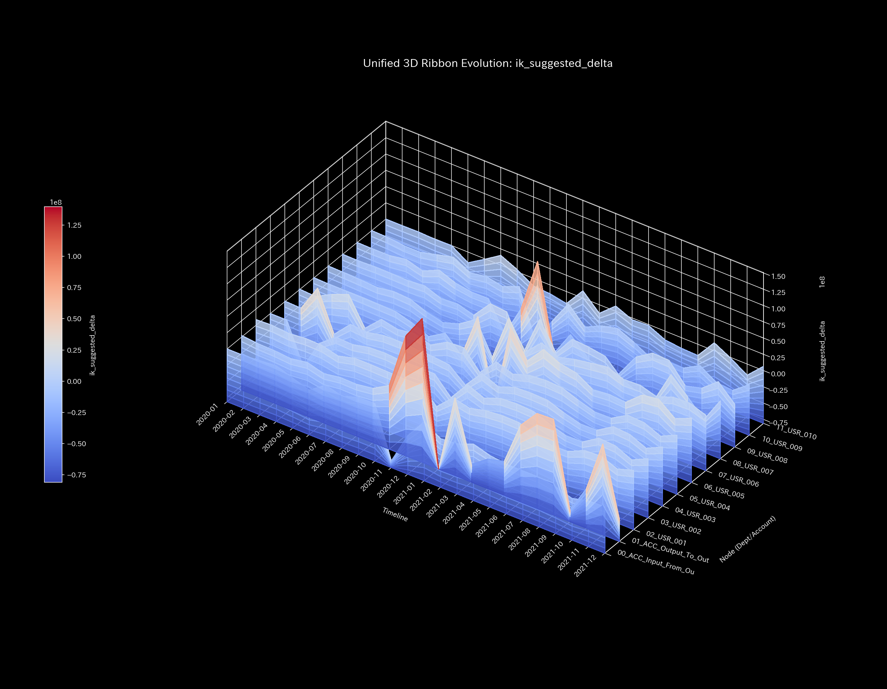

---

### 🔴 Sample 8 (fMRI Stroke: fMRI Stroke)

* **Forward Kinematics (FK) Reachable Potential Space (`003_1_1__3d_kinematics_fk.png`)**
  * **Clinical Commentary:** Ischemic stroke cuts off the motor cortex node. This is equivalent to a permanent loss of a specific arm part. Part of the reachability space permanently collapses and disappears.
  * 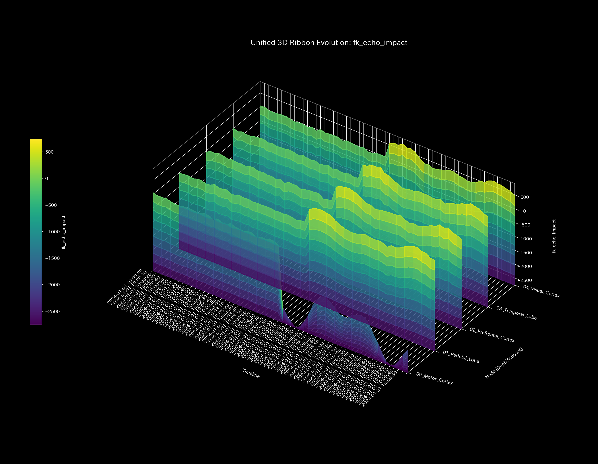

* **Inverse Kinematics (IK) Trajectory Ribbon (`003_1_2__3d_kinematics_ik.png`)**
  * **Clinical Commentary:** Inactivation of the motor cortex disrupts the transmission of control inputs. The arm's operating capacity is significantly impaired, indicating a geometric "partial arm paralysis" state.
  * 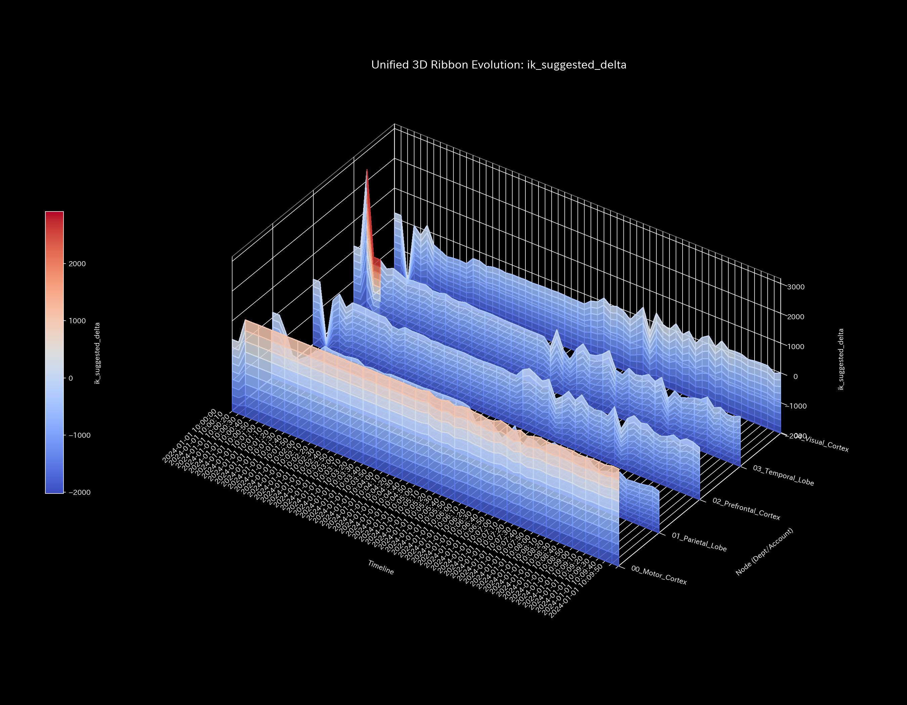

---

### 🔴 Sample 9 (fMRI Seizure: fMRI Seizure)

* **Forward Kinematics (FK) Reachable Potential Space (`003_1_1__3d_kinematics_fk.png`)**
  * **Clinical Commentary:** A hyper-synchronous burst occurs in the brain regions. The entire arm is hijacked by a single pattern. The reachable space shrinks extremely and is restricted to a rigid trajectory.
  * 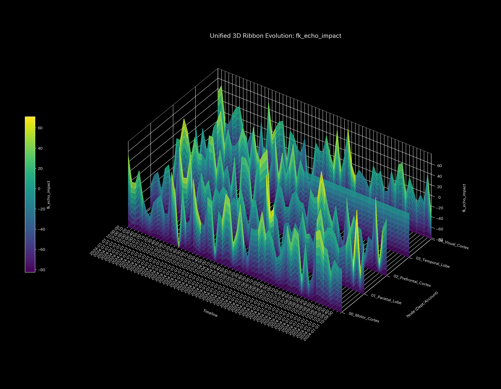

* **Inverse Kinematics (IK) Trajectory Ribbon (`003_1_2__3d_kinematics_ik.png`)**
  * **Clinical Commentary:** The entire brain is hijacked by pathological synchrony. The arm locks and does not accept external inputs. It cannot reach the target trajectory, resulting in a geometric freeze.
  * 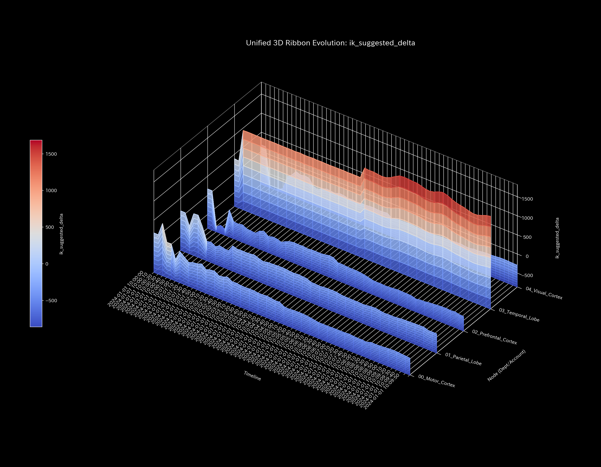
