# 004_1. System Stability & LQR Control

This guide describes the optimal linear quadratic regulator (LQR) and system stability analysis module (`004_1`) in the Tensor-Link Utility (TLU). It includes the spectral radius, LQR control performance space, and LQR control error convergence for each validation sample. It organizes the explanations based on outputs and values for all 10 samples.

---

## 🔬 Physico-Mathematical Theory of LQR Control and System Stability

We describe the state transitions of the network as a discrete state equation based on the adjacency connection probability matrix $A, control input $u(t), and input path $B$:

$$X(t+1) = A \cdot X(t) + B \cdot u(t)$$

We monitor the "spectral radius ( $\rho$ )", which is the maximum eigenvalue of the connection matrix $A$:

$$\rho$ = \max_{i} |\lambda_i|$$

If $\rho < 1.0, the system possesses self-damping capability (stability). When wash trade loops or traffic deadlocks form, the spectral radius approaches `1.0`. The energy of the entire system is trapped in closed circuits, making it uncontrollable (unstable).

TLU uses Linear Quadratic Regulator (LQR) control theory. It calculates the feedback gain $K_{lqr}$ to pull the system back to a steady state. TLU identifies the node with the highest intervention effect in the system using the sensitivity matrix:

$$u(t) = -K_{lqr} \cdot X(t)$$

---

## 📊 Stability and Control Analysis Results of Each Validation Sample

This section presents the analysis of system stability (`004_1_2__system_stability.png`), LQR control performance space (`004_1_3__control_lqr_performance_space.png`), and LQR control error convergence (`004_1_2__control_error_convergence.png`) for all 10 validation samples. It explains their physico-mathematical characteristics.

### 🟢 Sample 0 (Healthy Metabolism: Healthy)

* **System Stability (Spectral Radius) (`004_1_2__system_stability.png`)**
  * **Clinical Commentary:** No wash trade loops exist. The spectral radius $\rho$ remains `0.00` throughout the period. The self-damping restoring force is active.
  * 

* **Optimal Control (LQR) Performance Space (`004_1_3__control_lqr_performance_space.png`)**
  * **Clinical Commentary:** No sensitivity peaks exist on specific nodes. Sensitivity is distributed across all areas. The self-regulation function of the system works.
  * 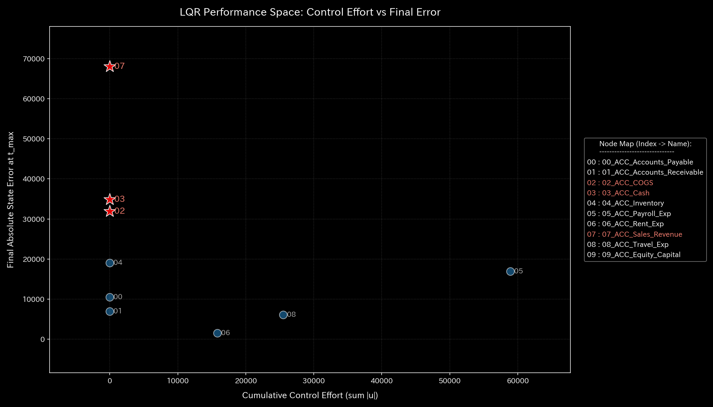

* **LQR Control Error Convergence (`004_1_2__control_error_convergence.png`)**
  * **Clinical Commentary:** The error trajectory decays along the time axis, converging to the target steady state.
  * 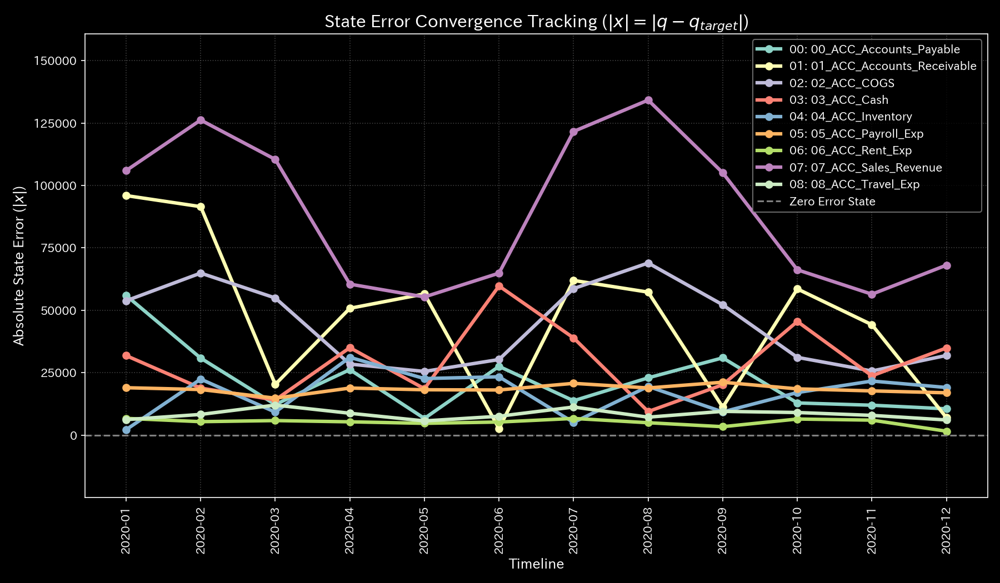

---

### 🟡 Sample 1 (Wash Trade: Wash Trade)

* **System Stability (Spectral Radius) (`004_1_2__system_stability.png`)**
  * **Clinical Commentary:** The spectral radius $\rho$ rises during wash trades. It reaches `0.7488` at $t=0$ and `0.5501` at $t=4, indicating the formation of wash trade cycles.
  * 

* **Optimal Control (LQR) Performance Space (`004_1_3__control_lqr_performance_space.png`)**
  * **Clinical Commentary:** Sensitivity rises at deposit and accounts receivable nodes, which act as transaction junctions. Interventions like transaction limits on these nodes are effective.
  * 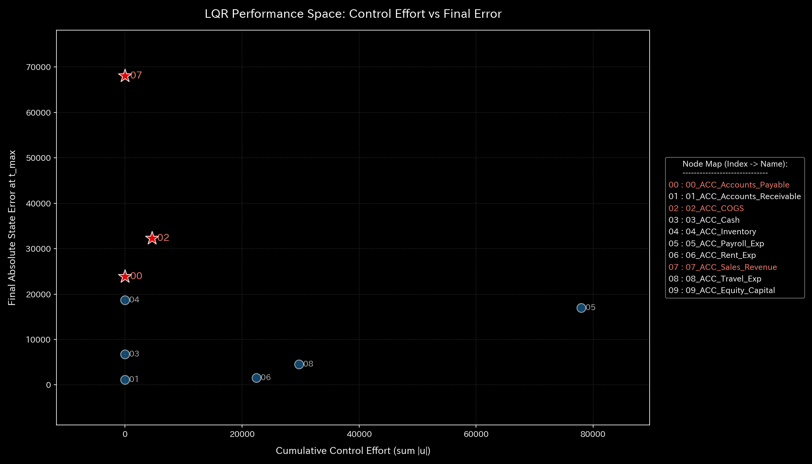

* **LQR Control Error Convergence (`004_1_2__control_error_convergence.png`)**
  * **Clinical Commentary:** Control inputs break the synchronization of the wash trade circuit. The state error converges to the steady state.
  * 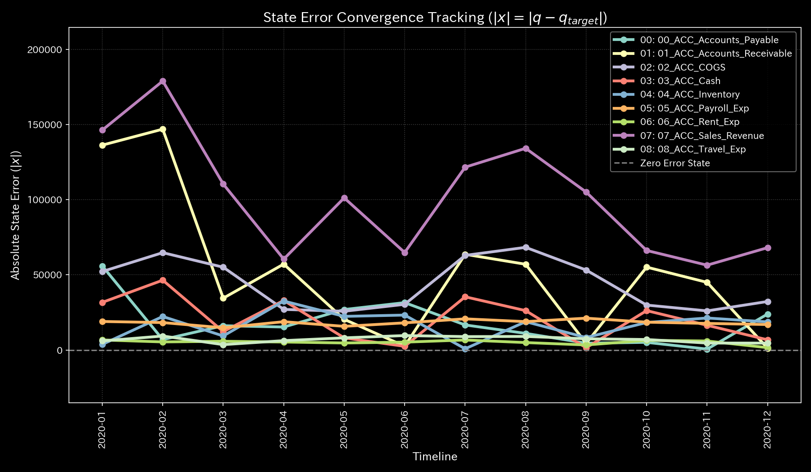

---

### 🔴 Sample 2 (Embezzlement Leak: Embezzlement Leak)

* **System Stability (Spectral Radius) (`004_1_2__system_stability.png`)**
  * **Clinical Commentary:** Active mass leaks out due to funds outflow. No self-circulation occurs. The spectral radius $\rho$ remains `0.00` throughout the period.
  * 

* **Optimal Control (LQR) Performance Space (`004_1_3__control_lqr_performance_space.png`)**
  * **Clinical Commentary:** Sensitivity rises at accounts receivable and deposit accounts directly connected to `UNKNOWN_LEAK`. These nodes are control points to block the leak.
  * 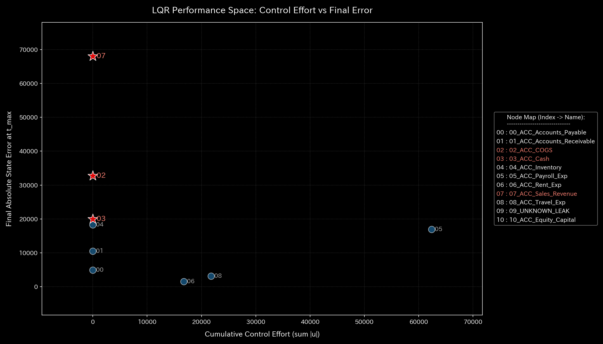

* **LQR Control Error Convergence (`004_1_2__control_error_convergence.png`)**
  * **Clinical Commentary:** The presence of a leak path slows down error convergence. Optimal inputs eventually pull the error to zero.
  * 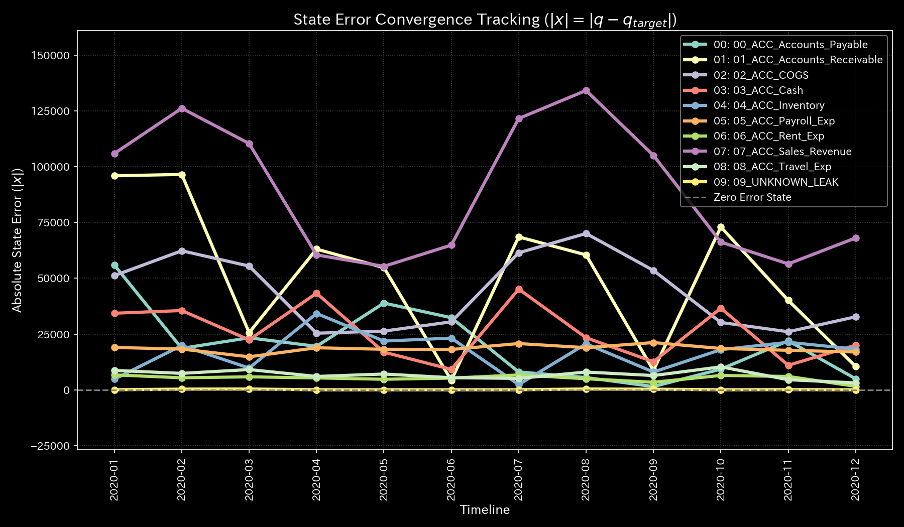

---

### 🟡 Sample 3 (Unbalanced Mistake: Unbalanced Mistake)

* **System Stability (Spectral Radius) (`004_1_2__system_stability.png`)**
  * **Clinical Commentary:** This is a single input mistake. The spectral radius $\rho$ remains `0.00` throughout the period. Persistent circulation of empty liquidity does not occur.
  * 

* **Optimal Control (LQR) Performance Space (`004_1_3__control_lqr_performance_space.png`)**
  * **Clinical Commentary:** A temporary sensitivity bias occurs at the step when the error happens. It is self-corrected in the next step, restoring a normal balance and removing the intervention point.
  * 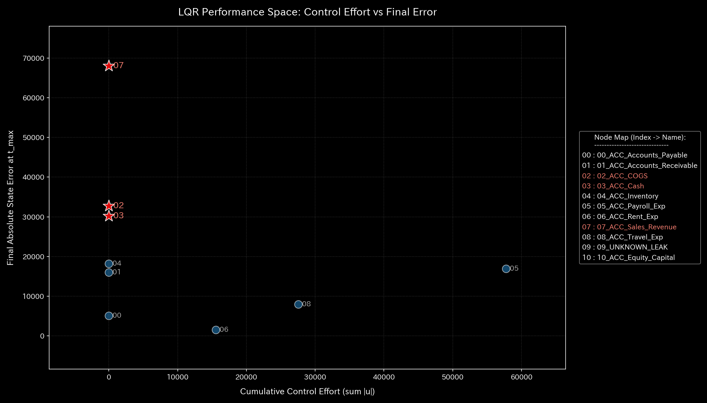

* **LQR Control Error Convergence (`004_1_2__control_error_convergence.png`)**
  * **Clinical Commentary:** An error occurs temporarily at the step of the mistake. Self-correction and control inputs bring the error back to zero.
  * 

---

### 🔴 Sample 4 (Composite Chaos: Composite Chaos)

* **System Stability (Spectral Radius) (`004_1_2__system_stability.png`)**
  * **Clinical Commentary:** Wash trades raise the spectral radius $\rho$ up to `0.79`, indicating that the system is in an unstable state.
  * 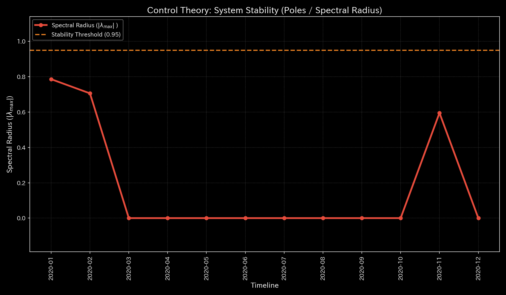

* **Optimal Control (LQR) Performance Space (`004_1_3__control_lqr_performance_space.png`)**
  * **Clinical Commentary:** Multiple sensitivity peaks occur, corresponding to both wash trades and embezzlement. This shows the complexity of intervention.
  * 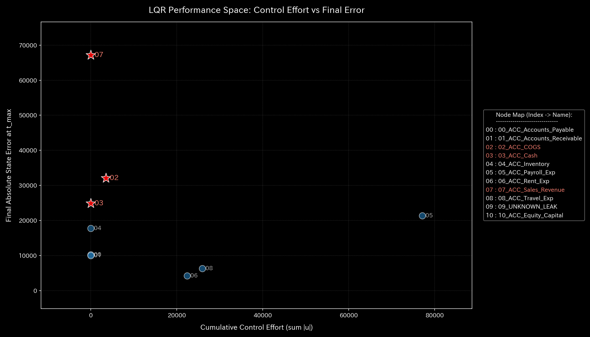

* **LQR Control Error Convergence (`004_1_2__control_error_convergence.png`)**
  * **Clinical Commentary:** The error oscillates due to the dual load of wash trade maintenance and off-book leaks. Optimal control inputs guide the system toward convergence.
  * 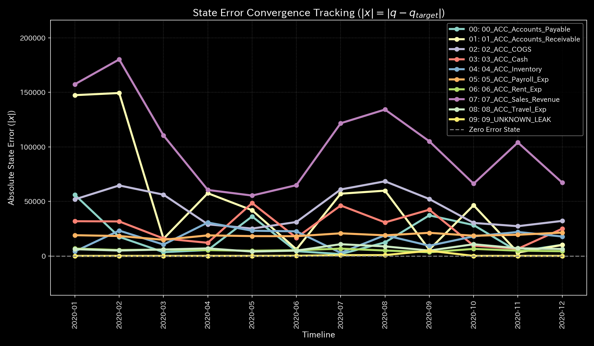

---

### 🔴 Sample 5 (Kyoto Traffic: Kyoto Traffic)

* **System Stability (Spectral Radius) (`004_1_2__system_stability.png`)**
  * **Clinical Commentary:** After deadlock occurs at $t \ge 50, the spectral radius $\rho$ stays locked at `1.00`. The traffic network has lost its self-recovery capacity.
  * 

* **Optimal Control (LQR) Performance Space (`004_1_3__control_lqr_performance_space.png`)**
  * **Clinical Commentary:** A maximum sensitivity of `41.5234` is detected at bottleneck intersections `23_Shijo_Karasuma`, `13_Nijo_Karasuma`, and `00_Ichijo_Horikawa`. Signal timing interventions at these points are effective.
  * 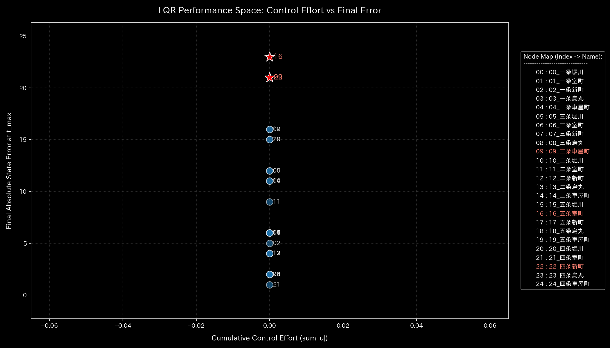

* **LQR Control Error Convergence (`004_1_2__control_error_convergence.png`)**
  * **Clinical Commentary:** Signal control intervention relieves congestion from the deadlock state. The error converges with some delay.
  * 

---

### 🟢 Sample 6 (Market Stock Flow: Market Stock Flow)

* **System Stability (Spectral Radius) (`004_1_2__system_stability.png`)**
  * **Clinical Commentary:** The spectral radius $\rho$ saturates at `1.00` immediately when wash trading begins. The market is locked in a wash trade loop.
  * 

* **Optimal Control (LQR) Performance Space (`004_1_3__control_lqr_performance_space.png`)**
  * **Clinical Commentary:** LQR intervention sensitivity is distributed across all nodes rather than concentrating on specific ones. There are no local control vulnerabilities.
  * 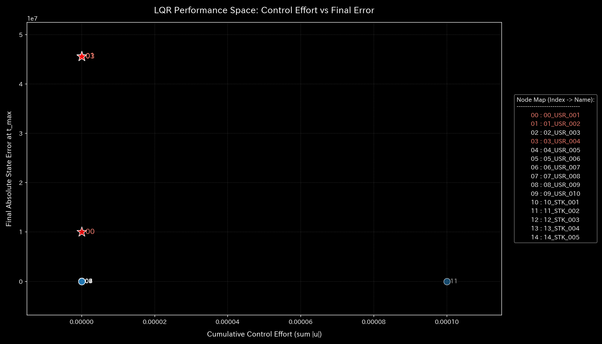

* **LQR Control Error Convergence (`004_1_2__control_error_convergence.png`)**
  * **Clinical Commentary:** Control inputs break the wash trade loop. The liquidity balance error converges to zero.
  * 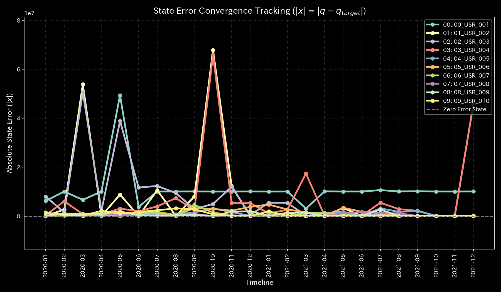

---

### 🟢 Sample 7 (Market Cash Flow: Market Cash Flow)

* **System Stability (Spectral Radius) (`004_1_2__system_stability.png`)**
  * **Clinical Commentary:** The spectral radius $\rho$ remains stable at `0.00`. No synchronization distortion is detected.
  * 

* **Optimal Control (LQR) Performance Space (`004_1_3__control_lqr_performance_space.png`)**
  * **Clinical Commentary:** No sharp spikes in LQR sensitivity exist. Sensitivity is distributed across all accounts, showing a robust network structure.
  * 

* **LQR Control Error Convergence (`004_1_2__control_error_convergence.png`)**
  * **Clinical Commentary:** Since there is no uneven distribution, the state error remains low from the start and converges quickly.
  * 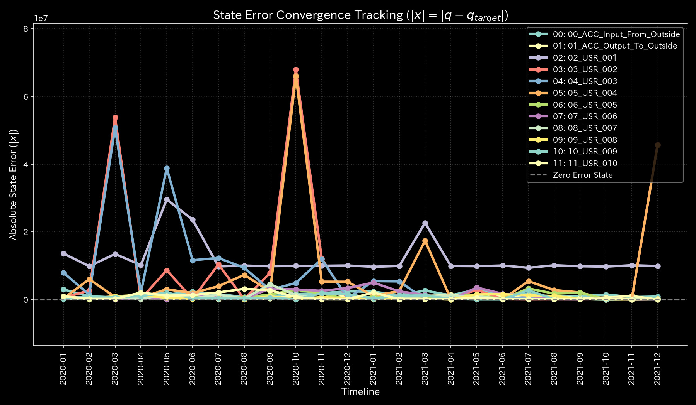

---

### 🔴 Sample 8 (fMRI Stroke: fMRI Stroke)

* **System Stability (Spectral Radius) (`004_1_2__system_stability.png`)**
  * **Clinical Commentary:** Following topological disruption from the stroke ( $t=30$ ), the spectral radius $\rho$ saturates at `1.00`. This indicates a breakdown of brain flow control.
  * 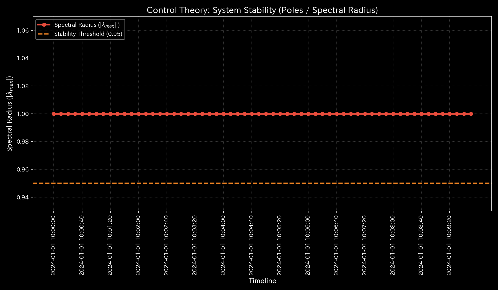

* **Optimal Control (LQR) Performance Space (`004_1_3__control_lqr_performance_space.png`)**
  * **Clinical Commentary:** Sensitivity peaks at `48.7492` at the ischemic site `00_Motor_Cortex` and the surrounding `01_Parietal_Lobe`. Stimulation interventions at these sites are effective.
  * 

* **LQR Control Error Convergence (`004_1_2__control_error_convergence.png`)**
  * **Clinical Commentary:** Controlling the areas around the stroke is difficult, which delays error convergence. The system eventually converges to a new steady state.
  * 

---

### 🔴 Sample 9 (fMRI Seizure: fMRI Seizure)

* **System Stability (Spectral Radius) (`004_1_2__system_stability.png`)**
  * **Clinical Commentary:** The spectral radius $\rho$ saturates at `1.00` when the synchronous burst starts, indicating the collapse of information regulation functions.
  * 

* **Optimal Control (LQR) Performance Space (`004_1_3__control_lqr_performance_space.png`)**
  * **Clinical Commentary:** Intervention sensitivity peaks at `48.7492` at the `03_Temporal_Lobe`, which is the focus of the hyper-synchronous discharge. Stimulation interventions here are effective.
  * 

* **LQR Control Error Convergence (`004_1_2__control_error_convergence.png`)**
  * **Clinical Commentary:** Control pulses reset the hyper-synchronous burst. Brain activity errors then converge to the normal range.
  * 
