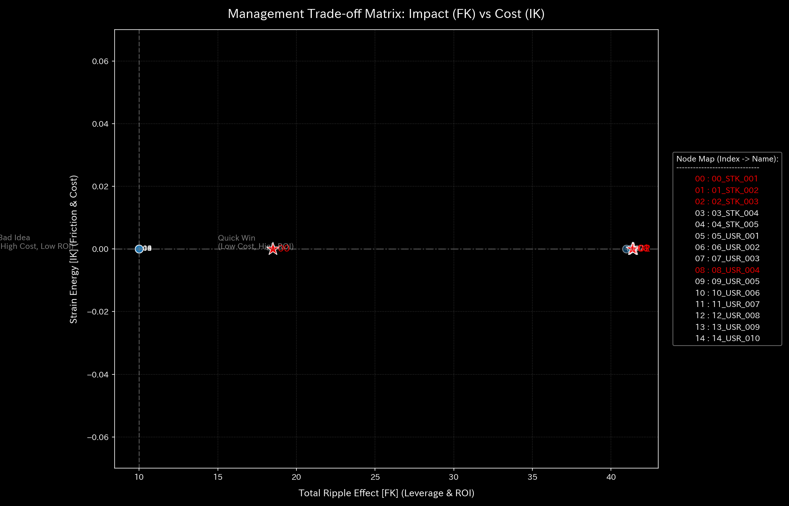

# 004_2. Intervention Sensitivity Matrices

This guide describes the optimal linear quadratic regulator (LQR) and system stability analysis module (`004_2`) in the Tensor-Link Utility (TLU). It includes the intervention sensitivity matrix for each validation sample. It organizes the explanations based on outputs and values for all 10 samples.

---

## 🔬 Physico-Mathematical Theory of LQR Control and System Stability

We describe the state transitions of the network as a discrete state equation based on the adjacency connection probability matrix $A, control input $u(t), and input path $B$:

$$X(t+1) = A \cdot X(t) + B \cdot u(t)$$

We monitor the "spectral radius ( $\rho$ )", which is the maximum eigenvalue of the connection matrix $A$:

$$\rho$ = \max_{i} |\lambda_i|$$

If $\rho < 1.0, the system possesses self-damping capability (stability). When wash trade loops or traffic deadlocks form, the spectral radius approaches `1.0`. The energy of the entire system is trapped in closed circuits, making it uncontrollable (unstable).

TLU uses Linear Quadratic Regulator (LQR) control theory. It calculates the feedback gain $K_{lqr}$ to pull the system back to a steady state. TLU identifies the node with the highest intervention effect in the system using the sensitivity matrix:

$$u(t) = -K_{lqr} \cdot X(t)$$

---

## 📊 Intervention Sensitivity Analysis Results of Each Validation Sample

This section presents the analysis of the intervention sensitivity matrix (`004_2_1__sensitivity_matrix.png`) for all 10 validation samples. It explains their physico-mathematical characteristics.

### 🟢 Sample 0 (Healthy Metabolism: Healthy)

* **Intervention Sensitivity Matrix (`004_2_1__sensitivity_matrix.png`)**
  * **Clinical Commentary:** The matrix maintains a uniform, light blue distribution across all nodes. This indicates a stable topology with no concentrated control vulnerability on any specific connection path.
  * 

---

### 🟡 Sample 1 (Wash Trade: Wash Trade)

* **Intervention Sensitivity Matrix (`004_2_1__sensitivity_matrix.png`)**
  * **Clinical Commentary:** Local sensitivity blocks appear around accounts receivable and cash nodes that form the wash trade loop. This shows control interventions affect the wash trade path.
  * 

---

### 🔴 Sample 2 (Embezzlement Leak: Embezzlement Leak)

* **Intervention Sensitivity Matrix (`004_2_1__sensitivity_matrix.png`)**
  * **Clinical Commentary:** Asymmetric sensitivity paths appear between the leak target node `UNKNOWN_LEAK` and surrounding deposit/accounts receivable nodes. This shows specific connection paths are vulnerable.
  * 

---

### 🟡 Sample 3 (Unbalanced Mistake: Unbalanced Mistake)

* **Intervention Sensitivity Matrix (`004_2_1__sensitivity_matrix.png`)**
  * **Clinical Commentary:** Extreme sensitivity values (spikes) are recorded only for the affected account at the step when the input mistake occurs. Because it is a temporary distortion, the distribution returns to uniform in the next period.
  * 

---

### 🔴 Sample 4 (Composite Chaos: Composite Chaos)

* **Intervention Sensitivity Matrix (`004_2_1__sensitivity_matrix.png`)**
  * **Clinical Commentary:** A complex, mosaic-like sensitivity pattern forms between multiple nodes involved in both wash trade and leak paths. Multiple local control vulnerabilities exist. This state is highly prone to intervention conflicts.
  * 

---

### 🔴 Sample 5 (Kyoto Traffic: Kyoto Traffic)

* **Intervention Sensitivity Matrix (`004_2_1__sensitivity_matrix.png`)**
  * **Clinical Commentary:** Highly sensitive connection blocks appear between major intersections. This indicates that control interventions at these locations influence the flow of the entire network.
  * 

---

### 🟢 Sample 6 (Market Stock Flow: Market Stock Flow)

* **Intervention Sensitivity Matrix (`004_2_1__sensitivity_matrix.png`)**
  * **Clinical Commentary:** Local sensitivity patterns appear between specific stock nodes and USR accounts involved in collusive trading. This shows that flow allocation is blocked and control depends on a subset of connection paths.
  * 

---

### 🟢 Sample 7 (Market Cash Flow: Market Cash Flow)

* **Intervention Sensitivity Matrix (`004_2_1__sensitivity_matrix.png`)**
  * **Clinical Commentary:** Sensitivity is distributed uniformly across all accounts. This shows a robust network structure that does not depend on specific payment paths.
  * 

---

### 🔴 Sample 8 (fMRI Stroke: fMRI Stroke)

* **Intervention Sensitivity Matrix (`004_2_1__sensitivity_matrix.png`)**
  * **Clinical Commentary:** Sensitivity drops within the stroke region and its functional connection network. Alternatively, an asymmetric sensitivity cliff forms at the boundary with non-stroke regions. This indicates structural discontinuity and partial control paralysis.
  * 

---

### 🔴 Sample 9 (fMRI Seizure: fMRI Seizure)

* **Intervention Sensitivity Matrix (`004_2_1__sensitivity_matrix.png`)**
  * **Clinical Commentary:** Starting from the temporal lobe (the focus of synchronization), a uniform hyper-synchronous sensitivity block forms across the entire brain. The entire brain responds to a single control input. This shows a locked state where individual regions lose independent control.
  * 
