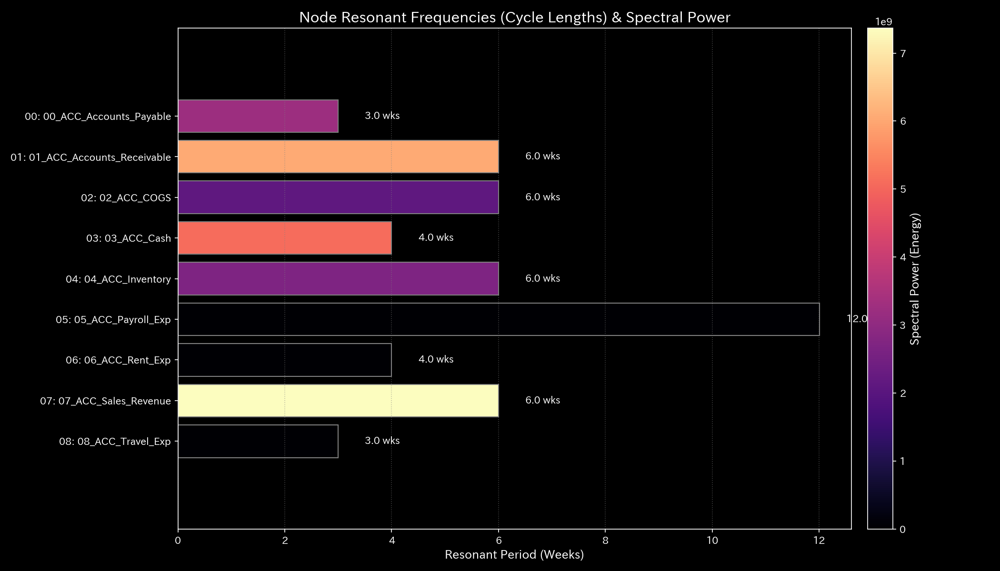
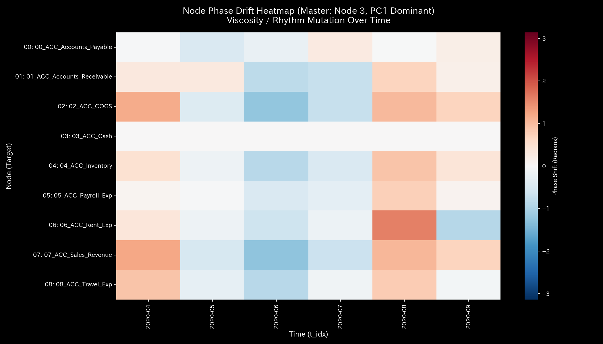
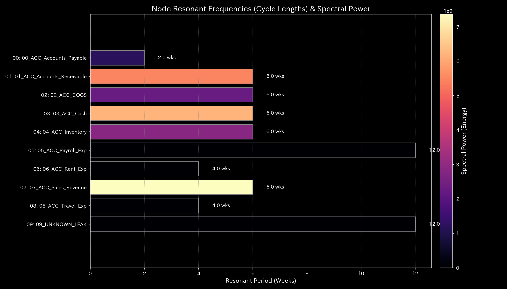
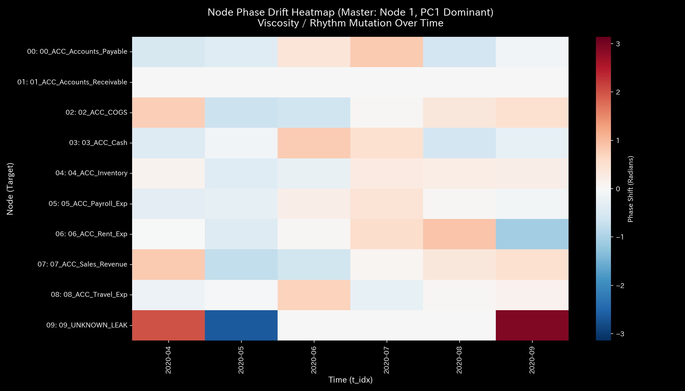
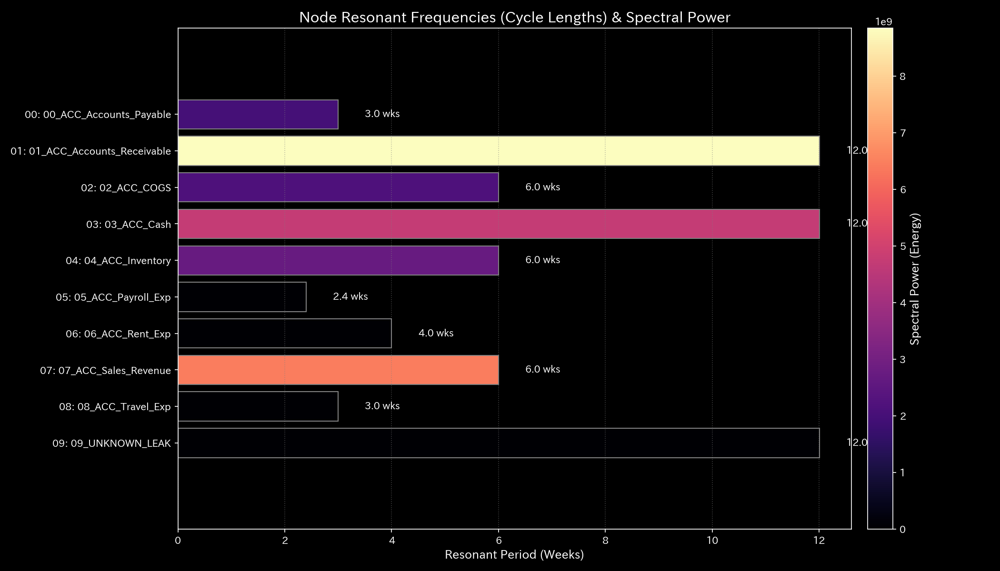
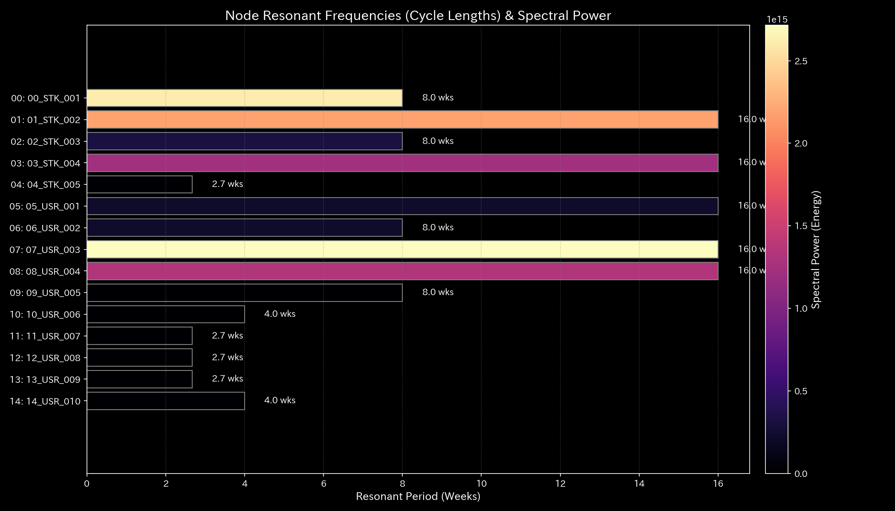
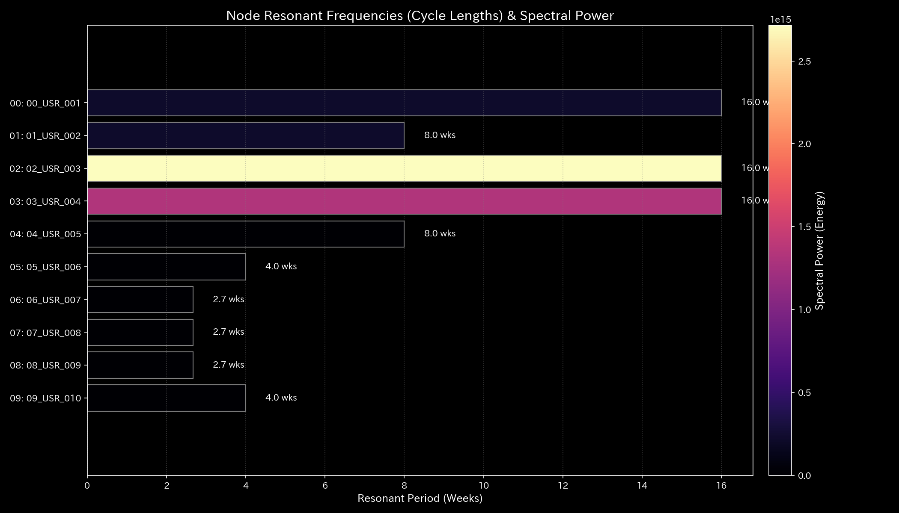
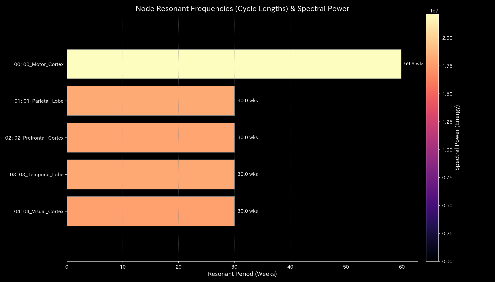
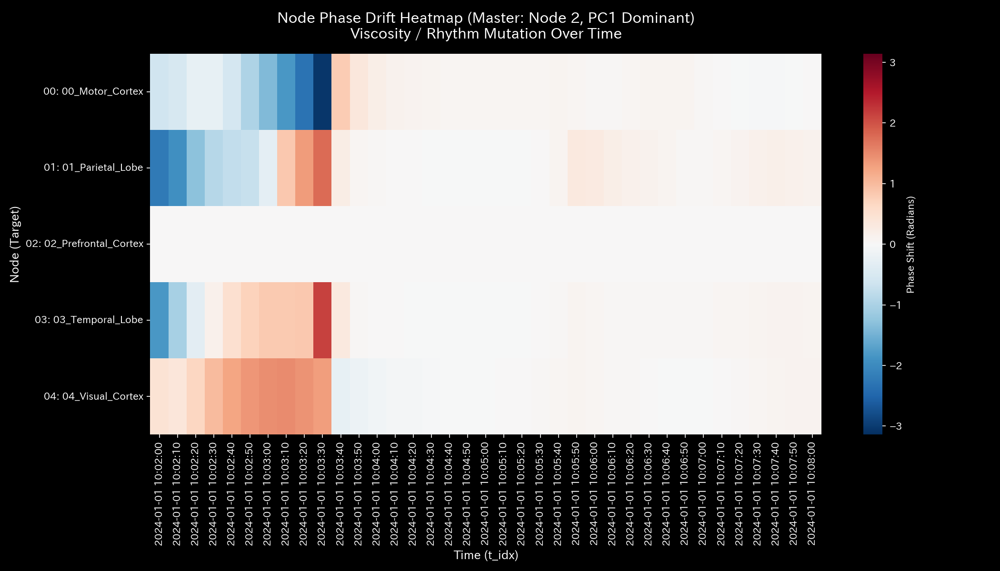

# 005_1. Wave Mechanics & Signal Processing

This guide describes the signal processing in the Tensor-Link Utility (TLU). It also explains the wave mechanics and phase coherence analysis module (`005_1`). It presents the resonant frequency spectrum of each validation sample. It also provides the phase drift heatmap. We organize the explanations based on outputs and numerical values for all 10 samples.

---

## 🔬 Physico-Mathematical Theory of Wave Mechanics and Phase Coherence

A healthy system involves countless independent decision-making nodes. The combined frequency spectrum exhibits "1/f noise (fractal noise / pink noise)":

$$S(f) \propto \frac{1}{f^\beta} \quad (\beta \approx 1.0)$$

During collusion or states like epileptic seizures, specific nodes align their timing. This causes phase coherence. The fractal slope of the 1/f noise decreases. This process leads to a synchronous state.

TLU measures time-series changes in phase differences between nodes. This is called "phase drift". TLU also calculates the coherence matrix. This approach detects synchronization that traditional statistical models cannot find.

---

## 📊 Wave Mechanics and Signal Processing Analysis Results of Each Validation Sample

This section presents the analysis of all 10 validation samples. It shows the resonant frequency spectrum (`005_1_1_resonant_frequency.png`). It also displays the phase drift heatmap (`005_1_2__phase_drift_heatmap.png`). It explains their physico-mathematical characteristics.

### 🟢 Sample 0 (Healthy Metabolism: Healthy)

* **Resonant Frequency Spectrum (`005_1_1_resonant_frequency.png`)**
  * **Clinical Commentary:** No resonant peaks exist at specific frequencies. Noise (fluctuations) is distributed smoothly across all bands. This indicates a steady state.
  * 

* **Phase Drift Heatmap (`005_1_2__phase_drift_heatmap.png`)**
  * **Clinical Commentary:** Phase differences diffuse randomly across all regions. There is no bias toward any specific pair. No artificial synchronization or phase coherence is detected.
  * 

---

### 🟡 Sample 1 (Wash Trade: Wash Trade)

* **Resonant Frequency Spectrum (`005_1_1_resonant_frequency.png`)**
  * **Clinical Commentary:** A resonant peak (single spike) occurs. This corresponds to the wash trade cycle at a specific frequency. This shows the presence of an artificial circulation cycle.
  * 

* **Phase Drift Heatmap (`005_1_2__phase_drift_heatmap.png`)**
  * **Clinical Commentary:** The phase difference is locked to a constant value between account pairs involved in wash trading. This forms a steady synchronization band. This indicates persistent transaction synchronization.
  * 

---

### 🔴 Sample 2 (Embezzlement Leak: Embezzlement Leak)

* **Resonant Frequency Spectrum (`005_1_1_resonant_frequency.png`)**
  * **Clinical Commentary:** Resonance spikes occur at multiple locations. This is due to changes in network stiffness from the leak. This shows resonance of local flow fluctuations around the leaking node.
  * 

* **Phase Drift Heatmap (`005_1_2__phase_drift_heatmap.png`)**
  * **Clinical Commentary:** Phase difference alignment is observed between the leak target and specific accounts. Synchronous transaction fluctuations occur only through the specific leak path.
  * 

---

### 🟡 Sample 3 (Unbalanced Mistake: Unbalanced Mistake)

* **Resonant Frequency Spectrum (`005_1_1_resonant_frequency.png`)**
  * **Clinical Commentary:** Temporary high-frequency noise is excited only at the step when the mistake occurs. Persistent resonance at specific frequencies does not occur.
  * 

* **Phase Drift Heatmap (`005_1_2__phase_drift_heatmap.png`)**
  * **Clinical Commentary:** The phase difference of the affected account is temporarily distorted only during the error period. Self-correction occurs. It returns to a random diffusion state (normal) in the next step.
  * 

---

### 🔴 Sample 4 (Composite Chaos: Composite Chaos)

* **Resonant Frequency Spectrum (`005_1_1_resonant_frequency.png`)**
  * **Clinical Commentary:** The resonant peak of wash trading occurs. Simultaneously, asymmetric multi-resonant peaks of embezzlement occur. The entire spectrum shows multiple spikes.
  * 

* **Phase Drift Heatmap (`005_1_2__phase_drift_heatmap.png`)**
  * **Clinical Commentary:** The synchronization band of the wash trading pairs appears. Simultaneously, the alignment pattern of the embezzlement nodes appears. These patterns intersect. This shows a double hack of the network.
  * 

---

### 🔴 Sample 5 (Kyoto Traffic: Kyoto Traffic)

* **Resonant Frequency Spectrum (`005_1_1_resonant_frequency.png`)**
  * **Clinical Commentary:** Deadlock from congestion occurs. All power concentrates near the DC component (zero frequency). High-frequency flow disappears.
  * 

* **Phase Drift Heatmap (`005_1_2__phase_drift_heatmap.png`)**
  * **Clinical Commentary:** Phase difference drift stops between major intersections. A phase-locked band dominates the entire area. This shows that vehicles cannot move.
  * 

---

### 🟢 Sample 6 (Market Stock Flow: Market Stock Flow)

* **Resonant Frequency Spectrum (`005_1_1_resonant_frequency.png`)**
  * **Clinical Commentary:** No resonant peaks exist. Energy is distributed across all bands as fluctuations. This indicates healthy flow.
  * 

* **Phase Drift Heatmap (`005_1_2__phase_drift_heatmap.png`)**
  * **Clinical Commentary:** Phase differences diffuse randomly across all regions. There is no bias toward any specific pair. No artificial synchronization is detected.
  * 

---

### 🟢 Sample 7 (Market Cash Flow: Market Cash Flow)

* **Resonant Frequency Spectrum (`005_1_1_resonant_frequency.png`)**
  * **Clinical Commentary:** No resonant peaks exist. Energy is distributed across all bands as fluctuations.
  * 

* **Phase Drift Heatmap (`005_1_2__phase_drift_heatmap.png`)**
  * **Clinical Commentary:** No pathological locking of phase differences is observed between transaction accounts. Phase differences diffuse randomly. This shows no signs of collusion.
  * 

---

### 🔴 Sample 8 (fMRI Stroke: fMRI Stroke)

* **Resonant Frequency Spectrum (`005_1_1_resonant_frequency.png`)**
  * **Clinical Commentary:** Functional connection is disrupted by the stroke. Functional signal frequencies around the motor cortex disappear. An extreme bias to low frequencies (inactivation) occurs.
  * 

* **Phase Drift Heatmap (`005_1_2__phase_drift_heatmap.png`)**
  * **Clinical Commentary:** Phase drift stops between the stroke area and other regions. Or it turns into random drift. This indicates the loss of functional connection (loss of coherence).
  * 

---

### 🔴 Sample 9 (fMRI Seizure: fMRI Seizure)

* **Resonant Frequency Spectrum (`005_1_1_resonant_frequency.png`)**
  * **Clinical Commentary:** A single frequency corresponds to the synchronous burst of the seizure. All power spectral energy concentrates at this frequency. This forms a resonant spike.
  * 

* **Phase Drift Heatmap (`005_1_2__phase_drift_heatmap.png`)**
  * **Clinical Commentary:** Phase differences align across the entire brain (especially around the temporal lobe). A strong phase coherence (global brain coherence) forms. Individual regions lose independent activity.
  * 
