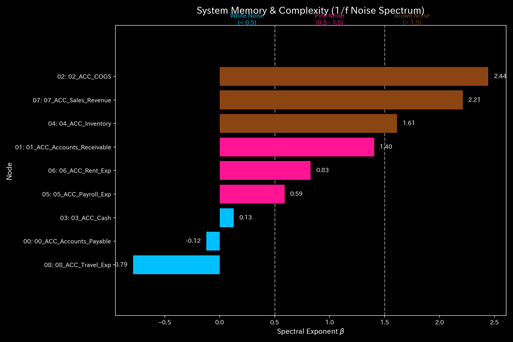
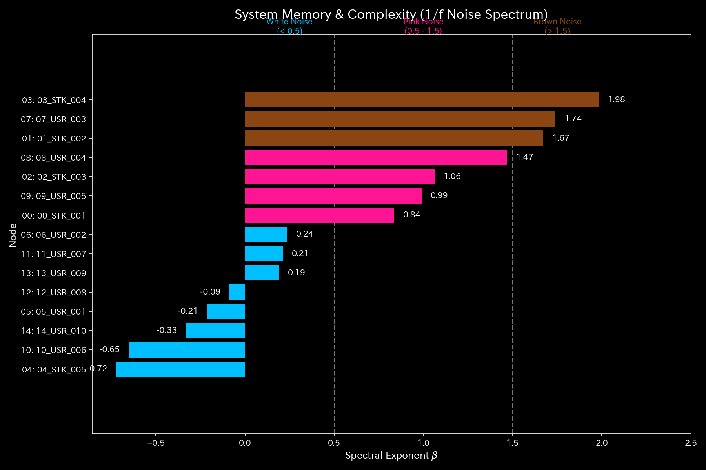
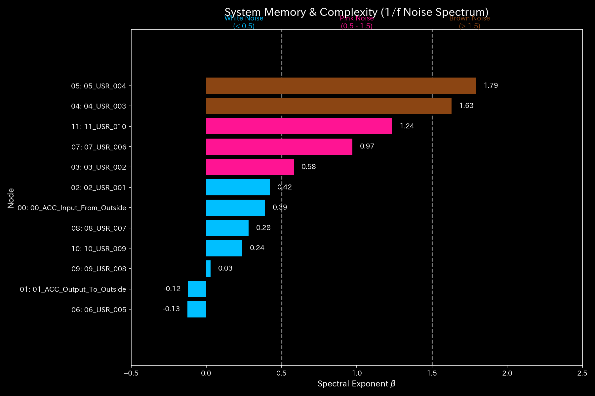
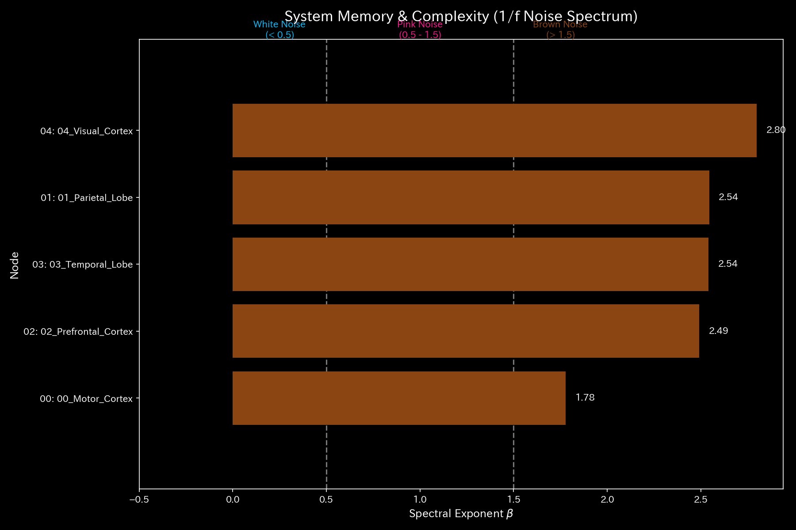
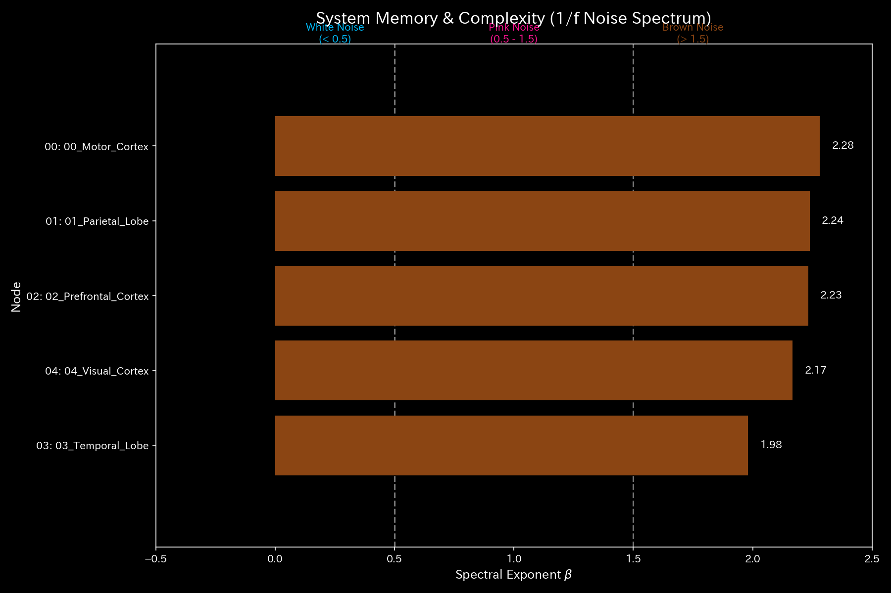

# 005_2. Fractal Noise

This guide describes the signal processing in the Tensor-Link Utility (TLU). It also explains the fractal noise (1/f noise) analysis module (`005_2`). It presents the fractal noise spectrum for each validation sample. We organize the explanations based on outputs and values for all 10 samples.

---

## 🔬 Physico-Mathematical Theory of Wave Mechanics and 1/f Noise

A healthy system involves countless independent decision-making nodes. The combined frequency spectrum exhibits "1/f noise (fractal noise / pink noise)":

$$S(f) \propto \frac{1}{f^\beta} \quad (\beta \approx 1.0)$$

During collusion or states like epileptic seizures, specific nodes align their timing. This causes phase coherence. The fractal slope of the 1/f noise decreases. This process leads to a synchronous state.

TLU measures time-series changes in phase differences between nodes. This is called "phase drift". TLU also calculates the coherence matrix. This approach detects synchronization that traditional statistical models cannot find.

---

## 📊 Fractal Noise Analysis Results of Each Validation Sample

This section presents the analysis of the fractal noise (1/f noise) spectrum (`005_2_1_fractal_noise_spectrum.png`) for all 10 validation samples. It explains their physico-mathematical characteristics.

### 🟢 Sample 0 (Healthy Metabolism: Healthy)

* **Fractal Noise (1/f Noise) Spectrum (`005_2_1_fractal_noise_spectrum.png`)**
  * **Clinical Commentary:** The spectrum draws a straight downward-sloping line on a log-log graph. The power-law exponent is near $\beta \approx 1.0$. This indicates that "1/f noise" of active metabolism holds.
  * 

---

### 🟡 Sample 1 (Wash Trade: Wash Trade)

* **Fractal Noise (1/f Noise) Spectrum (`005_2_1_fractal_noise_spectrum.png`)**
  * **Clinical Commentary:** The power-law exponent $\beta$ rises. Forced synchronization from wash trading occurs. The self-similarity (autonomy) of the entire spectrum is lost. Power concentrates locally at specific frequencies.
  * 

---

### 🔴 Sample 2 (Embezzlement Leak: Embezzlement Leak)

* **Fractal Noise (1/f Noise) Spectrum (`005_2_1_fractal_noise_spectrum.png`)**
  * **Clinical Commentary:** Leaks occur. High-frequency noise decays due to the drop in liquidity. The power-law exponent $\beta$ rises. This shows a fractal slope where the active energy of the entire system has dropped.
  * 

---

### 🟡 Sample 3 (Unbalanced Mistake: Unbalanced Mistake)

* **Fractal Noise (1/f Noise) Spectrum (`005_2_1_fractal_noise_spectrum.png`)**
  * **Clinical Commentary:** Impulse noise overlays only during the temporary mistake step. This distorts the fractal slope. It returns to "1/f noise" ( $\beta \approx 1.0$ ) in the next step. Self-correction occurs.
  * 

---

### 🔴 Sample 4 (Composite Chaos: Composite Chaos)

* **Fractal Noise (1/f Noise) Spectrum (`005_2_1_fractal_noise_spectrum.png`)**
  * **Clinical Commentary:** Wash trades and embezzlement leaks burden the system. This distorts the spectral slope. The power-law exponent $\beta$ deviates significantly from the normal value. This indicates a breakdown of self-organization capacity.
  * 

---

### 🔴 Sample 5 (Kyoto Traffic: Kyoto Traffic)

* **Fractal Noise (1/f Noise) Spectrum (`005_2_1_fractal_noise_spectrum.png`)**
  * **Clinical Commentary:** Traffic deadlock occurs. The power-law exponent $\beta$ rises. High-frequency movement disappears. This shows a frozen system state.
  * 

---

### 🟢 Sample 6 (Market Stock Flow: Market Stock Flow)

* **Fractal Noise (1/f Noise) Spectrum (`005_2_1_fractal_noise_spectrum.png`)**
  * **Clinical Commentary:** The power-law exponent remains near $\beta \approx 1.0$. This indicates that autonomous and diverse trading flows function in the market.
  * 

---

### 🟢 Sample 7 (Market Cash Flow: Market Cash Flow)

* **Fractal Noise (1/f Noise) Spectrum (`005_2_1_fractal_noise_spectrum.png`)**
  * **Clinical Commentary:** The power-law exponent remains near $\beta \approx 1.0$. Fluid flow in the payment network maintains autonomous self-organization. This indicates a robust state.
  * 

---

### 🔴 Sample 8 (fMRI Stroke: fMRI Stroke)

* **Fractal Noise (1/f Noise) Spectrum (`005_2_1_fractal_noise_spectrum.png`)**
  * **Clinical Commentary:** Stroke causes functional connection disconnection. Functional signal frequencies around the motor cortex disappear. The power-law exponent $\beta$ rises. The slope falls. This indicates loss of fractal autonomy (paralysis) in brain activity.
  * 

---

### 🔴 Sample 9 (fMRI Seizure: fMRI Seizure)

* **Fractal Noise (1/f Noise) Spectrum (`005_2_1_fractal_noise_spectrum.png`)**
  * **Clinical Commentary:** A synchronous seizure burst occurs. Power concentrates at a specific frequency. This breaks the fractal 1/f line. The power-law exponent $\beta$ reaches a peak, indicating a collapse of the autonomous activity of the entire brain system.
  * 
