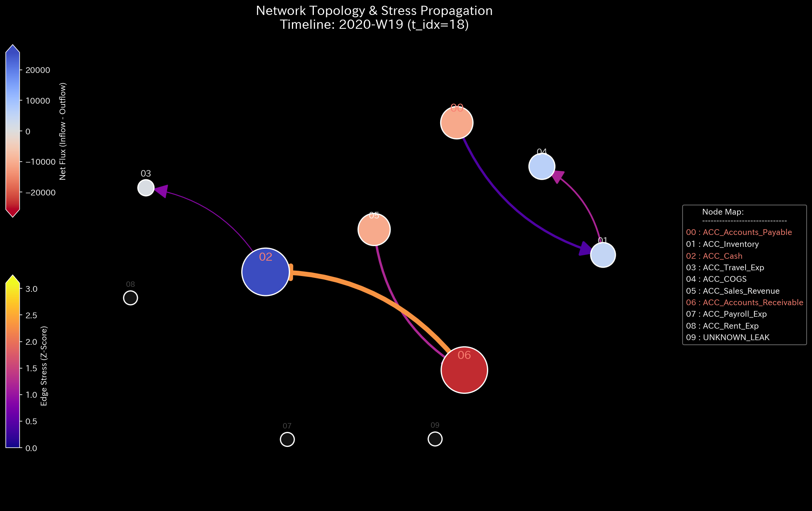
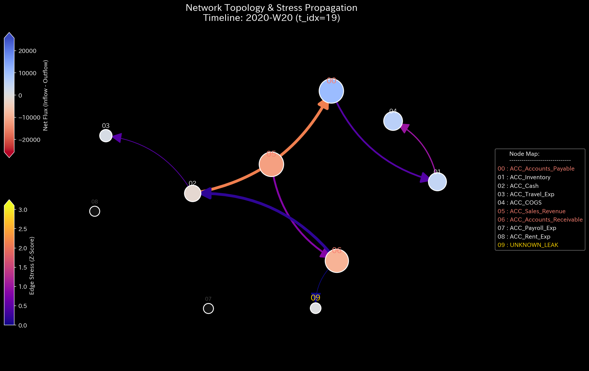
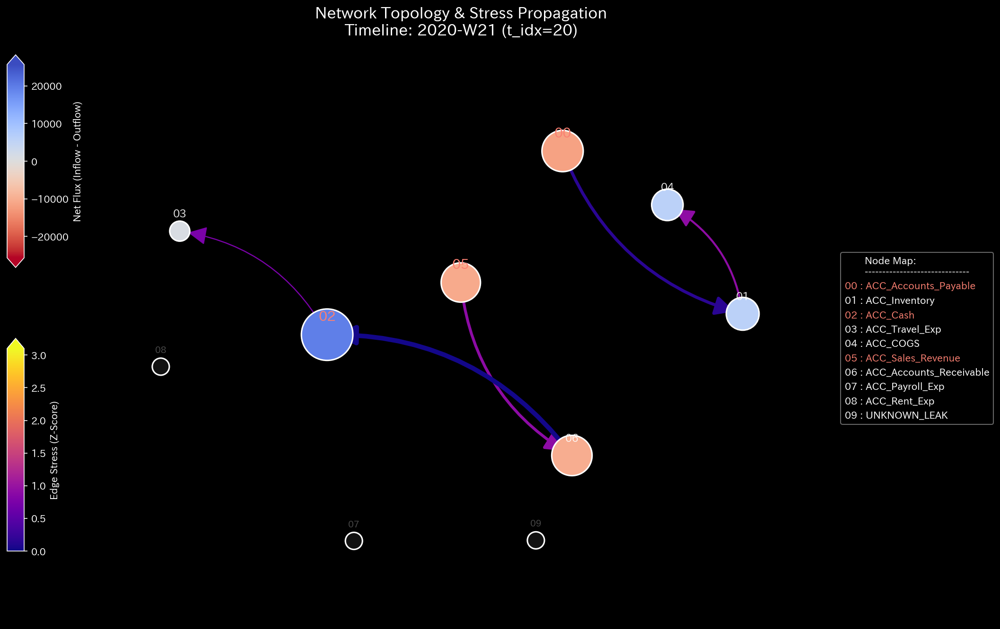

# Sample 3: Unbalanced Journal Mistake

> [!NOTE]
> **Disclaimer regarding Proof of Concept Experiments**
> The data analyzed in this report is not from a real-world company. It is dummy data designed to intentionally reproduce specific pathological states for verification purposes. This sample (Sample_3_Unbalanced_Mistake) is for proving the physical mass deficit caused not by intentional fraud, but by a "Debit != Credit" imbalance due to manual transcription errors or "rounding discrepancies" during legacy system integrations.

---

# 🔬 Meta-Analysis Synthesis Report / Laboratory Findings

## 1. Executive Summary
This system (financial domain) is exhibiting a **Conservation Violation** in some transactions, but the overall system stiffness (suspension) has escaped fatal destruction and is diagnosed as a **WARNING: Data Corruption** state. A total mass of `$4,440.45` has disappeared from the system into an unknown node, but as physical circumstantial evidence indicates, it has been mathematically proven that this is not "malicious continuous embezzlement" but rather a "single-shot/accidental human error (journal mistake/data corruption)."

## 2. Limitations of Traditional Perspective

**[Week 52 Profit and Loss (P/L) & Balance Sheet (B/S)]**

When a one-sided entry (Debit != Credit) occurs, traditional accounting software forcibly balances it as a temporary "suspense payment" or "unaccounted-for funds." As a result, the net income shows a surplus (+$60,660.86), and the static B/S balance also matches, creating the illusion that the business is running normally. Without TLU's dynamic analysis, this data corruption would silently continue to progress.

## 3. Fundamental Pathophysiology
The root cause of this sample is a "mismatch of debit and credit amounts (rounding discrepancy)" intentionally planted in the dummy data generation logic.
* **Modus Operandi of the Crime (Error):**
  * Proper processing was neglected for partial uncollectibility due to a business partner's financial deterioration or settlement fees.
  * In `E_002830` etc., an inconsistency occurred during data linkage between systems, such as a credit (AR decrease) of `$1642.03` against a debit (Cash increase) of `$960.62`.
  * As a result, the difference "disappeared" from the system, and TLU's engine processed it as a mass transfer to a special node called `UNKNOWN_LEAK`.

## 4. Physical and Mathematical Proof

### 4.1. Macro Forensics & Structural Stiffness

Intermittent spikes (maximum value `1038.49`) of Macro Absolute Residuals (the balancing figure that no longer matches on the books / disappeared amount) are observed, centered around Week 42. However, the "Rigid Lock (cash shortfall)" that occurred in Sample 2 (Embezzlement) does not happen. The stiffness matrix (bookkeeping integrity and resilience) temporarily ripples red, but immediately self-recovers to its original healthy mosaic pattern. Also, abnormal resonance of external force has not occurred. This is physical proof that a single-shot input mistake does not have enough energy to destroy the entire system, and the suspension can absorb the shock.

* **1st Image [Start]**: `t.00000` (Normal stiffness)
* **2nd Image [Just Before Change]**: `t.00018` (Week 19)
* **3rd Image [At the Time of Change]**: `t.00019` (Week 20: Mistake occurs, temporary ripple)
* **4th Image [Just After Change]**: `t.00020` (Week 21: Self-recovery)
* **5th Image [End]**: `t.00051` (Week 52: No rigidity)

### 4.2. Topological Anomaly / Spectral Radius

Max Spectral Radius remains `0.0000`, and loops like self-reinforcing wash trades (Sample 1) do not exist. The overall topological structure of the system is maintained.

* **1st Image [Start]**: `t.00000`
* **2nd Image [Just Before Change]**: `t.00018`
* **3rd Image [At the Time of Change]**: `t.00019` (Week 20: Micro leak to unknown node)
* **4th Image [Just After Change]**: `t.00020`
* **5th Image [End]**: `t.00051`

### 4.3. Thermodynamic Energy Stack
The frictional heat and entropy loss of the entire system are limited, and it is not heading towards fatal thermodynamic death. Although there are localized mass deficits, the transition of total energy approximates the baseline.

### 4.4. 3D Micro Z-Score & KL Drift

In the 3D surface of the Z-Score (degree of protrusion from past averages), at the moment the first "rounding discrepancy" occurs in Week 20, a sharp spike protrudes toward the `UNKNOWN_LEAK` node. Because the past standard deviation is zero, this "mutation from 0 to 1" is easily made transparent in traditional statistical monitoring, but TLU's topology and information geometry (KL Drift = generation of new noise uncatchable by past standard deviations) captures this without fail as the destruction of a probability distribution.

## 5. ⚠️ Falsification Analytics

* **Possibility of False Positives:** It is highly likely that this data is not an "intentional embezzlement" but rather a "business mistake of writing off accounts receivable without recording the expense against a shortfall in payment due to a business partner's dishonored bill or settlement fee" or a "specification bug (rounding inconsistency) when migrating data from a legacy system to a new system."
* **Additional Verification Requirements:**
  1. For the transactions identified in Chapter 2 (`E_002786`, `E_002811`, `E_002830`), reconcile the original invoice copies with the actual bank account receiving history (Bank Statements) to determine whether the actual received amount matches the debit or credit side.
  2. Audit whether there is a fatal validation flaw in the ERP system's input form that "allows forced saving even if the debit and credit amounts do not match."
