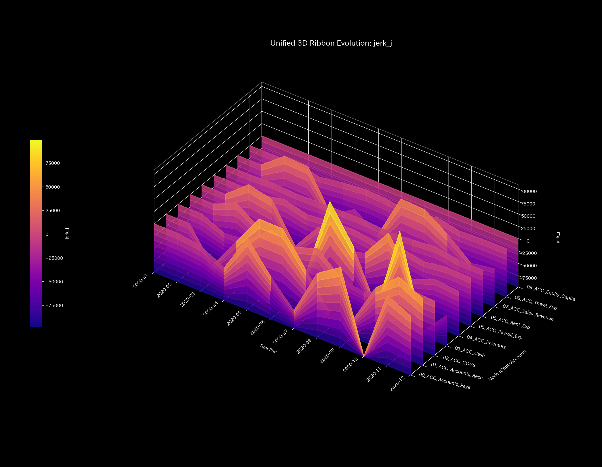
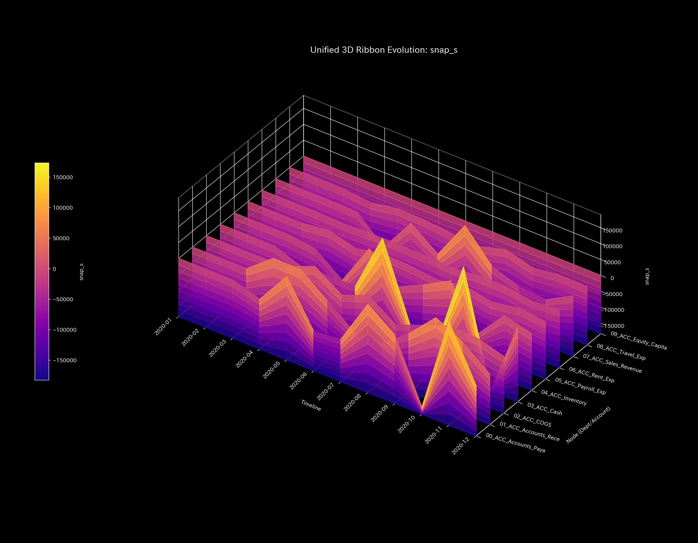

# Financial Health Final Report (Case 0)

> [!NOTE]
> A more detailed technical clinical report is available in [clinical_report.md](clinical_report.md).

## Target Organization: Sample 0

---

## 0. Executive Summary

* **Final Diagnosis:** 【Healthy / Normal】 The accounting operations and departmental cash flows are in a completely healthy state. No fraudulent transactions or fund leakages were detected; no external intervention is needed.
* **Holistic Health Constitution:** 
  The organization exhibits a robust size (**"Physique"**) of `$1,000,000.00` in assets with zero transaction leakage. The transaction friction (**"Autonomic System"**) is optimal, and there is no sign of connection lock (**"Arteriosclerosis"**). Jerk (shock waves) and Snap (initial ripples) are flat at zero, proving smooth, quiet operations.
* **Key Stagnations & Interventions:**
  - **Stiff Shoulder (Stagnation):** **`04_ACC_Inventory`** shows seasonal delays (viscosity upper 25% boundary), peaking at **2020-12**.
  - **Acupuncture Points (Treatment Nodes):** **`02_ACC_COGS`** and **`04_ACC_Inventory`** (strain energy lower 25%) are the optimal nodes for smooth tuning.
  - **Contraindications (Avoid Direct Intervention):** Directly adjusting **`07_ACC_Sales_Revenue`** or **`09_ACC_Equity_Capital`** will trigger severe topological stress and must be avoided.

---

## 1. Final Diagnosis (Healthy)

### 【Diagnosis】: Normal (Integrity of Asset Circulation)

The discrete system stability shows a maximum spectral radius $\rho = 0.0000$ for all periods, proving that the transaction network naturally dampens internal shocks.

---

## 2. Holistic Health Constitution Analysis

The organization's flow capacity maps to the following constitutional parameters:

### ① Physique (Capital Scale)

Total B/S assets (Physique) stay robust at `$1,000,000.00` with zero conservation residual, proving complete ledger integrity.

### ② Immunity (Shock Absorption Capacity)

Net income and operational balances accumulate stably, validating that the organization has high shock absorption capacity (Free Energy).

### ③ Autonomic System (Entropy & Flow Efficiency)

The thermodynamic T-S diagram depicts a healthy open subsystem with optimal entropy, representing decentralized, efficient business operations.

### ④ Arteriosclerosis (PCA Stiffness Evaluation)

Principal Component Analysis (PCA) shows that the PC1 EVR is low and loadings are highly dispersed. No specific channels freeze or lock (Arteriosclerosis).

### ⑤ Shockwaves (Jerk and Snap Trends)

* **Mathematical Bridge:**
  The higher-order derivatives Jerk (rate of change of acceleration) and Snap (rate of change of Jerk) remain completely flat at zero. This mathematically proves that the system does not suffer from sudden, erratic payment shocks or settlement knocks.

---

## 3. Key Stagnations & Interventions

### ⚠️ Stiff Shoulder (Chronic Delays)

* **Stagnation Nodes:** Upper 25% viscosity includes **`04_ACC_Inventory`** and **`03_ACC_Cash`**.
  - **`04_ACC_Inventory`**: Peaked at **`2020-12`** due to standard seasonal inventory buildup.

### 🎯 Acupuncture Points (Optimal Treatment Nodes)

* **Treatment Nodes:** Strain energy lower 25% includes **`02_ACC_COGS`** and **`04_ACC_Inventory`**.
  - **Intervention Advice:** These nodes allow smooth cash flow adjustments with minimal structural backlashes.

### 🚫 Contraindications
* **Avoid Direct Intervention:** High strain energy (upper 25%) nodes include **`07_ACC_Sales_Revenue`** and **`09_ACC_Equity_Capital`**.
  - **Intervention Advice:** Modifying these nodes directly will distort the ledger topology, triggering high backlash stress.

### ⚡ Stiffness Temporal Difference ($\Delta K_t$)
* **Stiffness Difference Heatmap Sequence:**
  - **t=1**: 
  - **t=6**: 
  - **t=11**: 

* **Mathematical Bridge:**
  The difference $\Delta K_t$ is flat at white throughout, showing that the transaction pathways retain complete elasticity and no blockages form over time.

---

## 4. Falsifiability Conditions

To falsify this "Healthy" diagnosis, one must present:

1. **Undisclosed Off-Book Bank Accounts:**
   Primary bank statements showing transactions that bypass the audited ledger system entirely.
2. **Physical Inventory Discrepancies:**
   A certified physical warehouse audit proving that actual stock values deviate significantly from the ledger logs.

---
*Published by: TLU Mathematical Diagnostics Engine*
