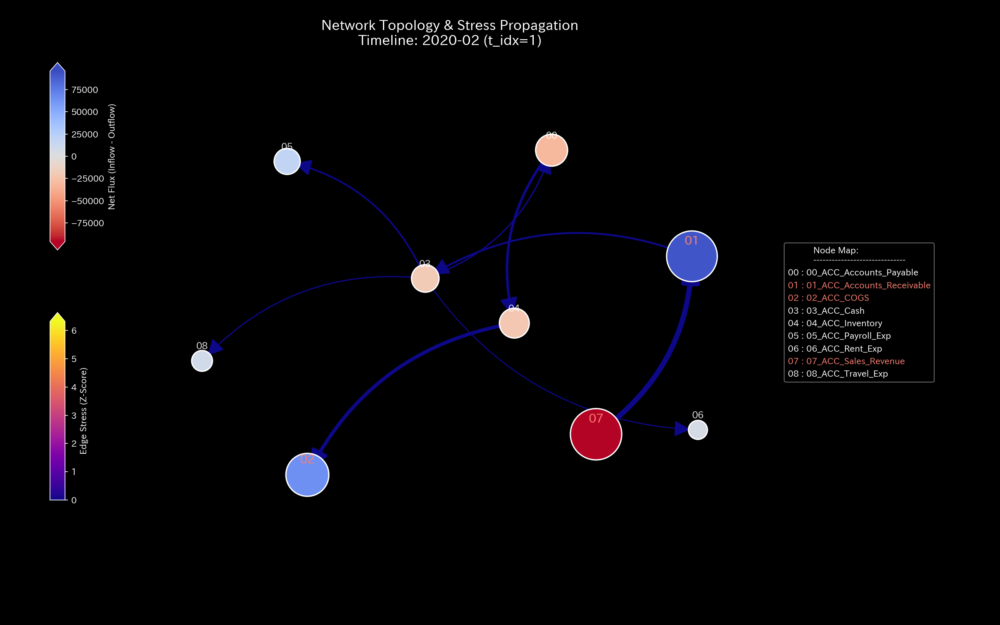
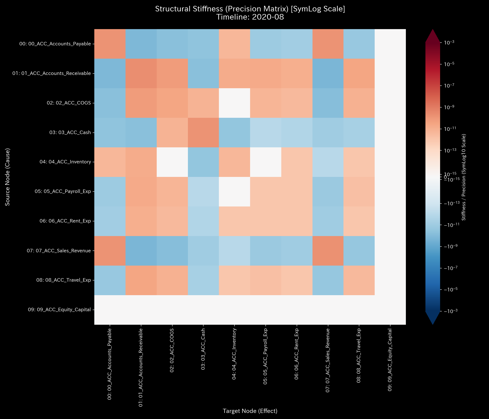
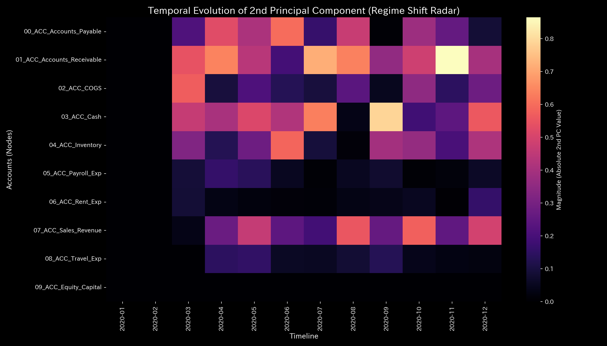
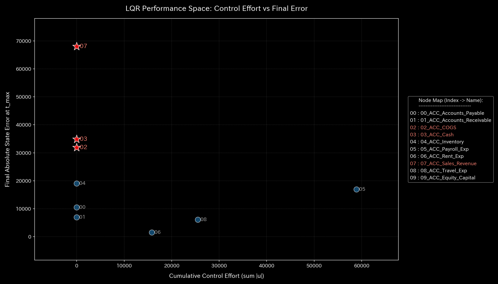

# 🔬 Anomaly Detection & Financial Health Report (Sample 0 - Healthy/Normal System)

## 1. Executive Summary

* **Overall Status:** 🟢 **Healthy / Normal**
* **Severity:** 🟢 **NORMAL (No Anomaly)**
* **Summary:** The system is in a normal state for both balance sheets (B/S) and transaction flows (P/L). No discrepancies exist. The conservation residual (Kirchhoff residual) is `0.00`. There are no signs of illicit leaks or wash trades.

---

## 2. Comparison of Financial Statements and Transaction Flows

We compare the financial statements and transaction flows.

### Balance Sheet (B/S) Comparison

* **B/S Asset & Equity Cumulative Trend & Block Chart (Cumulative):**
  
  

* **B/S Asset & Equity Periodic Trend (Monthly Non-Cumulative):**
  

### Income Statement (P/L) Comparison

* **P/L Revenue & Expense Cumulative Trend:**
  

* **P/L Revenue & Expense Periodic Trend (Monthly Non-Cumulative):**
  

* **Observation:** Flows remain stable in both cumulative and periodic views. No sudden drops or blocks (flattening) exist.

---

## 3. Pathophysiology

* **Diagnosis:** **Normal Circulation**
* Transaction flows between departments satisfy physical conservation laws. There is no accumulation of funds or bias toward specific routes.

---

## 4. Summary of Mathematical Analysis Results

### 4.1. Mass Conservation and Network Topology

The Kirchhoff residual is **`0.00`**. No leaks exist to off-book unregistered accounts.

* **Macro Forensics Dashboard:**
  

* **Network Topology Evolution:**
  
  
  

### 4.2. Stiffness Connection & PCA (Stiffness & PCA)

The stiffness matrix shows a normal joint state. No transaction block exists. The eigenvalue ratios and time transitions of the principal eigenvectors (PC1, PC2, PC3) remain stable.

* **Evolution of Structural Stiffness Matrix:**
  
  
  

* **Principal Axis Ratios & Eigenvector Evolution (PC1, PC2, PC3):**
  
  
  
  

### 4.3. Exclusion of Wash Trades (Spectral Radius)

The spectral radius remains **`0.00`** throughout the period. No wash trade loops exist.

* **System Stability Indicator:**
  

### 4.4. Thermodynamic Indicators and 3D Topology

Effective energy increases. Frictional loss (entropy) is regulated based on the payment cycle.

* **Thermodynamic Characteristics & 3D Trajectory:**
  
  
  
  
  

---

## 5. Control Interventions and Recommended Actions (LQR & Operations)

* **Treatment Status:** **No Treatment Required**
* The system is self-stable. Optimal correction using LQR control feedback is unnecessary.

### 💡 Quantitative Evaluation of Leverage Points for Cost Reduction

Based on the data, the leverage effect of reducing the three expense types (payroll, travel, rent) is ranked as follows:

1. **Rank 1: Payroll Expense (`ACC_Payroll_Exp`)**
   * **Quantitative Feature:** The joint strain energy (`ik_strain_energy`), which indicates organizational load and friction, is **`6.5682`** (lowest). The LQR controller demands the largest optimal control inputs (absolute adjustments). This adjustment item has the lowest organizational friction and the largest effect.
2. **Rank 2: Travel Expense (`ACC_Travel_Exp`)**
   * **Quantitative Feature:** The joint strain energy (`ik_strain_energy`) is **`8.0020`**. Adjusting this expense causes lower friction than rent. It serves as a short-term variable cost adjustment.
3. **Rank 3: Rent Expense (`ACC_Rent_Exp`)**
   * **Quantitative Feature:** The joint strain energy (`ik_strain_energy`) is **`8.1039`** (highest). This node is the stiffest fixed cost node, causing maximum organizational load (friction). It has the lowest priority as a cost reduction lever.

#### 📊 3D Ribbon Evolution Graph and Scale Discrepancies

The 3D ribbon graphs of Forward Kinematics (FK) and Inverse Kinematics (IK) visualize the flow propagation across the system.

* **Forward Kinematics (FK Impact):**
  Expenses are transaction sinks (absorbing nodes). The impact does not propagate. The ribbon height remains near zero.
  

* **Inverse Kinematics (IK Impact):**
  This shows the adjustments required to achieve the target sales revenue (`ACC_Sales_Revenue`).
  

> [!NOTE]
> **Scale Limits in Visualization:**
> The three expense lanes appear flat on the 3D ribbon graphs. This occurs because mainstream adjustments (e.g., accounts receivable, sales revenue) are extremely large (magnitude of 100k). The Z-axis scale of the graph is dominated by these large flows, compressing the smaller expense fluctuations (magnitude of 1k to 10k). Mathematically, the three expenses synchronize with the phase of the cash flows, displaying fluctuations monthly.

---

## 6. Alerts & Falsifiability

### 6.1. Evaluation of False Positive Alerts

* **Alert Details:** The Z-Score temporarily exceeded the threshold of `3.0` at the end of quarters and fiscal periods (March, April, June, July, August, October, November, and December).
* **Evaluation:** False positive (no issue). This is a normal seasonal fluctuation caused by concentrated entries at closing periods. Since the conservation law holds, these alerts can be safely ignored.

### 6.2. Falsification Conditions

To reject the diagnosis in this report, one of the following pieces of evidence is required:

1. **Physical Discrepancy:** A mismatch between the bank balance and the ledger balance.
2. **Off-Book Entities:** Money transfers to hidden accounts or shell companies not included in the model.
