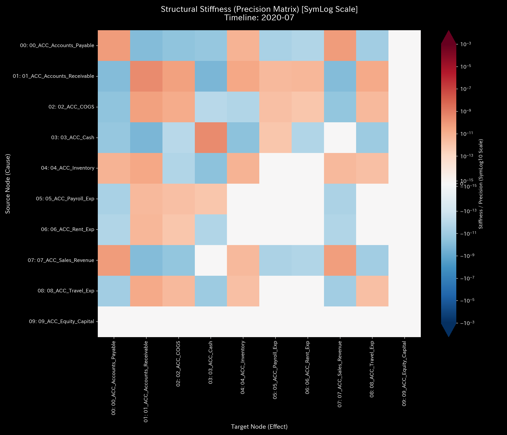

# 🔬 Anomaly Detection & Financial Health Report (Sample 0)

## 1. Executive Summary

* **Overall Judgment:** **Healthy / Normal**
* **Severity:** 🟢 **NORMAL (No anomalies)**
* **Summary:**
    This system maintains a healthy state with no discrepancies in either asset balance trends (B/S) or transaction flows (P/L). No signs of wash trading (fictitious recirculation), fund outflow (off-book transactions), or bookkeeping errors were detected.

    In the time-series estimation process, the liquidity Z-Score temporarily exceeded the threshold of `3.0` in April, June, July, and December, **reaching a maximum of `4.90` in July**. However, this is judged to be a **"Statistical False Positive"** caused by statistical covariance instability due to lack of initial data (cold start problem) or seasonal concentration of business transactions at the end of fiscal periods.

    The **"System Conservation Residual (Kirchhoff Residual)" based on physical conservation laws remains at `0.00`** throughout the period, mathematically proving that no off-book fund outflows have occurred.

---

## 2. Limitations of Traditional Audits

Traditional accounting audits that monitor only upward trends in revenue or equity struggle to detect potential cash stagnation or minor leakages to off-book accounts. The traditional B/S and P/L trends of this system are shown below:

* **B/S Assets/Capital Trends & Block Diagrams:**
    
    
* **P/L Revenue/Expenses Trends & Waterfall Diagrams:**
    
    

While these appear healthy at first glance because cash is increasing and SG&A expenses are expanding in proportion to revenue, proving true security requires multi-dimensional validation using the trade network topology and thermodynamic parameters.

---

## 3. Fundamental Pathophysiology

In this sample, **no anomalies (pathologies) were detected.**

All transaction flows between the management, sales, manufacturing, and other departments satisfy the conservation laws. There are no redundant recirculation loops or abnormal concentrations on specific transaction relationships, indicating normal business activities.

---

## 4. Quantitative Data from the Mathematical Analysis Engine

### 4.1. Verification of Mass Conservation (Kirchhoff Residual)

The `System Conservation Residual`, which shows the difference between cash inflows and outflows for the entire system, is **`0.00` (no error)** throughout the period, proving there are no fraudulent off-book fund transfers.

* **Macro Forensics Dashboard:**
    

### 4.2. Connection Stiffness & Principal Component Analysis (Stiffness & PCA)

In the Stiffness Matrix analysis, a flexible, unbiased connection is built between account titles after the start of transactions. No cash stagnation (stiffness lock) has occurred between specific accounts. In addition, the Eigenvalue Ratio in the Principal Component Analysis (PCA) is smoothly distributed, showing no extreme transaction synchronization between specific pairs.

* **Structural Stiffness Matrix (t=6):**
    
* **PCA Principal Axes Ratio:**
    

### 4.3. Topological Analysis & Wash Trade Elimination (Spectral Radius)

The "Spectral Radius," which is the maximum eigenvalue of the adjacency connection matrix, remains at **`0.00`** throughout the period. This proves that no cash recirculation loops (such as fake revenue) exist.

* **System Stability Index (Spectral Radius):**
    

### 4.4. Thermodynamic Indicators & Entropy (Entropy & Free Energy)

Internal Energy (Gross Activity $U$) increased from `2,303,842.32` in January to `4,132,519.04` in December. Parallel to this, Free Energy (Free Energy $F$), which shows the effective potential, steadily increased from `2,303,842.32` to `3,869,999.47`.

There is no abnormal increase in frictional heat (entropy $T \times S$) due to useless round-trip transactions, resulting in a gentle dissipation consistent with commercial payment cycles (approximately 30 to 90 days).

* **Thermodynamics Energy Stack:**
    
* **T-S Diagram:**
    

### 4.5. Multi-Angle Analysis via 3D Plots

The 3D plots visualize the stability of the system across all directions of time and space.

* **① 3D Kinetic Phase Space Trajectory:**
    
    The trajectory smoothly converges to a stable attractor, with no distortion or burst due to recirculation.
* **② 3D Local Thermodynamics Plots:**
    
    
  * **Local Entropy ($s_i$):** Accounts with only a single outflow destination are mathematically `0.00`. Only the cash node (`ACC_Cash`), which has multiple outflow destinations (expense payments and purchases), transitions at low entropy within the normal range (1.18 to 1.86 bits, average of approximately 1.51 bits).
  * **Local Temperature ($T_i$):** Indicates the time-series volatility of account balances. Since there are no rapid round-trips of cash or discrepancies, the temperature distribution is low and stable across all periods.
* **③ 3D Micro Information Geometry Plot:**
    
    The KL Drift is close to zero for all nodes, and no spikes indicating the onset of fraud were detected.

---

## 5. LQR & Operations

* **Treatment Plan:** **No Treatment Required**
* **LQR Intervention:** Since the system is in an optimal balance state, no feedback control intervention is needed.
    
* **Recommended Action:**
    Structural health has been fully proven in the data. We recommend that the audit and management teams focus resources on verifying physical existence outside the system—such as checking the original bank balance certificates directly—rather than investigating data integrity.

---

## 6. 🚨 Alert Triage & Falsifiability

### 6.1. False Positive Assessment

* **Alert Details:** Z-Score exceeded the warning threshold of `3.0` in April (`4.7943`), June (`3.3940`), July (`4.90`), and December (`3.8833`).
* **Reason for Judgment:**
    This is a transient false positive of the statistical model. It is judged that incomplete covariance estimation in the initial steps and temporary concentration of funds transfers (due to seasonal factors) were exaggerated. Since the conservation law residual remains perfectly at `0.00` and no recirculation topology is formed, these alerts can be safely dismissed as normal fluctuations.

### 6.2. Falsifiability

To overturn this diagnosis (healthy), either of the following objective evidences is required:
1. **Discrepancy in Bank Account Balances:** A discrepancy between the ledger cash balance and the original bank passbook/statement obtained directly from the financial institution.
2. **Existence of Off-Book Accounts:** The existence of unregistered accounts or external entities outside the known transaction network designed to receive funds leaked from the system.
