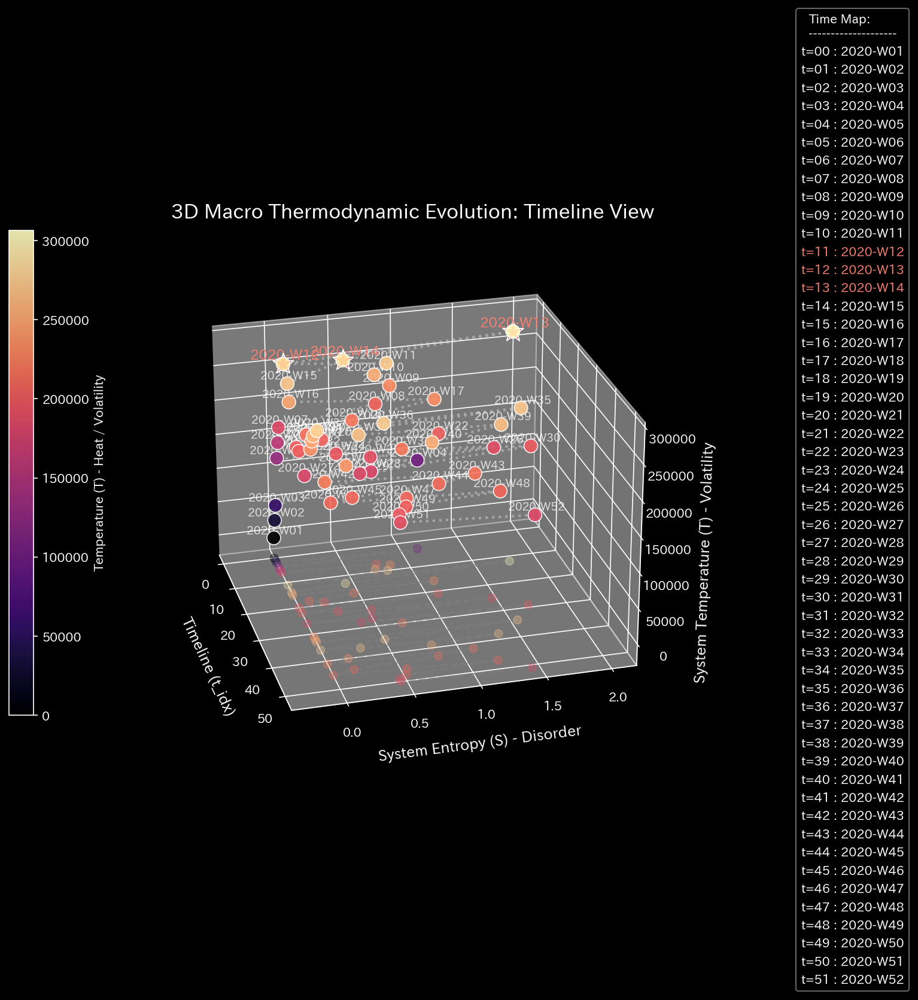
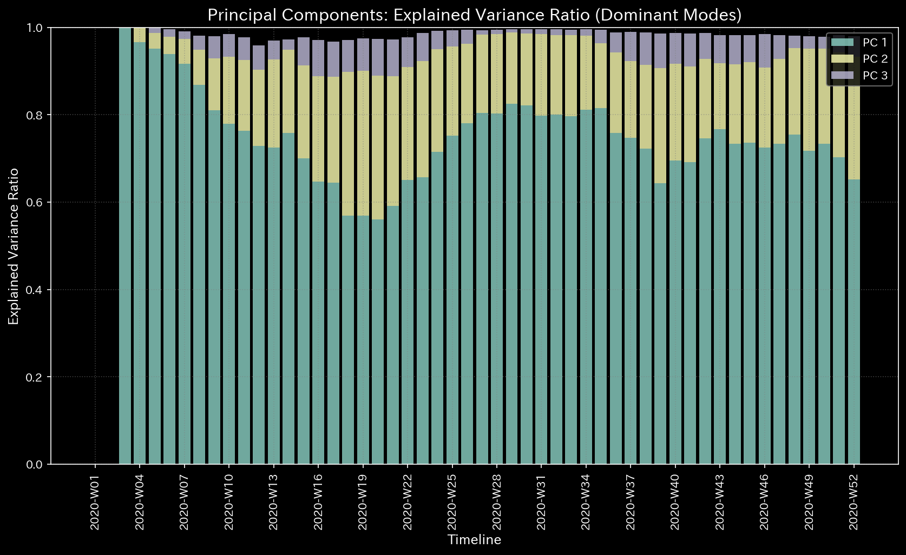
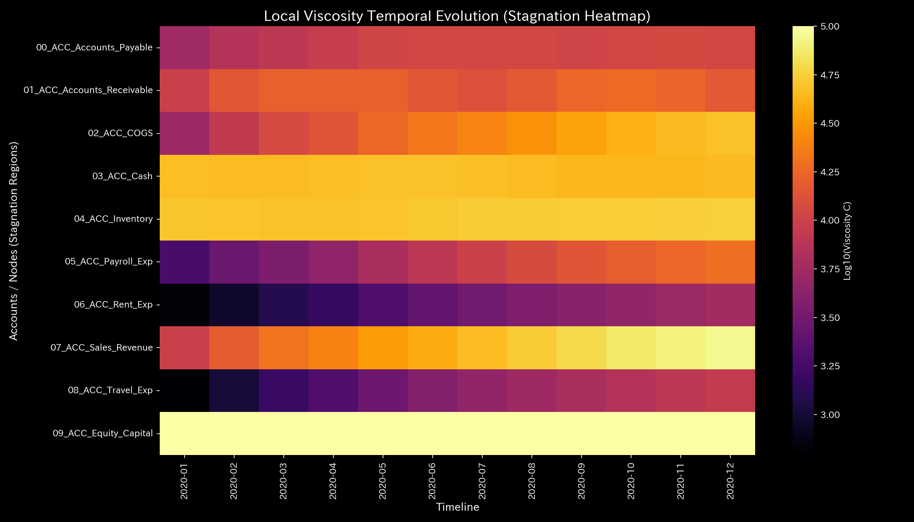
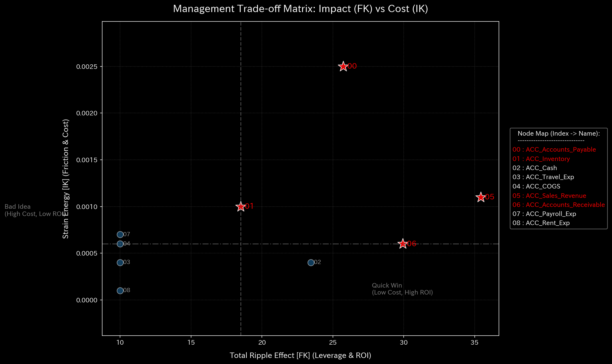

# Financial Health Report (Case 0)

> [!NOTE]
> A more detailed analysis report is available in [clinical_report.md](clinical_report.md).

## Target Entity: Sample 0

---

## 0. Executive Summary

* **Overall Diagnosis:** 【Healthy / Normal】 The accounting entries and fund flows between departments maintain a completely healthy state. No fraudulent transactions or cash leakage anomalies were detected; no external intervention is required.
* **Overall Constitution (Physical State):**
  The organization possesses a **"healthy physique"** with sufficient capital capacity, and its resilience to external shocks—such as sudden sales drops (**"immunity and basic stamina"**)—remains at an extremely high level. The frictional loss of fund circulation (**"autonomic nervous system"**) is systematically managed, and there are no signs of collusion or rigid stagnation (**"arteriosclerosis"**).
* **Areas for Improvement (Viscosity & Treatment Points):**
  * **Stagnation (Viscosity / "Stiff Shoulder") Range:** Mild settlement latency is observed in **"04_ACC_Inventory"**, **"03_ACC_Cash"**, and **"07_ACC_Sales_Revenue"** (top 25% viscosity range), peaking around **2020-12**. This is a normal timing lag in business operations.
  * **Treatment Points ("Tsubo") Range:** The minimum intervention stress range (bottom 25% strain energy range), comprising **"02_ACC_COGS"**, **"04_ACC_Inventory"**, and **"01_ACC_Accounts_Receivable"**, represents the highest priority treatment points to optimize the system.
  * **Contraindications (Avoid Intervention) Range:** Conversely, aggressive reductions or interventions in **"07_ACC_Sales_Revenue"**, **"09_ACC_Equity_Capital"**, and **"06_ACC_Rent_Exp"** (top 25% strain energy range) must be strictly avoided, as they will trigger intense system backlash and functional paralysis.

---

## 1. Overall Diagnosis (Normal)

### 【Diagnosis】: Normal (Highly Healthy Accounting and Transaction Environment)

The diagnostic engine has determined that the system is operating in a completely healthy and stable state. The maximum spectral radius, which measures dynamic stability, remains well below the warning threshold throughout the entire period. No fictitious transactions (wash trades) or off-book cash leaks (embezzlement) were detected. No control intervention or debugging is necessary.

---

## 2. Overall Constitution (Health State) Analysis

Mapping the organization's "financial stamina" to a medical checkup template reveals excellent constitutional characteristics:

### ① Physique & Weight (Cumulative Trend of Capital Scale)

The total stocks in the Balance Sheet (B/S), such as capital and cash, are fully secured, showing a highly robust and stable cumulative physique.

### ② Immunity & Basic Stamina (Resilience to External Shocks)

The cumulative balance of sales and expenses in the Profit and Loss Statement (P/L) is well-balanced, indicating that the system retains ample free energy to buffer external shocks and self-heal.

### ③ Autonomic Nervous System & Metabolic Efficiency (Regularity of Frictional Loss)

In the Temperature-Entropy (T-S) diagram mapping transaction volatility ($T$) to frictional entropy ($S$), the system traces a highly stable, closed thermodynamic cycle. Payment schedules and expense paces are exceptionally regular, with no signs of wasteful expenditure or abnormal entropy dispersion.

### ④ Arteriosclerosis Zero (PCA Principal Axes Evaluation)

Principal Component Analysis (PCA) of the accounts' coupling stiffness matrix shows no "stiffness lock" (where the first principal component (PC1) explainability spikes, indicating structure immobilization). The transaction routes are flexible and free of blockages, indicating a supple flow network.

---

## 3. Key Areas for Improvement (Viscosity & Treatment Points)

Specific areas for improvement identified by the system and recommended action plans are detailed below:

### ⚠️ Stagnation (Viscosity) Identification (Local Viscosity Temporal Heatmap Analysis)

* **Stagnation Range:**
  The heatmap mapping log local viscosity ($viscosity\_C$) over time shows mild settlement latency in **"04_ACC_Inventory"**, **"03_ACC_Cash"**, and **"07_ACC_Sales_Revenue"** (top 25% viscosity range). The peak latency is concentrated at the end of the fiscal year (**2020-12**), reflecting normal operational seasonality.
  In dynamic terms, increased local viscosity (friction/brakes) causes state trajectories to be drawn into and stagnate in specific spatial regions (referred to as "attractor confinement" or "attractor locking"). For further spatial details, refer to the 3D Phase Portrait ([000_1_8__phase_portrait_3d.png](../../../samples/Sample_0_Healthy/readme_plots/000_1_8__phase_portrait_3d.png)).
  * **`04_ACC_Inventory`**: Mean viscosity `52152.06`, peaking at **`2020-12`** (peak value `57092.62`).
  * **`03_ACC_Cash`**: Mean viscosity `30953.51`, peaking in **`2020-06`**.
  * **`07_ACC_Sales_Revenue`**: Mean viscosity `28765.41`, peaking in **`2020-12`**.

### 🎯 Treatment Points ("Tsubo") & Contraindications

* **Treatment Points Range:** Accounts in the bottom 25% of intervention strain energy—**"02_ACC_COGS"**, **"04_ACC_Inventory"**, and **"01_ACC_Accounts_Receivable"**—represent areas where adjustments can be made with minimal frictional resistance.
  * **Advice:** These sectors (such as Cost of Goods Sold) can be adjusted to optimize liquidity with the least effort, without damaging the capital structure. In particular, when intervening in boundary terminal nodes that directly interface with the external world (e.g., Accounts Receivable representing external clients' cash flows), you must carefully assess the cash squeeze (External Backlash) forced on external partners. Aggressive local collection speedups (sedation/泻) carry a high risk of triggering negative feedback loops, such as subsequent sales drops due to customer churn. Thus, instead of a localized push for faster collections, a symbiotic package of interventions (Yin-Yang balancing) must be proposed—such as easing Accounts Payable terms or providing digital process tools to reduce operational frictions—to maintain overall system homeostasis.
* **Contraindications Range:** Conversely, the top 25% strain energy group—**"07_ACC_Sales_Revenue"**, **"09_ACC_Equity_Capital"**, and **"06_ACC_Rent_Exp"**—must be avoided.
  * **Advice:** Forcing adjustments (e.g., severe rent cuts) on these nodes will disrupt core connections and trigger massive system backlash.

---

## 4. Diagnostic Limitations and Falsifiability

To overturn (falsify) the diagnosis of "Normal/Healthy," the following external, primary physical evidence must be presented:

1. **Undocumented Side Agreements or Off-Book Directives:**
   If side-agreements on price manipulation or off-book fund transfer orders executed outside the system are presented, demonstrating that profit adjustment occurred externally.
2. **Discrepancy with Off-Scope Bank Records:**
   If direct reconciliation with bank statements or affiliate accounts outside the audit scope reveals fund transfers that do not match the system's recorded ledger (indicating an off-book bypass route).

---
*Published by: TLU Financial Mathematical Diagnostics Engine (General Reader Edition)*
