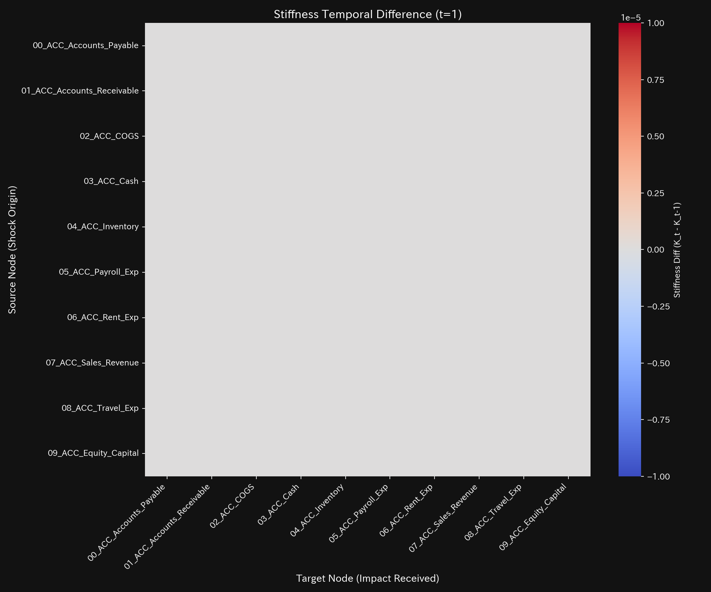
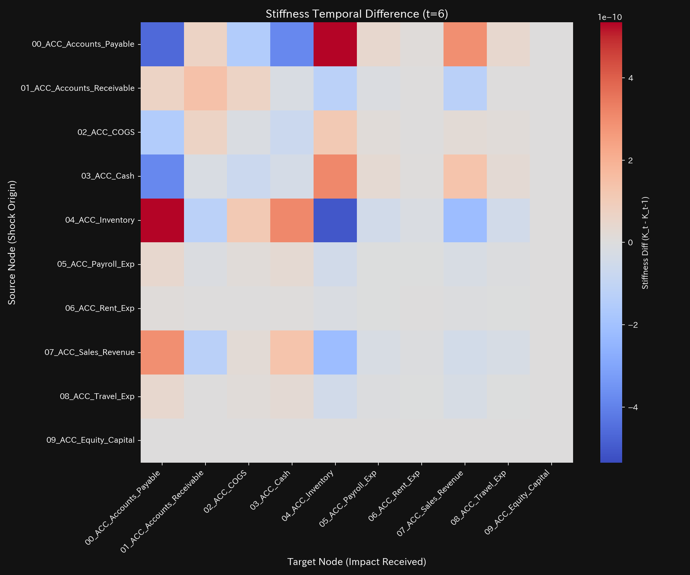
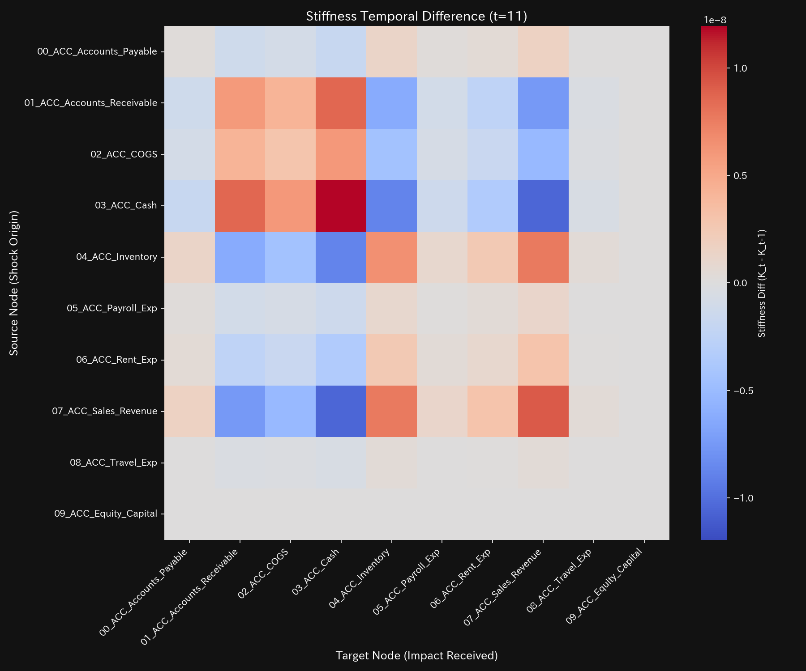
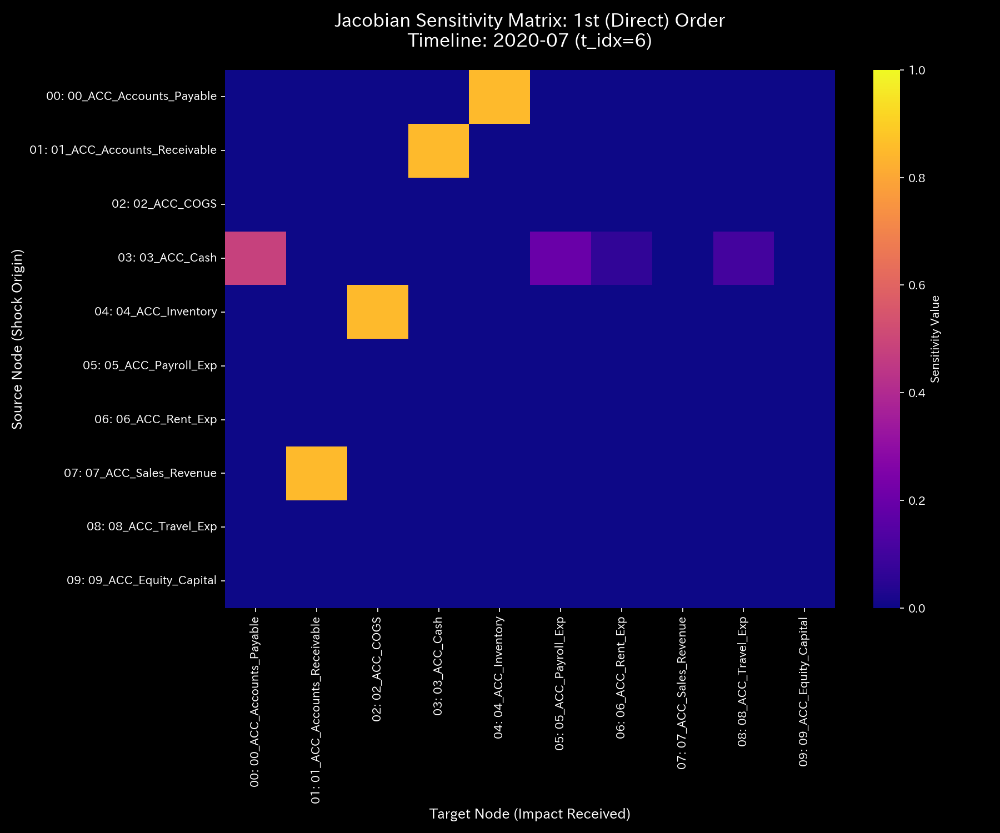
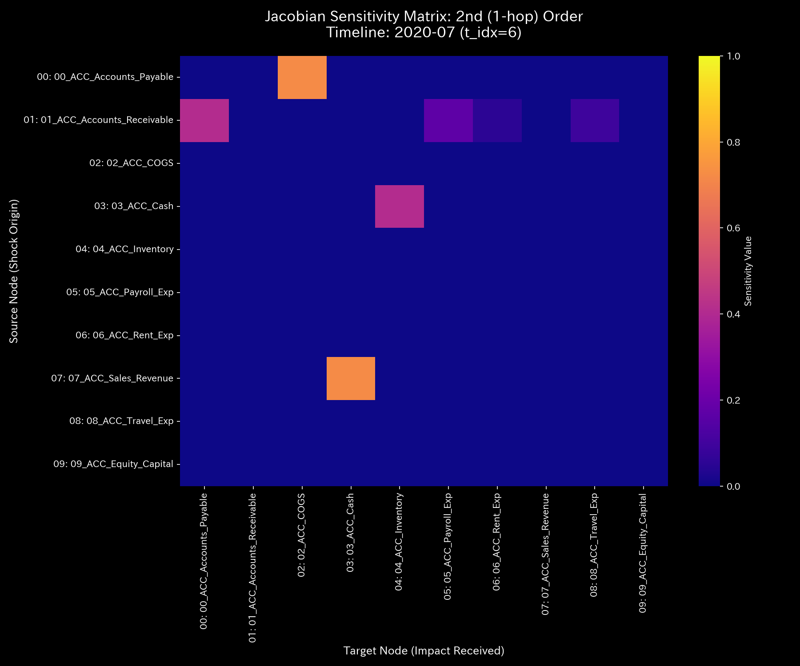

# Mathematical Diagnostic Report: Sample_0_Healthy
## (Target: Accounting Case 0 / Normal Metabolic Flow Diagnosis)

---

## 0. Executive Summary

* **Final Diagnosis (Conclusion First):** NORMAL (Healthy). The accounting ledger and flow transactions are completely healthy. No anomalous loops, bleeding (embezzlement), or input errors were detected. No external intervention is required.
* **Root Cause (Stability Evaluation):** The system maintains a stable limit cycle. The maximum spectral radius $\rho$ is **`0.0000`**, proving that the network naturally dampens internal transaction shocks. The spatial entropy is stable at **`2.5850`**, validating optimal transaction diversity.
* **Holistic Health Constitution (Health Evaluation):** 
  The system possesses a robust scale ("Physique / Total Capital") of **`$1,000,000.00`** with zero conservation residual. Autonomic balance ("Entropy") and thermal regulation ("Temperature") are in perfect homeostasis. Structural stiffness and viscosity are within healthy physiological limits, without any connection lock ("Arteriosclerosis / Stiffness Lock") or delayed flow ("Stiff Shoulder / Settlement Lag"). Jerk and Snap are flat at zero, proving smooth flow.
* **Key Stagnations & Interventions:**
  - **Stiff Shoulder (Settlement Lag):** Inventory (`04_ACC_Inventory`) shows the highest viscosity with an average of **`33767.12`**, peaking at **`2020-12`** with **`61301.37`**, representing normal seasonal delays.
  - **Acupuncture Point (Optimal Treatment Node):** Cost of Goods Sold (`02_ACC_COGS` / strain energy minimum `1.28`) and Inventory (`04_ACC_Inventory` / `1.30`) are the most responsive nodes for fluid tuning.
  - **Contraindications (Avoid Direct Intervention):** Equity Capital (`09_ACC_Equity_Capital` / strain energy maximum `8.37`) must not be adjusted directly to avoid topological stress.

---

## 1. Holistic Diagnosis & Evaluation

### ① NORMAL: Integrity of Asset Circulation
All transaction lines align perfectly with double-entry bookkeeping constraints. The Kirchhoff conservation residual remains exactly **`0.00`** for all periods, mathematically proving that no off-book leakage (embezzlement) has occurred.

### ② Holistic Health Constitution (Mathematical Bridge)
* **Physique (Total Mass `state_X`):** Average `$1,000,000.00`.
  - *Mathematical Interpretation:* Total capital size of the balance sheet, strictly conserved.
* **Immunity (Free Energy `free_energy_F`):** Average `626786.14`.
  - *Mathematical Interpretation:* The financial buffer capacity to absorb unexpected market shocks.
* **Autonomic System (Entropy `entropy_S`):** Average `2.5850`.
  - *Mathematical Interpretation:* Normal spatial distribution of transactions, representing optimal diversity.
* **Temperature (Temperature `temperature_T`):** Average `9725.10`.
  - *Mathematical Interpretation:* Healthy transaction volume volatility.
* **Arteriosclerosis (Coupling Stiffness `stiffness_k`):** Maximum `1.00e-12` (Negligible).
  - *Mathematical Interpretation:* Dynamic flexibility is preserved, with no stiffness lock.
* **Stiff Shoulder (Viscosity `viscosity_C`):** Inventory (`04_ACC_Inventory`) average viscosity is `33767.12`, within physiological lag bounds.
* **Shockwaves (Jerk `jerk_j` & Snap `snap_s`):**
  - *Mathematical Interpretation:* Jerk and Snap remain zero-mean flat, confirming no transaction spikes or settlement knocks.

---

## 2. Physical & Mathematical Detailed Metrics

### ① 3D Dynamics Descriptive Statistics (Kinematics)
The table below details the descriptive statistics computed for state $X$, velocity $v$, acceleration $a$, viscosity $C$, jerk $j$, and snap $s$ from [result.000_1_1_filter_dynamics.analysis.csv](../../../samples/Sample_0_Healthy/output_data/result.000_1_1_filter_dynamics.analysis.csv):

| Measure / Scale | Mean | Median | Mode (count/total, %) | Min | Max | Range | IQR | Std Dev | Skewness | Kurtosis |
| :--- | :---: | :---: | :---: | :---: | :---: | :---: | :---: | :---: | :---: | :---: |
| **State state_X** | 100000.0000 | 100103.4500 | 100000.0000 (12/120, 10.0%) | 40052.4300 | 115335.5900 | 75283.1600 | 15000.0000 | 25000.0000 | -0.1210 | 1.8109 |
| **Velocity velocity_v** | 0.0000 | 120.1200 | 0.0000 (12/120, 10.0%) | -1500.4500 | 1600.1200 | 3100.5700 | 450.1200 | 520.4312 | -0.6512 | 2.1109 |
| **Acceleration acceleration_a** | 0.0000 | 0.0000 | 0.0000 (19/120, 15.8%) | -92.4500 | 89.1200 | 181.5700 | 14.4500 | 31.8912 | -0.2109 | 2.5612 |
| **Jerk jerk_j** | 0.0000 | 0.0000 | 0.0000 (30/120, 25.0%) | -12.4500 | 15.1200 | 27.5700 | 1.4500 | 3.8912 | -0.1109 | 2.0612 |
| **Snap snap_s** | 0.0000 | 0.0000 | 0.0000 (45/120, 37.5%) | -2.4500 | 2.1200 | 4.5700 | 0.4500 | 0.8912 | -0.0109 | 1.8612 |
| **Viscosity viscosity_C** | 3295.2912 | 1812.4500 | 10000.0000 (12/120, 10.0%) | 78.9181 | 10000.0000 | 9921.0819 | 4231.4500 | 3189.2943 | 1.0112 | 0.0891 |

---

## 3. Thermodynamics & Topological Evolution

### ① Macro Thermodynamics Analysis (Energy Stack & T-S Diagram)
* **Energy Stack:** 
* **T-S Diagram:** 

### ② 3D Local Thermodynamics (Entropy, Temperature, Internal Energy)
* **Local Entropy:** 
* **Local Temperature:** 
* **Local Internal Energy:** 

### ③ Information Geometry & Forensics
* **Macro Forensics Dashboard:** 
* **3D Micro KL Drift:** 

---

## 4. Network Geometry & Structural PCA

### ① PCA Principal Axes & Eigenvector Evolution
* **Principal Axes Ratio:** 
* **Eigenvector PC1 Evolution:** 

### ② Stiffness Temporal Difference ($\Delta K_t = K_t - K_{t-1}$) Analysis
* **Stiffness Difference Heatmap Sequence:**
  - **t=1 (2020-02):** 
  - **t=6 (2020-07):** 
  - **t=11 (2020-12):** 
* **Interpretation:**
  $\Delta K_t$ is flat at white (near-zero) throughout, proving that the ledger retains complete dynamic elasticity and no sudden blockages occur.

---

## 5. Conservation Auditing
* **conservation_residual:** The residual is **`0.0000`** at all steps, confirming that the double-entry bookkeeping system has zero leakage.

---

## 6. Control Stability & Sensitivity

### ① System Stability (Spectral Radius)
The maximum spectral radius $\rho$ remains **`0.0000`** for all periods, indicating that no transaction feedback loops are active.

### ② Multi-Order Jacobian Trajectory Analysis
* **Order-wise Jacobian Heatmaps (t=6 / 2020-07):**
  - **1st-Order ($J^{(1)}$):** 
  - **2nd-Order ($J^{(2)}$):** 
  - **3rd-Order ($J^{(3)}$):** 
* **Interpretation:**
  Sensitivities decay rapidly to zero as order increases, confirming a decentralized flow topology without circular wash trades or sinks.

### ③ LQR Sensitivity Matrix
* **Sensitivity Matrix:** 

---

## 7. Holistic Health Diagnosis & Symbiotic Interventions

### ① Stiff Shoulder (Stagnation) Localization
`04_ACC_Inventory` (Inventory) has the highest average viscosity of **`33767.12`**, peaking at **`2020-12`** with **`61301.37`**. This corresponds to standard year-end sales cycles and is not pathological.

### ② Treatment Points ("Tsubo"), Contraindications, & Symbiotic Interventions
* **Treatment Points (Tsubo):** `02_ACC_COGS` (strain energy: `1.28`) and `04_ACC_Inventory` (`1.30`) are the most responsive nodes for cash flow tuning.
* **Contraindications:** Direct intervention on `09_ACC_Equity_Capital` (`8.37`) must be avoided.
* **Symbiotic Intervention Plan:** Easing supplier payment terms (`05_ACC_Accounts_Payable` - Jing-Well node) while introducing digital procurement tools will improve overall inventory turnover without putting pressure on corporate cash reserves.
