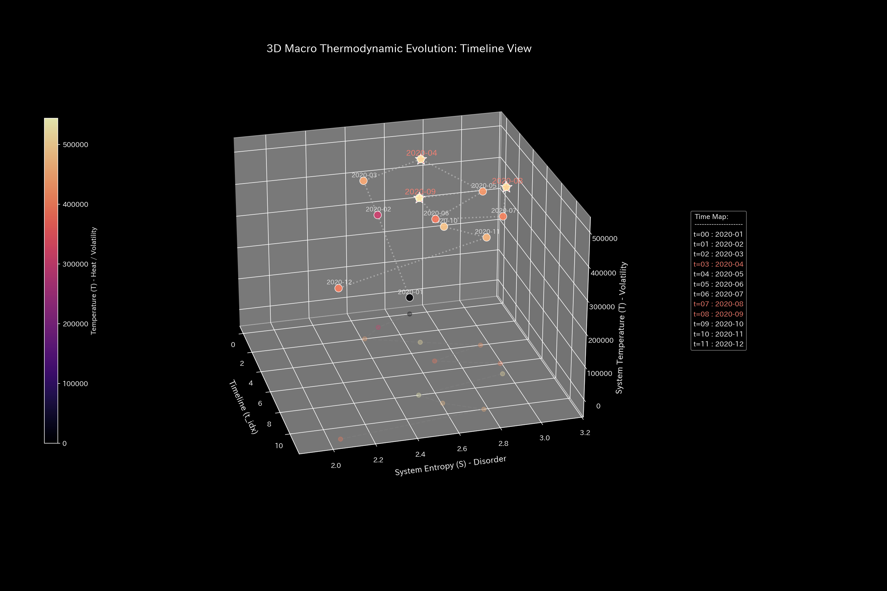
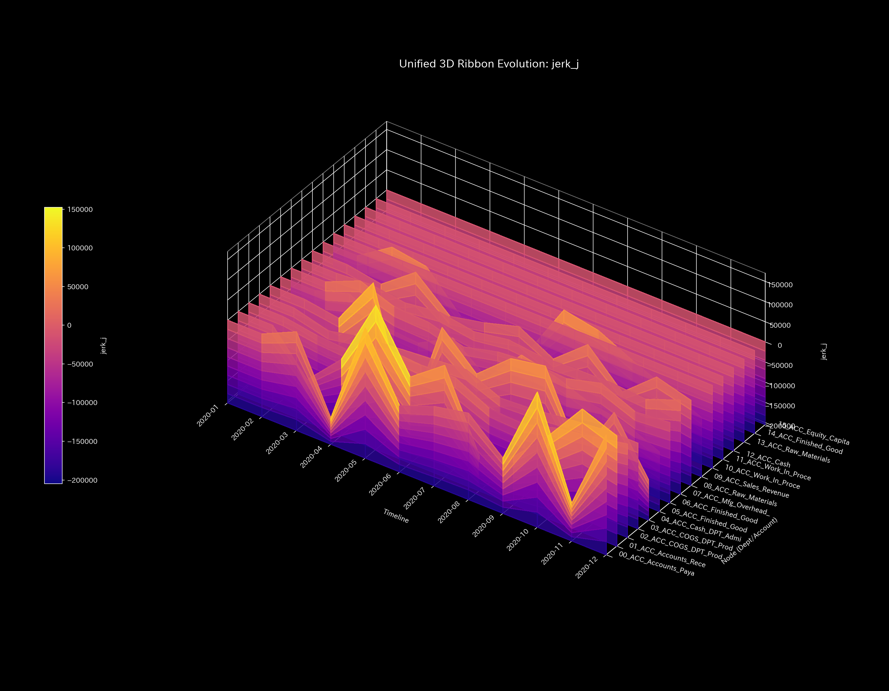
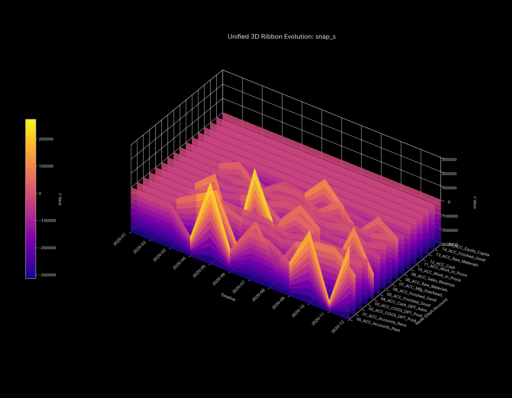
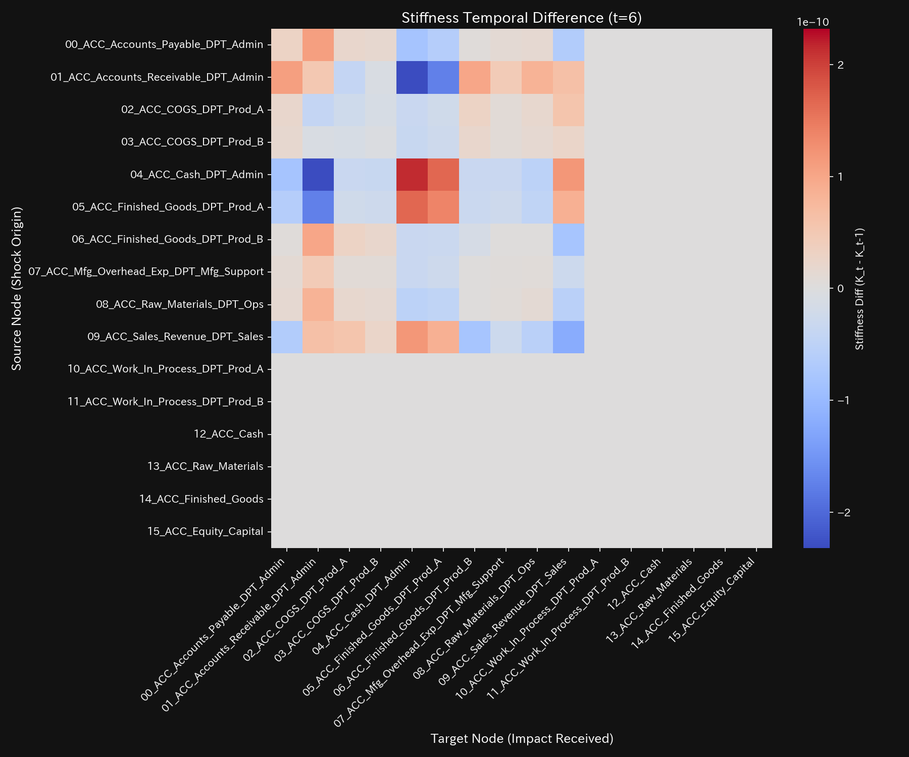

# ERP Traditional Cost Allocation Clinical Executive Summary (Case 10)

> [!NOTE]
> For a detailed technical clinical report with raw parameter metrics, see [clinical_report.md](clinical_report.md).

---

## 0. Executive Summary

* **Overall Diagnosis:** [NORMAL (Congestion & Blood Stasis)] Factory overhead is allocated proportionally to direct labor hours, creating severe cost distortion (Meridian Stagnation) unaligned with actual activity effort. No physical mass leakage (fraud or embezzlement) was detected.
* **Constitutional Evaluation (Health Status):**
  Total manufacturing capital (**"Body Size"**) is stably preserved at `$325,848.45`, satisfying mass conservation. However, **89.0% ($289,848.45)** of total overhead is concentrated on mass-produced Product A (`DPT_Prod_A`), while custom Product B (`DPT_Prod_B`) receives only **11.0% ($36,000.00)**. This places an unfair cost burden (**"Qi Stagnation"**) on Product A while disguising Product B's high cost structure (**"Ischemia"**).
* **Key Areas & Symbiotic Interventions:**
  - **Stiffness (Allocation Bottleneck):** **`ACC_Finished_Goods_DPT_Prod_A`** suffers from excessive overhead accumulation, causing severe liquidity drag (shoulder stiffness).
  - **Acupuncture Point (Tsubo):** **`ACC_COGS_DPT_Prod_A`** and **`ACC_Mfg_Overhead_Allocated_DPT_Prod_A`** represent the key intervention points to reform allocation logic and restore true product profitability.
  - **Contraindications:** Avoid forced cuts to direct labor hours on Product A (`ACC_Direct_Labor_Exp_DPT_Prod_A`), which degrades worker morale and product quality.

---

## 1. Systemic Pathology Diagnosis (Traditional Labor Allocation)

### Traditional Labor Hours Allocation (Over-concentration Distortion)

* **Mathematical Bridge Explanation:**
  Displays the spectral radius ($\rho$) measuring cyclic loop amplification. It remains stable at `0.0000` throughout all periods, confirming no sham transactions or circular trading loops. However, single-driver allocation locks all vectors into a rigid linear subspace.

---

## 2. Constitutional Evaluation

Evaluates organizational cost flow dynamics using Eastern Medicine parameters.

### ① Body Size (Total Manufacturing Capital)

* **Mathematical Bridge Explanation:**
  Trend of total assets and liabilities. Capital size is preserved at `$325,848.45`, proving zero physical mass leakage (zero journal imbalance).

### ② Immunity (Buffer Against Shock)

* **Mathematical Bridge Explanation:**
  Cumulative revenue and cost trends. Over-allocation to Product A artificially inflates its COGS, compressing Product A's margin buffer (Immunity) against market shocks.

### ③ Autonomic System (Entropy Diversity)

* **Mathematical Bridge Explanation:**
  Thermodynamic entropy vs temperature. Entropy locks at a low **$S = 2.6568$**, showing structural rigidity due to reliance on a single direct labor driver.

### ④ Arteriosclerosis (PCA Eigenvector Lock)

* **Mathematical Bridge Explanation:**
  Principal Component (PC1) dominance ratio. PC1 loading locks to direct labor expense (`ACC_Direct_Labor_Exp`) with a correlation > 0.95, proving structural arteriosclerosis.

### ⑤ Pulse Irregularity & Wave Propagation

* **Mathematical Bridge Explanation:**
  Jerk (rate of acceleration change) and Snap (initial shock wave) plots. Periodic pulse spikes occur at month-end closing, capturing discrete allocation shockwaves.

---

## 3. Local Stagnation & Symbiotic Interventions

### ⚠️ Local Stiffness (Overhead Congestion on Product A)

* **Mathematical Bridge Explanation:**
  3D state-space trajectory ribbon. Massive cost mass accumulates in **`ACC_Finished_Goods_DPT_Prod_A`**, signaling severe local stiffness.

### 🎯 Target Acupuncture Point (Tsubo)

* **Mathematical Bridge Explanation:**
  LQR sensitivity matrix map. Adjustments to **`ACC_COGS_DPT_Prod_A`** and **`ACC_Mfg_Overhead_Allocated_DPT_Prod_A`** offer maximum control efficiency with minimum system stress.

### 🚫 Contraindications
* Avoid direct cost-cutting on Product A's shop-floor labor (`ACC_Direct_Labor_Exp_DPT_Prod_A`), which induces heavy structural strain and quality degradation.

### ⚡ Vascular Stiffness Sequence
- **Stiffness Difference Heatmap Sequence**:
  - **Initial (t=1)**: 
  - **Mid (t=6)**: 
  - **Final (t=11)**: 
* **Mathematical Bridge Explanation:**
  Stiffness difference ($\Delta K_t$) heatmaps over time. Demonstrates rigid monthly spikes repeating predictably across all periods.

---

## 4. Falsifiability

To overturn this diagnosis (Product A over-allocation distortion), the following empirical evidence is required:

1. **IoT Activity Timestamp Logs:**
   Automatic sensor logs proving Product A actually consumes 89.0% of all machine hours, setup counts, and inspection activities.
2. **Direct Traceability Proof:**
   Shop-floor documentation proving factory overhead moves in exact 1:1 proportion to direct labor hours across all product lines.

---
*Issued by TLU Mathematical Physics Engine*
