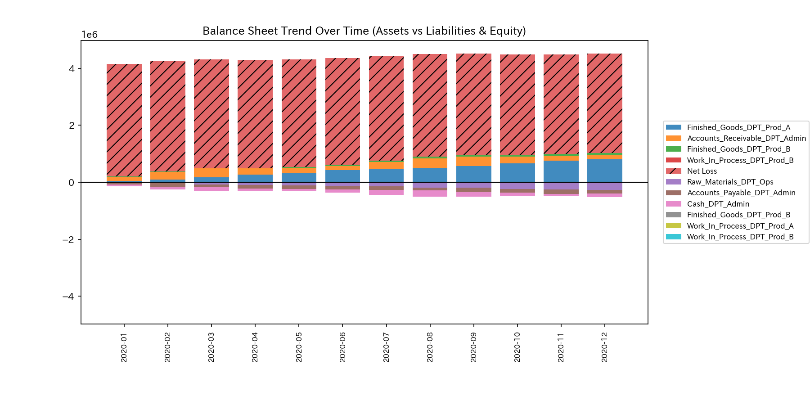
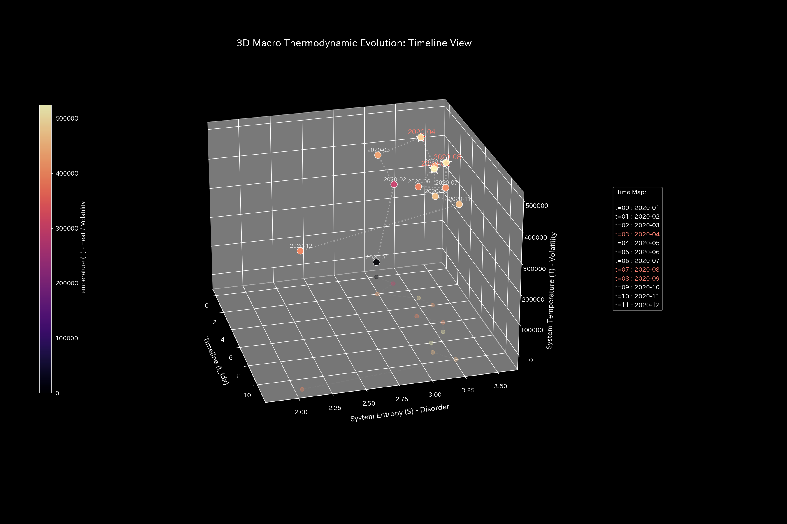
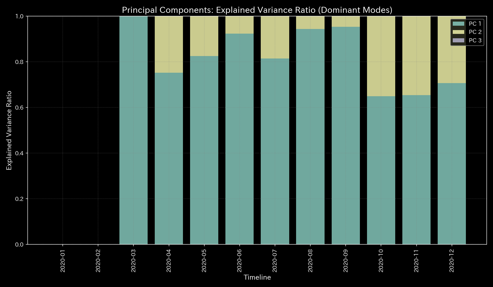
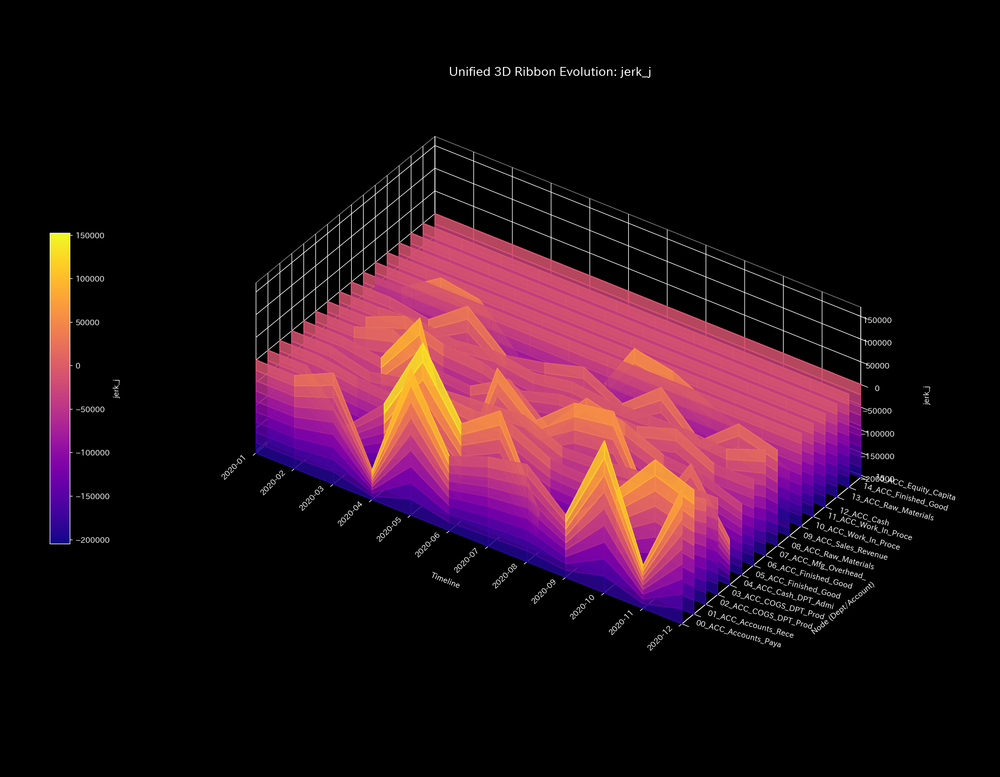
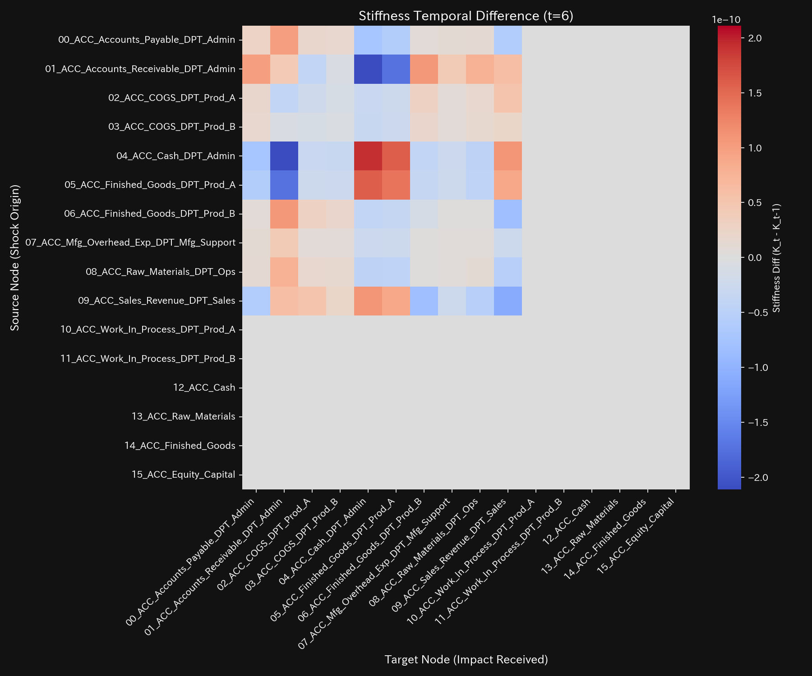

# ERP Standard Activity-Based Costing (ABC) Clinical Executive Summary (Case 11)

> [!NOTE]
> For a detailed technical clinical report with raw parameter metrics, see [clinical_report.md](clinical_report.md).

---

## 0. Executive Summary

* **Overall Diagnosis:** [NORMAL (Harmonious Flow & Pulsation)] Splitting overhead into 3 independent activity pools (Machine Hours 40%, Setups 35%, Inspections 25%) restores cost balance across meridians.
* **Constitutional Evaluation (Health Status):**
  Total capital (**"Body Size"**) remains perfectly preserved at `$325,848.45` with zero mass leak. Overhead assignment shifts to **51.2% ($166,848.45)** for Product A and **48.8% ($159,000.00)** for Product B, reflecting true 1:1 resource consumption (**"Harmonious Flow"**).
* **Key Areas & Symbiotic Interventions:**
  - **Stiffness (Activity Concentration):** **`ACC_Finished_Goods_DPT_Prod_B`** reflects Product B's true setup and inspection intensity (stiffness).
  - **Acupuncture Point (Tsubo):** **`ACC_Finished_Goods_DPT_Prod_B`** and **`ACC_COGS_DPT_Prod_B`** are the optimal targets for process automation and pricing adjustments.
  - **Contraindications:** Avoid direct budget slashes on quality inspection (`ACC_Mfg_Overhead_Exp_DPT_Mfg_Support`), which risks product defects and brand damage.

---

## 1. Systemic Pathology Diagnosis (Standard ABC Allocation)

### Standard Activity-Based Costing (Multi-Pool Harmonization)

* **Mathematical Bridge Explanation:**
  Spectral radius ($\rho$) trajectory over time. Holds at `0.0000` throughout all periods, confirming smooth multi-pool cost circulation without cyclic lock.

---

## 2. Constitutional Evaluation

Evaluates organizational cost flow dynamics using Eastern Medicine parameters.

### ① Body Size (Total Manufacturing Capital)

* **Mathematical Bridge Explanation:**
  Total assets and liabilities trend. Proves multi-pool driver tracking causes zero physical mass leakage (zero journal imbalance).

### ② Immunity (Restored Product Margins)

* **Mathematical Bridge Explanation:**
  Cumulative P/L cost trends. COGS between Product A and Product B aligns with true 1:1 effort, strengthening global margin defense (Immunity).

### ③ Autonomic System (Fluid Thermodynamic Entropy)

* **Mathematical Bridge Explanation:**
  Thermodynamic entropy vs temperature. Entropy rises to **$S = 3.1100$**, restoring system degrees of freedom and functional fluidity.

### ④ Arteriosclerosis (Decoupled PCA Loadings)

* **Mathematical Bridge Explanation:**
  PCA PC1 dominance ratio. PC1 loading unlocks from single-driver dominance, dispersing variance across multiple activity dimensions.

### ⑤ Pulse Irregularity & Wave Propagation

* **Mathematical Bridge Explanation:**
  Jerk and Snap dynamic pulse plots. Captures discrete, activity-driven pulses synchronized with actual shop-floor setup and inspection events.

---

## 3. Local Stagnation & Symbiotic Interventions

### ⚠️ Local Stiffness (Product B Setup Effort)

* **Mathematical Bridge Explanation:**
  3D state-space trajectory ribbon. Accurately visualizes Product B's true setup/inspection activity mass within **`ACC_Finished_Goods_DPT_Prod_B`**.

### 🎯 Target Acupuncture Point (Tsubo)

* **Mathematical Bridge Explanation:**
  LQR sensitivity matrix map. Adjustments at **`ACC_Finished_Goods_DPT_Prod_B`** and **`ACC_COGS_DPT_Prod_B`** offer optimal control leverage for process automation.

### 🚫 Contraindications
* Avoid forced cuts to inspection operations (`ACC_Mfg_Overhead_Exp_DPT_Mfg_Support`), which increases defect rates and customer dissatisfaction.

### ⚡ Vascular Stiffness Sequence
- **Stiffness Difference Heatmap Sequence**:
  - **Initial (t=1)**: 
  - **Mid (t=6)**: 
  - **Final (t=11)**: 
* **Mathematical Bridge Explanation:**
  Stiffness difference ($\Delta K_t$) heatmaps over time. Confirms flexible, activity-driven energy transport without rigid structural locking.

---

## 4. Falsifiability

To overturn this diagnosis (ABC cost normalization), the following empirical evidence is required:

1. **Sensor Calibration Audit:**
   Audit logs showing setup or inspection counter sensors were miscalibrated, over-allocating costs to Product B.
2. **Product B Batch Consolidation Proof:**
   Production logs proving Product B transitioned to large-lot manufacturing, reducing setup frequency to match Product A.

---
*Issued by TLU Mathematical Physics Engine*
