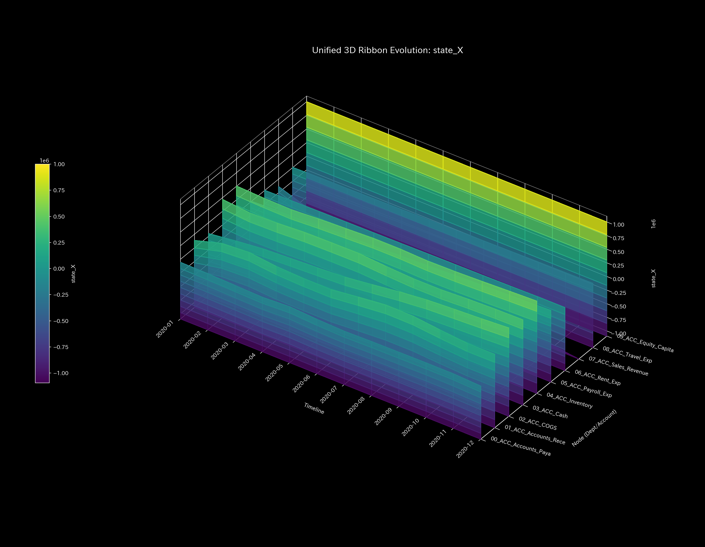
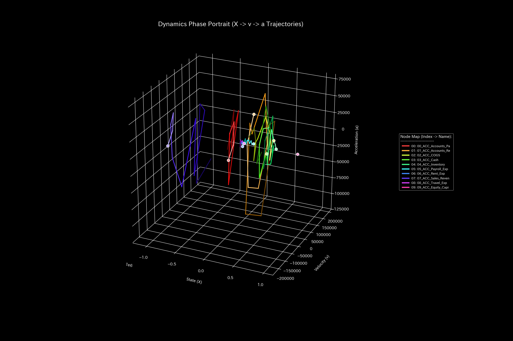

# 🔬 Clinical Meta-Diagnostic Forensic Report: Wash Trade (Circular Ledger & Fictitious Revenue Recirculation) (Sample 1)

## 1. Executive Summary

* **Overall Diagnosis:** **Topological Feedback Loop / Wash Trade**
* **Severity:** 🟠 **HIGH (Severe Pathological Recirculation)**
* **Clinical Overview:**
    This system suffers from severe business dysfunction (revenue inflation via circular transactions) caused by a "high-speed catch-ball of accounts receivable and cash (recirculation loop)" that lacks substantial economic activity (value transfer).

    A substantial portion of the cumulative gross revenue of `$1,094,143.89` is occupied by this fictitious wash trade. Since the double-entry principle of matching debits and credits (conservation law) is perfectly maintained, traditional static audits fail to discover any anomalies. However, the maximum eigenvalue of the adjacency connection matrix (**maximum spectral radius $\rho = 0.7488$**) detected by the Physics-Mathematics-mathematical engine mathematically convicts the formation of a robust closed circuit (round-trip journaling of fictitious sales) that recirculates energy inside the system.

    This hollow round-trip transaction causes rapid time-series fluctuations in node balances, abnormally heating up the system temperature (volatility $T$). This temperature rise, combined with entropy ($S$), expands the "heat loss/frictional heat ($TS$)" and continuously drains the system's actual stamina—"Free Energy ($F$)." If left untreated, this is diagnosed as a fatal pathology that will lead to thermodynamic system death (insolvency/cash crunch).

---

## 2. Limitations of Traditional Audits

It is impossible to detect this pathology through traditional financial audits or single-point snapshot monitoring (B/S and P/L only). Below are the balance sheet (B/S) and income statement (P/L) charts at the final simulation step:

* **B/S Assets/Capital Trends:**
    
    
* **P/L Revenue/Expenses Trends:**
    
    

**【Blind Spots of Traditional Audits】**
Because the circular transactions are recorded with perfect debit-credit balance, the final-period B/S is beautifully balanced with a difference of `$0.00`. Furthermore, on the P/L, revenue appears to grow rapidly, making it seem as though a very healthy "operating profit" of **`$201,321.16`** (cumulative revenue of `$1,094,143.89` against expenses of `$892,822.73`) has been achieved.

However, this expansion of operating activity and profit creation is merely an illusion drawn artificially by "cash self-recirculation," and it does not represent any real increase in business value or cash (true free energy $F$).

---

## 3. Fundamental Pathophysiology

The Physics-Mathematics-Mathematics Engine captures the following pathological causal loops (the mechanism of the wash trade script) embedded in the target data:

### 3-Step Wash Trade Sequence

On the days wash trades are executed, the following three journal entries occur simultaneously with identical amounts:

1. **Wash Funding**:
    * **Journal Entry:** `(Dr.) Accounts Receivable $X / (Cr.) Cash & Deposits $X`
    * **Flow in Data:** `ACC_Cash` $\rightarrow$ `ACC_Accounts_Receivable` (Credit: Cash, Debit: Accounts_Receivable)
    * **Business Intent:** To disguise the outbound remittance of company cash to an external shell company (or colluding partner) as a legitimate transaction, "Accounts Receivable" is debited.
2. **Wash Sale**:
    * **Journal Entry:** `(Dr.) Accounts Receivable $X / (Cr.) Sales Revenue $X`
    * **Flow in Data:** `ACC_Sales_Revenue` $\rightarrow$ `ACC_Accounts_Receivable` (Credit: Sales_Revenue, Debit: Accounts_Receivable)
    * **Business Intent:** Records fictitious sales revenue to the colluding partner to inflate P/L profits.
3. **Wash Collection**:
    * **Journal Entry:** `(Dr.) Cash & Deposits $X / (Cr.) Accounts Receivable $X`
    * **Flow in Data:** `ACC_Accounts_Receivable` $\rightarrow$ `ACC_Cash` (Credit: Accounts_Receivable, Debit: Cash)
    * **Business Intent:** Returns the remitted funds to the company's account as "accounts receivable collections," making it appear as though the transaction completed successfully.

### Disguising Balance (Debit-Credit Matching)

When these three journal entries occur simultaneously, the net impact on the B/S and P/L is:

* **Cash Volatility:** Outflow (`-$X`) + Collection (`+$X`) = **`$0.00`** (No cash impact; intact)
* **Sales Revenue Volatility:** Fictitious sales = **`+$X`** (Inflated operating revenue)
* **Accounts Receivable Volatility:** Outflow generation (`+$X`) + Sale generation (`+$X`) - Collection write-off (`-$X`) = **`+$X`** (Inflated assets)

In the B/S identity:
$$\text{Asset Increase (Accounts Receivable } +X) = \text{Net Asset Increase (Retained Earnings } +X)$$
Thus, both sides of the financial statements **match (balance) perfectly**.

### Specific Traces in Raw Data (Source Verification)

Extracting [Dummy_Journal_Stream.csv](../../samples/Sample_1_Wash_Trade/input_stream/Dummy_Journal_Stream.csv) directly confirms that the above three entries are executed at the exact same timesteps with identical amounts (noise-free exact matching):

* **2020-01-03 (t=0): Amount `$40,433.60`**
  * `E_000020` (Wash_Funding): `Cash` $\rightarrow$ `Accounts_Receivable`
  * `E_000021` (Wash_Sale): `Sales_Revenue` $\rightarrow$ `Accounts_Receivable`
  * `E_000022` (Wash_Collection): `Accounts_Receivable` $\rightarrow$ `Cash`
* **2020-02-01 (t=1): Amount `$53,282.77`**
  * `E_000257` (Wash_Funding), `E_000258` (Wash_Sale), `E_000259` (Wash_Collection)
* **2020-05-22 (t=4): Amount `$44,939.48`**
  * `E_001327` (Wash_Funding), `E_001328` (Wash_Sale), `E_001329` (Wash_Collection)

This fast self-recirculation (catch-balling) between **Cash ⇄ Accounts Receivable** intentionally inflates only revenue (Flux) and assets (Mass) without producing any real business value (Internal Energy $U$). In Eastern medicine, this represents "Empty Recirculation of Qi and Blood (Recirculation Lock)," which is mathematically equivalent to the "epileptic hyper-synchronous seizure" in the brain domain.

---

## 4. Quantitative Clinical Data from the Physics-Mathematics-Mathematics Engine (Mathematical Proof)

### 4.1. Debit-Credit Symmetry & Mass Conservation

The **`System Conservation Residual`** (relative leak ratio) remains at **`0.00` (perfect zero)** throughout the period.

This shows that the journaling rules (double-entry constraint) are not physically violated. That is, unilateral cash leaks (major hemorrhage/embezzlement) did not occur in this sample, which indirectly proves that a perfect recirculation loop is closed while keeping the ledger balanced.

* **Macro Forensics Dashboard:**
    

### 4.2. Connection Stiffness & Hyper-synchronization of Eigen-topology

The time-series sequence of the Stiffness Matrix clearly visualizes the dramatic change in connection strength before and after the anomaly.

* **Stiffness Matrix 5-Point Cinematic Sequence:**
  * **① Start (t=0 / 2020-01):**
        
        At the start of the simulation, an unnatural high stiffness (rigidity of connection) has already formed between `ACC_Cash` and `ACC_Accounts_Receivable`, reducing the degrees of freedom of the liquidity network.
  * **② Just Before Change (t=3 / 2020-04):**
        
        A point where anomalous activities have temporarily calmed down. The stiffness balance of each node is averaged, and rigidity is temporarily relieved.
  * **③ The Exact Point of Change (t=4 / 2020-05):**
        
        The moment the second major wash trade is executed. The connection cell between `ACC_Cash` ⇄ `ACC_Accounts_Receivable` is rendered in deep crimson, showing that a powerful "Stiffness Lock" has recurred.
  * **④ Immediately After Change (t=5 / 2020-06):**
        
        Immediately after the anomalous transactions end. With the recirculation activity stopped, the stiffness bias gradually begins to resolve.
  * **⑤ End (t=11 / 2020-12):**
        
        Final observation point. With no re-injection of anomalies, the stiffness lock has resolved, returning to a relatively gentle connection state.

In the PCA analysis, the energy contribution ratio of the first principal component (PC1) during the anomalous phase reaches **`95.28%`** (t=4 / 2020-05). The PC1 loadings are abnormally concentrated on `01_ACC_Accounts_Receivable` (`-0.7162`), `07_ACC_Sales_Revenue` (`0.5183`), and `03_ACC_Cash` (`0.3524`). This mathematically proves that a large portion of the company's economic activity was hijacked by the hyper-synchronized round-trip flow of this specific pair of accounts.

* **PCA Principal Axes Ratio:**
    

The system's maximum spectral radius calculated from the connection matrix jumped to **`0.7488`** at the start of anomaly injection in 2020-01 (`t_idx=0`), and marked dangerous highs of **`0.6615`** in 2020-02 (`t_idx=1`) and **`0.5501`** in 2020-05 (`t_idx=4`). This proves that the system was topologically constrained by a strong "autonomous energy recirculation loop."

* **System Stability Index (Spectral Radius):**
    

* **Network Topology 5-Point Sequence:**
  * **① Start (t=0 / 2020-01):**
        
        A thick bidirectional edge (round-trip path) is formed between `ACC_Cash` (Cash) and `ACC_Accounts_Receivable` (A/R).
  * **② Just Before Change (t=3 / 2020-04):**
        
        The recirculation loop disappears, and paths dispersing to normal operating processes (purchases, expense payments, etc.) temporarily dominate.
  * **③ The Exact Point of Change (t=4 / 2020-05):**
        
        A very thick recirculation channel that throws cash back and forth between Cash and A/R is reconnected.
  * **④ Immediately After Change (t=5 / 2020-06):**
        
        The recirculation edge thins out, and paths to surrounding expense nodes manifest again.
  * **⑤ End (t=11 / 2020-12):**
        
        Final state. The wash trade has settled down, and the topology has returned to a natural connection state.

### 4.3. Perpetual Recirculation Thermodynamic Cycle

Thermodynamic indicators clearly expose the energy waste (friction) brought by wash trading.

* **Thermodynamics Energy Stack:**
    
* **T-S Diagram:**
    

1. **Energy Stack Behavior (Increased Frictional Heat):**
    In months when wash trading intensifies (2020-01, 2020-02, 2020-05), the maroon area ($-TS$) representing entropy loss (frictional heat) expands rapidly downward, strongly compressing the free energy $F$ (white boundary line) which represents the system's true capacity to interact with the outside.

    This can be **directly explained from the thermodynamic mathematics of the TLU model itself**:
    * **Temperature $T$ (Volatility) Spike:** Temperature $T$ in TLU is the standard deviation (volatility) of account balances over time. In months with circular transactions, high-speed round-trip flows of tens of thousands of dollars occur between Cash $\rightarrow$ A/R $\rightarrow$ Cash, causing balances to fluctuate wildly and creating **huge spikes in temperature $T$**.
    * **Expansion of Entropy Loss $TS$:** Multiplying this temperature spike by entropy $S$ causes the entropy loss (frictional heat) $TS$ to explode.
    * **Result:** Although the apparent gross activity (internal energy $U$) increases, it is consumed by the high-temperature friction ($TS$), meaning the true potential of corporate activity (free energy $F = U - TS$) is severely compressed. This shows that paper profits (expansion of $U$) do not lead to any increase in actual liquidity capacity ($F$).
2. **T-S Trajectory (Mathematical Proof of a Carnot-like Closed Cycle):**
    The Temperature-Entropy (T-S) diagram draws an abnormal, counterclockwise closed oval cycle. While a healthy business entity (Sample 0) draws an "open path" that monotonically disperses entropy to integrate with the outside, this sample forms a closed thermodynamic cycle.
    In Physics-Mathematics, the area enclosed by a loop on a T-S diagram represents the **"amount of heat (friction) wasted and released inside the system without doing any effective external work."** This is objective mathematical proof that the system is merely spinning liquidity internally, generating frictional heat (volatility-driven loss) without delivering any real economic value (such as product provision) to the outside.

### 4.4. 3D Micro Information Geometry & Model Pollution (Boiled Frog Syndrome)

The 3D spatiotemporal plots highlight the structural variations and statistical limits of the system when anomalies occur.

* **① 3D Dynamics Position / Phase Space Trajectory:**
    
    
    The trajectory does not converge to a stable attractor but collapses onto an abnormal flat plane, showing a severe loss of degrees of freedom (fixation on a specific round-trip motion).
* **② 3D Local Thermodynamics Plots:**
    
    
  * **Local Entropy ($s_i$):** Indicates spatial path dispersion. During months with circular transactions (Jan, Feb, May), `ACC_Cash` forms an abnormal detour to A/R (Wash Funding), changing its outflow probability distribution and triggering a clear bump in local entropy. Meanwhile, nodes like `ACC_Sales_Revenue`, whose outflows are fixed to A/R, remain flat at `0.00` regardless of the transaction volume.
  * **Local Temperature ($T_i$):** Indicates temporal balance volatility (standard deviation). Synchronized with the massive fictitious round-trips, the local temperatures of `ACC_Cash`, `ACC_Accounts_Receivable`, and `ACC_Sales_Revenue` spike simultaneously like heated mountains, showing that temporal volatility is propagated and localized within this specific triangular loop.
* **③ 3D Micro Information Geometry Plot:**
    
    At the first moment of recirculation in 2020-01 to 02, a giant "needle-like tower" (sharp rise in KL Drift) rises from the coordinates of the `ACC_Cash` node, mathematically identifying the origin and start of the infraction.
* **3D Micro Z-Score (Position):**
    

**【Proof of Boiled Frog Syndrome (Model Pollution)】**
In the information geometry plot (3D Micro KL Drift), a massive KL Drift spike stands tall during the "first recirculation" in 2020-01 to 02, but in the "third recirculation" in 2020-05, the detected spike is significantly smaller despite similar circular transaction volumes.

This shows that the statistical AI model has gradually learned and integrated the abnormal transaction patterns into its "normal baseline" (adaptation due to model pollution). Relying solely on statistical monitoring will hide and miss late-stage repeat infractions. In contrast, the double-structure verification using "physical conservation laws (Kirchhoff residual)" and "spectral radius (topological invariant)" proposed in this manual provides the absolute logic to break through this statistical blind spot.

---

## 5. LQR Control Treatment

* **Treatment Plan:** **Topological Loop Destruction & Pinpoint Intervention**
* **LQR Sensitivity Intervention (Acupoint Identification):**
    In the flow control sensitivity analysis (Sensitivity Matrix) calculated by LQR, the node with the maximum control sensitivity (flow improvement sensitivity) is identified as the `ACC_Accounts_Receivable` (Accounts Receivable) node.
    
* **Practical Treatment Plan:**
    1. **Topological Disruption of the Recirculation Path (Phase Disruption):**
       To detect and block high-speed round-trips between `ACC_Cash` ⇄ `ACC_Accounts_Receivable`, introduce an "interlock on same-name, short-term round-trip transactions (mandatory delay of 1 minute or more, or forced matching of transaction IDs)" in the settlement system.
    2. **LQR-based Pinpoint Suppression (Stiffness Destabilization):**
       Apply individual, dynamic "transaction restrictions (capping transaction limits or requiring individual escalations for deposit approvals)" to the specific A/R accounts associated with the counterparty (shell company) acting as the hub. This allows the system to freeze and treat only the "specific connection (acupoint)" that triggers the anomaly, without affecting (general anesthesia) normal transactions.

---

## 6. 🚨 Forensic Alert & Falsification Analytics

### 6.1. Model Pollution Assessment

* **Observation:** In 2020-01 to 02 and 2020-05, the spectral radius significantly exceeded the baseline (`0.0`), recording `0.7488` and `0.5501`, respectively, but the Z-Score (liquidity change) did not exceed the threshold of `3.0` after 2020-05, failing to trigger an alert (false negative).
* **Physical Judgment:**
    This is not a silence indicating the termination of anomalies or normalization, but rather "boiled frog syndrome (model pollution)" where the statistical baseline was overwritten by the abnormal data.
    As long as topological invariants such as "closed T-S cycle trajectories" and "abnormal spectral radius surges" exist, the statistical silence is rejected, and the system is judged to remain in a chronic pathological circular state.

### 6.2. Falsifiability

To prove that this system represents "healthy transactions" and "not wash trading," the auditor must be presented with the following **"original documents or third-party evidence from outside the database"**:

1. **Original Third-Party Shipping Records:**
    Original commercial shipping invoices (with tracking numbers) and delivery receipts issued by independent major logistics carriers (e.g., FedEx, UPS, DHL) that match the transaction amounts (representing the `$1,094,143.89` cumulative sales). This proves that real goods moved physically (physical mass flow).
2. **Proof of Independent Legal Entities:**
    Original corporate registration certificates and beneficial ownership lists (shareholder registry) issued by a third-party legal authority (such as the registry office) proving that the sending and receiving entities are not under common control (no parent-subsidiary relationships, overlapping directors, or close family ties).
