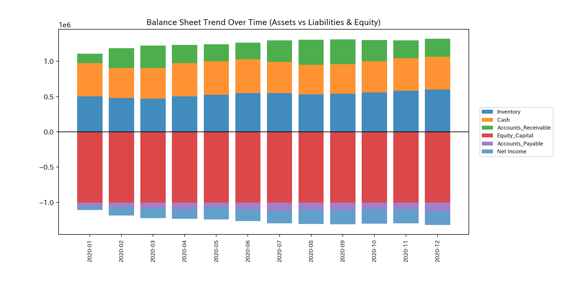
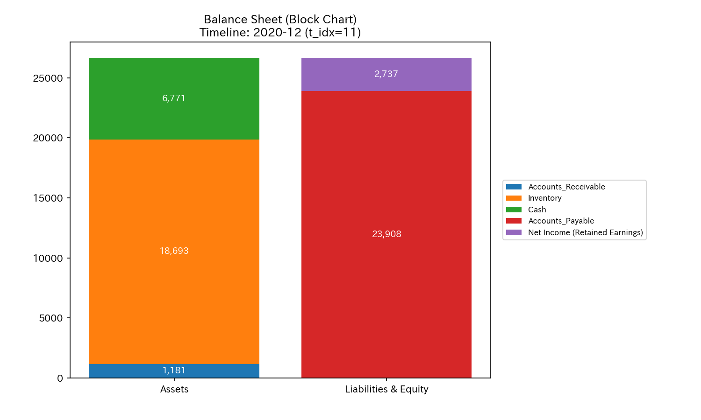
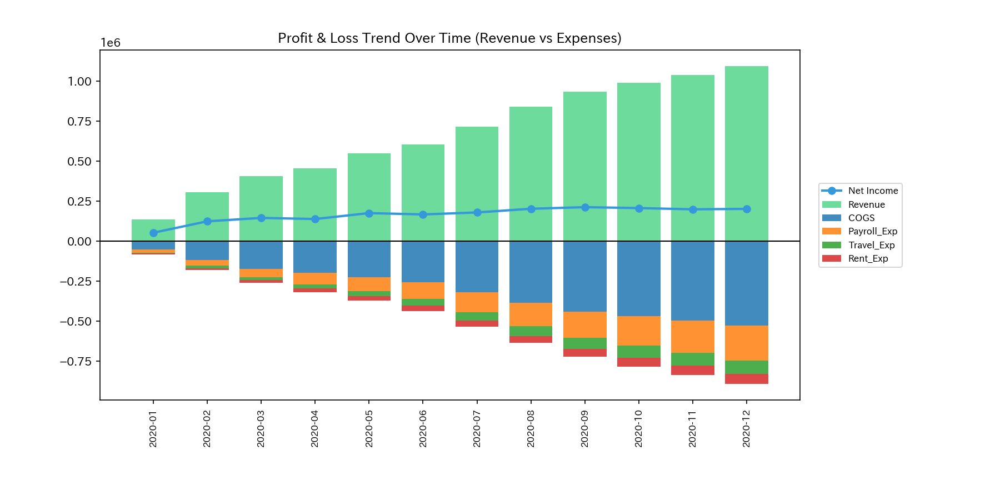
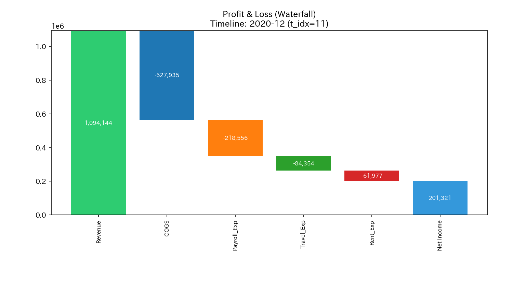
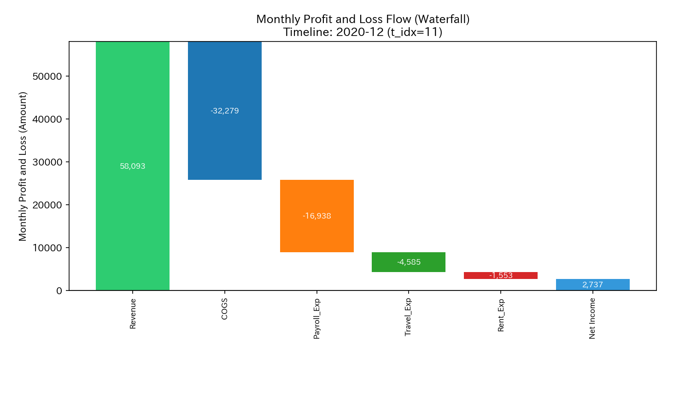
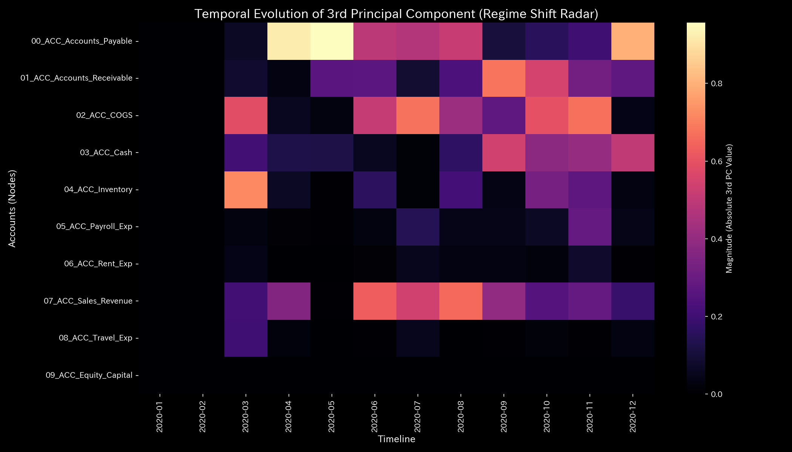
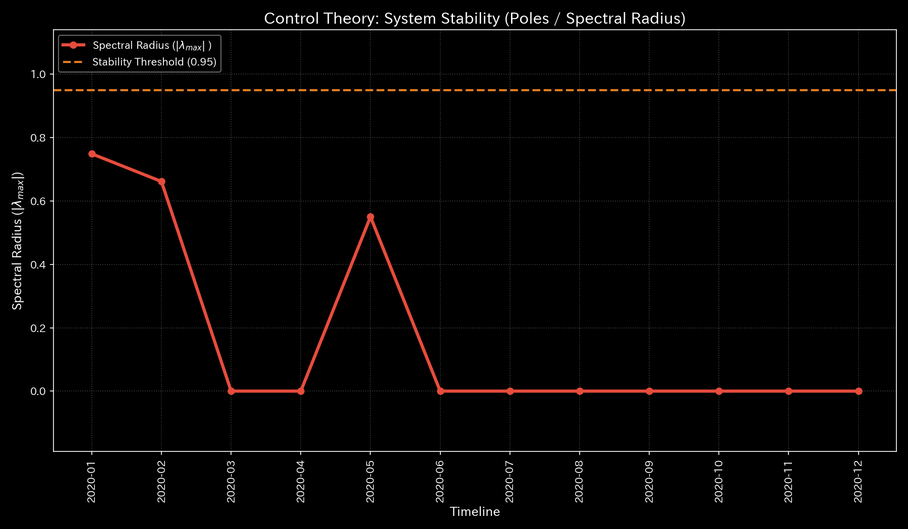
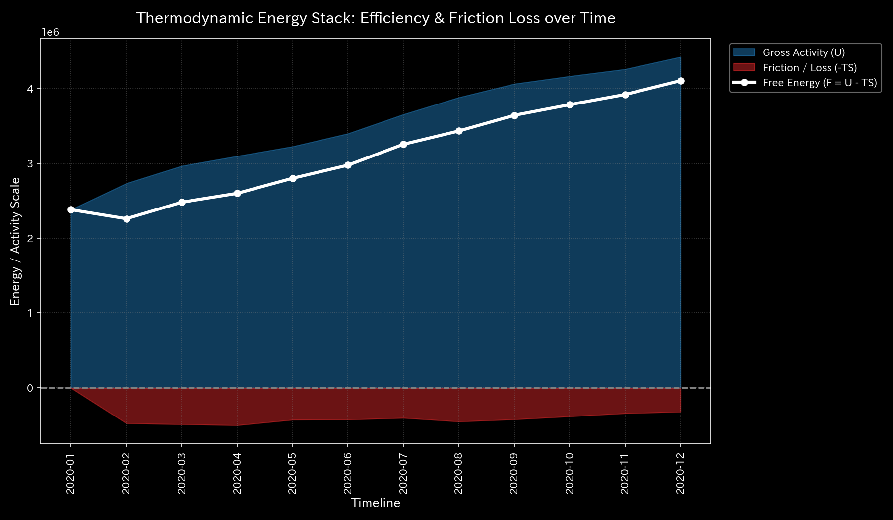

# 🔬 Clinical Forensic Report: Wash Trade (Circular Self-Reflux Loop) (Sample 1)

## 1. Executive Summary

* **Diagnosis:** **Topological Circulation Failure (Wash Trade / Self-Reflux Loop)**
* **Severity:** 🟠 **HIGH (Severe Capital Circulation Failure)**
* **Anomaly Period and Amount (Journal Ledger Verified):**
  * **2020-01-03 (t=0)**: Amount **`$40,433.60`** (Journal IDs: `E_000020` to `E_000022`)
  * **2020-02-01 (t=1)**: Amount **`$53,282.77`** (Journal IDs: `E_000257` to `E_000259`)
  * **2020-05-22 (t=4)**: Amount **`$44,939.48`** (Journal IDs: `E_001327` to `E_001329`)
* **Clinical Summary:**
  Circular trades (inflated sales) occur through funds passing between cash and accounts receivable. The double-entry bookkeeping principle (conservation law) is maintained, making this anomaly undetectable with traditional auditing (such as static trial balances). The physics analysis engine identified the rise of the maximum spectral radius $\rho = 0.7488$ (the maximum eigenvalue of the adjacency matrix) and the formation of a loop that circulates internal energy.
  These wash trades cause cash balance volatility, increasing system temperature $T$ and entropy loss $TS$. Consequently, the system's net free energy ( $F = U - TS$ ) decreases. This condition leads to liquidity failures (profitable bankruptcy).

---

## 2. Limits of Traditional Analysis: Cumulative vs Periodic (Single-Month) Comparison

Traditional audits and cumulative snapshots (B/S, P/L) cannot detect this loop because the records balance. The B/S balances, and the P/L shows expanding sales revenue. An operating profit appears to be achieved (cumulative sales of `$1,094,143.89` with a net income of `$201,321.16`).

We compare the cumulative and periodic (single-month) financial plots side-by-side. Anomaly spikes concentrate in specific months (January, February, and May).

### B/S Asset & Equity Comparison (Cumulative vs Periodic)

* **Cumulative B/S Trend:**
  
* **Periodic B/S Trend:**
  

### B/S Block Comparison (Cumulative vs Periodic)

* **Cumulative B/S Block Total:**
  
* **Periodic B/S Block Total:**
  

### P/L Revenue & Expense Comparison (Cumulative vs Periodic)

* **Cumulative P/L Trend:**
  
* **Periodic P/L Trend:**
  

### P/L Waterfall Comparison (Cumulative vs Periodic)

* **Cumulative P/L Waterfall:**
  
* **Periodic P/L Waterfall:**
  

**【Comparative Analysis】**
The cumulative graphs show a gentle rise. However, the periodic graphs show that transactions between cash and accounts receivable spike in January ( $t=0$ ), February ( $t=1$ ), and May ( $t=4$ ).

---

## 3. Characteristic Topology and Stiffness Locking

The wash trade causes structural distortion in the network topology and "stiffness locking" between specific accounts.

### Time-Series Sequence of Stiffness Matrix

During wash trade months, the connection between cash (`ACC_Cash`) and accounts receivable (`ACC_Accounts_Receivable`) hardens.

* **① 2020-01 (t=0: Start of Loop):**
  
* **② 2020-04 (t=3: Temporary Calm):**
  
* **③ 2020-05 (t=4: Recurrence of Loop):**
  
* **④ 2020-06 (t=5: Post-Loop):**
  
* **⑤ 2020-12 (t=11: Final Observation):**
  

### Principal Component Analysis (PCA) and Eigenvector Evolution

The energy contribution ratio of the first principal component (PC1) reaches **`95.28%`** during the anomaly period ( $t=4$ ), showing that liquidity is dominated by the anomaly.

* **PCA Axis Ratio:**
  

We analyze the eigenvectors of PC1, PC2, and PC3 to identify the accounts driving the anomalous transactions.

* **PC1 Eigenvector Evolution:**
  
  In PC1, component weights concentrate on `01_ACC_Accounts_Receivable` (`-0.7162`), `03_ACC_Cash` (`0.3524`), and `07_ACC_Sales_Revenue` (`0.5183`). This shows the circular pair dominates corporate liquidity.
* **PC2 Eigenvector Evolution:**
  
* **PC3 Eigenvector Evolution:**
  

### Maximum Spectral Radius $\rho$ (System Stability)

The maximum spectral radius rises during wash trade months (January, February, and May). This proves the topological construction of a capital circulation loop.

* **System Stability Indicator (Spectral Radius):**
  

### Network Topology Time-Series Sequence

* **① 2020-01 (t=0: Bidirectional edge forms between cash and accounts receivable):**
  
* **② 2020-04 (t=3: Normal flow distribution):**
  
* **③ 2020-05 (t=4: Reconnection of the loop):**
  
* **④ 2020-06 (t=5: Return to normal flow):**
  
* **⑤ 2020-12 (t=11: Normal business flow):**
  

---

## 4. Perpetual Frictionless Thermodynamic Cycle and Model Pollution

The thermodynamic behavior reveals energy waste (frictional heat) and the blind spots of statistical AI models.

### Visualization of Thermodynamic Energy Structure

* **Thermodynamics Energy Stack:**
  
* **T-S Diagram:**
  

1. **Expansion of Frictional Heat (Entropy Loss $TS$ ):**
   During wash trade months (January, February, and May), round-trip balance transfers spike the volatility (system temperature $T$ ). Entropy loss (red $-TS$ area) increases. Although the apparent activity (internal energy $U$ ) grows, the net free energy $F = U - TS$ (white boundary line) decreases.
2. **Counter-clockwise Carnot Cycle (Closed T-S Loop):**
   The T-S diagram displays a closed egg-shaped loop. The area enclosed by this loop represents the total frictional heat dissipated within the system instead of doing external work. This indicates circular idle running.

### Local Thermodynamic Anomalies in 3D Space

* **3D Local Entropy ( $s_i$ ):**
  
  `ACC_Cash` forms a bypass path (`Wash Funding`) to `ACC_Accounts_Receivable`, causing an asymmetric exit probability. Local entropy rises during wash trade months.
* **3D Local Temperature ( $T_i$ ):**
  
  Local temperature spikes at the three nodes involved in the loop (cash, accounts receivable, sales revenue), indicating a surge in balance volatility.

### 3D Micro Information Geometry and "Boiled Frog Phenomenon" (Model Pollution)

* **3D Micro KL Drift (Information Geometry Change):**
  
* **3D Micro Z-Score (Balance Position Deviation):**
  

**【Mathematical Proof of Model Pollution (Boiled Frog Phenomenon)】**
In the 3D Micro KL Drift plot, the first loop in January and February 2020 triggers a detection spike at the `ACC_Cash` node. However, in the May 2020 loop, the detected KL Drift spike decreases despite the identical wash trade scale.
This occurs because the statistical model learns the past anomalous transactions as part of the normal baseline. Relying only on statistical thresholds can lead to missing recurring anomalies. This system combines physical conservation laws and topological spectral radius to avoid the blind spots of statistical models.

---

## 5. Local Treatment Plan (LQR Control Treatment)

* **Treatment Protocol: Cut Reflux Topology and Apply Target Interventions**
* **LQR Sensitivity Intervention Effect:**
  LQR sensitivity analysis reveals that control interventions on the `ACC_Accounts_Receivable` (accounts receivable) node produce the maximum effect in this network.
  

* **Specific Interventions:**
  1. **Topological Interlock:**
     Introduce a time delay (e.g., more than one minute) or double-payment warnings for transactions between `ACC_Cash` and `ACC_Accounts_Receivable` to physically sever the loop.
  2. **LQR Targeted Restrictions:**
     Limit the transaction capacity or trigger automated individual approvals for accounts receivable balances linked to specific counterparties that act as hubs in the loop. This neutralizes the anomaly sources without disrupting healthy business operations.

---

## 6. 🚨 Falsifiability

To reject the diagnosis of circular trading in this report, the following evidence must be provided:

1. **Original Delivery Records:**
   Original shipping bills with tracking numbers and delivery confirmations (signed receipt) matching the transaction amount (totaling `$138,655.85`) for the target dates (January 3, February 1, and May 22). This proves physical goods moved.
2. **Proof of Legal Independence:**
   Original registration documents and shareholder lists proving that the sending and receiving entities are not under common ownership or control.
