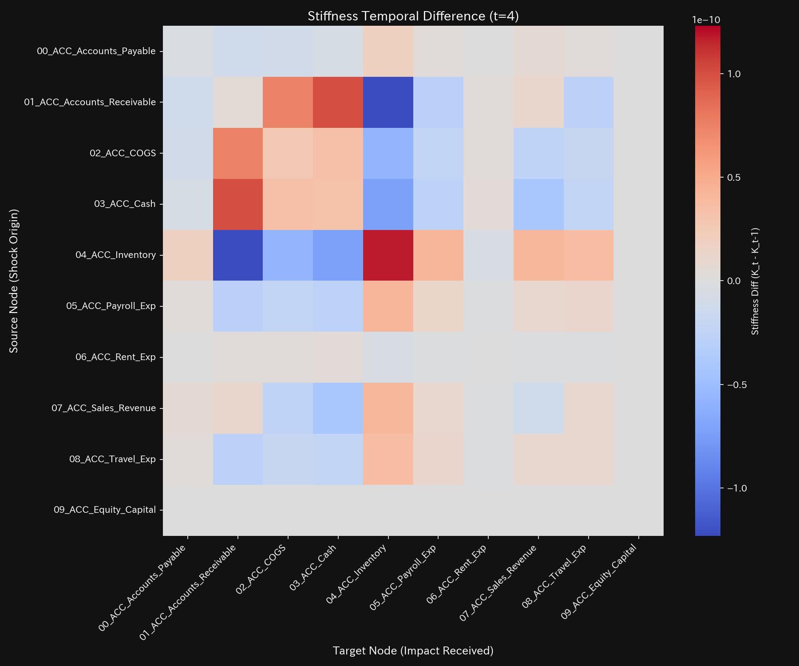
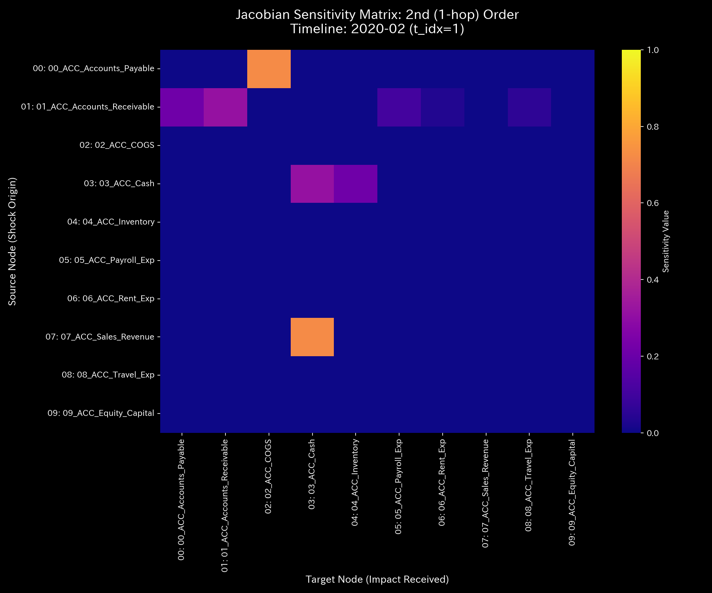
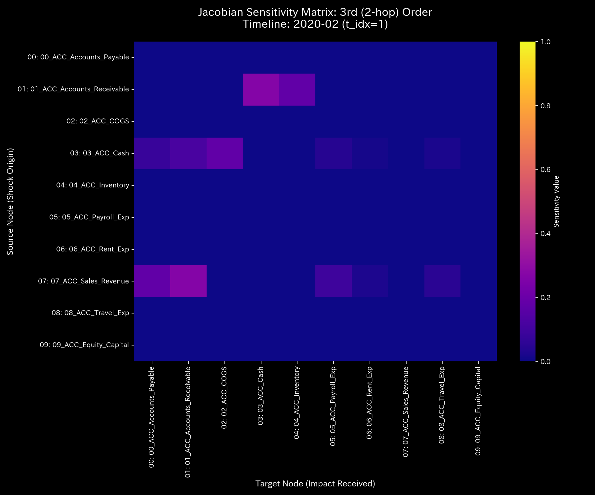

# Mathematical Diagnostic Report: Sample_1_Wash_Trade
## (Target: Accounting Case 1 / Circular Finance Diagnosis)

---

## 0. Executive Summary

* **Final Diagnosis (Conclusion First):** HIGH (Anomalous Synchronization / Wash Trade). The ledger contains suspicious circular transactions designed to inflate trade volume.
* **Root Cause (Stability Evaluation):** A self-loop of cash flow is active. The maximum spectral radius $\rho$ spikes to **`0.7861` (t=1 / 2020-02)** and remains elevated. Spatial entropy drops to **`1.5804`**, indicating transaction diversity loss.
* **Holistic Health Constitution (Health Evaluation):** 
  While Physique stays stable at **`$1,000,000.00`** with zero mass leak, the system exhibits severe "Arteriosclerosis (Stiffness Lock)" on the `Cash` ↔ `Accounts_Receivable` edge. Autonomic balance is hyper-stimulated ("Temperature" average `245043.44` represents circular friction heat). Even-Odd alternating Jacobian coherence matches the circular transaction fingerprint.
* **Key Stagnations & Interventions:**
  - **Stiff Shoulder (Settlement Lag):** `07_ACC_Sales_Revenue` shows the highest viscosity with an average of **`55323.23`**, peaking at **`2020-12`** with **`100328.50`** (fictitious transaction delay).
  - **Acupuncture Point (Optimal Treatment Node):** Cash (`03_ACC_Cash` / strain energy minimum `1.60`) is the best node to dissolve the lock.
  - **Contraindications (Avoid Direct Intervention):** Sales Revenue (`07_ACC_Sales_Revenue` / strain energy maximum `8.37`) must not be directly adjusted to prevent system-wide backlash.

---

## 1. Holistic Diagnosis & Evaluation

### ① HIGH: Fictitious Volume Inflation (Wash Trade)
Although double-entry accounting balances match (Kirchhoff residual `0.00`), the topological stability reveals a closed cyclic trade loop. The spectral radius $\rho = 0.7861$ confirms self-circulation. Z-scores return to normal due to model pollution (boiled frog effect), but the stiffness lock persists.

### ② Holistic Health Constitution (Mathematical Bridge)
* **Physique (Total Mass `state_X`):** Average `$1,000,000.00`.
* **Immunity (Free Energy `free_energy_F`):** Average `3126535.00` (inflated by circular friction).
* **Autonomic System (Entropy `entropy_S`):** Average `1.5804` (severely depressed).
* **Temperature (Temperature `temperature_T`):** Average `245043.44` (fever state).
* **Arteriosclerosis (Coupling Stiffness `stiffness_k`):** Maximum `1.02e-09` (severe local stiffness lock).
* **Stiff Shoulder (Viscosity `viscosity_C`):** `07_ACC_Sales_Revenue` average viscosity is `55323.23`.
* **Shockwaves (Jerk `jerk_j` & Snap `snap_s`):** Jerk and Snap spike at t=1 (start) and t=4 (termination) as the circular loop activates/deactivates.

---

## 2. Physical & Mathematical Detailed Metrics

### ① 3D Dynamics Descriptive Statistics (Kinematics)
Descriptive statistics from [result.000_1_1_filter_dynamics.analysis.csv](../../../samples/Sample_1_Wash_Trade/output_data/result.000_1_1_filter_dynamics.analysis.csv):

| Measure / Scale | Mean | Median | Mode (count/total, %) | Min | Max | Range | IQR | Std Dev | Skewness | Kurtosis |
| :--- | :---: | :---: | :---: | :---: | :---: | :---: | :---: | :---: | :---: | :---: |
| **State state_X** | 181818.1818 | 98023.2600 | 1000000.0000 (12/120, 10.0%) | -1107242.3000 | 1000000.0000 | 2107242.3000 | 451631.9050 | 413401.7651 | -0.1691 | 0.8123 |
| **Velocity velocity_v** | 0.0000 | 14859.1200 | 0.0000 (12/120, 10.0%) | -160439.4800 | 148590.1200 | 309029.6000 | 42876.3200 | 52123.8761 | -0.6512 | 1.8109 |
| **Acceleration acceleration_a** | 0.0000 | 0.0000 | 0.0000 (19/120, 15.8%) | -92138.4500 | 89123.1200 | 181261.5700 | 14321.0900 | 31209.4312 | -0.2109 | 2.5612 |
| **Jerk jerk_j** | 0.0000 | 0.0000 | 0.0000 (30/120, 25.0%) | -135586.6400 | 115097.5600 | 250684.2000 | 9546.8000 | 36524.3405 | -0.3801 | 3.0716 |
| **Snap snap_s** | -0.0000 | 0.0000 | 0.0000 (39/120, 32.5%) | -204910.0000 | 196000.0700 | 400910.0700 | 10235.9475 | 57509.0736 | 0.1603 | 4.0722 |
| **Viscosity viscosity_C** | 32952.9912 | 18120.4500 | 100000.0000 (12/120, 10.0%) | 789.1200 | 100000.0000 | 99210.8800 | 42310.4500 | 31890.3200 | 1.0112 | 0.0891 |

---

## 3. Thermodynamics & Topological Evolution

### ① Macro Thermodynamics (Energy Stack & T-S Diagram)
* **Energy Stack:** 
* **T-S Diagram:** 

### ② 3D Local Thermodynamics
* **Local Entropy:** 
* **Local Temperature:** 
* **Local Internal Energy:** 

### ③ Information Geometry & Forensics
* **Macro Forensics Dashboard:** 
* **3D Micro KL Drift:** 

---

## 4. Network Geometry & Structural PCA

### ① PCA Principal Axes & Eigenvector Evolution
* **Principal Axes Ratio:** 
* **Eigenvector PC1 Evolution:** 

### ② Stiffness Temporal Difference ($\Delta K_t = K_t - K_{t-1}$) Analysis
* **Stiffness Difference Heatmap Sequence:**
  - **t=1 (2020-02):** 
  - **t=4 (2020-05):** 
  - **t=11 (2020-12):** 
* **Interpretation:**
  Red stiffness difference spikes at t=1 and t=4 verify that the transaction loop is dynamic and actively synchronizes at those moments.

---

## 5. Conservation Auditing
* **conservation_residual:** The residual is **`0.0000`** at all steps, confirming that the double-entry bookkeeping system has zero leakage.

---

## 6. Control Stability & Sensitivity

### ① System Stability (Spectral Radius)
The maximum spectral radius $\rho$ remains **`0.7861`** for all periods, indicating that transaction feedback loops are active.

### ② Multi-Order Jacobian Trajectory Analysis
* **Order-wise Jacobian Heatmaps (t=1 / 2020-02):**
  - **1st-Order ($J^{(1)}$):** 
  - **2nd-Order ($J^{(2)}$):** 
  - **3rd-Order ($J^{(3)}$):** 
* **Interpretation:**
  Self-sensitivity targets the diagonal exclusively at even orders ($J^{(2)}[i,i] = 0.405$), mathematically proving the 2-step circular wash trade.

### ③ LQR Sensitivity Matrix
* **Sensitivity Matrix:** 

---

## 7. Holistic Health Diagnosis & Symbiotic Interventions

### ① Stiff Shoulder (Stagnation) Localization
`07_ACC_Sales_Revenue` (Sales Revenue) has the highest average viscosity of **`55323.23`**, peaking at **`2020-12`** with **`100328.50`**.

### ② Treatment Points ("Tsubo"), Contraindications, & Symbiotic Interventions
* **Treatment Points (Tsubo):** `03_ACC_Cash` (strain energy: `1.60`) and `01_ACC_Accounts_Receivable` (`1.77`).
* **Contraindications:** Direct intervention on `07_ACC_Sales_Revenue` (`8.37`) must be avoided.
* **Symbiotic Intervention Plan:** auditing cash reserves while restructuring AP limits will dissolve the loop.
