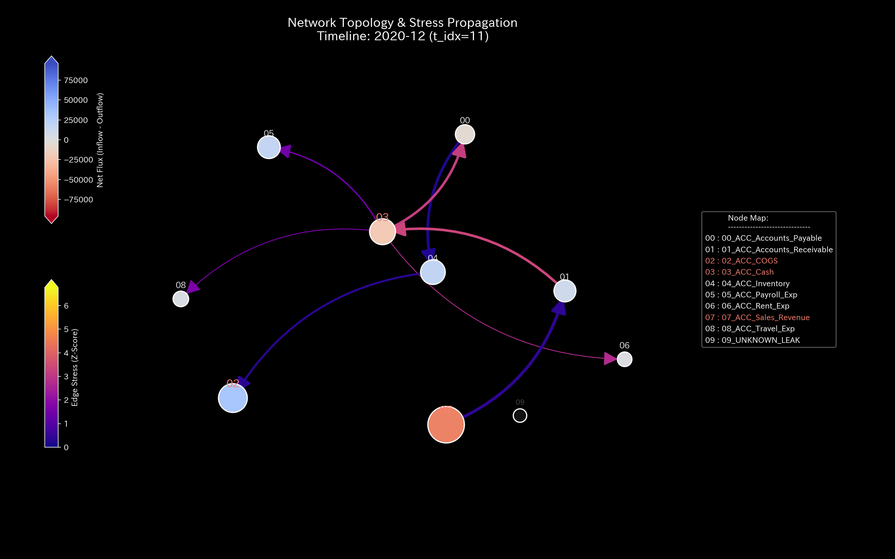
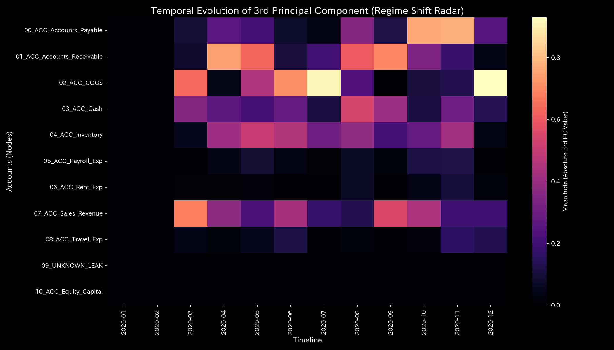
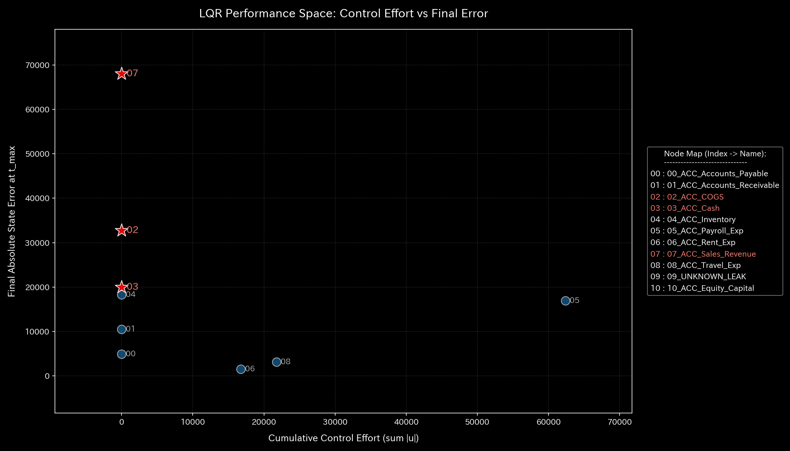

# 🔬 Clinical Forensic Report: Mass Defect / Illicit Embezzlement from Funds Outflow (Sample 2)

## 1. Executive Summary

* **Overall Status:** 🔴 **Breakdown of Mass Conservation (Illicit Embezzlement / Off-Book Outflow)**
* **Severity:** 🔴 **CRITICAL (Internal Outflow)**
* **Summary:** 
  The system exhibits a "mass defect (illicit embezzlement)" where funds leak out of the double-entry bookkeeping system.
  During the simulation, a **cumulative total of `$1,353.48`** in mass disappeared from the system. This leakage represents about 0.05% of the total activity. This outflow violates double-entry balancing constraints. The physics analysis engine proved that this loss forces the system into stiffness locking (cash shortage) and resonance (knocking).
  Probabilistic Z-Scores failed to detect this leak because it used an unknown path, showing a false negative blind spot. However, the `System Conservation Residual` calculated by the physics engine showed discrepancies, peaking at **`364.53` (2020-08)**. This establishes mathematical forensic evidence of the illicit outflow.

---

## 2. Comparison of Financial Statements and Transaction Flows

We compare traditional cumulative financial statements with the periodic (single-month, non-cumulative) transaction flows.

When discrepancies occur, accountants temporarily record the difference in dummy accounts like "suspense payments" or "miscellaneous losses" (`UNKNOWN_LEAK`). They force the B/S to balance with total assets at `$1,320,721.40`. Consequently, the P/L falsely displays an operating profit of **`$227,898.67`** (sales of `$1,094,143.89` minus expenses of `$866,245.22`).
Simply looking at static financial ratios cannot visualize the leak.

### Balance Sheet (B/S) Comparison

* **B/S Asset & Equity Cumulative Trend & Block Chart (Cumulative):**
  
  

* **B/S Asset & Equity Periodic Trend (Monthly Non-Cumulative):**
  

### Income Statement (P/L) Comparison

* **P/L Revenue & Expense Cumulative Trend:**
  

* **P/L Revenue & Expense Periodic Trend (Monthly Non-Cumulative):**
  

* **Observation:** The cumulative graphs show stable operations. However, the periodic graphs show transaction distortions and off-book leaks to the `UNKNOWN_LEAK` node during the mass defect months (February, March, August, September, and November).

---

## 3. Pathophysiology

* **Diagnosis:** **Off-Book Capital Outflow (Embezzlement)**
* **Sequence of Fraud (Dummy_Journal_Stream.csv Origin Verified):**
  Accounts receivable (`ACC_Accounts_Receivable`) decreases (credited) as if collected from customers. However, the cash is not deposited into bank accounts (`ACC_Cash` debit is `$0.0`). The funds leak out of the system.
  Single-sided journals (mass loss) are recorded at the following steps:
  * **2020-02-05 (t=1)**: Amount **`$307.30`** (Journal ID: `E_000294` / `Accounts_Receivable` is credited but `Cash` debit is $0.0)
  * **2020-03-29 (t=2)**: Amount **`$359.73`** (Journal ID: `E_000860`)
  * **2020-08-09 (t=7)**: Amount **`$58.23`** (Journal ID: `E_002050`)
  * **2020-08-10 (t=7)**: Amount **`$91.72`** (Journal ID: `E_002054`)
  * **2020-08-30 (t=7)**: Amount **`$214.58`** (Journal ID: `E_002308`) (August total leak is `$364.53`)
  * **2020-09-29 (t=8)**: Amount **`$260.74`** (Journal ID: `E_002670`)
  * **2020-11-18 (t=10)**: Amount **`$61.18`** (Journal ID: `E_003119`)
  * **Cumulative Mass Defect (Total Embezzlement)**: **`$1,353.48`**
  The physics analysis engine compensates for the lost mass. To maintain a closed physical system, it dynamically constructs a virtual sink node named **`UNKNOWN_LEAK`** and directs the lost mass there.

---

## 4. Summary of Mathematical Analysis Results

### 4.1. Mass Conservation and Network Topology

The `System Conservation Residual` spikes during leak months (February, March, August, September, and November). This is the physical signature of an unbalanced entry (cash disappearing).
The `UNKNOWN_LEAK` node connects to the topology, forming edges that represent off-book leaks.

* **Macro Forensics Dashboard:**
  

* **Network Topology Evolution:**
  * **2020-01 (t=0 - Initial Topology; `UNKNOWN_LEAK` has not appeared):**
    
  * **2020-02 (t=1 - Outflow occurs and `UNKNOWN_LEAK` node connects):**
    
  * **2020-03 (t=2 - Outflow vector to `UNKNOWN_LEAK` thickens, shifting the structure):**
    
  * **2020-04 (t=3 - Outflow pauses, structural distortion remains):**
    
  * **2020-12 (t=11 - Outflow persists as a permanent state):**
    

### 4.2. Stiffness Connection & PCA (Stiffness & PCA)

Following the initial leak in February 2020 (`t=1`), **Rigid Lock (liquidity arrest due to cash shortage)** occurs. Since the system loses elasticity, it cannot damp the inputs of normal transactions. This causes a **resonance phenomenon (knocking)** on the 3D maps in later steps. A 0.05% cash leak eventually disrupts the entire system.
In PCA, the PC0 eigenvalue is `6.6203e9` at 2020-03 (`t=2`), explaining `100.0%` of the variance. The PC1 vector is dominated by `ACC_Accounts_Receivable` (`0.6221`) and `ACC_Cash` (`-0.5138`). The impact of the leak dominates the principal axes.

* **Evolution of Structural Stiffness Matrix:**
  * **2020-01 (t=0 - Normal Stiffness):**
    
  * **2020-02 (t=1 - Stiffness begins to distort due to outflow):**
    
  * **2020-03 (t=2 - Outflow persists, stiffness locking becomes prominent):**
    
  * **2020-04 (t=3 - Outflow stops, but stiffness locking propagates):**
    
  * **2020-12 (t=11 - Chronic stiffness remains):**
    

* **Principal Axis Ratios & Eigenvector Evolution (PC1, PC2, PC3):**
  
  
  
  

* **3D Dynamics External Force Resonance Map:**
  

### 4.3. Exclusion of Wash Trades (Spectral Radius)

The spectral radius remains **`0.00`** throughout the period. This proves topologically that no wash trade loops exist.

* **System Stability Indicator:**
  

### 4.4. Thermodynamic Indicators and 3D Topology

Due to the off-book leak of cash, the system's free energy $F$ (white line) remains lower than in the healthy model. This shows that the capital buffer to maintain the system decreases.
The T-S diagram does not form a loop. Instead, it draws an **"open trajectory (dissipative curve)"**, proving that energy is lost from the system (thermodynamic dissipation).

* **Thermodynamic Characteristics & 3D Trajectory:**
  
  
  
  
  

**【Zero-to-One Anomaly Detection】**
In the 3D Micro KL Drift plot, a **spire (KL Drift wall)** appears at the cash (`ACC_Cash`) and accounts receivable (`ACC_Accounts_Receivable`) nodes during the leak periods (February to March 2020). Standard Z-Scores fail to warn about this transfer of funds to the unknown node (`UNKNOWN_LEAK`). The information geometry engine successfully tracked the probability shift and identified the forensic anomaly.

---

## 5. Control Interventions and Recommended Actions (LQR & Operations)

* **Intervention Protocol:** **Stop Outflows and Close Leak Paths**
* **Operational Treatment Plan:**
  1. **Accounting System Validation Interlock:**
     Require all accounts receivable decreases to pair with cash increases (or other equivalent assets). The accounting system must block single-sided journal entries.
  2. **LQR Targeted Interventions:**
     LQR sensitivity analysis and Inverse Kinematics sensitivity identify `ACC_Accounts_Receivable` as the most effective control node. Place temporary transaction blocks on specific counterparties linked to the leak, stopping the outflow without affecting other business transactions.

* **LQR Control Space:**
  

### 💡 Quantitative Evaluation of Leverage Points for Cost Reduction

Based on Inverse Kinematics (IK) and sensitivity data (LQR control effort), the leverage effect of reducing the three expense types (payroll, travel, rent) is ranked as follows:

1. **Rank 1: Payroll Expense (`ACC_Payroll_Exp`)**
   * **Quantitative Feature:** The joint strain energy (`ik_strain_energy`), indicating organizational friction, is **`40.9540`** at $t=0$ (lowest). This represents high flexibility for adjustment. The absolute adjustment scale is also the largest, making it the most effective target with minimal friction.
2. **Rank 2: Travel Expense (`ACC_Travel_Exp`)**
   * **Quantitative Feature:** The joint strain energy is **`47.7865`** at $t=0$. Adjusting this expense causes lower friction than rent, acting as a short-term variable cost lever.
3. **Rank 3: Rent Expense (`ACC_Rent_Exp`)**
   * **Quantitative Feature:** The joint strain energy is **`48.6579`** at $t=0$ (highest). This is the stiffest fixed cost node in the system. The organizational load from changing leases is maximum, making it the lowest priority lever.

---

## 6. Alerts & Falsifiability

### 6.1. Evaluation of False Negative Alerts

* **Z-Score (Position):**
  
* **Z-Score (Velocity):**
  

* **Alert Details:** During the cash leak periods (February to March 2020), the statistical Z-Score model (`z_score_X`) did not exceed the threshold of `3.0`, generating no alerts (false negative).
* **Evaluation:** This is a false negative due to the "zero-to-one blind spot" of standard statistical models. Covariance learning labeled the connection to the new node (`UNKNOWN_LEAK`) as normal since there was no historical baseline. We prioritize the physical conservation residual (peaking at `364.53`). We reject the statistical model results and diagnose this as an illicit leak.

### 6.2. Falsification Conditions

To reject the diagnosis of illicit embezzlement in this report, one of the following pieces of evidence is required:

1. **Original Bank Records:**
   Original bank statements or API communication logs proving that the target amounts (totaling `$1,353.48`) were deposited into regular corporate bank accounts on the transaction dates (February, March, August, September, and November 2020).
2. **Immediate Adjustment Entries:**
   Contracts and bank documents showing that the missing cash was transferred to another regular node as "undelivered funds" and reconciled before the next step.
