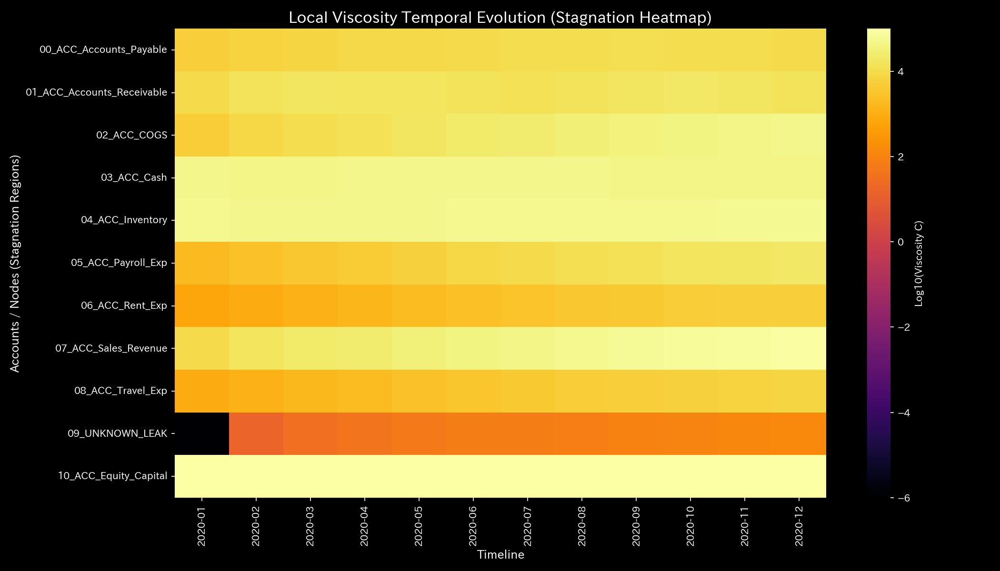

# Embezzlement Report (Case 2)

> [!NOTE]
> A more detailed analysis report is available in [clinical_report.md](clinical_report.md).

## Target Entity: Sample 2

---

## 0. Executive Summary

* **Overall Diagnosis:** 【Warning / Needs Improvement】 Unexplained capital leakage (**"unauthorized embezzlement/asset outflow"**) has been detected, causing a persistent loss of mass within the system.
* **Overall Constitution (Physical State):**
  Due to the off-book outflow of cash, the organization's basic scale (**"physique"**) is shrinking, and its resilience to external shocks (**"immunity and basic stamina"**) is severely depleted. The trade channels have lost flexibility, resulting in structural rigidity (**"arteriosclerosis / stiffness lock"**). In later steps, when normal operational stress is applied, the system fails to absorb the shock, causing severe oscillations (**"resonance / knocking"**).
* **Areas for Improvement (Viscosity & Treatment Points):**
  * **Stagnation (Viscosity / "Stiff Shoulder") Range:** Severe settlement lags are observed in **"04_ACC_Inventory"**, **"03_ACC_Cash"**, and **"07_ACC_Sales_Revenue"** (top 25% viscosity range), peaking around **2020-12**.
  * **Treatment Points ("Tsubo") Range:** The minimum intervention stress range (bottom 25% strain energy range), comprising **"02_ACC_COGS"**, **"04_ACC_Inventory"**, and **"01_ACC_Accounts_Receivable"**, represents the highest priority treatment points to restore the system's basic stamina.
  * **Contraindications (Avoid Intervention) Range:** Conversely, aggressive reductions or interventions in **"09_UNKNOWN_LEAK"** (leakage channel), **"07_ACC_Sales_Revenue"**, and **"06_ACC_Rent_Exp"** (top 25% strain energy range) must be strictly avoided, as they will trigger intense system backlash and functional paralysis.

---

## 1. Overall Diagnosis (Warning / Needs Improvement)

### 【Diagnosis】: Needs Improvement (Persistent Off-Book Capital Leakage)

Although the books appear balanced and report a net profit of `$227,898.67`, the physical diagnostics engine detected a persistent loss of mass (leakage). When Accounts Receivable are collected, the funds are not transferred to Cash; instead, they are bypassed to an off-book, external entity (`UNKNOWN_LEAK`). The cumulative leakage totals **`$1,353.48`**, verified quantitatively as a violation of the law of conservation of mass.

---

## 2. Overall Constitution (Health State) Analysis

Mapping the organization's "financial stamina" to a medical checkup template reveals the following structural distortions:

### ① Physique & Weight (Cumulative Trend of Capital Scale)

Due to the continuous off-book drain of cash, the cumulative cash stock is steadily decreasing, showing a distinct downward trend in basic physique.

### ② Immunity & Basic Stamina (Resilience to External Shocks)

Despite surface-level profitability, the continuous cash drain has depleted the system's capacity (free energy) to buffer shocks. The organization's actual immunity is hollowed out.

### ③ Autonomic Nervous System & Metabolic Efficiency (Regularity of Frictional Loss)

In the T-S diagram, frictional entropy spikes during leakage steps. The accumulation of frictional heat (costs associated with concealment and off-book journal adjustments) disrupts metabolic efficiency and destabilizes the system.

### ④ Arteriosclerosis & Resonance (PCA Principal Axes Evaluation)

Principal Component Analysis (PCA) reveals that from February ($t=1$) onward, the PC1 explanation ratio spikes, locking specific transaction pathways into structural rigidity ("stiffness lock"). In later steps, when normal operational load is applied to this hardened network, the lack of a fluid cash buffer causes the entire system to experience violent oscillations ("resonance / knocking").

---

## 3. Key Areas for Improvement (Viscosity & Treatment Points)

Specific areas for improvement identified by the system and recommended action plans are detailed below:

### ⚠️ Stagnation (Viscosity) Identification (Local Viscosity Temporal Heatmap Analysis)

* **Stagnation Range:**
  The temporal heatmap mapping log local viscosity ($viscosity\_C$) shows that the inventory account (**`04_ACC_Inventory`**) maintains a high viscosity index, peaking sharply in December.
  This viscosity surge (delay) locks state trajectories into localized regions of phase space (attractor confinement). Refer to the 3D Phase Portrait ([000_1_8__phase_portrait_3d.png](../../../samples/Sample_2_Embezzlement_Leak/readme_plots/000_1_8__phase_portrait_3d.png)) for trajectory clustering.
  The top 25% viscosity group—**"04_ACC_Inventory"**, **"03_ACC_Cash"**, and **"07_ACC_Sales_Revenue"**—contains severe settlement delays.
  * **`04_ACC_Inventory`**: Mean viscosity `52569.22`, peaking at **`2020-12`** (peak value `57275.08`).
  * **`03_ACC_Cash`**: Mean viscosity `45680.18`, peaking in **`2020-06`**.
  * **`07_ACC_Sales_Revenue`**: Mean viscosity `45422.23`, peaking in **`2020-12`**.

### 🎯 Treatment Points ("Tsubo") & Contraindications

* **Treatment Points Range:** Accounts in the bottom 25% of intervention strain energy—**"02_ACC_COGS"**, **"04_ACC_Inventory"**, and **"01_ACC_Accounts_Receivable"**—can be adjusted with minimal frictional resistance.
  * **Advice:** These sectors (such as Cost of Goods Sold) can be adjusted to optimize liquidity with the least effort, without damaging the capital structure. In particular, when intervening in boundary terminal nodes that directly interface with the external world (e.g., Accounts Receivable representing external clients' cash flows), you must carefully assess the cash squeeze (External Backlash) forced on external partners. Aggressive local collection speedups (sedation/泻) carry a high risk of triggering negative feedback loops, such as subsequent sales drops due to customer churn. Thus, instead of a localized push for faster collections, a symbiotic package of interventions (Yin-Yang balancing) must be proposed—such as easing Accounts Payable terms or providing digital process tools to reduce operational frictions—to maintain overall system homeostasis.
* **Contraindications Range:** Conversely, the top 25% strain energy group—**"09_UNKNOWN_LEAK"**, **"07_ACC_Sales_Revenue"**, and **"06_ACC_Rent_Exp"**—must be avoided.
  * **Advice:** Forcing adjustments on these nodes (especially parameter edits on the leak channel `UNKNOWN_LEAK`) will generate massive strain energy and trigger catastrophic structural failure.

---

## 4. Diagnostic Limitations and Falsifiability

To overturn (falsify) the diagnosis of "Embezzlement/Capital Leakage," the following external, primary physical evidence must be presented:

1. **Official Bank Transaction Logs:**
   For the specific leak dates (February 5, March 29, August 9, etc.), presenting official SWIFT logs or bank transaction records proving that the matching amounts were successfully deposited into the organization's official bank account.
2. **Reconciliation of Transit Accounts:**
   Proving that the missing `$1,353.48` was temporarily routed through a valid transit account (e.g., goods in transit, prepayments) and reconciled in subsequent steps, backed by matching original invoices and counterparty receipts.

---
*Published by: TLU Financial Mathematical Diagnostics Engine (General Reader Edition)*
