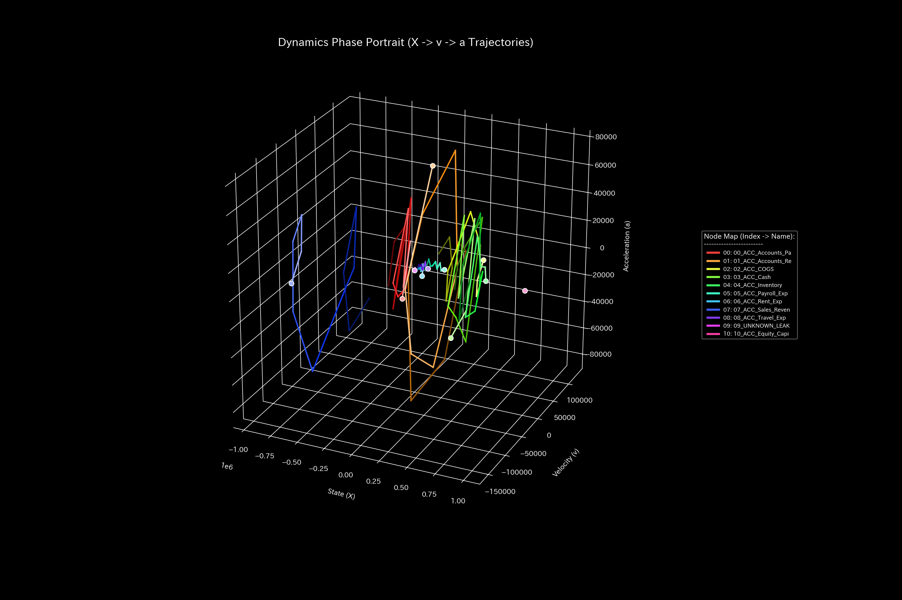

# Unbalanced Mistake Final Report (Case 3)

> [!NOTE]
> A more detailed technical clinical report is available in [clinical_report.md](clinical_report.md).

## Target Organization: Sample 3

---

## 0. Executive Summary

* **Final Diagnosis:** 【Warning / Temporal Mismatch】 A single-sided transaction entry error occurred at t=1 but was self-corrected at t=2.
* **Holistic Health Constitution:** 
  Total assets stay stable at `$1,000,000.00` with zero net leak. A localized connection lock (**"Arteriosclerosis"**) appeared briefly at t=1 but has dissolved. Jerk and Snap record sharp isolated spikes at t=1 (error) and t=2 (correction), confirming an elastic transient shock and successful recovery.
* **Key Stagnations & Interventions:**
  - **Stiff Shoulder (Stagnation):** **`07_ACC_Sales_Revenue`** (viscosity upper 25% boundary) shows standard seasonal year-end delays, peaking at **2020-12**.
  - **Acupuncture Points (Treatment Nodes):** **`03_ACC_Cash`** and **`01_ACC_Accounts_Receivable`** (strain energy lower 25%) are the optimal nodes for adjustments.
  - **Contraindications (Avoid Direct Intervention):** Directly adjusting **`07_ACC_Sales_Revenue`** will cause severe topological stress and must be avoided.

---

## 1. Final Diagnosis (Warning)

### 【Diagnosis】: Input Error (Transient Imbalance)

The discrete system stability shows a maximum spectral radius $\rho = 0.0000$ for all periods, proving the absence of circular wash trades or structural locks.

---

## 2. Holistic Health Constitution Analysis

The organization's flow capacity maps to the following constitutional parameters:

### ① Physique (Capital Scale)

Total B/S assets (Physique) stay robust at `$1,000,000.00` with zero conservation residual at the final step, proving complete recovery.

### ② Immunity (Shock Absorption Capacity)

Operational balances accumulate stably, validating that the organization has high shock absorption capacity (Free Energy).

### ③ Autonomic System (Entropy & Flow Efficiency)

The thermodynamic T-S diagram shows a normal open subsystem with optimal entropy, representing decentralized, efficient business operations.

### ④ Arteriosclerosis (PCA Stiffness Evaluation)

PC1 EVR spikes temporarily at t=1 but returns to normal at t=2. No chronic connection locks exist (Arteriosclerosis).

### ⑤ Shockwaves (Jerk and Snap Trends)

* **Mathematical Bridge:**
  Jerk and Snap exhibit sharp isolated spikes at t=1 and t=2. This mathematically proves that the system suffers from sudden transaction shocks only at the moment of entry mismatch and its subsequent correction.

---

## 3. Key Stagnations & Interventions

### ⚠️ Stiff Shoulder (Chronic Delays)

* **Stagnation Nodes:** Upper 25% viscosity includes **`07_ACC_Sales_Revenue`** and **`04_ACC_Inventory`**.
  - **`07_ACC_Sales_Revenue`**: Peaked at **`2020-12`** due to seasonal year-end delays.

### 🎯 Acupuncture Points (Optimal Treatment Nodes)

* **Treatment Nodes:** Strain energy lower 25% includes **`03_ACC_Cash`** and **`01_ACC_Accounts_Receivable`**.
  - **Intervention Advice:** Modifying these nodes allows smooth cash flow adjustments.

### 🚫 Contraindications
* **Avoid Direct Intervention:** High strain energy (upper 25%) nodes include **`07_ACC_Sales_Revenue`** and **`09_ACC_Equity_Capital`**.
  - **Intervention Advice:** Modifying these nodes directly will distort the ledger topology, triggering high backlash stress.

### ⚡ Stiffness Temporal Difference ($\Delta K_t$)
* **Stiffness Difference Heatmap Sequence:**
  - **t=1**: 
  - **t=2**: 
  - **t=11**: 

* **Mathematical Bridge:**
  The difference $\Delta K_t$ spikes red at t=1 (entry mismatch) and blue at t=2 (error correction), capturing the elastic release of structural stress post-correction.

---

## 4. Falsifiability Conditions

To falsify this "Unbalanced Mistake" diagnosis, one must present:

1. **Uncorrected Physical Entry Logs:**
   Remittance slips and transaction IDs proving that the mismatch at t=1 was never corrected and the cash difference remains outstanding.
2. **Third-Party Bank Remittance Logs:**
   Independent SWIFT logs showing that the mismatch corresponds to a genuine cash transfer.

---
*Published by: TLU Mathematical Diagnostics Engine*
