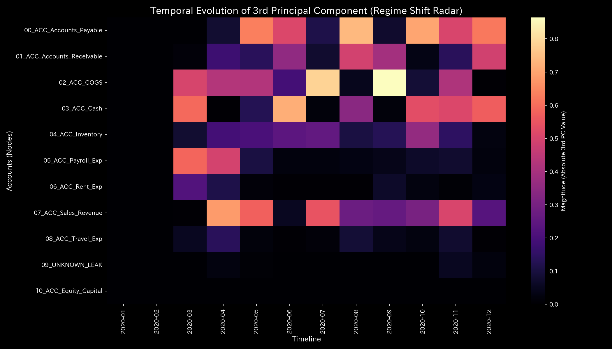
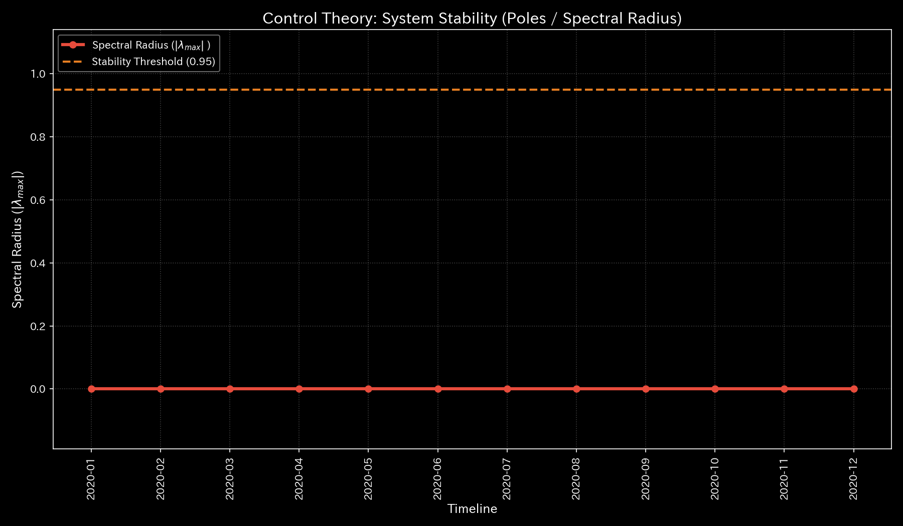

# 🔬 Clinical Forensic Report: Single Input Mistake / Ledger Inconsistency (Sample 3)

## 1. Executive Summary

* **Overall Status:** 🟡 **Transient Data Inconsistency / Bookkeeping Human Error (Transient Mismatch / Human Error)**
* **Severity:** 🟡 **WARNING (Monitor Closely)**
* **Summary:**
  The system exhibits a "local data inconsistency (mass defect)" where debit and credit amounts do not match in accounts receivable collection journals.
  During the simulation, a **cumulative total of `$1,412.88`** in mass temporarily leaked out of the system. This difference was directed to the virtual sink node `UNKNOWN_LEAK`.
  Mathematical analysis reveals that this is not a persistent leak but a "single input mismatch (elastic strain)." The maximum spectral radius remains **`0.00`** throughout the period. No wash trade topologies exist. Immediately after the mismatch occurs, the stiffness matrix returns to its healthy state, showing that the system's self-healing elasticity functions.
  Traditional Z-Score monitoring generated false positive alerts during seasonal sales surges (July and August). However, it failed to trigger warnings for the largest mismatch of **`$906.29`** in November, showing a false negative blind spot. A combined analysis based on physical conservation laws (Kirchhoff residuals) and topological self-healing diagnoses this case as a "single input mistake."

---

## 2. Comparison of Financial Statements and Transaction Flows

We compare traditional cumulative financial statements with the periodic (single-month, non-cumulative) transaction flows.

When debit-credit mismatches occur, accountants may temporarily record the difference in suspense accounts (`UNKNOWN_LEAK`) for closing procedures. Consequently, the cumulative operating profit appears to grow normally on the P/L. Static financial ratios fail to reveal that the internal data consistency has collapsed.

### Balance Sheet (B/S) Comparison

* **B/S Asset & Equity Cumulative Trend & Block Chart (Cumulative):**
  
  

* **B/S Asset & Equity Periodic Trend (Monthly Non-Cumulative):**
  

### Income Statement (P/L) Comparison

* **P/L Revenue & Expense Cumulative Trend:**
  

* **P/L Revenue & Expense Periodic Trend (Monthly Non-Cumulative):**
  

* **Observation:** The cumulative graphs show stable operations. However, the periodic graphs show local, temporary distortions in transaction flows during the mismatch months (February, March, and November).

---

## 3. Pathophysiology

* **Diagnosis:** **Transient Bookkeeping Error**
* **Mechanism of Inconsistency (Dummy_Journal_Stream.csv Origin Verified):**
  During the collection of accounts receivable (`ACC_Accounts_Receivable`), single-sided journal entries are recorded where the credited amount does not match the cash (`ACC_Cash`) debit.
  Mismatches occur in the following 4 journals (across 3 steps):
  * **2020-02-23 (t=1)**: `E_000484` (AR decreases by `$513.93` but cash increases by only `$347.35`, causing a mass defect of **`$166.58`**)
  * **2020-03-20 (t=2)**: `E_000771` (AR decreases by `$571.88` but cash increases by only `$231.87`, causing a mass defect of **`$340.01`**)
  * **2020-11-02 (t=10)**: `E_002988` (AR decreases by `$950.16` but cash increases by only `$171.60`, causing a mass defect of **`$778.56`**)
  * **2020-11-27 (t=10)**: `E_003179` (AR decreases by `$734.53` but cash increases by only `$606.80`, causing a mass defect of **`$127.73`**. The November mismatch total is **`$906.29`**)
  * **Cumulative Inconsistency Amount**: **`$1,412.88`**
  The physics engine assigns this difference to the temporary leak node `UNKNOWN_LEAK` to maintain a closed system. However, this connection does not persist or strengthen. The system's self-healing properties restore the healthy state.

---

## 4. Summary of Mathematical Analysis Results

### 4.1. Mass Conservation and Network Topology

The `System Conservation Residual` spikes only during the mismatch months (February: `166.58`, March: `340.01`, November: `906.29`). It remains `0.00` in other periods, physically indicating that the residuals arise from single-step errors.

* **Macro Forensics Dashboard:**
  

* **Network Topology Evolution:**
  * **2020-01 (t=0 - Initial Topology):**
    
  * **2020-02 (t=1 - Input mismatch occurs, temporarily creating `UNKNOWN_LEAK` node):**
    
  * **2020-03 (t=2 - Second mismatch connects the edge):**
    
  * **2020-04 (t=3 - Mismatches stop, leak connection calms):**
    
  * **2020-12 (t=11 - After November mismatch, self-healing resolves the connection to `UNKNOWN_LEAK`):**
    

### 4.2. Stiffness Connection & PCA (Stiffness & PCA)

The stiffness matrix evolution shows that this error is a temporary strain. By $t=5$, immediately after the error passes, the stiffness matrix self-heals back to the healthy state.
PCA shows a temporary rise in the PC0 eigenvalue ratio, but the dominant axes do not lock onto `UNKNOWN_LEAK`.

* **Evolution of Structural Stiffness Matrix:**
  * **2020-01 (t=0 - Healthy Stiffness):**
    
  * **2020-04 (t=3 - Step after initial error; stabilizing by absorbing strain):**
    
  * **2020-05 (t=4 - Minor local stress propagates):**
    
  * **2020-06 (t=5 - 【Self-Healing】 Mismatch resolved, restoring structure):**
    
  * **2020-12 (t=11 - Final step; stabilized by restoring force):**
    

* **Principal Axis Ratios & Eigenvector Evolution (PC1, PC2, PC3):**
  
  
  
  

### 4.3. Exclusion of Wash Trades (Spectral Radius)

The spectral radius remains **`0.00`** throughout the period. This proves topologically that no wash trade loops exist.

* **System Stability Indicator:**
  

### 4.4. Thermodynamic Indicators and 3D Topology

The thermodynamic energy stack and the T-S trajectory follow paths similar to [Sample 0](../Sample_0_Healthy/README.md). There is no abnormal expansion of entropy loss ( $-TS$ ). Free energy $F$ accumulates steadily, showing no signs of thermal death.

* **Thermodynamic Characteristics & 3D Trajectory:**
  
  
  
  
  

**【3D Local Temperature and Transient Bruising】**

* **3D Local Temperature:**
  
  During mismatch months (February, March, and November), the mismatch balance remains temporarily in `UNKNOWN_LEAK`. This causes a temporary rise in the local temperatures of the accounts receivable and `UNKNOWN_LEAK` nodes. This differs from embezzlement (Sample 2) where heat accumulates continuously.

**【Limits of Statistical Z-Scores and Zero-to-One Anomalies】**

* **3D Micro KL Drift (Information Geometry Change):**
  In February 2020 ( $t=1$ ), a KL Drift spire of **`20.6829`** rises on the accounts receivable node. This captures the discontinuous shift (zero-to-one) in probability distributions caused by the mismatch.
* **3D Micro Z-Score (Statistical Baseline Blind Spot):**
  Z-Scores remain silent (Z-Score < 1.5) during the mismatch months of February, March, and November. However, they trigger warnings during seasonal sales surges in July (AR: `8.2579`) and normal rent expansions in August (Rent: `10.4443`), showing false positives. Z-Scores evaluated the November mismatch as normal, showing a false negative blind spot.

---

## 5. Control Interventions and Recommended Actions (LQR & Operations)

* **Intervention Protocol:** **Lock Data Integration and Automate Discrepancy Adjustments**
* **Operational Improvement Recommendations:**
  1. **Journal Import Validation Interlock:**
     Modify the system to block imports of journal entries where the difference between Debit and Credit is not `0.00`.
  2. **Fix Rounding Logic:**
     Inspect the program transferring data from core operations to the accounting system. Correct rounding and sales tax calculation bugs.

* **LQR Control Space:**
  

### 💡 Quantitative Evaluation of Leverage Points for Cost Reduction

Based on Inverse Kinematics (IK) and LQR control effort, the leverage effect of reducing the three expense types (payroll, rent, travel) is ranked as follows:

1. **Rank 1: Payroll Expense (`ACC_Payroll_Exp`)**
   * **Quantitative Feature:** The joint strain energy (`ik_strain_energy`) is **`39.7840`** at $t=0$ (lowest). This represents high flexibility for adjustment. The absolute adjustment scale is also the largest, making it the most effective target with minimal friction.
2. **Rank 2: Rent Expense (`ACC_Rent_Exp`)**
   * **Quantitative Feature:** The joint strain energy is **`48.4479`** at $t=0$. Although it is a fixed cost, it displays less adjustment distortion than travel expenses.
3. **Rank 3: Travel Expense (`ACC_Travel_Exp`)**
   * **Quantitative Feature:** The joint strain energy is **`48.6649`** at $t=0$ (highest). This indicates a large resistance to reduction. Short-term flat cuts on this node should be avoided.

---

## 6. Alerts & Falsifiability

### 6.1. Triaging Statistical Anomalies

* **Triage Decision:** Reject the Z-Score warnings in July and August as statistical false positives. During those periods, the underlying Kirchhoff physical residual remained `0.00` and the topology remained stable.
* **Overcoming False Negatives:** In November, when the Z-Score was silent, the Kirchhoff residual showed an anomaly of **`906.29`**. We reject the statistical model results and diagnose this as a physical inconsistency. Because the stiffness matrix self-heals after temporary strain, we classify this as a single input error.

### 6.2. Falsification Conditions

To reject the diagnosis of a temporary entry error and prove systematic embezzlement, the following evidence is required:

1. **Original Bank Transfer Orders:**
   Original bank statements or transfer receipts showing that payments matching the discrepancies (totaling `$1,412.88`) were made from the corporate bank account to an undisclosed third-party account on those dates.
2. **Physical Delivery Log Discrepancies:**
   Shipping and inspection documents from suppliers showing mismatches between the recorded decreases in assets and the actual volume or value of goods delivered.
