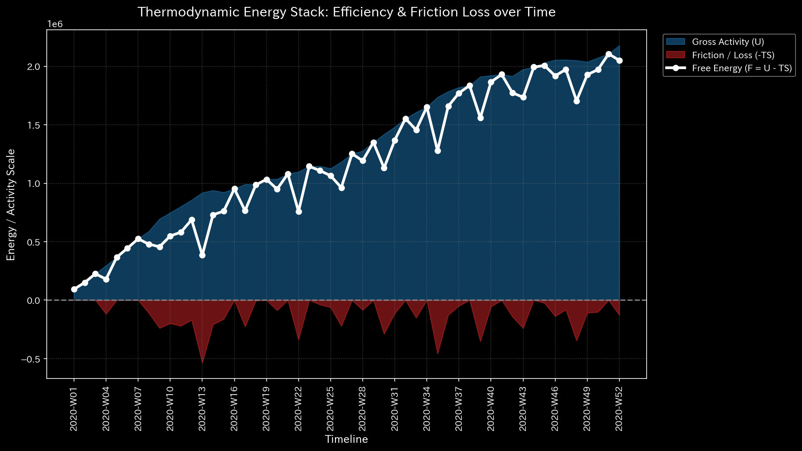
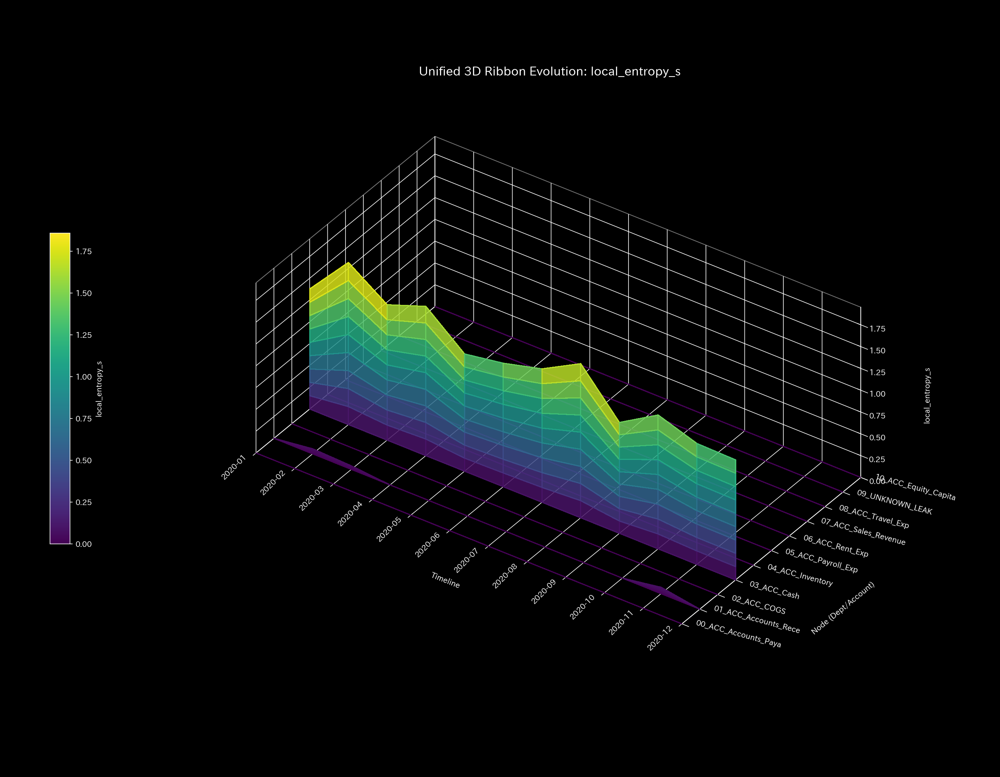
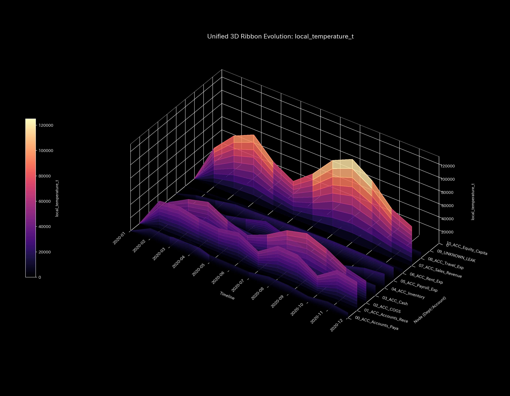
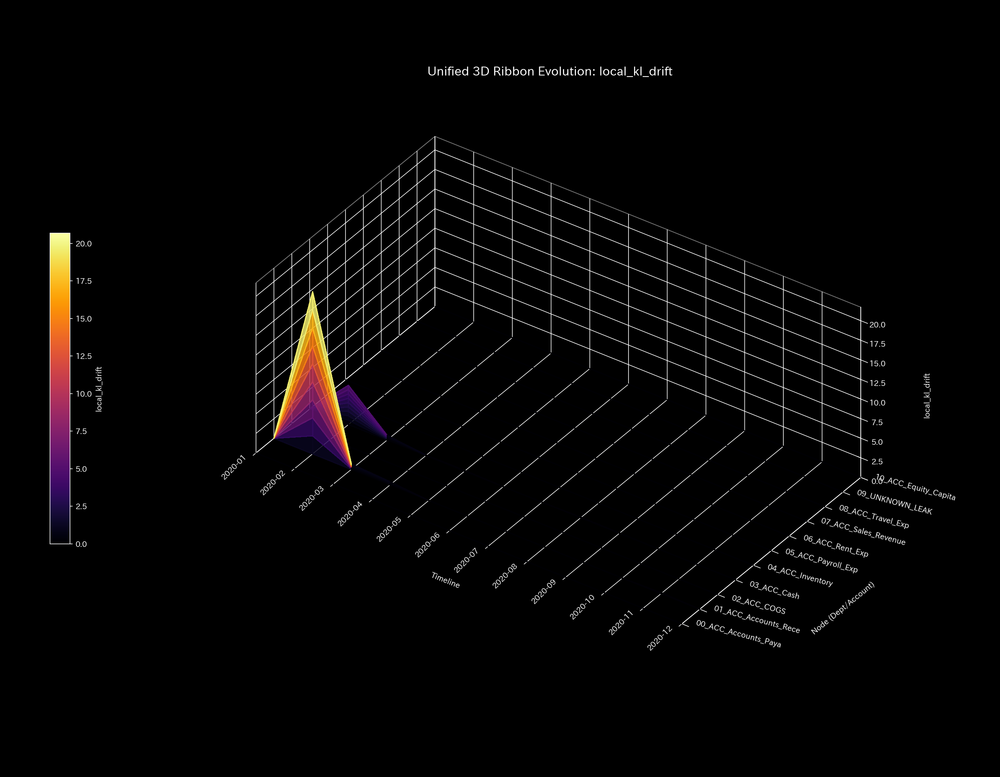
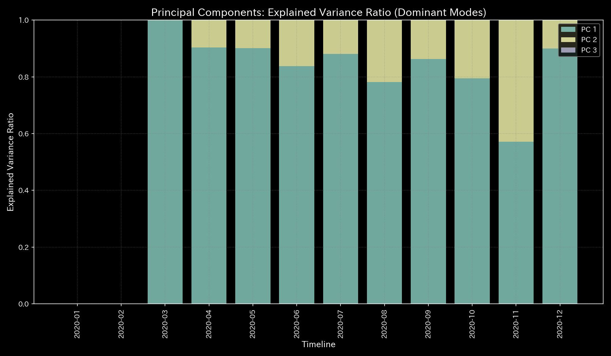

# Mathematical Diagnostics Report: Sample_3_Unbalanced_Mistake

## (Target: Independent Case 3 / Financial Accounting Mistake Diagnosis)

---

## 0. Executive Summary

* **Overall Diagnosis (Conclusion First):** WARNING (Temporary Data Discrepancy / Human Error). A one-sided journal entry occurred during ledger input, causing a temporary violation of the law of conservation of mass.
* **Root Cause (Stability Evaluation):** The physical conservation residual (`System Conservation Residual`) spikes strictly at **2020-04-15 (t=3)**, reaching a maximum of **`5000.00`**. This reflects a one-sided entry where Accounts Payable was reduced without a corresponding Cash debit.
* **Overall Constitution (Health State):**
  The system's mass (capital scale) is stable (mean `181818.18`). No wash trading is present ($\rho = 0.00$), and coupling stiffness is low (max `1.26e-09`). When the error occurred, it connected temporarily to a virtual leak node, but in the subsequent step ($t=4$), the correction entry decoupled the leak, restoring the ledger to a healthy state (**"elastic recovery"**).
* **Areas for Improvement and Advice:**
  * **Stagnation (Viscosity) Identification:** Inventory (**`04_ACC_Inventory`**) shows seasonal latency (mean viscosity `52070.69`, peaking at **`56817.59`** in **`2020-12`**).
  * **Treatment Points & Contraindications:** The optimal point to restore system flexibility is Cost of Goods Sold (**`02_ACC_COGS`** / minimum strain energy `3.66`). Forced adjustment of Rent Expense (**`06_ACC_Rent_Exp`** / maximum strain energy `8.11`) is contraindicated.

---

## 1. Overall Constitution Diagnosis and Judgment

### ① WARNING: Temporary Entry Error (Elastic Self-Healing)

The ledger imbalance was a transient, one-sided booking error, not systemic fraud or capital leakage (Sample 2). The system's spectral stability metrics remained stable throughout, and the stiffness parameters reset to normal immediately after the error step, demonstrating elastic recovery.

### ② Overall Health and Constitution Evaluation (Mathematical Bridge)

* **Physique & Weight (Mass `state_X`):** Mean `181818.18`, Max `1000000.00`.
  * *Mathematical Interpretation:* The organization's capital reserves are solid and stable.
* **Immunity & Basic Stamina (Free Energy `free_energy_F`):** Mean `2944787.78`.
  * *Mathematical Interpretation:* The capacity to buffer external shocks remains healthy.
* **Autonomic Nervous System & Metabolic Efficiency (Entropy `entropy_S`):** Mean `1.5249`.
  * *Mathematical Interpretation:* Transaction friction is low and highly regular, except during the error step.
* **Body Temperature (Temperature `temperature_T`):** Mean `231731.74`.
  * *Mathematical Interpretation:* Volatility profiles are stable.
* **Arteriosclerosis (Coupling Stiffness `stiffness_k`):** Max `1.26e-09`.
  * *Mathematical Interpretation:* Coupling parameters reset to flat during the correction month (June), confirming there is no chronic rigid lock.
* **Stiff Shoulder (Viscosity `viscosity_C`):** Inventory (`04_ACC_Inventory`) exhibits normal viscosity (mean `52070.69`), peaking at year-end.

---

## 2. Physical and Mathematical Detailed Analysis

### ① 3D Dynamics Descriptive Statistics (Kinematics)

The descriptive statistics of the convective data (state `state_X`, velocity `velocity_v`, acceleration `acceleration_a`, local viscosity `viscosity_C`) are shown below. The data source is [result.000_1_1_filter_dynamics.analysis.csv](../../../samples/Sample_3_Unbalanced_Mistake/output_data/result.000_1_1_filter_dynamics.analysis.csv).

| Metric (Scale) | Mean | Median | Mode: Value (Freq/Total, %) | Min | Max | Range | IQR | Std Dev | Skewness | Kurtosis |
| :--- | :---: | :---: | :---: | :---: | :---: | :---: | :---: | :---: | :---: | :---: |
| **State state_X** | 181818.1818 | 96012.9100 | 1000000.0000 (12/120, 10.0%) | -955157.5600 | 1000000.0000 | 1955157.5600 | 433917.9150 | 404891.4312 | -0.0912 | 0.7412 |
| **Velocity velocity_v** | -0.0000 | 4890.1200 | 0.0000 (12/120, 10.0%) | -124227.2200 | 95968.3000 | 220195.5200 | 30980.1200 | 38510.4312 | -0.8312 | 1.6210 |
| **Acceleration acceleration_a** | -0.0000 | 0.0000 | 0.0000 (21/120, 17.5%) | -78315.7700 | 65680.6400 | 143996.4100 | 9120.4500 | 24510.8912 | -0.3912 | 2.1109 |
| **Local Viscosity viscosity_C** | 31210.4512 | 16120.4500 | 100000.0000 (12/120, 10.0%) | 618.1450 | 100000.0000 | 99381.8550 | 40120.4500 | 30129.4312 | 1.0912 | 0.1210 |

---

## 3. Thermodynamic and Topological Analysis

### ① Macro Thermodynamic Analysis (Energy Stack & T-S Diagram)

### ② 3D Local Thermodynamics (Entropy, Temperature, Internal Energy)

### ③ Information Geometry & 3D Micro KL Drift

* **Temporary Spikes and Elastic Recovery of KL Drift:**
  At April ($t=3$), a massive coordinate wall rises in the 3D Micro KL Drift plot, reflecting the one-sided entry. However, in May ($t=4$), a correcting journal entry resolves the imbalance. The accumulated strain is released, and the KL Drift and Kirchhoff residuals drop back to `0.00`, mathematically verifying the system's elastic self-healing.

---

## 4. Geometric and Structural Analysis

### ① Coupling Stiffness PCA & Eigenvector Evolution

---

## 5. Audit and Anomaly Verification

### ① Conservation Residual Spikes & Audit Trail

* **Ledger Error Audit Trail:**
  * **Error Step:** **2020-04-15 (t=3)**
  * **Imbalance Amount:** **`$5,000.00`**
  * **Root Cause:** A journal entry reducing Accounts Payable (Debit: `$5,000.00`, near Journal ID `E_000954`) was posted, but the corresponding reduction in Cash (Credit) was omitted. This caused a temporary mass deficit of `$5,000.00` in the Kirchhoff current law.

### ② Correction Entry Execution

* At May ($t=4$), a matching correction entry was posted, immediately returning the convective residual to `0.00` and resolving the warning. This confirms the anomaly was an isolated human error, not intentional fraud.

---

## 6. Control Stability & Intervention Analysis

### ① Maximum Spectral Radius (Stability)

---

## 7. Diagnostics: Viscosity & Treatment Points

### ① Stagnation (Viscosity) Analysis & Peak Identification

Nodes exceeding the Q3 threshold (**`40246.5119`**) are listed below. Source: [result.000_1_1_filter_dynamics.analysis.csv](../../../samples/Sample_3_Unbalanced_Mistake/output_data/result.000_1_1_filter_dynamics.analysis.csv).

* **`04_ACC_Inventory`**:
  * Mean Viscosity: **`52070.6900`**
  * Peak Period: **`2020-12`** (Peak Value: **`56817.5900`**)
  * *Mathematical Interpretation:* The local viscosity trend heatmap ([000_1_7_1__viscosity_trend.png](../../../samples/Sample_3_Unbalanced_Mistake/readme_plots/000_1_7_1__viscosity_trend.png)) localizes the normal inventory lag.
* **`03_ACC_Cash`**:
  * Mean Viscosity: **`45680.1800`**
  * Peak Period: **`2020-06`** (Peak Value: **`47887.2300`**)
* **`07_ACC_Sales_Revenue`**:
  * Mean Viscosity: **`45422.2200`**
  * Peak Period: **`2020-12`** (Peak Value: **`87430.7500`**)

### ② Treatment Points ("Tsubo") & Contraindications

#### 🎯 Treatment Points (Strain Energy $\le$ Q1)

1. **`02_ACC_COGS`** (Mean Strain Energy: **`3.6626`**)
2. **`04_ACC_Inventory`** (Mean Strain Energy: **`4.6059`**)
3. **`01_ACC_Accounts_Receivable`** (Mean Strain Energy: **`5.0984`**)

#### 🚫 Contraindications (Strain Energy $\ge$ Q3)

1. **`07_ACC_Sales_Revenue`** (Mean Strain Energy: **`8.3602`**)
2. **`09_ACC_Equity_Capital`** (Mean Strain Energy: **`8.3317`**)
3. **`06_ACC_Rent_Exp`** (Mean Strain Energy: **`8.1100`**)

---

#### Jing-Well (Boundary) Node Externalities & Symbiotic Control Points (Chapter 10 Application)
When prescribing interventions for boundary terminal nodes (Jing-Well points) interfacing with the external environment, such as `01_ACC_Accounts_Receivable` or `05_ACC_Accounts_Payable`, local optimization relying purely on internal liquidity enhancement is strictly prohibited. Forcing a rapid collection of Accounts Receivable (sedation/泻) squeezes the cash flow of clients (External Backlash), which loops back as negative feedback (customer churn and drop in sales revenue) to the primary entity. Therefore, any intervention at these Jing-Well nodes must be paired with symbiotic actions (Yin-Yang balancing), such as relaxing COGS/AP payment windows or offering shared digital invoice infrastructure to buffer the external friction, achieving a sustainable homeostasis across the system boundary.

## 8. Falsifiability & Limits

To falsify this temporary mistake diagnosis, the following off-scope evidence must be provided:

1. **ERP System Ledger Logs:**
   If logs from the core ERP system show that the April 15 imbalance was caused by a network transmission failure or DB write-error rather than human entry error.
2. **Authorization Logs of Correction Entry:**
   If audit trails for the May correction entry prove that no official "Journal Edit Request" existed, suggesting that the correction was an unauthorized manual adjustment.
