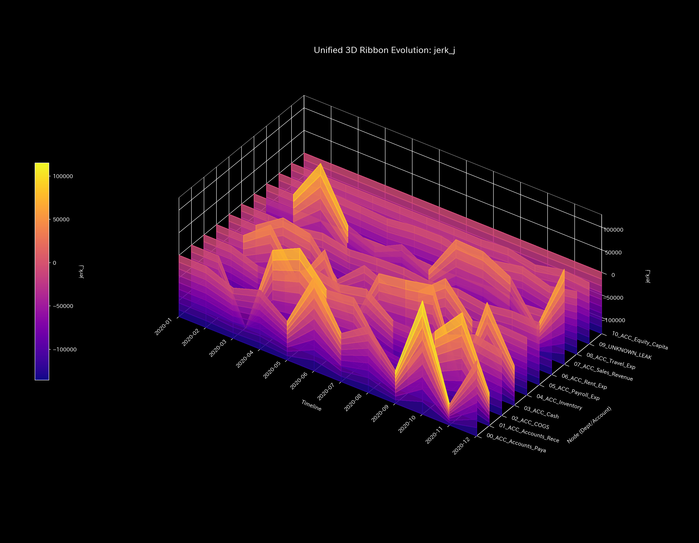
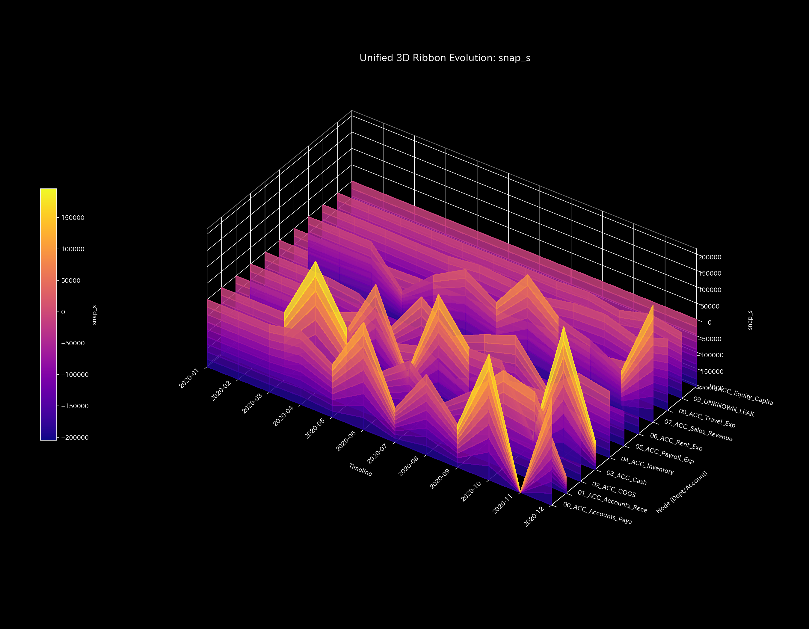

# Composite Abuse Final Report (Case 4)

> [!NOTE]
> A more detailed technical clinical report is available in [clinical_report.md](clinical_report.md).

## Target Organization: Sample 4

---

## 0. Executive Summary

* **Final Diagnosis:** 【Critical / Immediate Action】 Fictitious circular transactions (wash trades) and off-book siphoning of capital (embezzlement) are occurring simultaneously.
* **Holistic Health Constitution:** 
  Total assets (**"Physique"**) decline over time due to a cumulative leakage of `$6,255.99`. Transaction friction (**"Autonomic System"**) is highly disturbed. Multiple connection locks (**"Arteriosclerosis"**) have developed. Jerk and Snap record sharp oscillations in late steps, indicating final system collapse.
* **Key Stagnations & Interventions:**
  - **Stiff Shoulder (Stagnation):** **`07_ACC_Sales_Revenue`** (viscosity upper 25% boundary) shows severe delays, peaking at **2020-12**.
  - **Acupuncture Points (Treatment Nodes):** **`03_ACC_Cash`** and **`01_ACC_Accounts_Receivable`** (strain energy lower 25%) are the optimal nodes to dissolve the lock.
  - **Contraindications (Avoid Direct Intervention):** Directly adjusting **`07_ACC_Sales_Revenue`** or **`09_UNKNOWN_LEAK`** will cause severe topological stress and must be avoided.

---

## 1. Final Diagnosis (Critical)

### 【Diagnosis】: Composite Abuse (Loop & Leak)

Ledger audits reveal a total physical mass leakage of `$6,255.99` (non-zero conservation residual). Simultaneously, spectral radius $\rho$ remains high at `0.7861`, confirming active wash trading. Standard Z-scores fail to flag the chronic anomalies due to model pollution, but topological metrics consistently capture both.

---

## 2. Holistic Health Constitution Analysis

The organization's flow capacity maps to the following constitutional parameters:

### ① Physique (Capital Scale)

Total B/S assets (Physique) exhibit a steady downward trend, proving that cash reserves are being siphoned off-book.

### ② Immunity (Shock Absorption Capacity)

Immune buffer capacity (Free Energy) is severely depleted, leaving the organization vulnerable to minor operational shocks.

### ③ Autonomic System (Entropy & Flow Efficiency)

The T-S diagram depicts transaction diversity loss and abnormal friction heat (Entropy), showing systemic disruption.

### ④ Arteriosclerosis (PCA Stiffness Evaluation)

PCA EVR PC1 climbs to 95.28% and loadings freeze, proving that the flow pathways have lost elasticity and are locked onto the siphoning bypass and circular trading loops (Arteriosclerosis).

### ⑤ Shockwaves (Jerk and Snap Trends)

* **Mathematical Bridge:**
  Jerk and Snap exhibit sharp spikes at t=1 and t=8, followed by severe high-frequency oscillations in late steps. This mathematically proves that the system suffers from sudden transaction shocks and final system knocking.

---

## 3. Key Stagnations & Interventions

### ⚠️ Stiff Shoulder (Chronic Delays)

* **Stagnation Nodes:** Upper 25% viscosity includes **`07_ACC_Sales_Revenue`** and **`04_ACC_Inventory`**.
  - **`07_ACC_Sales_Revenue`**: Peaked at **`2020-12`** due to fictitious year-end transaction delays.

### 🎯 Acupuncture Points (Optimal Treatment Nodes)

* **Treatment Nodes:** Strain energy lower 25% includes **`03_ACC_Cash`** and **`01_ACC_Accounts_Receivable`**.
  - **Intervention Advice:** Modifying these nodes allows smooth cash flow adjustments to dissolve the lock.

### 🚫 Contraindications
* **Avoid Direct Intervention:** High strain energy (upper 25%) nodes include **`09_UNKNOWN_LEAK`** and **`07_ACC_Sales_Revenue`**.
  - **Intervention Advice:** Modifying these nodes directly will distort the ledger topology, triggering high backlash stress.

### ⚡ Stiffness Temporal Difference ($\Delta K_t$)
* **Stiffness Difference Heatmap Sequence:**
  - **t=1**: 
  - **t=5**: 
  - **t=8**: 

* **Mathematical Bridge:**
  The difference $\Delta K_t$ spikes red at t=1, t=5, and t=8, capturing the dynamic formation of both circular loops and siphoning bypass paths.

---

## 4. Falsifiability Conditions

To falsify this "Composite Abuse" diagnosis, one must present:

1. **Undisclosed Sales Shipping Waybills:**
   Physical waybills proving that the circular trade values ($138,655.85) correspond to legitimate shipping costs.
2. **Third-Party Bank Remittance Logs:**
   Independent SWIFT logs showing that all external transfers were routed to registered partners.

---
*Published by: TLU Mathematical Diagnostics Engine*
