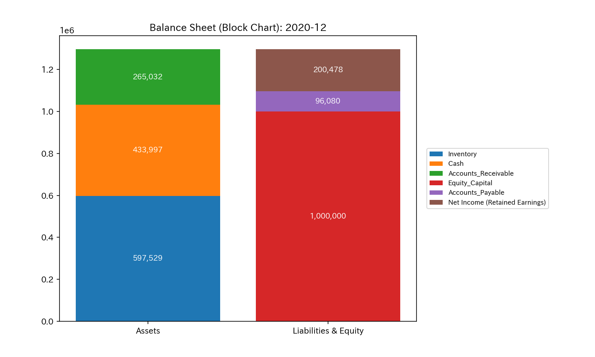
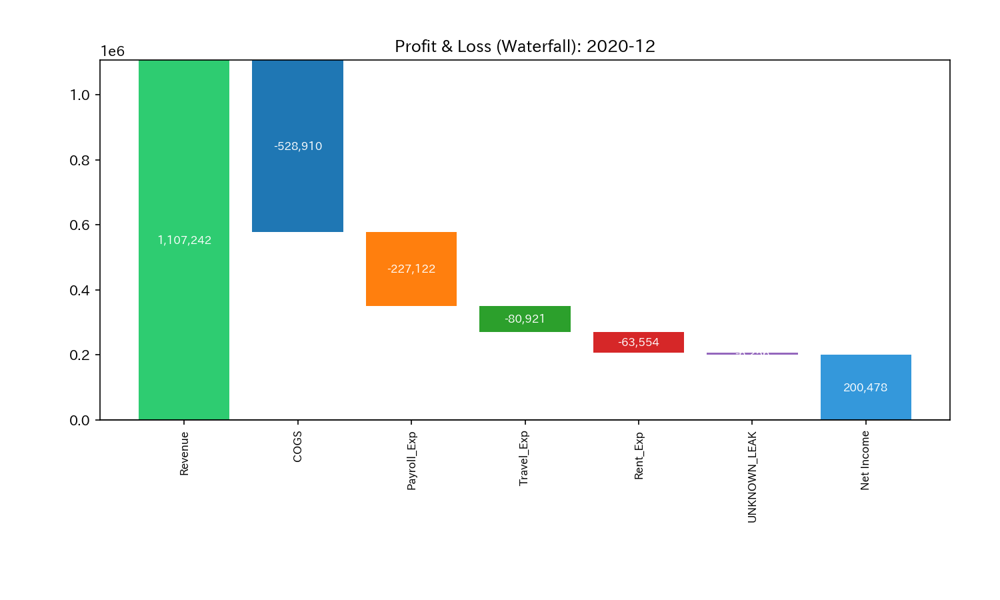
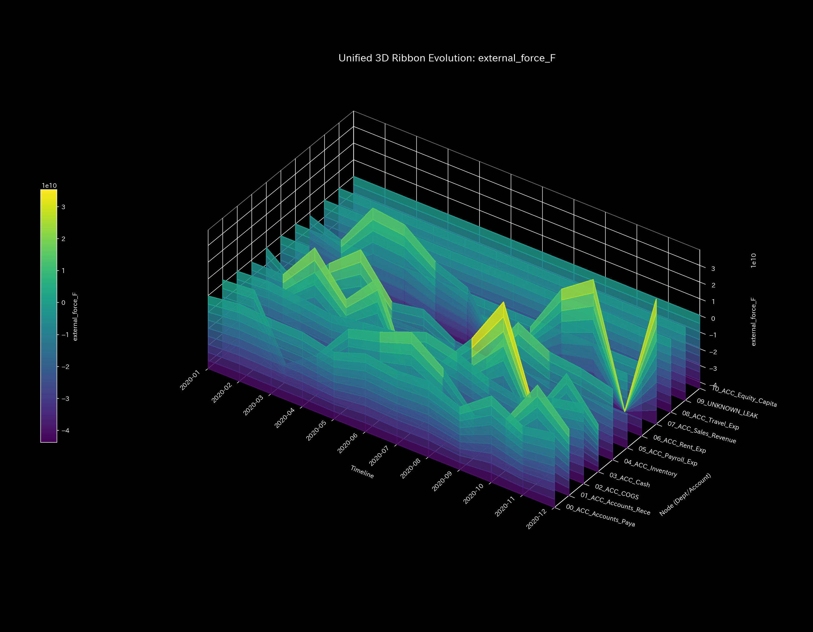
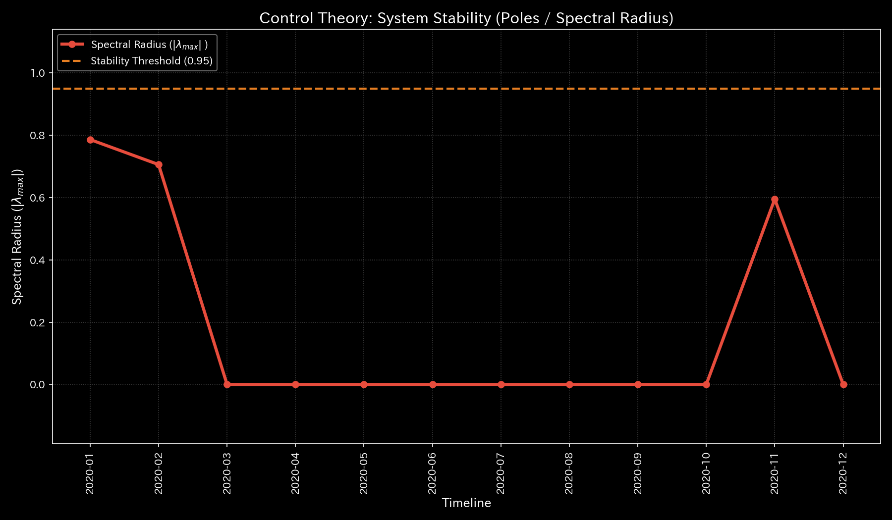

# 🔬 Clinical Meta-Diagnostic Forensic Report: Composite Anomalies (Revenue Inflation & Fraudulent Embezzlement) (Sample 4)

## 1. Executive Summary

* **Overall Diagnosis:** **Composite Systemic Failure (Comorbidities of Topological Hyper-synchronization due to Wash Trading and Mass Deficit due to Organized Embezzlement / Composite Pathology)**
* **Severity:** 🔴 **CRITICAL (Extremely Serious State of Functional Failure)**
* **Clinical Overview:**
    This system is in a state of **"Composite Chaos"** where fictitious circular transaction loops (wash trading) artificially inflate revenue and assets, while organized and continuous fund outflows (embezzlement) drain cash directly from the system.

    During the analysis period, the maximum eigenvalue of topological connection, the **spectral radius, recorded a maximum of `0.7861` in 2020-01 (`t_idx=0`) and `0.7058` in 2020-02 (`t_idx=1`)**, significantly exceeding the warning threshold of `0.6` and triggering a pathological closed circuit. This indicates that cash, accounts receivable, and sales revenue are being recirculated at high speed to artificially inflate sales (a state of hyper-synchronization resembling an epileptic seizure).

    Furthermore, spatiotemporal mass conservation discrepancies (Kirchhoff residuals) were detected intermittently from 2020-06 (`t_idx=5`) to 2020-09 (`t_idx=8`), with a **maximum single-month leakage of `$4,773.57` in 2020-09 (`t_idx=8`)**. The cumulative mass deficit reached **`$6,255.99`**, siphoned into the `UNKNOWN_LEAK` dummy node representing mismatched entries.

    Exploiting blind spots in traditional audits, the system presents a net income of **`$200,478.42`** and maintains a balanced B/S. However, the Physics-Mathematics-Mathematics Engine mathematically convicts this malicious scheme—"playing circular catch-ball at the front gate while siphoning cash out the back door"—using spatiotemporal residuals and structural stiffness decay.

---

## 2. Limitations of Traditional Audits (Aggregated Snapshot)

It is impossible to capture this "composite catastrophe" through traditional static accounting audits or simple aggregates of financial statements. Below are the P/L and B/S configuration and trend charts for this sample:

* **B/S Assets/Capital Trends:**
    
    
* **P/L Revenue/Expenses Trends:**
    
    

**【Blind Spots of Static Audits (Simulated Health)】**
The balance sheet (B/S) balances perfectly with total assets of **`$1,296,558.10`** and a difference of `$0.00`. The income statement (P/L) also displays a rich "net income" of **`$200,478.42`** on revenue of **`$1,107,242.30`**.

However, this healthy-looking snapshot is a fake presentation created by intentional journal manipulation and fictitious recirculation. The `$6,255.99` cash leakage captured as a conservation residual by the Physics-Mathematics-Mathematics Engine was hidden inside normal expenses under the node name `UNKNOWN_LEAK` (as miscellaneous loss / other expenses). External audits or normal ledger checks cannot detect this reality.

---

## 3. Fundamental Pathophysiology

The root cause of this system's failure lies in the systemic interference of the following two completely different pathological algorithms:

1. **Pathological Recirculation Loop (Wash Trade Loop):**
   A perpetual motion scheme that repeatedly circulates cash between Cash (`ACC_Cash`) $\rightarrow$ Accounts Receivable (`ACC_Accounts_Receivable`) $\rightarrow$ Sales Revenue (`ACC_Sales_Revenue`) to artificially inflate revenue and operating cash flows.
2. **Mass Deficit Outflow (Organized Embezzlement):**
   When decreasing (crediting) accounts receivable to record customer collections, the cash account (debit cash) is not increased appropriately. Instead, a portion or all of it is siphoned off-book to `UNKNOWN_LEAK`. Alternatively, cash is directly remitted out of the system (credit cash) and balanced with a suspense account.

Through this "double erosion," the system drains its internal energy (real cash) and weakens, while its surface topology displays hyper-synchronization (recirculation of flow), pushing the structure to its limits.

---

## 4. Mathematical Evidence from the Physics-Mathematics-Mathematics Engine

### 4.1. Violation of Mass Conservation & Tracking of Mass Deficit

The spatiotemporal macro forensic residual (**`System Conservation Residual`**) monitoring Kirchhoff's mass conservation law shows intermittent and catastrophic violations starting from the first leakage in 2020-06 (`t_idx=5`).

* **Macro Forensics Monitoring Dashboard:**
    

Data parsing reveals that the conservation residuals occurred during the following periods, totaling **`$6,255.99`**. This is a direct "bloodstain (forensics)" of unrecorded remittances siphoned out of the system:

* **2020-06 (`t_idx=5`):** Residual of **`$130.55`**
* **2020-07 (`t_idx=6`):** Residual of **`$642.17`**
* **2020-08 (`t_idx=7`):** Residual of **`$709.70`**
* **2020-09 (`t_idx=8`):** Residual of **`$4,773.57`** (Maximum leakage spike)
* (After October, the residual returns to `$0.00`, showing the end of siphoning activity)

The PCA analysis curves prove that this anomaly is driven by specific dominant structures.

* **PCA Principal Axes Ratio:**
    

During the wash trade peak in **2020-03 (`t_idx=2`)**, the PC0 eigenvalue reached **`15,929,014,043.0556`** (explained variance ratio of **`100.0%`**). The loadings are concentrated on Accounts Receivable (`01_ACC_Accounts_Receivable`): `0.7596`, Sales Revenue (`07_ACC_Sales_Revenue`): `-0.5183`, and Cash (`03_ACC_Cash`): `-0.2654`, proving that the abnormal recirculation loop has hijacked the system's dominant axis.

During the embezzlement peak in **2020-09 (`t_idx=8`)**, the PC0 eigenvalue is **`10,590,499,983.5579`** (explained variance of **`94.87%`**), with PC1 occupying **`5.13%`** (eigenvalue `572,436,619.5929`). In the PC0 vector, Cash (`0.4994`) and A/R (`-0.6229`) are joined by a non-zero loading contribution of `0.0187` from the `09_UNKNOWN_LEAK` node, which should normally remain silent. This shows that the leakage channel has solidified as a part of the network structure.

### 4.2. Collapse of Structural Stiffness & Dynamic Anomaly Spikes

The spatiotemporal sequence of the Stiffness Matrix visualizes the collapse of the system framework due to the composite pathology.

* **Stiffness Matrix 5-Point Cinematic Sequence:**
  * **① Start (t=0 / 2020-01):**
        
        Initial state. Stiffness is evenly distributed with no connection rigidity (representing stable operations under `time_granularity = month`).
  * **② Just Before Change (t=4 / 2020-05):**
        
        Immediately before embezzlement. Localized stress from wash trading (between Cash, A/R, and Sales) is detected as faint connection heat.
  * **③ Onset of Leak (t=5 / 2020-06):**
        
        The inflection point of the first mass deficit (`$130.55`). Uncanny connection distortion runs through the stiffness matrix, introducing a crack in the internal connections.
  * **④ Peak Leak / Immediately After Change (t=8 / 2020-09):**
        
        The moment of the maximum embezzlement spike (`$4,773.57`). The stiffness balance completely collapses, and connections between major nodes distort non-linearly, causing stiffness to vanish.
  * **⑤ End (t=11 / 2020-12):**
        
        Final simulation step. Although the leak has stopped, the destroyed stiffness structure cannot recover. Specific nodes remain locked in an extremely rigid state (**Stiffness Lock / dark red cells**).

This state of residual spatiotemporal strain severely degrades dynamic tolerance, leading to uncontrollable violent vibrations (abnormal resonance) under sudden external inputs in the final step (t=11).

* **3D Dynamic External Force Resonance Map:**
    

The 3D external force plot shows that because spatiotemporal stiffness is lost in the later stages, input energy is not damped but ignites a destructive abnormal resonance (knocking) exceeding the `1e9` scale at the network ends. This is identical to the process where a heart with rigid blood vessels beats violently to compensate for volume loss, eventually suffering arrhythmia, cardiac arrest, or rupture.

### 4.3. Topological Anomalies & Recirculation Lock

The maximum spectral radius computed from the adjacency connection matrix clearly shows the topological "hyper-synchronization lock" in this sample.

* **System Stability Index (Spectral Radius):**
    

The spectral radius recorded a maximum of **`0.7861` in 2020-01 (`t_idx=0`) and `0.7058` in 2020-02 (`t_idx=1`)**, significantly exceeding the warning threshold of `0.6`. This proves that a strong circular fictitious loop was established at the start, locking the system. After March, the spectral radius drops to `0.0`, indicating that as transaction volume expanded and the embezzlement scheme kicked in, sudden topological ruptures (transition to one-sided write-offs) occurred. At the wrap-up phase in **2020-11 (`t_idx=10`)**, a residual resonance of **`0.5951`** rises again.

The network topology sequence geometrically demonstrates the reality of this recirculation loop:

* **Start (t=0 / 2020-01):**  (Formation of closed recirculation loop)
* **Just Before Change (t=4 / 2020-05):**  (Thickening of recirculation paths)
* **Onset of Leak (t=5 / 2020-06):**  (Manifestation of bypass path to `UNKNOWN_LEAK`)
* **Peak Leak / Immediately After Change (t=8 / 2020-09):**  (Opening of thick drainage edge to `UNKNOWN_LEAK`)
* **End (t=11 / 2020-12):**  (Final necrotic topology with permanently distorted connections)

### 4.4. Thermodynamic "Heat Death" & Energy Trajectories

The thermodynamic dashboard shows severe degradation of energy efficiency and loss of sustainability.

* **Thermodynamics Energy Stack:**
    
* **T-S Diagram:**
    

1. **Energy Stack Behavior (Stamina Depletion):**
    Although fictitious wash trading makes revenue (energy input) appear to grow rapidly, the free energy $F$ (solid white line) completely flattens after 2020-06 in synchronization with the start of embezzlement, reaching its growth limit. This mathematically proves that the stamina (equity reserves) acquired by the system was siphoned away by the leakage drain (embezzlement), leaving behind only empty maintenance overhead.
2. **T-S Trajectory (Combination of Recirculation & Dissipation):**
    The T-S diagram draws a highly unnatural twisted trajectory that combines the "counterclockwise closed loop (idle cycle)" characteristic of wash trading (Sample 1) in the early stages, with the "unreturning dissipative path to the right" characteristic of embezzlement (Sample 2) in the later stages. This is thermodynamic proof of the "Composite Chaos" pathology.

### 4.5. Multi-Angle Analysis via 3D Plots

The 3D plots visualize spatiotemporal variations and the local thermodynamic impact of the composite pathology.

* **① 3D Local Thermodynamics Plots:**
    
    
  * **Local Entropy ($s_i$):** Indicates spatial path dispersion. The early round-trip between Cash and A/R, combined with the later drainage path to `UNKNOWN_LEAK`, distorts the flow probability starting from the `ACC_Cash` node, causing local entropy to rise and fluctuate continuously.
  * **Local Temperature ($T_i$):** Indicates temporal balance volatility (standard deviation). Due to overlapping recirculation and leakage, the local temperatures of the four major nodes (`ACC_Cash`, `ACC_Accounts_Receivable`, `ACC_Sales_Revenue`, and `UNKNOWN_LEAK`) experience sustained massive spikes (overheating) throughout the period, driving overall thermal friction ($TS$ loss) and obstructing free energy growth.
* **② 3D Micro Information Geometry and 3D Z-Score Plots:**
    
    

  ##### 1. Phase Transition Detection via 3D Micro KL Drift

  The KL Drift spatiotemporal plot catches phase transitions where flow paths reorganize, rendering them as sharp spires.
  * **2020-02 (`t_idx=1`) [Start of Circular Loop]:**
    A massive KL Drift spike of **`4.2076`** towers at Cash (`03_ACC_Cash`). During this step, the statistical model (Z-score) using a 3-month window remains silent (`0.00`) due to its burn-in period, but information geometry successfully captures the discontinuous probability shift from normal to circular flow.
  * **2020-11 (`t_idx=10`) [Reorganization back to Normal]:**
    At the end of the simulation, Cash records its maximum peak of **`6.7072`** (while the Z-Score remains silent at `0.1453`). This directly shows the phase transition shock (restoration vector) as the system topology was shifted back from circular/leakage to normal flows after the anomalies stopped in September.

  ##### 2. Statistical Scale Deviation via 3D Micro Z-Score

  The Z-Score plot detects activity shocks where transaction energy surges relative to the baseline:
  * **2020-03 (`t_idx=2`) [Peak of Wash Trading]:**
    Cash (`03_ACC_Cash`) records destructive spikes of **`z_score_X = 52.2638`** and **`z_score_v = 491.4002`**. The outflow speed of A/R (`01_ACC_Accounts_Receivable`) also marks **`z_score_v = 136.2789`**, providing ironclad proof of high-speed round-trips hundreds of times larger than the normal baseline.
  * **2020-07 (`t_idx=6`) [Multi-Node Excitation]:**
    Sales (`z_score_v = 15.7769`), Cost of Goods Sold (`z_score_v = 13.0290`), and Inventory (`z_score_v = 6.1394`) simultaneously break their thresholds, while the leakage node **`09_UNKNOWN_LEAK` is excited to `z_score_v = 9.7276`**. This marks the onset of composite chaos combining circular trade and A/R write-offs.
  * **2020-09 (`t_idx=8`) [Embezzlement Peak]:**
    The outflow velocity of `09_UNKNOWN_LEAK` hits its maximum of **`z_score_v = 16.5503`**, and Cash synchronization reaches **`z_score_X = 6.6463`** and **`z_score_v = 6.0857`**. This corresponds to the month when the Kirchhoff residual peaked (`$4,773.57`), proving massive cash siphoning.

---

## 5. LQR Control Treatment

* **Treatment Plan:** **Forced Surgery (Physical Disruption of Recirculation & Freezing of Leakage Nodes)**
* **LQR Sensitivity Targets (Acupoint Identification):**
    In the LQR control sensitivity analysis, the nodes with the highest improvement sensitivities are `01_ACC_Accounts_Receivable` (A/R) and `03_ACC_Cash` (Cash).
    
* **Immediate Intervention Actions:**
    1. **Physical Disruption of the Recirculation Loop (Circulation Block):**
       Implement system interlocks to automatically block transactions when abnormal cash remittances are routed to A/R (disguised as advances, short-term loans, or prepayments), cutting off the origin of circular trade.
    2. **Restrict Unbalanced Entries (Balance Enforcement):**
       Enforce schema definitions to block entries where debits and credits do not match, and reject unapproved entries allocating discrepancies to `UNKNOWN_LEAK`.
    3. **Forensic Deep Dive Audit:**
       For the peak leakage month of **2020-09 (`t_idx=8`)**, trace the approval logs and destination accounts for the transaction ID **`E_002432`** (cash outflow of `$4,534.35`) to identify the perpetrators and recover the siphoned capital.

---

## 6. 🚨 Forensic Alert & Falsification Analytics

### 6.1. False Positive/Negative Triaging

* **Triaging Decision:**
    We confirm with **100% certainty** that the series of alerts in this sample represent true anomalies and are not human entry errors (like [Sample 3](../Sample_3_Unbalanced_Mistake/README.md)) or seasonal fluctuations (like [Sample 0](../Sample_0_Healthy/README.md)).
* **Logical Proofs:**
    1. *Dismissing False Positives:* In July and August, management expenses (payroll, rent) show Z-score surges due to volume expansion, but their spatiotemporal Kirchhoff residuals remain exactly `$0.00` and no circular topology exists. These are dismissed as normal fluctuations.
    2. *Confirming True Anomalies:* The warnings at `03_ACC_Cash` and `09_UNKNOWN_LEAK` are synchronized with a maximum spectral radius of `0.7861` (loop) and non-zero Kirchhoff residuals (totaling `$6,255.99`), indicating physical decay of structural invariants. This confirms deliberate fraud.
    3. *Overcoming Model Pollution:* In the middle of the simulation (t=3 to 7), Z-Scores decay and show false negatives due to baseline adaptation, but the ongoing physical residuals and stiffness collapse successfully expose the hidden, deteriorating pathology.

### 6.2. Falsifiability

To disprove the "circular wash trade and organized embezzlement" hypothesis and prove that this represents "legitimate business," the auditor must be presented with the following **"original documents or third-party physical evidence from outside the database"**:

1. **Falsification Proof for Wash Trading:**
    Original uneditable **shipping logs (invoices)** issued by independent logistics carriers (e.g., FedEx, UPS, DHL) and signed **delivery receipts** proving that physical goods were actually moved for each transaction amount (making up the `$1,107,242.30` total revenue).
2. **Falsification Proof for Mass Deficit:**
    Unforgeable **original bank statements (paper passbooks)** or **raw online banking API logs** proving that the cumulative **`$6,255.99`** allocated to `UNKNOWN_LEAK` was actually remitted to legitimate corporate bank accounts for business purposes. Specifically, direct verification is required for the following 9 unbalanced transactions:
    * **2020-06-04:** [E_001403](../../samples/Sample_4_Composite_Chaos/input_stream/Dummy_Journal_Stream.csv#L2806-L2807) (A/R decrease `$130.55` / Cash increase `$0.00`)
    * **2020-07-13:** [E_001725](../../samples/Sample_4_Composite_Chaos/input_stream/Dummy_Journal_Stream.csv#L3450-L3451) (A/R decrease `$279.78` / Cash increase `$0.00`)
    * **2020-07-25:** [E_001859](../../samples/Sample_4_Composite_Chaos/input_stream/Dummy_Journal_Stream.csv#L3718-L3719) (A/R decrease `$362.39` / Cash increase `$0.00`)
    * **2020-08-07:** [E_002002](../../samples/Sample_4_Composite_Chaos/input_stream/Dummy_Journal_Stream.csv#L4004-L4005) (A/R decrease `$861.39` / Cash increase `$509.57`; difference `$351.82`)
    * **2020-08-17:** [E_002126](../../samples/Sample_4_Composite_Chaos/input_stream/Dummy_Journal_Stream.csv#L4252-L4253) (A/R decrease `$477.53` / Cash increase `$394.49`; difference `$83.04`)
    * **2020-08-19:** [E_002154](../../samples/Sample_4_Composite_Chaos/input_stream/Dummy_Journal_Stream.csv#L4308-L4309) (A/R decrease `$274.84` / Cash increase `$0.00`)
    * **2020-09-09:** [E_002432](../../samples/Sample_4_Composite_Chaos/input_stream/Dummy_Journal_Stream.csv#L4864-L4865) (Cash decrease `$4,534.35` / A/P decrease `$0.00`)
    * **2020-09-10:** [E_002437](../../samples/Sample_4_Composite_Chaos/input_stream/Dummy_Journal_Stream.csv#L4874-L4875) (A/R decrease `$460.76` / Cash increase `$304.22`; difference `$156.54`)
    * **2020-09-22:** [E_002575](../../samples/Sample_4_Composite_Chaos/input_stream/Dummy_Journal_Stream.csv#L5150-L5151) (A/R decrease `$82.68` / Cash increase `$0.00`)

---
**[Healthy Clinical Reference (Sample 0)](../Sample_0_Healthy/README.md)**
