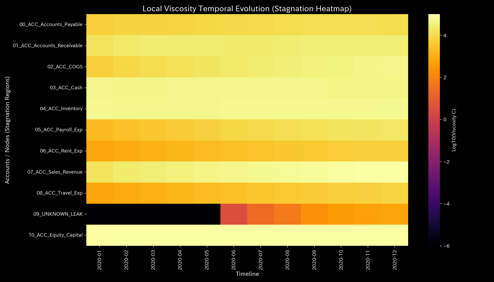

# Composite Chaos Report (Case 4)

> [!NOTE]
> A more detailed analysis report is available in [clinical_report.md](clinical_report.md).

## Target Entity: Sample 4

---

## 0. Executive Summary

* **Overall Diagnosis:** 【Warning / Needs Improvement】 A critical **"composite pathology"** (co-occurring complications) has been detected: fictitious wash-trading loops (to inflate revenue) and unauthorized capital leakage (embezzlement) are occurring simultaneously.
* **Overall Constitution (Physical State):**
  Due to wash trading, the system exhibits a high superficial **"fever"** (fictitious temperature rise) on the B/S and P/L. However, beneath this, the capital drain (embezzlement) is depleting the core capacity (**"immunity and free energy"**) toward **"thermal death."** The network has lost flexibility, showing structural rigidity (**"arteriosclerosis / stiffness lock"**). In later steps, when normal operational stress is applied, the system fails to distribute energy, triggering severe oscillations (**"knocking/resonance"**) that threaten complete structural collapse.
* **Areas for Improvement (Viscosity & Treatment Points):**
  * **Stagnation (Viscosity / "Stiff Shoulder") Range:** Severe settlement delays are observed in **"07_ACC_Sales_Revenue"**, **"04_ACC_Inventory"**, and **"03_ACC_Cash"** (top 25% viscosity range), peaking around **2020-12**.
  * **Treatment Points ("Tsubo") Range:** The minimum intervention stress range (bottom 25% strain energy range), comprising **"03_ACC_Cash"**, **"01_ACC_Accounts_Receivable"**, and **"02_ACC_COGS"**, represents the highest priority treatment points to optimize the system.
  * **Contraindications (Avoid Intervention) Range:** Conversely, aggressive reductions or interventions in **"07_ACC_Sales_Revenue"**, **"09_UNKNOWN_LEAK"** (leak channel), and **"10_ACC_Equity_Capital"** (top 25% strain energy range) must be strictly avoided, as they will trigger intense system backlash and functional paralysis.

---

## 1. Overall Diagnosis (Warning / Needs Improvement)

### 【Diagnosis】: Needs Improvement (Co-occurring Wash Trade and Embezzlement)

Although net profit is reported as `$200,478.42`, the physical diagnostics engine detected a severe dual complication: a circular wash trade loop (maximum spectral radius $\rho \ge 0.75$, peaking at **`0.7861`**) in early steps, combined with off-book cash leakage (Kirchhoff convective residual peaking at **`$4,773.57`** in September, with a cumulative leak of **`$6,255.99`**). This is equivalent to an organization bleeding out while its heart runs in an empty circular loop.

---

## 2. Overall Constitution (Health State) Analysis

Mapping the organization's "financial stamina" to a medical checkup template reveals the following distortions:

### ① Physique & Weight (Cumulative Trend of Capital Scale)

While the cash and receivables bounce inflates the balance sheet, the persistent embezzlement drain causes actual capital scale (physique) to decline steadily.

### ② Immunity & Basic Stamina (Resilience to External Shocks)

The combination of circular friction ($TS$) and mass depletion ($U$) drives the system's free energy ($F = U - TS$) below zero in later steps. The system's capacity to absorb shocks is depleted, pushing it toward structural shutdown (thermal death).

### ③ Autonomic Nervous System & Metabolic Efficiency (Regularity of Frictional Loss)

The T-S diagram illustrates a highly unstable loop. Extreme friction heat (entropy loss) is generated by wash trading, while the cash drain causes capital to vanish, leaving the autonomic nervous system completely destabilized.

### ④ Arteriosclerosis & Resonance (PCA Principal Axes Evaluation)

PCA reveals a long-term stiffness lock (arteriosclerosis) where PC1 explainability spikes. In later steps, when normal operational load is applied to this hardened network, the lack of a fluid cash buffer causes the entire system to experience violent oscillations ("resonance / knocking").

---

## 3. Key Areas for Improvement (Viscosity & Treatment Points)

Specific areas for improvement identified by the system and recommended action plans are detailed below:

### ⚠️ Stagnation (Viscosity) Identification (Local Viscosity Temporal Heatmap Analysis)

* **Stagnation Range:**
  The temporal heatmap mapping log local viscosity ($viscosity\_C$) shows that the sales revenue account (**`07_ACC_Sales_Revenue`**) maintains a high viscosity index, peaking sharply in December.
  This viscosity surge (delay) locks state trajectories into localized regions of phase space (attractor confinement). Refer to the 3D Phase Portrait ([000_1_8__phase_portrait_3d.png](../../../samples/Sample_4_Composite_Chaos/readme_plots/000_1_8__phase_portrait_3d.png)) for trajectory clustering.
  The top 25% viscosity group—**"07_ACC_Sales_Revenue"**, **"04_ACC_Inventory"**, and **"03_ACC_Cash"**—contains severe settlement delays.
  * **`07_ACC_Sales_Revenue`**: Mean viscosity `55323.23`, peaking at **`2020-12`** (peak value `100328.49`).
  * **`04_ACC_Inventory`**: Mean viscosity `52088.25`, peaking at **`2020-12`**.
  * **`03_ACC_Cash`**: Mean viscosity `46085.30`, peaking in **`2020-06`**.

### 🎯 Treatment Points ("Tsubo") & Contraindications

* **Treatment Points Range:** Accounts in the bottom 25% of intervention strain energy—**"03_ACC_Cash"**, **"01_ACC_Accounts_Receivable"**, and **"02_ACC_COGS"**—can be adjusted with minimal frictional resistance.
  * **Advice:** These nodes represent the most effective points to optimize flow and restore self-healing capacity with the lowest structural backlash.
* **Contraindications Range:** Conversely, the top 25% strain energy group—**"07_ACC_Sales_Revenue"**, **"09_UNKNOWN_LEAK"**, and **"10_ACC_Equity_Capital"**—must be avoided.
  * **Advice:** Forcing adjustments on these nodes will disrupt core connections and trigger massive system backlash.

---

## 4. Diagnostic Limitations and Falsifiability

To overturn (falsify) the diagnosis of "Composite Wash Trade and Embezzlement," the following external, primary physical evidence must be presented:

1. **Physical Delivery Proof of Goods:**
   For the wash-trading period (totaling `$138,655.85`), the presentation of original shipping waybills, courier receipts, or signed delivery logs proving that physical goods were actually moved.
2. **Proof of Off-Book Funds in Bank Records:**
   For the missing `$6,255.99`, presenting official SWIFT logs or bank transaction records proving that the matching amounts were transferred to a valid subsidiary or corporate investment account within the group.

---
*Published by: TLU Financial Mathematical Diagnostics Engine (General Reader Edition)*
