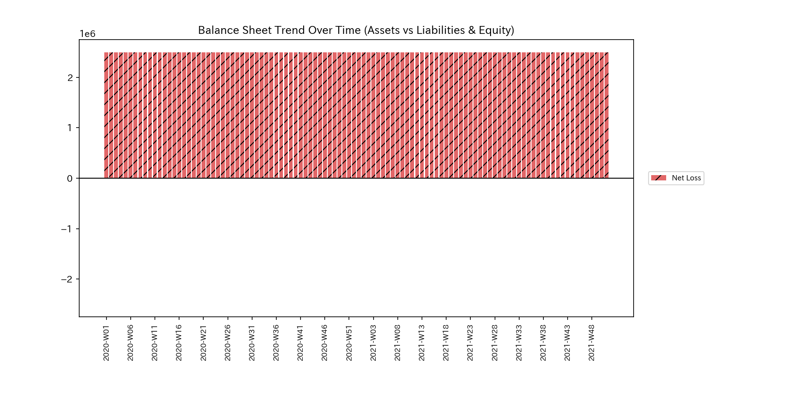
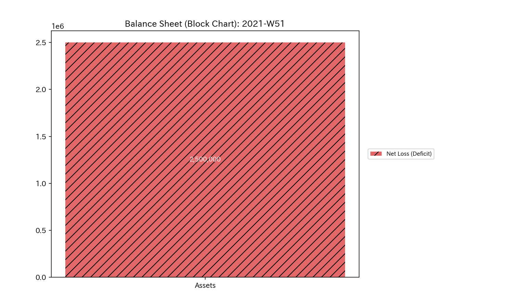
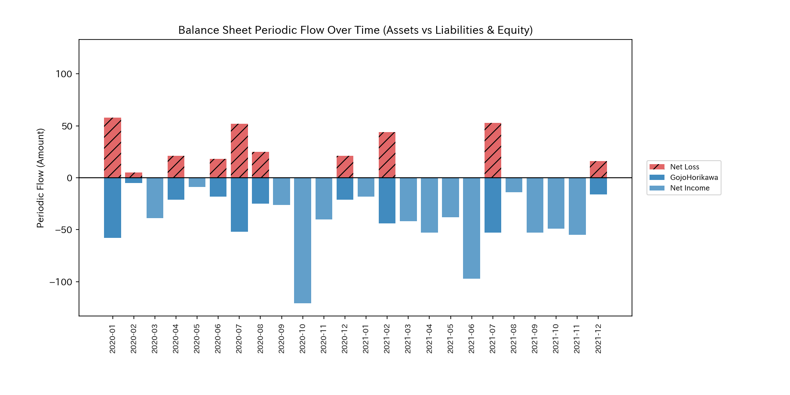
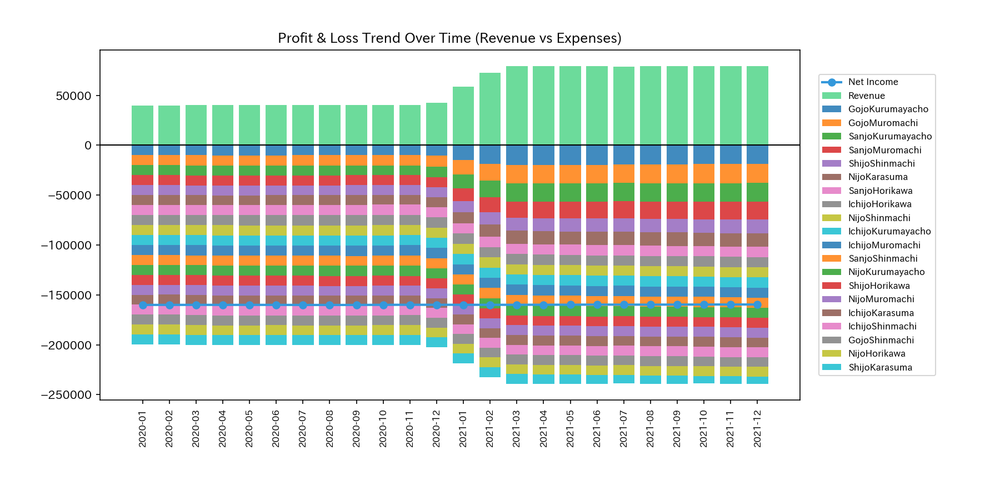
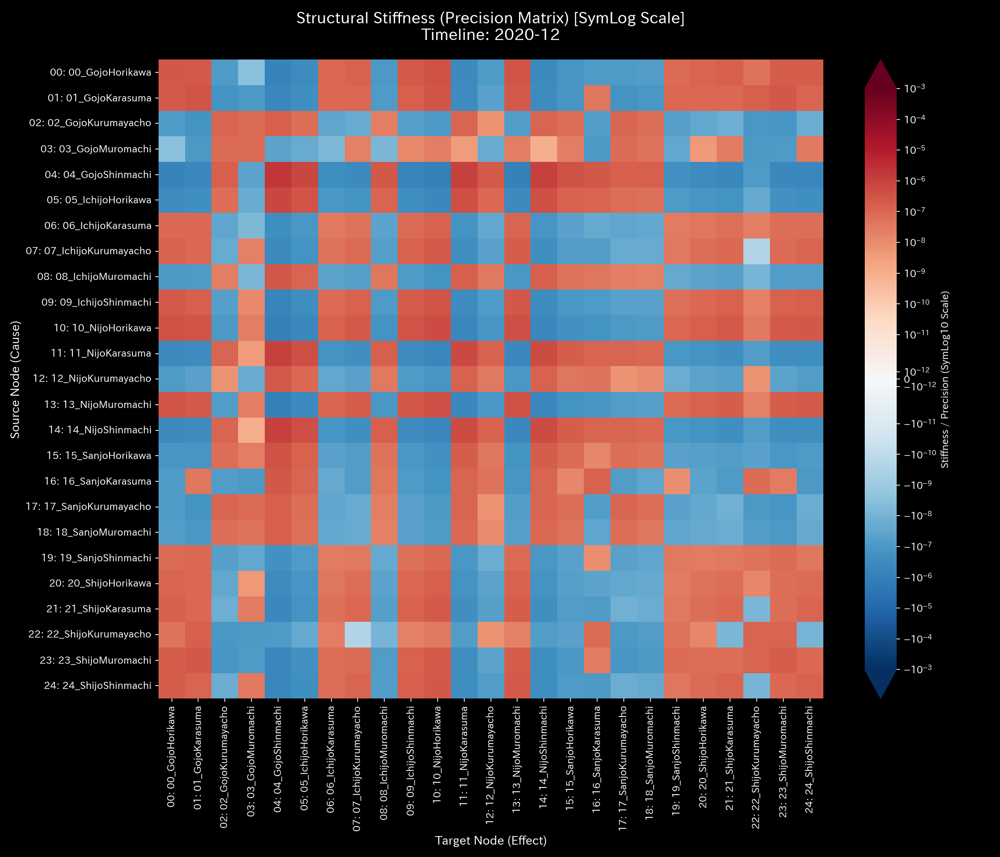
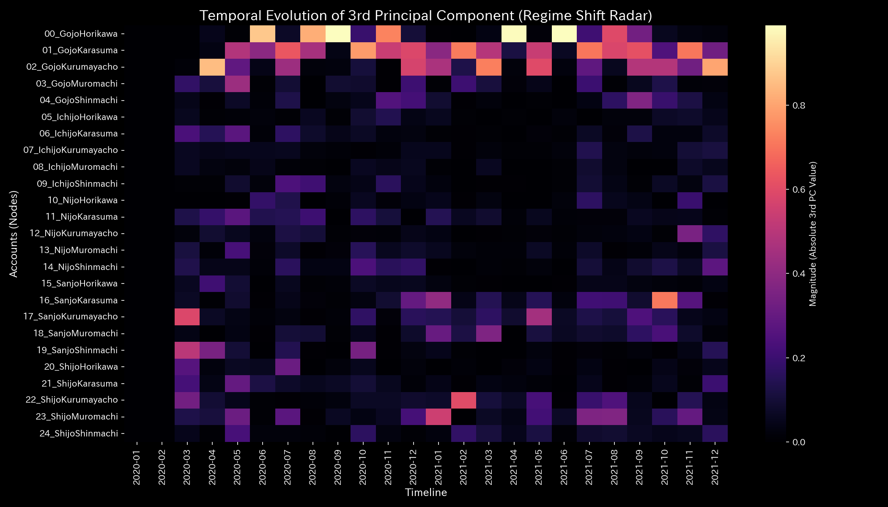
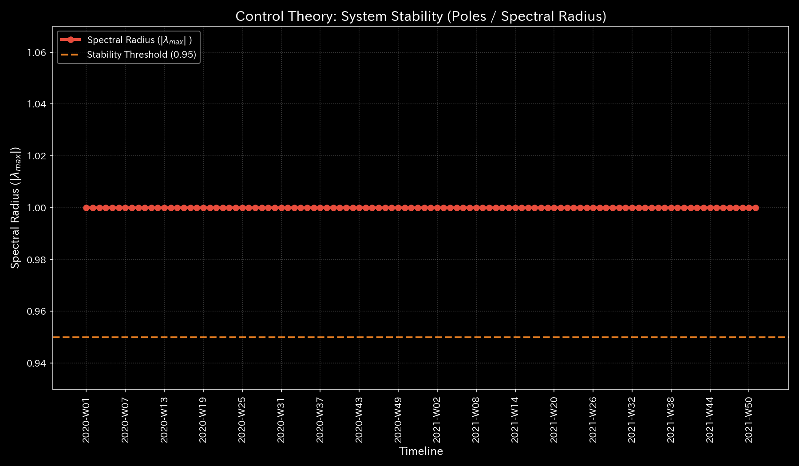
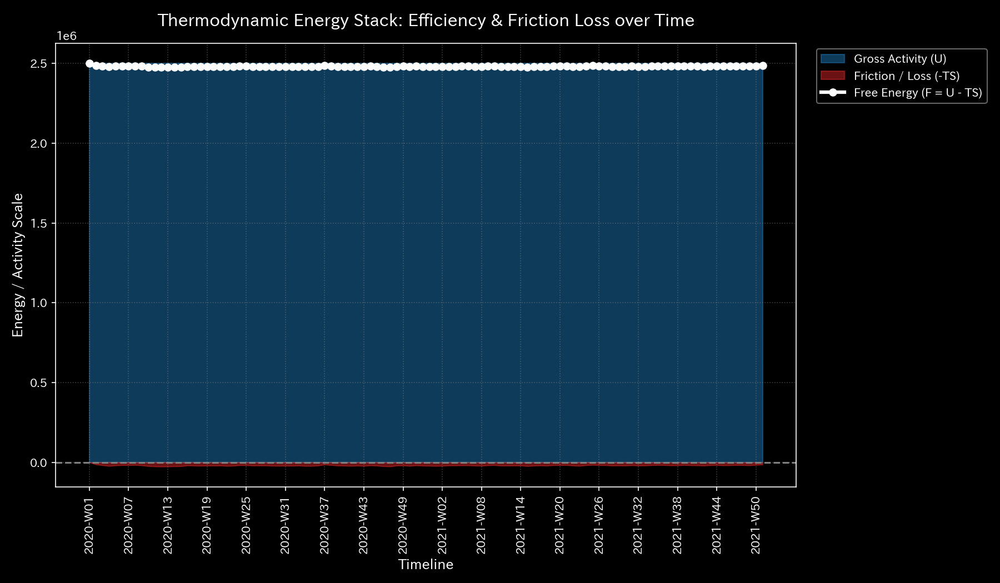
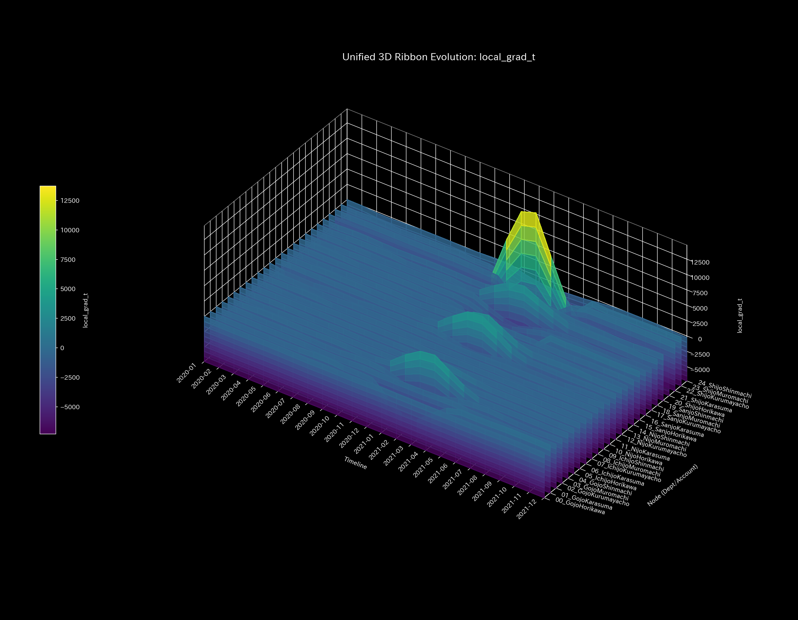
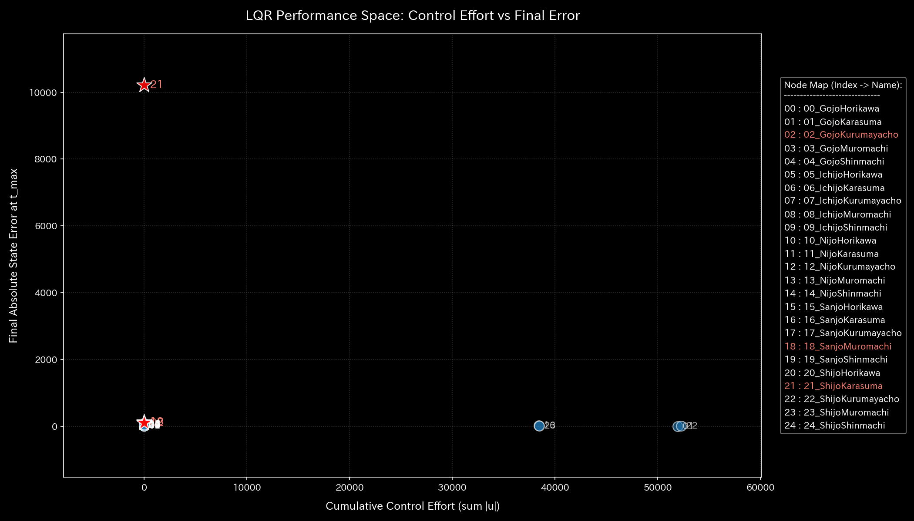

# 🔬 Clinical Forensic Report: Traffic Flow Paralysis and Thermodynamic Death in Urban Road Network (Sample 5)

> [!NOTE]
> **【Important】 Role and Characteristics of Sample 5 (Kyoto Traffic Simulation):**
> This sample models a closed flow system where vehicle counts (mass) are conserved across 25 central intersections in Kyoto. It simulates a pathology caused by local solidification (congestion bottlenecks) due to road construction or accidents.
> Unlike the financial and market samples, this is a demonstration of detecting and treating circular stasis and freezing in a traffic flow domain using thermodynamics (temperature, entropy, free energy) and information geometry (KL Drift) engines.

---

## 1. Executive Summary

* **Overall Status:** 🟡 **Local Thermodynamic Freezing of Urban Traffic Network (Kyoto Gridlock / Localized Freeze)**
* **Severity:** 🟡 **HIGH (Dysfunctional)**
* **Summary:**
  The system is a closed flow system where the total number of vehicles (internal energy $U = 250,000.0$ ) is conserved. In January 2021 ( $t=12$ ), inflow capacity restrictions (simulating road construction or accidents) began at the main intersection **`21_ShijoKarasuma`** (Shijo-Karasuma). This triggered flow stoppage.
  This anomaly is characterized by local thermodynamic freezing (solidification) rather than mass leakage. The local temperature (flow volatility) at Shijo-Karasuma fell from `97.15` ( $t=11$ ) to **`24.25`** at $t=13$ (2021-02), entering a frozen state. This formed a steep temperature gradient (local thermal stress / cold-island effect) with adjacent intersections.
  At the upstream intersection **`23_ShijoMuromachi`** (Shijo-Muromachi), the blocked outflow route reduced local entropy (spatial flow path dispersion $s_i$ ) from its normal level (~`1.99`) to **`1.6596`** ( $t=23$ ). The traffic is locked in a deadlock.

---

## 2. Comparison of Stock and Flow

We compare traditional cumulative financial statements (B/S, P/L equivalents) with the periodic (single-month, non-cumulative) transaction flows.

In traffic networks, the cumulative residual vehicle stock (B/S equivalent) eventually converges near `0.00`. We mapped the bottleneck intersection **`ShijoKarasuma`** as the **`Expense` (outflow rate)** and visualized the intersections.

### Balance Sheet Equivalent Comparison (B/S: Cumulative Vehicle Stock)

* **B/S Cumulative Vehicle Stock Trend & Block Chart:**
  
  

* **B/S Vehicle Stock Periodic Trend:**
  

### Income Statement Equivalent Comparison (P/L: Intersectional Flow)

* **P/L Cumulative Flow Trend:**
  

* **P/L Flow Periodic Trend:**
  

* **Observation and Blind Spots:**
  Examine the bottom half of the P/L periodic trend graph. The color band for Shijo-Karasuma (`ShijoKarasuma`) shrinks and disappears after **January 2021 (t=12)** when the capacity limit began.
  Standard static metrics can misinterpret this as "cost reduction (reduced intersection load)." In reality, the key intersection is frozen, destroying system balance. Conventional aggregation cannot detect this congestion. (The starting mass is managed at `GojoHorikawa`, which is mapped to `Equity`).

---

## 3. Pathophysiology

* **Diagnosis:** **Localized Traffic Gridlock**
* **Mechanism of Bottleneck (Original Traffic Stream Verified):**
  After January 2021 ( $t=12$ ), the inflow capacity of the Shijo-Karasuma intersection was restricted.
  1. **Upstream Accumulation and Phase Transition:**
     Vehicles accumulated at the upstream intersection `23_ShijoMuromachi` (Shijo-Muromachi). The outflow route was blocked, raising KL Drift to **`1.7572`** in 2021-01.
  2. **Loss of Route Options:**
     Because the exit route was blocked, the entropy $s_i$ at Shijo-Muromachi fell from ~`1.99` to **`1.6596`**. Vehicles lost the freedom to choose alternate routes, becoming locked in congestion.

---

## 4. Summary of Mathematical Analysis Results

### 4.1. Mass Conservation and Network Topology

The conservation residual (`System Conservation Residual`) remains exactly **`0.000000` (zero)** throughout. This proves that the system is a closed network with no vehicle loss, satisfying mass conservation.

* **Macro Forensics Dashboard:**
  

* **Network Topology Evolution:**
  * **2020-01 (t=0 - Initial Circulation):**
    
  * **2020-07 (t=6 - Normal state before bottleneck):**
    
  * **2021-01 (t=12 - Phase transition from Shijo-Karasuma restriction):**
    
  * **2021-07 (t=18 - Congestion propagates, locking flow probabilities):**
    
  * **2021-12 (t=23 - Final step; persistent biased topology fixes):**
    

### 4.2. Stiffness Connection & PCA (Stiffness & PCA)

The stiffness matrix evolution reveals that the entire network hardens over time.
In PCA, the PC1 contribution ratio rose from `54.65%` before the anomaly ( $t=6$ ) to **`64.70%`** in the final month ( $t=23$ ). Principal weights lock onto `14_NijoShinmachi` (`0.5034`) and `11_NijoKarasuma` (`-0.4200`), showing that the system's flexibility has degraded.

* **Evolution of Structural Stiffness Matrix:**
  * **2020-01 (t=0 - Low-stiffness flowing state):**
    
  * **2020-07 (t=6 - Stiffness before bottleneck):**
    
  * **2021-01 (t=12 - Stiffness change from Shijo-Karasuma block):**
    
  * **2021-07 (t=18 - Stiffness load shifts to other intersections):**
    
  * **2021-12 (t=23 - Final step; locked in permanent stiffness):**
    

* **Principal Axis Ratios & Eigenvector Evolution:**
  
  
  
  

### 4.3. Verification of Circular Topology (Spectral Radius)

The maximum spectral radius is exactly **`1.0000`** throughout. This is a mathematical consequence of a closed, strongly connected network. Thus, this anomaly is detected only by the **`kl_divergence_drift` spike (`1.7572` at t=12)**, which captures the distortion of flow distributions rather than connection changes.

* **System Stability Indicator:**
  

### 4.4. Thermodynamic Indicators and 3D Topology

The total vehicle count (internal energy $U = 250,000.0$ ) remains conserved. However, the macro entropy $S$ fell from `40.69` ( $t=11$ ) to **`39.18`** ( $t=12$ ) after the flow limits began.
The T-S diagram displays a closed freezing loop after January 2021, where both entropy and temperature shrink together. This is physical evidence that the system has lost flow and is locked in deadlock.

* **Thermodynamic Characteristics & 3D Trajectory:**
  
  
  

**【Visualization of 3D Local Thermal Stress】**

* **3D Local Entropy & Temperature:**
  
  
  The restriction at Shijo-Karasuma reduced the entropy at Shijo-Muromachi (`23_ShijoMuromachi`) to `1.6596`. The local temperature at Shijo-Karasuma fell to `24.25` at $t=13$, forming a yellow temperature gradient (`local_grad_t`) spire with adjacent nodes, showing localized thermal stress.
  

**【Identifying Structural Changes via 3D Micro KL Drift】**

* **3D Micro KL Drift:**
  
  When capacity limits began in **2021-01 (t=12)**, a KL Drift wall (`1.7572`) appeared around the Shijo-Karasuma coordinates, capturing the structural phase transition.
* **3D Micro Z-Score (Statistical Smoothing):**
  
  By applying mass conservation, the maximum Z-Score remained suppressed below ~`103.00`, avoiding abnormal divergence.

---

## 5. Control Interventions and Recommended Actions (LQR & Operations)

* **Intervention Protocol: Signal Phase Offset Intervention**
* **LQR Intervention Strain Energy (Identifying Leverage Points):**
  Because the system is closed, targets are selected to minimize the overall strain energy (`ik_strain_energy`) caused by the intervention.
  At the start of the anomaly ( $t=12$ ), the intersections with the lowest strain energy are:
  1. **`24_ShijoShinmachi` (Shijo-Shinmachi: strain `0.0376`)**
  2. **`16_SanjoKarasuma` (Sanjo-Karasuma: strain `0.0392`)**
  Directly controlling the congested **`21_ShijoKarasuma` (Shijo-Karasuma: strain `0.0665`)** consumes high strain energy.

* **LQR Control Space:**
  

* **Specific Intervention Protocol:**
  1. **Dynamic Signal Phase Offset Adjustment:**
     Introduce dynamic offsets (millisecond-level phase differences) to signal cycles at Shijo-Shinmachi and Sanjo-Karasuma. This shifts the arrival timing of vehicle groups, reducing inflow to Shijo-Karasuma and clearing the gridlock.
  2. **Stiffness Relief via Upstream Gate Control:**
     Regulate inflow gates at nodes preceding the stiffness-locked paths (e.g., Gojo-Muromachi) to ease stiffness across the network.

---

## 6. Alerts & Falsifiability

### 6.1. Triaging Statistical Alerts

* **Statistical Blind Spot:**
  When flow freezes over a long period (volatility approaches zero), the Z-Score remains below the threshold of `3.0`. Standard statistical alerts fail to trigger (false negative).
* **Diagnosis via Physical Indicators:**
  While statistical alerts were silent, physical indicators—the KL Drift spike (**`1.7572`**), the drop in local temperature (`24.25`), and the collapse of the T-S trajectory—clearly indicated the anomaly. We reject the statistical model results and diagnose this as traffic gridlock from a physical bottleneck.

### 6.2. Falsification Conditions

To reject the diagnosis of gridlock from a physical bottleneck, the following evidence is required:

1. **Traffic Control and Infrastructure Logs:**
   Original logs showing that no accidents, construction, lane closures, or signal failures occurred around the Shijo-Karasuma intersection after January 2021, and lane capacity remained at 100%.
2. **GPS Probe Data:**
   GPS trip logs proving that vehicles passing through Shijo-Karasuma maintained normal speeds (20–30 km/h) instead of crawling or stopping.
