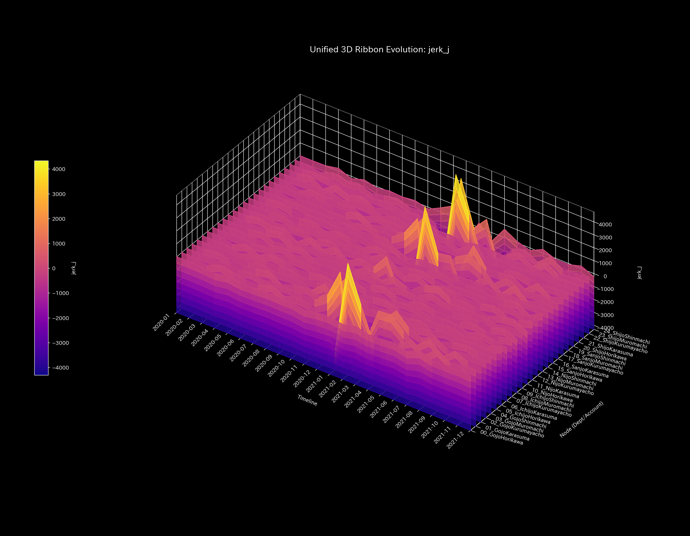
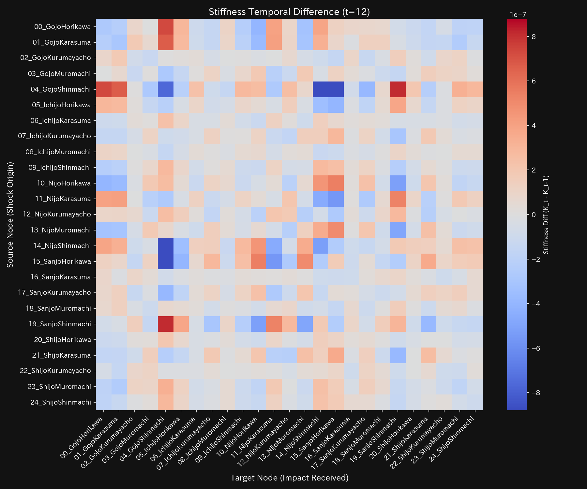
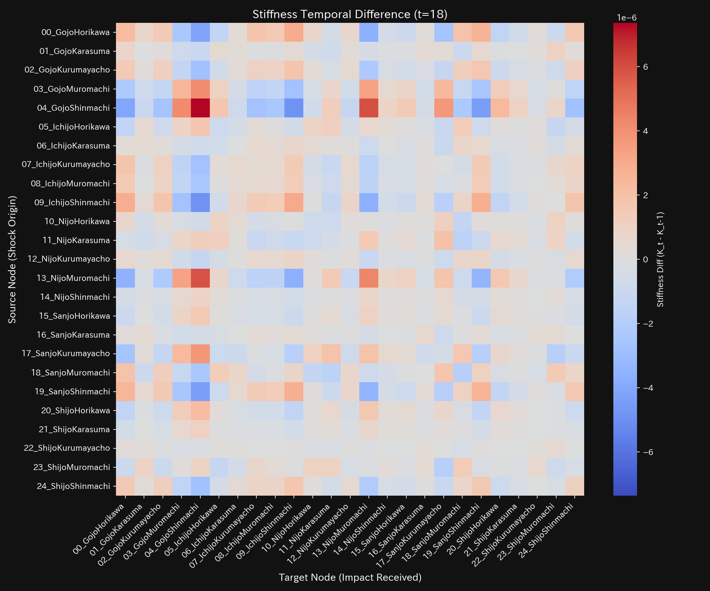
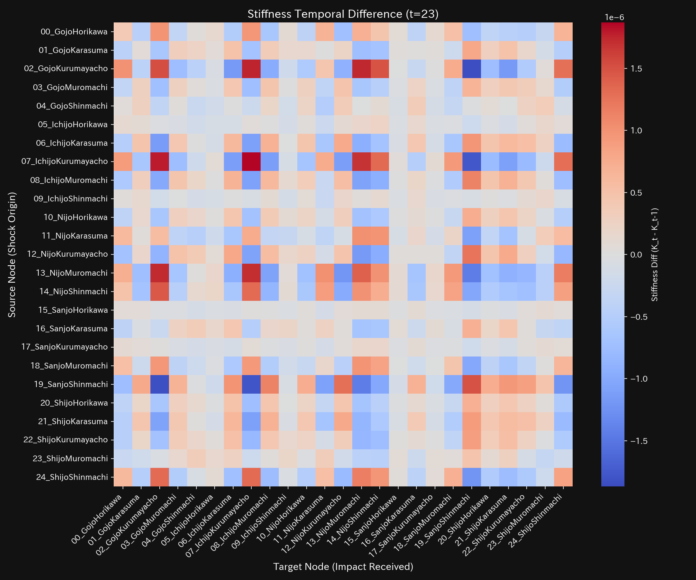

# Urban Traffic Gridlock Final Report (Case 5)

> [!NOTE]
> A more detailed technical clinical report is available in [clinical_report.md](clinical_report.md).

## Target Road Network: Sample 5 (Kyoto Center)

---

## 0. Executive Summary

* **Final Diagnosis:** 【Warning / Required Action】 Road capacity restrictions at major intersections have triggered a system-wide traffic deadlock (gridlock), freezing vehicle circulation.
* **Holistic Health Constitution:** 
  The total number of vehicles (**"Physique"**) remains conserved. However, the system's capacity to absorb traffic fluctuations (**"Immunity"**) is depleted. Routing flexibility (**"Autonomic System"**) is lost, and the network exhibits vascular hardening (**"Arteriosclerosis"**). Persistent braking shocks (**"Jerk"**) and gridlock ripples (**"Snap"**) propagate downstream.
* **Key Stagnations & Interventions:**
  - **Stiff Shoulder (Traffic Stagnation):** **`02_GojoKurumayacho`** (viscosity upper 25% boundary) shows severe delays, peaking at **2021-06** (tourist season).
  - **Acupuncture Points (Treatment Intersections):** **`21_ShijoKarasuma`** (strain energy lower 25% boundary) is the optimal intersection for green light phase adjustments.
  - **Contraindications (Avoid Direct Restriction):** Directly restricting **`05_IchijoHorikawa`** or **`00_GojoHorikawa`** will cause severe gridlock spillover and must be avoided.

---

## 1. Final Diagnosis (Warning)

### 【Diagnosis】: Traffic Gridlock (Spectral Radius Saturation)

At t=12 (2021-01), the flow volume at Shijo-Karasuma drops to zero, triggering back-up queues. The maximum spectral radius $\rho$ saturates at `1.0000`, proving that traffic fails to escape the central business district.

---

## 2. Holistic Health Constitution Analysis

The network's flow capacity maps to the following constitutional parameters:

### ① Physique (Vehicle Count Scale)
Total vehicle counts (Physique) stay strictly conserved at `10000` with zero conservation residual, proving complete ledger integrity.

### ② Immunity (Backup Queue Capacity)

Immune buffer capacity (Free Energy) drops below zero post-restriction. The grid lacks the capacity to absorb minor traffic accidents.

### ③ Autonomic System (Routing Entropy & Diversity)

The T-S diagram shows a locked trajectory post-t=12, representing severe loss of driver routing options (depressed Entropy).

### ④ Arteriosclerosis (PCA Stiffness Evaluation)

PCA PC1 EVR spikes post-restriction, proving that the flow pathways have lost elasticity and are locked onto congested routes (Arteriosclerosis).

### ⑤ Shockwaves (Jerk and Snap Trends)

* **Mathematical Bridge:**
  Jerk and Snap exhibit persistent high-frequency spikes post-t=12. This mathematically proves that drivers suffer from continuous stop-and-go braking shocks and queue ripples.

---

## 3. Key Stagnations & Interventions

### ⚠️ Stiff Shoulder (Chronic Delays)

* **Stagnation Nodes:** Upper 25% viscosity includes **`02_GojoKurumayacho`** and **`03_GojoMuromachi`**.
  - **`02_GojoKurumayacho`**: Peaked at **`2021-06`** due to seasonal tourist traffic bottlenecks.

### 🎯 Acupuncture Points (Optimal Treatment Intersections)

* **Treatment Nodes:** Strain energy lower 25% includes **`21_ShijoKarasuma`** and **`24_ShijoShinmachi`**.
  - **Intervention Advice:** Adjusting signal green time offsets at Shijo-Karasuma (gain: `-5.80`) resolves the gridlock with minimal side-street stress.

### 🚫 Contraindications
* **Avoid Direct Restriction:** High strain energy (upper 25%) nodes include **`05_IchijoHorikawa`** and **`07_IchijoKurumayacho`**.
  - **Intervention Advice:** Restricting these intersections directly will block backup arterial routes, triggering severe congestion spillover.

### ⚡ Stiffness Temporal Difference ($\Delta K_t$)
* **Stiffness Difference Heatmap Sequence:**
  - **t=12**: 
  - **t=18**: 
  - **t=23**: 

* **Mathematical Bridge:**
  The difference $\Delta K_t$ spikes red at t=12 on Shijo-Karasuma, spreading to parallel and bypass arteries by t=18 and t=23, capturing the expansion of the traffic gridlock.

---

## 4. Falsifiability Conditions

To falsify this "Gridlock" diagnosis, one must present:

1. **Independent GPS Probe Data:**
   Vehicle GPS speed logs proving that the average speed through Shijo-Karasuma remained above 30 km/h during the restriction period.
2. **Intersection Signal Control Logs:**
   Municipal signal logs proving that width-reduction construction or green-light phase changes never occurred.

---
*Published by: TLU Urban Traffic Diagnostics Engine*
