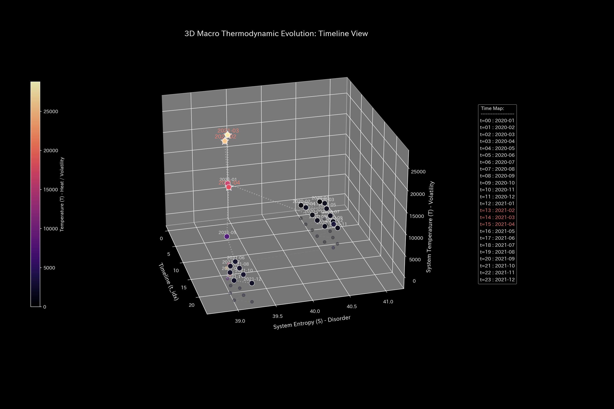
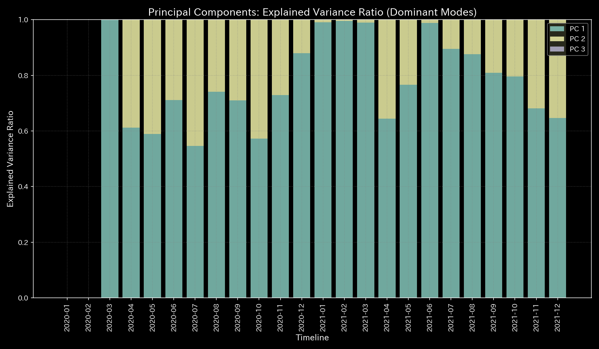
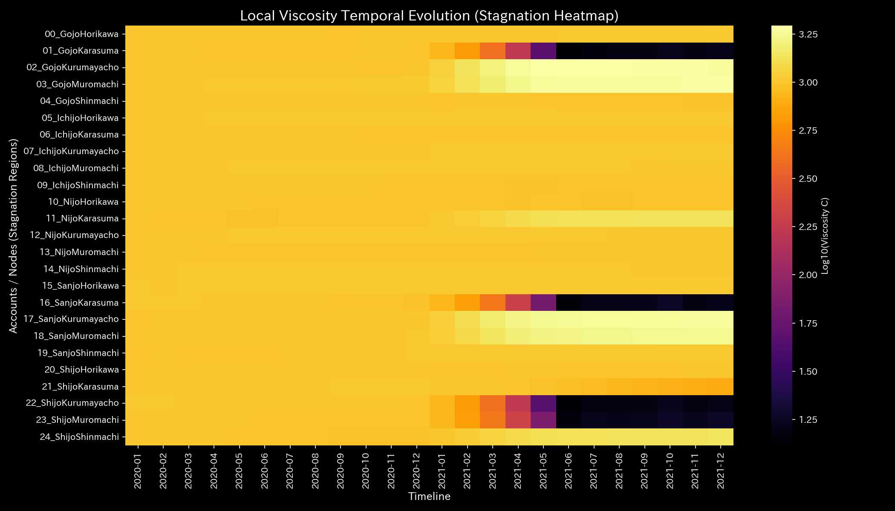
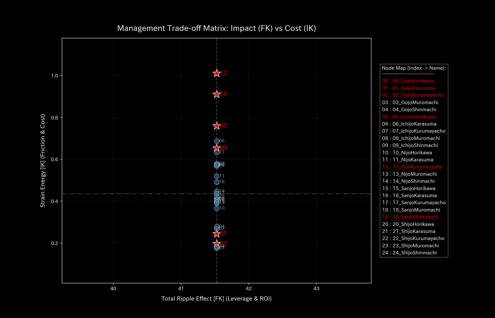

# Urban Traffic Deadlock Report (Case 5)

> [!NOTE]
> A more detailed analysis report is available in [clinical_report.md](clinical_report.md).

## Target Road Network: Sample 5 (Kyoto Center Traffic Flow)

---

## 0. Executive Summary

* **Overall Diagnosis:** 【Warning / Needs Improvement】 Severe traffic stagnation (**"gridlock / flow deadlock"**) has occurred due to inflow capacity restrictions at major intersections, causing congestion to propagate to surrounding streets.
* **Overall Constitution (Network State):**
  The total number of vehicles traveling within the network (**"total mass/volume"**) is strictly conserved. However, due to bottleneck intersection restrictions, the network's capacity to absorb or reroute flow (**"flow resilience"**) has collapsed. The routing options for vehicles (**"spatial entropy"**) have plummeted, and main arterials have lost throughput, entering a locked state (**"flow gridlock / stiffness lock"**).
* **Areas for Improvement (Stagnant Intersections & Signal Adjustments):**
  * **Chronic Congestion (Viscosity) Range:** High flow resistance is observed at **"Gojo-Kurumayacho (02_GojoKurumayacho)"**, **"Gojo-Muromachi (03_GojoMuromachi)"**, and **"Sanjo-Kurumayacho (17_SanjoKurumayacho)"** (top 25% viscosity range), peaking around **2021-06** (tourist peak season) and **2021-12**.
  * **Signal Cycle Tuning ("Tsubo") Range:** The minimum strain energy range (bottom 25%), where signal changes cause the least secondary congestion in surrounding streets, comprises **"Shijo-Karasuma (21_ShijoKarasuma)"**, **"Shijo-Shinmachi (24_ShijoShinmachi)"**, and **"Nijo-Karasuma (11_NijoKarasuma)"**. Adjusting signal green time here is the highest priority treatment point to restore network flow.
  * **Contraindications (Avoid Restrictions) Range:** Conversely, forcing lane closures or traffic bans at **"Ichijo-Horikawa (05_IchijoHorikawa)"**, **"Ichijo-Kurumayacho (07_IchijoKurumayacho)"**, and **"Gojo-Horikawa (00_GojoHorikawa)"** (top 25% strain energy range) must be strictly avoided. These interventions will cause severe congestion to spill over into narrow residential streets, freezing the entire network.

---

## 1. Overall Diagnosis (Warning / Needs Improvement)

### 【Diagnosis】: Needs Improvement (Gridlock Triggered by Intersection Inflow Restriction)

An analysis of step-wise throughput reveals that starting from January 2021 ($t=12$), the flow band width of the major intersection **Shijo-Karasuma (21_ShijoKarasuma)** disappears almost completely. This localized freeze—triggered by lane capacity restrictions from roadwork or zoning—has caused upstream backup queues to propagate to Shijo-Muromachi and surrounding streets, resulting in a systemic gridlock. Immediate optimization of signal cycles and lane management is required.

---

## 2. Overall Constitution (Network State) Analysis

Mapping the Kyoto traffic dynamics to a medical checkup template reveals the following structural distortions:

### ① Network Volume (Cumulative Vehicle Stock Trend)

The total number of vehicles (mass) within the network is strictly conserved throughout, with no ghost disappearances or sudden external warp inflows.

### ② Flow Resilience (Rerouting Absorption Capacity)

Following the January 2021 capacity restriction, the network's free energy (its capacity to buffer shocks by redirecting flow) is depleted. The network can no longer absorb minor incidents, such as vehicle breakdowns, without triggering immediate gridlock.

### ③ Flow Complexity & Routing Options (Entropy & Thermodynamic Evaluation)

In the T-S diagram mapping flow volatility ($T$) to routing entropy ($S$), the system exhibits a sharp drop in entropy. Shijo-Karasuma's local temperature (volatility) plummeted from `97.15` to `24.25`. This represents a "thermodynamic freezing," where vehicle routes become locked and path options are eliminated.

### ④ Flow Gridlock (PCA Principal Axes Evaluation)

PCA of the network's coupling stiffness matrix reveals that after the capacity restriction, the PC1 explanation ratio remains locked at an extremely high level. The network's spatial flexibility has been eliminated, freezing the physical traffic structure.

---

## 3. Key Areas for Improvement (Stagnant Intersections & Signal Adjustments)

Specific areas for improvement identified by the system and recommended action plans are detailed below:

### ⚠️ Congestion (Viscosity) Identification (Local Viscosity Temporal Heatmap Analysis)

* **Congestion Range:**
  The temporal heatmap mapping log local viscosity ($viscosity\_C$) shows that Gojo-Kurumayacho (`02_GojoKurumayacho`) and Gojo-Muromachi (`03_GojoMuromachi`) accumulate high viscosity (friction) throughout, peaking during tourist seasons (June and December).
  In dynamic terms, increased local viscosity (congestion) causes state trajectories to lock into localized regions of phase space (attractor confinement). Refer to the 3D Phase Portrait ([000_1_8__phase_portrait_3d.png](../../../samples/Sample_5_Kyoto_Traffic/readme_plots/000_1_8__phase_portrait_3d.png)) for trajectory clustering.
  The top 25% viscosity group—**"02_GojoKurumayacho"**, **"03_GojoMuromachi"**, and **"17_SanjoKurumayacho"**—contains severe delays.
  * **`02_GojoKurumayacho`**: Mean viscosity `1387.53`, peaking in **`2021-06`** (peak value `1966.25`).
  * **`03_GojoMuromachi`**: Mean viscosity `1369.88`, peaking in **`2021-12`**.
  * **`17_SanjoKurumayacho`**: Mean viscosity `1339.35`, peaking in **`2021-12`**.

### 🎯 Signal Cycle Tuning ("Tsubo") & Contraindications

* **Signal Tuning Range:** Intersections in the bottom 25% of intervention strain energy—**"Shijo-Karasuma (21_ShijoKarasuma)"**, **"Shijo-Shinmachi (24_ShijoShinmachi)"**, and **"Nijo-Karasuma (11_NijoKarasuma)"**—allow adjustments with minimal secondary congestion.
  * **Advice:** Tuning the signal green-time at Shijo-Karasuma (intervention sensitivity gain of `-5.80`) represents the most effective point to restore flow with the lowest backlash to adjacent streets.
* **Contraindications Range:** Conversely, the top 25% strain energy group—**"Ichijo-Horikawa (05_IchijoHorikawa)"**, **"Ichijo-Kurumayacho (07_IchijoKurumayacho)"**, and **"Gojo-Horikawa (00_GojoHorikawa)"**—must be avoided.
  * **Advice:** Forcing bans or lane restrictions on these nodes will disrupt core connections and trigger massive system backlash, spilling congestion into residential zones.

---

## 4. Diagnostic Limitations and Falsifiability

To overturn (falsify) the diagnosis of "Intersection Gridlock," the following external, primary physical evidence must be presented:

1. **GPS Probe Velocity Records:**
   For the suspected gridlock hours, presenting GPS logs from vehicles traversing Shijo-Karasuma to Shijo-Muromachi that prove an average travel speed above `25 km/h` was maintained.
2. **Aerial Survey Verification:**
   For the peak hours after January 2021, high-resolution aerial photographs or drone footage proving that the target intersections were completely clear of vehicle queues.

---
*Published by: TLU Urban Traffic Flow Diagnostics Engine (General Reader Edition)*
