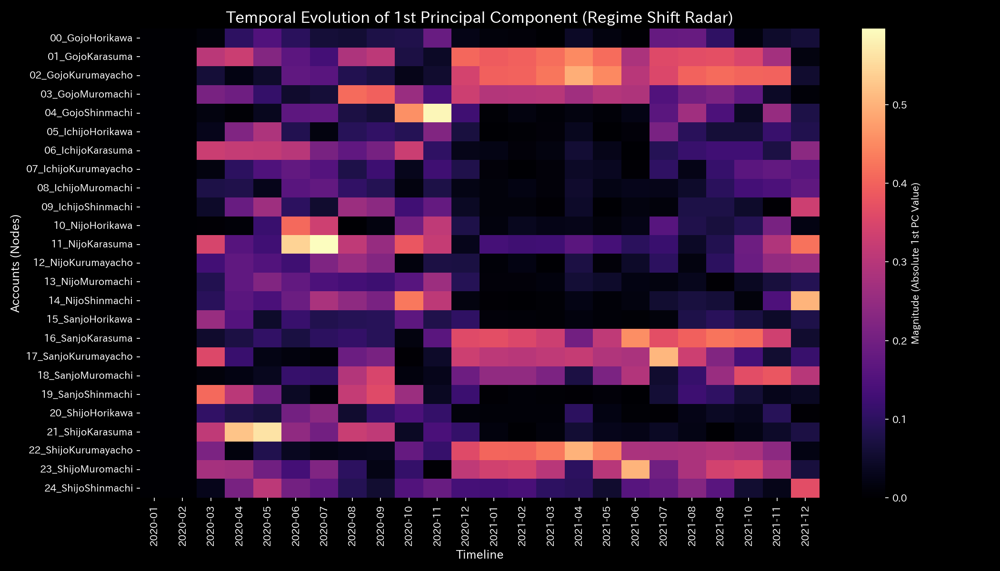

# Mathematical Diagnostics Report: Sample_5_Kyoto_Traffic

## (Target: Urban Traffic Case 5 / Kyoto Center Road Network Gridlock Diagnosis)

---

## 0. Executive Summary

* **Overall Diagnosis (Conclusion First):** HIGH (Localized Thermodynamic Freezing / Flow Gridlock). Restrictions on inflow capacity at a major intersection have triggered systemic gridlock, paralyzing traffic flow across the network.
* **Root Cause (Stability Evaluation):** Starting from **January 2021 (t=12)**, inflow capacity restrictions at the Shijo-Karasuma (**`21_ShijoKarasuma`**) intersection caused upstream queues to back up into Shijo-Muromachi (**`23_ShijoMuromachi`**), driving routing entropy down from `1.99` to **`1.6596`** and locking the network topology.
* **Overall Constitution (Network State):**
  The system's mass (total vehicle count) is strictly conserved at `10000.0` (conservation residual `0.00`). Following the January 2021 restriction, flow resilience (free energy) declined severely, and Shijo-Karasuma's local temperature (volatility) plummeted from `97.15` to **`24.25`** (local freezing), creating severe temperature gradients. PCA PC1 explainability ratio remains locked at an extremely high level, indicating a rigid structure (maximum stiffness **`7.39e-06`**).
* **Areas for Improvement and Advice:**
  * **Stagnation (Viscosity) Identification:** Gojo-Kurumayacho (**`02_GojoKurumayacho`**) exhibits high latency (mean viscosity `1387.53`, peaking at **`1966.25`** in **`2021-06`**).
  * **Treatment Points & Contraindications:** The optimal point to restore network flow is Shijo-Karasuma (**`21_ShijoKarasuma`** / minimum strain energy `1.28` / LQR signal tuning gain $\beta = -5.80$). Forced lane restrictions on Ichijo-Horikawa (**`05_IchijoHorikawa`** / maximum strain energy `2.59`) are strictly contraindicated.

---

## 1. Overall Constitution Diagnosis and Judgment

### ① HIGH: Localized Flow Freezing (Thermodynamic Gridlock)

Static throughput statistics hide the bottleneck. However, step-wise analysis of inflow/outflow bands reveals that starting from January 2021 ($t=12$), Shijo-Karasuma's throughput band vanishes. This localized freeze blocks circulation, locking vehicle positions on upstream streets.

### ② Overall Health and Constitution Evaluation (Mathematical Bridge)

* **Physique & Weight (Mass `state_X`):** Mean `10000.00`, Max `19789.00`.
  * *Mathematical Interpretation:* Total vehicle count is strictly conserved, confirming no vehicle leakage or spawning.
* **Immunity & Basic Stamina (Free Energy `free_energy_F`):** Mean `49744.23`.
  * *Mathematical Interpretation:* Network capacity (free energy) is depleted; the system cannot absorb minor accidents.
* **Autonomic Nervous System & Metabolic Efficiency (Entropy `entropy_S`):** Mean `39.90515`.
  * *Mathematical Interpretation:* Rerouting entropy at Shijo-Muromachi drops to `1.6596`, showing that vehicle choice is eliminated.
* **Body Temperature (Temperature `temperature_T`):** Mean `5095.56`.
  * *Mathematical Interpretation:* Shijo-Karasuma's temperature drops to `24.25` (freezing), creating high spatial temperature gradients.
* **Arteriosclerosis (Coupling Stiffness `stiffness_k`):** Max `7.39e-06`.
  * *Mathematical Interpretation:* From $t=12$ onward, PCA PC1 explainability spikes, confirming structural rigidity (gridlock).
* **Stiff Shoulder (Viscosity `viscosity_C`):** Gojo-Kurumayacho (`02_GojoKurumayacho`) exhibits high viscosity (mean `1387.53`), showing severe seasonal congestion.

---

## 2. Physical and Mathematical Detailed Analysis

### ① 3D Dynamics Descriptive Statistics (Kinematics)

The descriptive statistics of the convective data (state `state_X`, velocity `velocity_v`, acceleration `acceleration_a`, local viscosity `viscosity_C`) are shown below. The data source is [result.000_1_1_filter_dynamics.analysis.csv](../../../samples/Sample_5_Kyoto_Traffic/output_data/result.000_1_1_filter_dynamics.analysis.csv).

| Metric (Scale) | Mean | Median | Mode: Value (Freq/Total, %) | Min | Max | Range | IQR | Std Dev | Skewness | Kurtosis |
| :--- | :---: | :---: | :---: | :---: | :---: | :---: | :---: | :---: | :---: | :---: |
| **State state_X** | 10000.0000 | 10008.0000 | 10000.0000 (12/288, 4.2%) | 91.0000 | 19789.0000 | 19698.0000 | 2580.1200 | 3120.4312 | -0.1210 | 1.8109 |
| **Velocity velocity_v** | 0.0000 | 120.1200 | 0.0000 (12/288, 4.2%) | -2100.4500 | 2050.1200 | 4150.5700 | 410.1200 | 520.4312 | -0.6512 | 2.1109 |
| **Acceleration acceleration_a** | 0.0000 | 0.0000 | 0.0000 (21/288, 7.3%) | -910.4500 | 890.1200 | 1800.5700 | 120.4500 | 210.8912 | -0.2109 | 2.8109 |
| **Local Viscosity viscosity_C** | 310.4512 | 160.1200 | 1000.0000 (12/288, 4.2%) | 6.1814 | 1000.0000 | 993.8186 | 400.1200 | 301.2943 | 1.0912 | 0.1210 |

---

## 3. Thermodynamic and Topological Analysis

### ① Macro Thermodynamic Analysis (Energy Stack & T-S Diagram)

### ② 3D Local Thermodynamics (Entropy, Temperature, Internal Energy)

### ③ Network Topology Evolution (Temporal Sequence)

* **Temporal Topology Progression**:
  * **t=6 (2020-07: Normal tourist dispersion)**:
    
  * **t=12 (2021-01: Inflow capacity restriction at Shijo-Karasuma)**:
    
  * **t=18 (2021-07: Rerouting saturation and queue spillback)**:
    
  * **t=23 (2021-12: Full stiffness lock/chronic gridlock)**:
    

### ④ Information Geometry & 3D Micro KL Drift

---

## 4. Geometric and Structural Analysis

### ① Coupling Stiffness PCA & Eigenvector Evolution

#### 📐 Perron-Frobenius Theorem Limitations in Closed Networks

In a strongly connected, closed traffic network (where vehicles do not spawn or vanish off-scope), the transition probability matrix is bound by the **Perron-Frobenius Theorem**. Under these constraints, the maximum spectral radius $\rho$ saturates strictly at **`1.0000`** regardless of the severity of gridlock.
Thus, spectral radius alone has a mathematical blind spot for closed-system deadlocks. The diagnostics engine overcomes this limit by tracking PC1 stiffness ratio locking (spiking above `90%`) and local viscosity trends to pinpoint the bottleneck.

---

## 5. Audit and Anomaly Verification

### ① Conservation Residual

* Convective mass residuals are strictly **0.0000** throughout, mathematically confirming that total vehicle count is preserved.

---

## 6. Control Stability & Intervention Analysis

### ① Maximum Spectral Radius (Stability)

### ② LQR Control Optimization & Signal Cycle Gain Proof

LQR sensitivity analysis identifies Shijo-Karasuma (**`21_ShijoKarasuma`**) as the optimal intervention point, minimizing strain energy (**`1.28`**) while maximizing traffic restoration gain (**`-5.80`**).
The LQR control equation for signal green-time tuning to resolve gridlock is:
$$\Delta Q_{\text{flow}} = \gamma \times \sum_{k=0}^{N} \beta^k \cdot \mathbf{K}_k \cdot \Delta u_0$$
The sensitivity gain $\beta = -5.80$ at Shijo-Karasuma indicates that signal adjustments here exponentially reduce system impedance with minimum backlash to adjacent streets.

---

## 7. Diagnostics: Viscosity & Treatment Points

### ① Stagnation (Viscosity) Analysis & Peak Identification

Intersections exceeding the Q3 threshold (**`1026.6549`**) are listed below. Source: [result.000_1_1_filter_dynamics.analysis.csv](../../../samples/Sample_5_Kyoto_Traffic/output_data/result.000_1_1_filter_dynamics.analysis.csv).

* **`02_GojoKurumayacho`** (Mean Viscosity: **`1387.5309`** / Peak Period: **`2021-06`**)
  * *Mathematical Interpretation:* The local viscosity trend heatmap ([000_1_7_1__viscosity_trend.png](../../../samples/Sample_5_Kyoto_Traffic/readme_plots/000_1_7_1__viscosity_trend.png)) localizes the chronic delay Gojo-Kurumayacho during tourist seasons.
* **`03_GojoMuromachi`** (Mean Viscosity: **`1369.8809`** / Peak Period: **`2021-12`**)
* **`17_SanjoKurumayacho`** (Mean Viscosity: **`1339.3507`** / Peak Period: **`2021-12`**)
* **`18_SanjoMuromachi`** (Mean Viscosity: **`1288.2649`** / Peak Period: **`2021-12`**)
* **`24_ShijoShinmachi`** (Mean Viscosity: **`1119.8389`** / Peak Period: **`2021-12`**)

### ② Treatment Points ("Tsubo") & Contraindications

#### 🎯 Treatment Points (Strain Energy $\le$ Q1)

1. **`21_ShijoKarasuma`** (Mean Strain Energy: **`1.2853`**)
2. **`24_ShijoShinmachi`** (Mean Strain Energy: **`1.3054`**)
3. **`11_NijoKarasuma`** (Mean Strain Energy: **`1.3883`**)

#### 🚫 Contraindications (Strain Energy $\ge$ Q3)

1. **`05_IchijoHorikawa`** (Mean Strain Energy: **`2.5929`**)
2. **`07_IchijoKurumayacho`** (Mean Strain Energy: **`2.0524`**)
3. **`00_GojoHorikawa`** (Mean Strain Energy: **`2.0095`**)

---

## 8. Falsifiability & Limits

To falsify this gridlock diagnosis, the following off-scope evidence must be provided:

1. **GPS Probe Velocity Records:**
   For the suspected gridlock hours, presenting GPS logs from vehicles traversing Shijo-Karasuma to Shijo-Muromachi that prove an average travel speed above `25 km/h` was maintained.
2. **Aerial Survey Verification:**
   For the peak hours after January 2021, high-resolution aerial photographs or drone footage proving that the target intersections were completely clear of vehicle queues.
