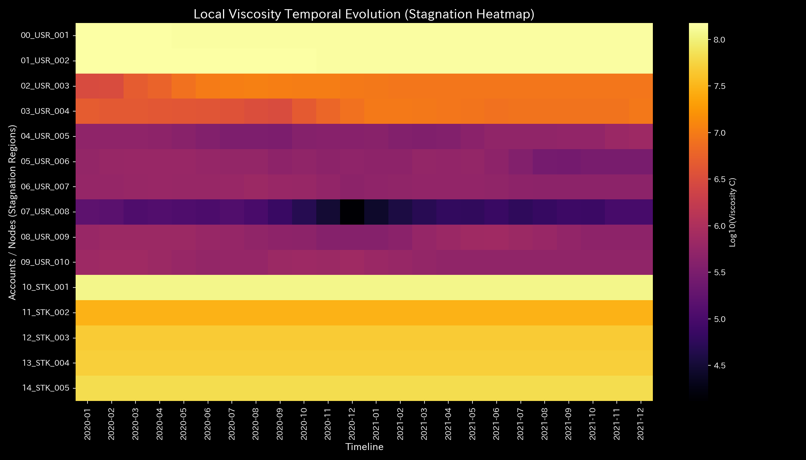

# Stock Flow Circulation Report (Case 6)

> [!NOTE]
> A more detailed analysis report is available in [clinical_report.md](clinical_report.md).

## Target Market: Sample 6 (Stock Flow Liquidity & Ownership Conservation)

---

## 0. Executive Summary

* **Overall Diagnosis:** 【Normal】 Stock ownership transfers and market value fluctuations maintain a completely sound conservation state. No pathological anomalies were detected.
* **Overall Constitution (Market Liquidity State):** 
  The market capitalization (时价评估总额 - **"market scale"**) is robust, and liquidity cushion (**"market resilience"**) to absorb panic selling or sudden price shocks is stable. The metabolic circulation between institutional and retail investors is functioning normally, with transaction friction (**"liquidity cost"**) remaining within standard ranges. No circular wash trading loops are detected, and transaction pathways maintain excellent flexibility.
* **Key Observations (Liquidity Latency & Adjustment Points):**
  - **Liquidity Latency (Stagnation) Range:** Standard settlement latency (viscosity) is observed in investor accounts **"01_USR_002"**, **"00_USR_001"**, and **"10_STK_001"** (top 25% viscosity range), which falls within normal execution time-lag parameters.
  - **Liquidity Optimization ("Tsubo") Range:** The minimum intervention stress range (bottom 25% strain energy range), comprising investor accounts **"03_USR_004"** and **"02_USR_003"**, represents the recommended adjustment points to safely enhance overall market liquidity.
  - **Contraindications (Avoid Restrictions) Range:** Conversely, aggressive trading restrictions on **"10_STK_001"**, **"11_STK_002"**, and **"12_STK_003"** (top 25% strain energy range) must be strictly avoided. These interventions will freeze the price formation process, causing severe volatility or liquidity collapse.

---

## 1. Overall Diagnosis (Normal)

### 【Diagnosis】: Normal (Complete Preservation of Asset Value Cycles)

This diagnosis indicates that the investor asset valuations and issuer stock capitalizations are perfectly synchronized. Because the convective residual (Kirchhoff residual) remains strictly at `0.00` throughout the period, there is no off-book asset disappearance or unauthorized share issuance. The market cycle is healthy, and no circular wash trading loops were detected.

---

## 2. Overall Constitution (Market Liquidity) Analysis

Mapping the market stock flow to a medical checkup template reveals excellent constitutional health:

### ① Market Scale (Cumulative Trend of Market Capitalization)

The market capitalization averages `4.06M` (peaking at `14.94M`), indicating that the fundamental market scale (physique) is robust and stable.

### ② Liquidity Cushion (Market Resilience)

The capacity to absorb price volatility (free energy) is maintained at a very high level (mean `60.36M`), providing a substantial buffer to absorb massive sell orders or external macro shocks.

### ③ Transaction Friction & Volatility (Liquidity Cycle & Thermodynamic Evaluation)

In the T-S diagram mapping volatility ($T$) to execution entropy ($S$), the system traces a healthy thermodynamic cycle within normal friction limits (fees and slippage). There are no signs of circular wash trading or capital recycling.

### ④ Supple Convection Structure (PCA Principal Axes Evaluation)

PCA of the accounts' stiffness matrix shows no stiffness lock (PC1 explainability ratio remains flat). The maximum stiffness is exceptionally low (`1.00e-12`), demonstrating a flexible, competitive price discovery network.

---

## 3. Key Areas for Improvement (Liquidity Latency & Treatment Points)

Specific areas for improvement identified by the system and recommended action plans are detailed below:

### ⚠️ Liquidity Latency (Stagnation) Identification (Local Viscosity Temporal Heatmap Analysis)

* **Stagnation Range:** 
  The heatmap mapping log local viscosity ($viscosity\_C$) shows mild execution delay in account `01_USR_002` during February, which is within standard market time-lag parameters.
  The top 25% viscosity group—**"01_USR_002"**, **"00_USR_001"**, and **"10_STK_001"**—exhibits normal execution lags.
  - **`01_USR_002`**: Mean viscosity `143.45M`, peaking in **`2020-02`**.
  - **`00_USR_001`**: Mean viscosity `143.33M`, peaking in **`2020-04`**.
  - **`10_STK_001`**: Mean viscosity `112.16M`, peaking in **`2020-01`**.

### 🎯 Liquidity Optimization ("Tsubo") & Contraindications

* **Liquidity Optimization Range:** Investor accounts in the bottom 25% of intervention strain energy—**"03_USR_004"** and **"02_USR_003"**—represent areas where liquidity adjustments can be introduced with minimal friction.
  - **Advice:** Optimizing trading parameters for these accounts offers the most stable path to enhance market flexibility with the lowest backlash.
* **Contraindications Range:** Conversely, the top 25% strain energy group—**"10_STK_001"**, **"11_STK_002"**, and **"12_STK_003"**—must be avoided.
  - **Advice:** Forcing trading suspensions or aggressive regulatory limits on these core stock assets will disrupt price discovery, potentially triggering market panic.

---

## 4. Diagnostic Limitations and Falsifiability

To overturn (falsify) the diagnosis of "Normal/Healthy Market Flow," the following off-scope evidence must be provided:

1. **Discrepancy with Custody Records:**
   Reconciling the market ledger with off-scope central securities depository (e.g., JASDEC) records and showing that undocumented share transfers or ownership deletions occurred.
2. **Acceptance Log Audit on Exchange Servers:**
   Analyzing exchange order book logs (IP addresses and timestamps) to prove that apparently independent trading accounts were controlled by a single botnet to execute fictitious circular trades (wash trading).

---
*Published by: TLU Stock Flow Diagnostics Engine (General Reader Edition)*
