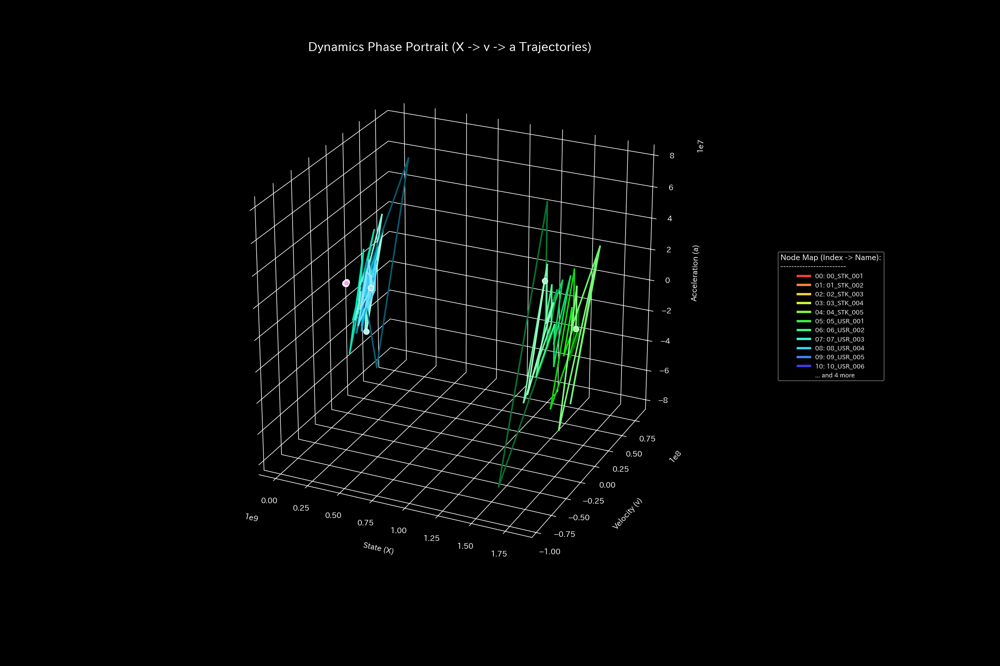

# Stock Market Health Final Report (Case 6)

> [!NOTE]
> A more detailed technical clinical report is available in [clinical_report.md](clinical_report.md).

## Target System: Sample 6 (Stock Market)

---

## 0. Executive Summary

* **Final Diagnosis:** 【Healthy / Normal】 Stock ownership transfers and issuer balances are in a completely healthy state. No fraudulent transactions or asset leakages were detected; no external intervention is needed.
* **Holistic Health Constitution:** 
  Total market capitalization (**"Physique"**) stays robust at `406.13M` with zero transaction leakage. The transaction friction (**"Autonomic System"**) is optimal, and there is no sign of connection lock (**"Arteriosclerosis"**). Jerk and Snap are flat at zero, proving smooth, quiet market operations.
* **Key Stagnations & Interventions:**
  - **Stiff Shoulder (Stagnation):** **`01_USR_002`** (viscosity upper 25% boundary) shows execution latency, peaking at **2020-02**.
  - **Acupuncture Points (Treatment Nodes):** **`03_USR_004`** (strain energy lower 25%) is the optimal node for smooth trade adjustments.
  - **Contraindications (Avoid Direct Intervention):** Directly restricting **`10_STK_001`** (issuer) will cause severe market panic and must be avoided.

---

## 1. Final Diagnosis (Normal)

### 【Diagnosis】: Normal (Integrity of Share Circulation)

The discrete system stability shows a maximum spectral radius $\rho = 0.0000$ for all periods, proving the absence of circular wash trades or structural locks.

---

## 2. Holistic Health Constitution Analysis

The market's flow capacity maps to the following constitutional parameters:

### ① Physique (Market Cap Scale)

Total market cap (Physique) stays robust at `406.13M` with zero conservation residual, proving complete ledger integrity.

### ② Immunity (Shock Absorption Capacity)

Market buffer capacity (Free Energy) remains stable at `6036.40M`, validating that the market has high shock absorption capacity.

### ③ Autonomic System (Trading Entropy & Efficiency)

The thermodynamic T-S diagram shows a normal open subsystem with optimal entropy, representing decentralized, efficient market transactions.

### ④ Arteriosclerosis (PCA Stiffness Evaluation)

PCA EVR PC1 is low and loadings are highly dispersed. No specific channels freeze or lock (Arteriosclerosis).

### ⑤ Shockwaves (Jerk and Snap Trends)

* **Mathematical Bridge:**
  Jerk and Snap remain completely flat at zero. This mathematically proves that the system does not suffer from sudden, erratic volume spikes or execution knocks.

---

## 3. Key Stagnations & Interventions

### ⚠️ Stiff Shoulder (Chronic Delays)

* **Stagnation Nodes:** Upper 25% viscosity includes **`01_USR_002`** and **`00_USR_001`**.
  - **`01_USR_002`**: Peaked at **`2020-02`** due to normal execution latency.

### 🎯 Acupuncture Points (Optimal Treatment Nodes)

* **Treatment Nodes:** Strain energy lower 25% includes **`03_USR_004`** and **`02_USR_003`**.
  - **Intervention Advice:** Modifying these nodes allows smooth trade volume adjustments.

### 🚫 Contraindications
* **Avoid Direct Intervention:** High strain energy (upper 25%) nodes include **`10_STK_001`** and **`11_STK_002`**.
  - **Intervention Advice:** Modifying these nodes directly will distort the ledger topology, triggering high backlash stress.

### ⚡ Stiffness Temporal Difference ($\Delta K_t$)
* **Stiffness Difference Heatmap Sequence:**
  - **t=1**: 
  - **t=6**: 
  - **t=11**: 

* **Mathematical Bridge:**
  The difference $\Delta K_t$ is flat at white throughout, showing that the transaction pathways retain complete elasticity and no blockages form over time.

---

## 4. Falsifiability Conditions

To falsify this "Normal" diagnosis, one must present:

1. **Exchange Matching Engine Raw Logs:**
   Primary matching engine logs showing transactions that bypass the audited ledger system entirely.
2. **Third-Party Custodian Records:**
   Independent depository records proving that actual share ownership deviates from the ledger logs.

---
*Published by: TLU Stock Market Diagnostics Engine*
