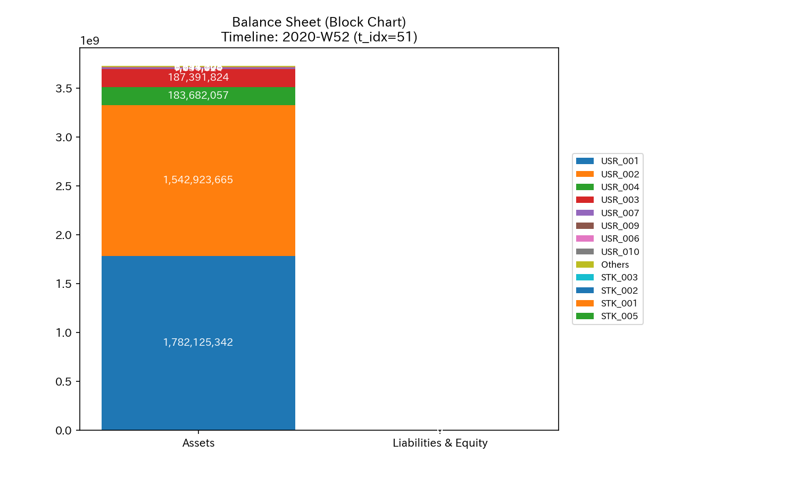
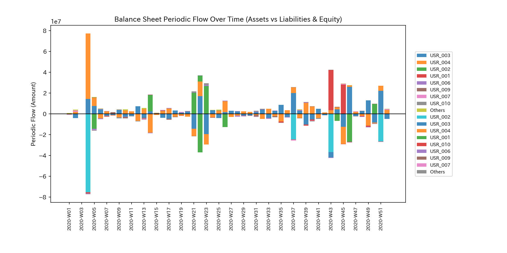
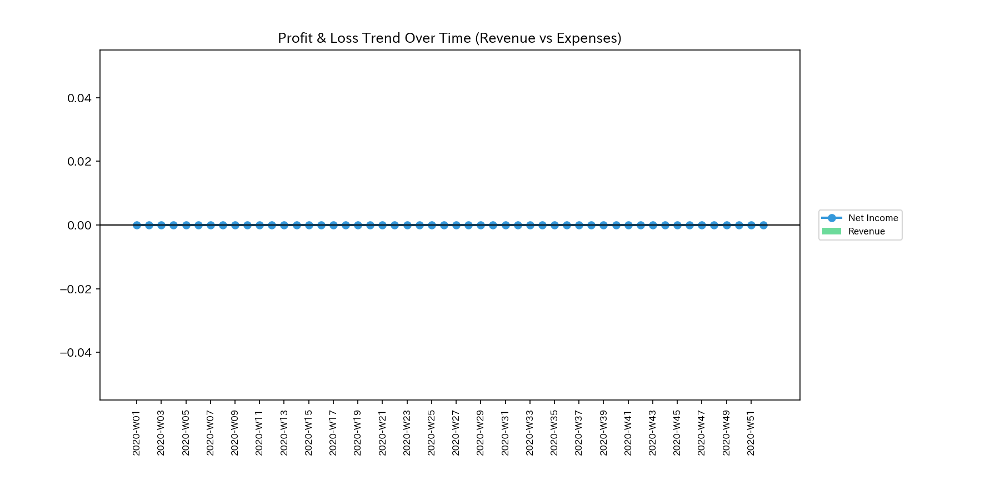
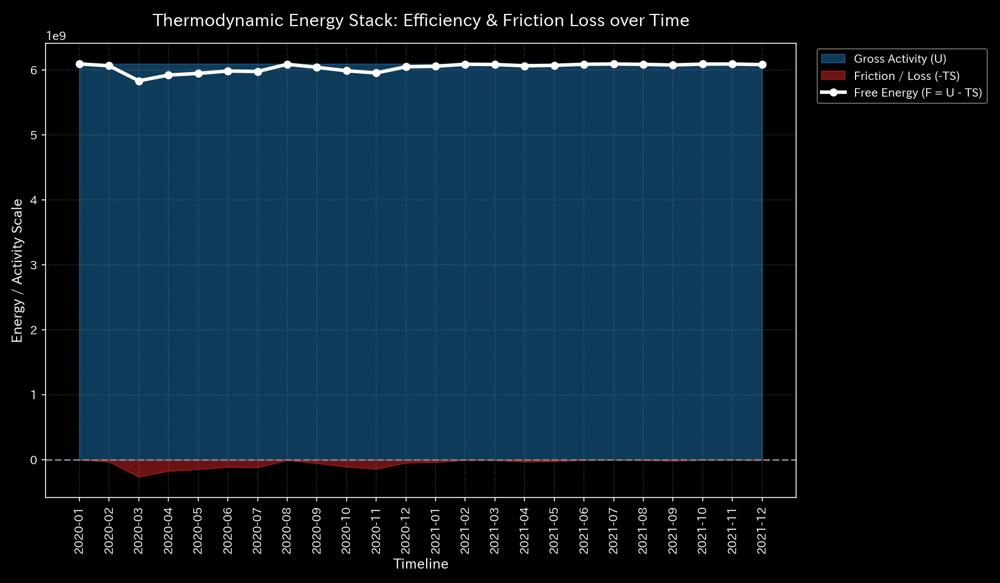

# 🔬 Anomaly Detection & Market Health Report (Sample 6 - Healthy Stock Volume Conservation System)

## 1. Executive Summary

* **Overall Status:** 🟢 **Healthy Stock Flow Convection**
* **Severity:** 🟢 **NORMAL (No Anomaly)**
* **Summary:** The system displays a state where the total outstanding balance of shares (mass) is conserved and steady convection is maintained across the stock market. The conservation residual remains `0.00` throughout. No generation of duplicate shares or off-book outflows exist.

---

## 2. Comparison of Stock and Flow

We compare the total stock of shares (B/S equivalent) with the periodic (single-month, non-cumulative) transaction flows (P/L equivalent) in the stock market.

### Share Balance Comparison (B/S Equivalent)

* **B/S Asset & Equity Cumulative Trend & Block Chart (Cumulative):**
  
  

* **B/S Share Balance Periodic Trend (Monthly Non-Cumulative):**
  

### Share Volume Comparison (P/L Equivalent)

* **P/L Volume Cumulative Trend:**
  

* **P/L Volume Periodic Trend (Monthly Non-Cumulative):**
  

* **Observation:** Volume (transaction flow) evolves stably in line with the market cycle. No hyper-synchronization by USRs or flow flattening (deadlock) from liquidity exhaustion is observed.

---

## 3. Pathophysiology

* **Diagnosis:** **Normal, Steady Convection**
* Share flows among participants and ticker symbols circulate in accordance with conservation mechanics. No stasis or panic cascades exist.

---

## 4. Summary of Mathematical Analysis Results

### 4.1. Mass Conservation and Network Topology

The Kirchhoff residual is exactly **`0.00`**. No shares disappear.

* **Macro Forensics Dashboard:**
  

* **Network Topology Evolution:**
  During steady convection, the network topology does not form structural distortions or connection edges where flow concentrates on specific accounts.

### 4.2. Stiffness Connection & PCA (Stiffness & PCA)

The stiffness matrix shows elastic coupling. No rigid locks (stiffness concentrating on specific stocks or accounts) occur.
In PCA, the PC1 contribution ratio does not become dominant, staying stable in response to normal supply and demand shifts.

* **PCA Axis Ratio:**
  

### 4.3. Verification of Circular Topology (Spectral Radius)

The maximum spectral radius is exactly **`1.0000`** throughout the period. This is a mathematical consequence of the stock market being a closed, strongly connected network (the saturation point of the Perron-Frobenius theorem). It indicates healthy connectivity.

* **System Stability Indicator:**
  

### 4.4. Thermodynamic Indicators and 3D Topology

Internal energy $U$ is conserved steadily. Free energy $F = U - TS$ also evolves stably.
The T-S diagram maintains the limit cycle of steady convection without drawing pathological loops.

* **Thermodynamic Characteristics & T-S Diagram:**
  
  

---

## 5. Control Interventions and Recommended Actions (LQR & Operations)

* **Operational Plan: Monitor to Maintain Steady Liquidity**
* The system is in a normal state (NORMAL). No LQR control interventions or trading halts are necessary. We monitor the elasticity of transaction fees and price spreads to maintain liquidity.

---

## 6. Alerts & Falsifiability

### 6.1. Triaging False Positives

* **Seasonal Volatility Detection:**
  Temporary volume surges from portfolio adjustments or market events may push Z-Scores above the threshold of `3.0`. However, since the conservation residual remains `0.00` and no rigid locks occur, these alerts are rejected as normal market activity (false positives).

### 6.2. Falsification Conditions

To reject the normal diagnosis and prove an anomaly, the following evidence is required:

1. **Order Book Discrepancy Logs:** Raw trade execution logs showing transaction inconsistencies (e.g., mismatch between trades and cash transfers) at the exchange.
2. **Audited Wallet Balance Certificates:** Raw wallet data proving trades occurred between specific accounts without ownership transfers.
