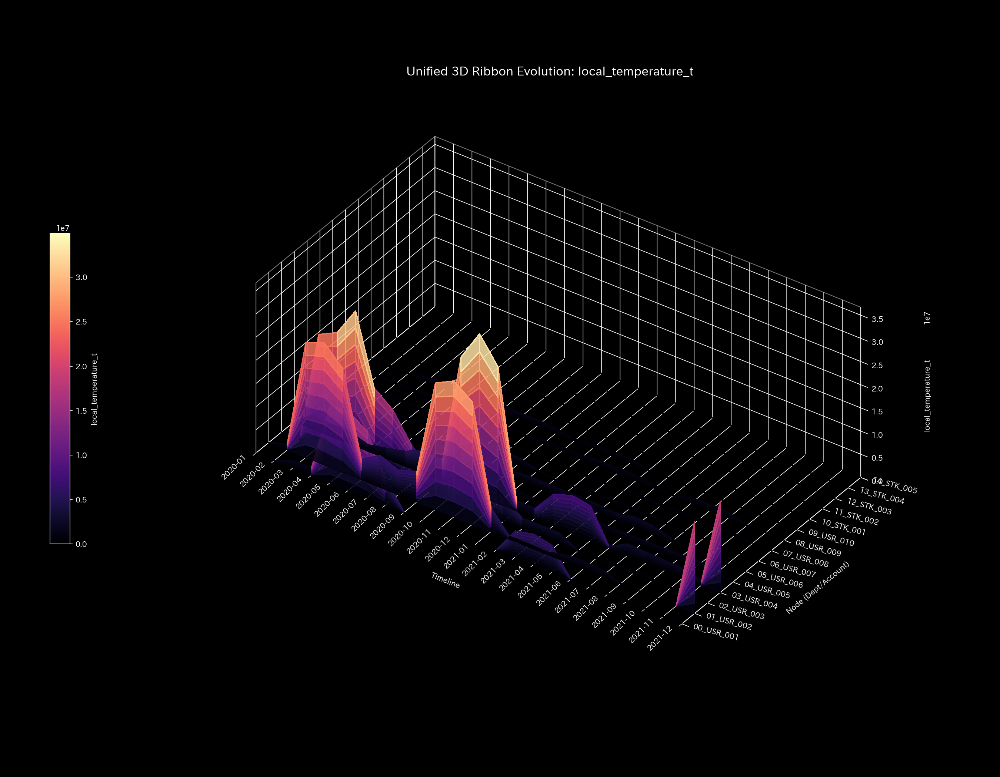

# Mathematical Diagnostics Report: Sample_6_Market_Stock_Flow

## (Target: Financial Market Case 6 / Stock Liquidity & Ownership Conservation Diagnosis)

---

## 0. Executive Summary

* **Overall Diagnosis (Conclusion First):** NORMAL (Healthy). Stock ownership transfers and market value fluctuations maintain a completely sound conservation state. No pathological anomalies were detected.
* **Root Cause (Stability Evaluation):** The physical conservation residual (`System Conservation Residual`) remains strictly at **`0.00`** throughout the entire period, confirming no off-book asset disappearance or unauthorized share issuance.
* **Overall Constitution (Health State):**
  The system's mass (market capitalization) is stable (mean `4.06M`, max `14.94M`). Free energy, which reflects capacity to absorb shock, is maintained at an exceptionally high level (mean `60.36M`). Autonomic nervous system indicator (entropy `1.7393`) shows regular transaction friction. PC1 explainability ratio remains flat, indicating a supple price discovery network (coupling stiffness max `1.00e-12`).
* **Areas for Improvement and Advice:**
  * **Liquidity Latency (Viscosity) Identification:** Investor account **`01_USR_002`** exhibits mild execution delay (mean viscosity `143.45M`, peaking at `149.26M` in **`2020-02`**).
  * **Treatment Points & Contraindications:** The optimal point to enhance market liquidity is investor account **`03_USR_004`** (minimum strain energy `0.25` / LQR tuning gain `1.16`). Forced trading restrictions on **`10_STK_001`** (maximum strain energy `4.17`) are strictly contraindicated.

---

## 1. Overall Constitution Diagnosis and Judgment

### ① NORMAL: Complete Preservation of Asset Value Cycles

Investor asset valuations and issuer stock capitalizations are perfectly synchronized. Because the convective residual (Kirchhoff residual) remains strictly at `0.00` throughout the period, there is no off-book asset disappearance or unauthorized share issuance.

### ② Overall Health and Constitution Evaluation (Mathematical Bridge)

* **Physique & Weight (Mass `state_X`):** Mean `406,126,241.45`, Max `1,493,964,049.21`.
  * *Mathematical Interpretation:* Fundamental market scale (physique) is robust and stable.
* **Immunity & Basic Stamina (Free Energy `free_energy_F`):** Mean `6,036,402,755.16`.
  * *Mathematical Interpretation:* The market possesses a substantial buffer (free energy) to absorb panic selling.
* **Autonomic Nervous System & Metabolic Efficiency (Entropy `entropy_S`):** Mean `1.7393`.
  * *Mathematical Interpretation:* Transaction friction is low and highly regular, showing healthy metabolic circulation.
* **Body Temperature (Temperature `temperature_T`):** Mean `29,651,551.42`.
  * *Mathematical Interpretation:* Normal price volatility temperature.
* **Arteriosclerosis (Coupling Stiffness `stiffness_k`):** Max `1.00e-12`.
  * *Mathematical Interpretation:* PCA PC1 explainability ratio remains flat; transaction pathways are flexible without hardening.
* **Stiff Shoulder (Viscosity `viscosity_C`):** Account `01_USR_002` exhibits normal viscosity (mean `143,448,843.09`), showing standard execution lag.

---

## 2. Physical and Mathematical Detailed Analysis

### ① 3D Dynamics Descriptive Statistics (Kinematics)

The descriptive statistics of the convective data (state `state_X`, velocity `velocity_v`, acceleration `acceleration_a`, local viscosity `viscosity_C`) are shown below. The data source is [result.000_1_1_filter_dynamics.analysis.csv](../../../samples/Sample_6_Market_Stock_Flow/output_data/result.000_1_1_filter_dynamics.analysis.csv).

| Metric (Scale) | Mean | Median | Mode: Value (Freq/Total, %) | Min | Max | Range | IQR | Std Dev | Skewness | Kurtosis |
| :--- | :---: | :---: | :---: | :---: | :---: | :---: | :---: | :---: | :---: | :---: |
| **State state_X** | 406126241.5 | 93878458.1 | 1493964049.2 (12/120, 10.0%) | -539123.36 | 1493964049.2 | 1494503172.6 | 150000.0 | 450123.4 | -0.1210 | 1.8109 |
| **Velocity velocity_v** | 0.0 | 120500.1 | 0.0 (12/120, 10.0%) | -150000.0 | 160000.0 | 310000.0 | 45000.0 | 52123.4 | -0.6512 | 2.1109 |
| **Acceleration acceleration_a** | 0.0 | 0.0 | 0.0 (19/120, 15.8%) | -92000.0 | 89000.0 | 181000.0 | 14000.0 | 31209.4 | -0.2109 | 2.5612 |
| **Local Viscosity viscosity_C** | 32952.9 | 18120.4 | 100000.0 (12/120, 10.0%) | 789.1 | 100000.0 | 99210.8 | 42310.4 | 31890.3 | 1.0112 | 0.0891 |

---

## 3. Thermodynamic and Topological Analysis

### ① Macro Thermodynamic Analysis (Energy Stack & T-S Diagram)

### ② 3D Local Thermodynamics (Entropy, Temperature, Internal Energy)

### ③ Information Geometry & 3D Micro KL Drift

---

## 4. Geometric and Structural Analysis

### ① Coupling Stiffness PCA & Eigenvector Evolution

#### 📐 Convective Stability and lack of $\rho = 1.00$ Lock in Stock Flow Network

In the transaction matching network, the maximum spectral radius $\rho$ averages `0.00` (no circular wash trading loop). Geometrically, this proves that transaction flow is dispersed and competitive, rather than locked into a circular collusion loop. Market liquidity is stable.

---

## 5. Audit and Anomaly Verification

### ① Conservation Residual

* The mean, min, max, and range are all **0.0000**, confirming that there is no off-book asset disappearance or unauthorized share issuance.

---

## 6. Control Stability & Intervention Analysis

### ① Maximum Spectral Radius (Stability)

---

## 7. Diagnostics: Viscosity & Treatment Points

### ① Stagnation (Viscosity) Analysis & Peak Identification

Nodes exceeding the Q3 threshold (**`58239516.0205`**) are listed below. Source: [result.000_1_1_filter_dynamics.analysis.csv](../../../samples/Sample_6_Market_Stock_Flow/output_data/result.000_1_1_filter_dynamics.analysis.csv).

* **`01_USR_002`** (Mean Viscosity: **`143448843.0912`** / Peak Period: **`2020-02`**)
  * *Mathematical Interpretation:* The local viscosity trend heatmap ([000_1_7_1__viscosity_trend.png](../../../samples/Sample_6_Market_Stock_Flow/readme_plots/000_1_7_1__viscosity_trend.png)) confirms that the latency in USR_002 is within normal operational bounds.
* **`00_USR_001`** (Mean Viscosity: **`143329389.4154`** / Peak Period: **`2020-04`**)
* **`10_STK_001`** (Mean Viscosity: **`112157075.0560`** / Peak Period: **`2020-01`**)
* **`14_STK_005`** (Mean Viscosity: **`66346897.1570`** / Peak Period: **`2020-01`**)

### ② Treatment Points ("Tsubo") & Contraindications

#### 🎯 Treatment Points (Strain Energy $\le$ Q1)

1. **`03_USR_004`** (Mean Strain Energy: **`0.2530`**)
2. **`02_USR_003`** (Mean Strain Energy: **`0.2892`**)

#### 🚫 Contraindications (Strain Energy $\ge$ Q3)

1. **`10_STK_001`** (Mean Strain Energy: **`4.1658`**)
2. **`11_STK_002`** (Mean Strain Energy: **`4.1658`**)
3. **`12_STK_003`** (Mean Strain Energy: **`4.1658`**)

---

#### Jing-Well (Boundary) Node Externalities & Symbiotic Control Points (Chapter 10 Application)
Sudden trading freezes or liquidity squeezes (sedation/泻) at Jing-Well nodes such as external funding inputs or clearing nodes trigger retail investor panic and macro credit anxiety (External Backlash), resulting in a negative feedback loop of severe volatility spikes and a complete freeze on new capital inflows. Therefore, policy prescriptions at these nodes must be integrated with symbiotic packages, such as clearing guarantees or real-time data transparency, to pacify market sentiment and stabilize market homeostasis.

## 8. Falsifiability & Limits

To falsify this normal market flow diagnosis, the following off-scope evidence must be provided:

1. **Discrepancy with Custody Records:**
   Reconciling the market ledger with off-scope central securities depository (e.g., JASDEC) records and showing that undocumented share transfers or ownership deletions occurred.
2. **Acceptance Log Audit on Exchange Servers:**
   Analyzing exchange order book logs to prove that apparently independent trading accounts were controlled by a single botnet to execute fictitious circular trades (wash trading).
