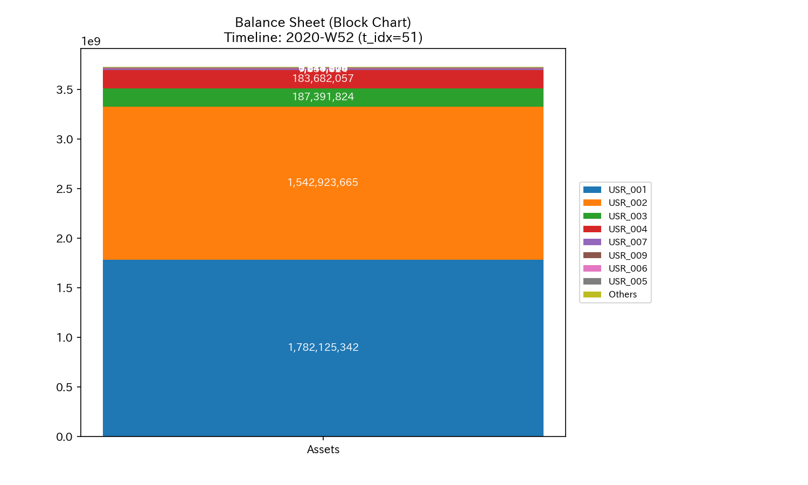
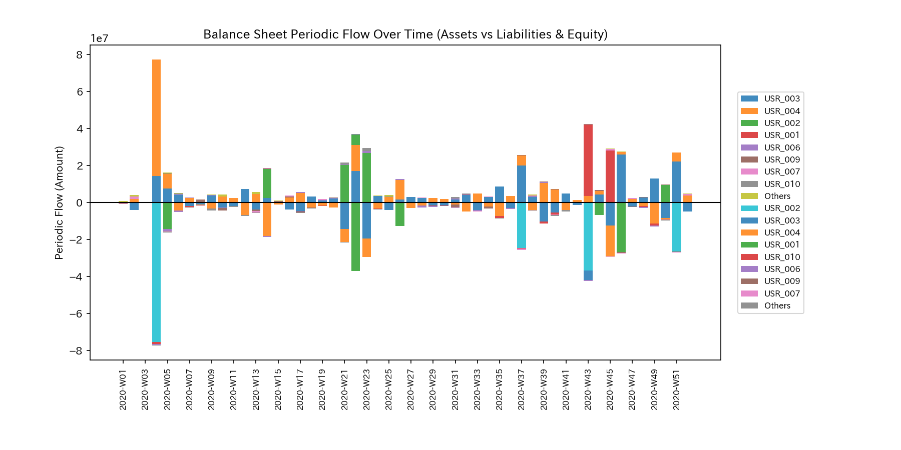
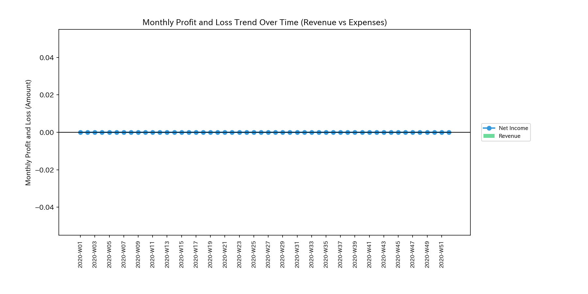

# 🔬 Anomaly Detection & Market Health Report (Sample 7 - Healthy Payment Liquidation Conservation System)

## 1. Executive Summary

* **Overall Status:** 🟢 **Healthy Cash Flow Convection**
* **Severity:** 🟢 **NORMAL (No Anomaly)**
* **Summary:** The system displays a state where the total cash amount (mass) in all user accounts is conserved and steady convection is maintained across the market. The conservation residual remains `0.00` throughout. No cash outflows to off-book accounts or loss of funds exist.

---

## 2. Comparison of Cash Stock and Flow

We compare the total cash balance (B/S equivalent) with the periodic (single-month, non-cumulative) transaction flows (P/L equivalent) in the market.

### Cash Balance Comparison (B/S Equivalent)

* **B/S Asset & Equity Cumulative Trend & Block Chart (Cumulative):**
  
  

* **B/S Cash Balance Periodic Trend (Monthly Non-Cumulative):**
  

### Cash Volume Comparison (P/L Equivalent)

* **P/L Volume Cumulative Trend:**
  

* **P/L Volume Periodic Trend (Monthly Non-Cumulative):**
  

* **Observation:** Payment liquidity (volume) remains stable against volatility. No monopolization by collusive groups or flow blocks (deadlock) exist.

---

## 3. Pathophysiology

* **Diagnosis:** **Normal, Steady Convection**
* The payment convection process, including external deposits and withdrawals, satisfies Kirchhoff's laws. No wash trade loops exist where funds circulate only among specific accounts.

---

## 4. Summary of Mathematical Analysis Results

### 4.1. Mass Conservation and Network Topology

The Kirchhoff residual is exactly **`0.00`**. No cash leaks exist.

* **Macro Forensics Dashboard:**
  

* **Network Topology Evolution:**
  Connections with external boundaries via regular nodes, such as `ACC_Input_From_Outside`, are maintained.

### 4.2. Stiffness Connection & PCA (Stiffness & PCA)

The stiffness matrix shows flexible coupling characteristics. No transaction blocks (Rigid Lock) occur. The eigenvalue ratios in PCA remain stable.

* **PCA Axis Ratio:**
  

### 4.3. Verification of Circular Topology (Spectral Radius)

The maximum spectral radius is exactly **`1.0000`** throughout the period. This is a mathematical consequence of the user accounts being a closed, strongly connected network of payment paths (the saturation point of the Perron-Frobenius theorem). This proves that fluid connection is maintained.

* **System Stability Indicator:**
  

### 4.4. Thermodynamic Indicators and 3D Topology

Internal energy $U$ and free energy $F$ evolve along the thermodynamic limit cycle.

* **Thermodynamic Characteristics & T-S Diagram:**
  
  

---

## 5. Control Interventions and Recommended Actions (LQR & Operations)

* **Operational Plan: Monitor to Maintain Liquidity Convection**
* The system is in a normal state (NORMAL). Emergency interventions via LQR control are unnecessary.

---

## 6. Alerts & Falsifiability

### 6.1. Triaging False Positives

* **Temporary High Volatility:**
  Volume surges or large withdrawals may temporarily raise Z-Scores (state Z-Score `z_score_X` peaking at `399.76`). Since the conservation residual remains `0.00` and the thermodynamic balance is stable, these are rejected as normal market liquidity (false positives).

### 6.2. Falsification Conditions

To reject the normal diagnosis, the following evidence is required:

1. **Third-Party Bank API Raw Logs:** Transaction statements or raw logs proving that off-book accounts were used, violating mass conservation.
2. **Original Collusive Agreements:** Original contracts or agreements proving that participants coordinate to fix market prices or engage in wash trades.
