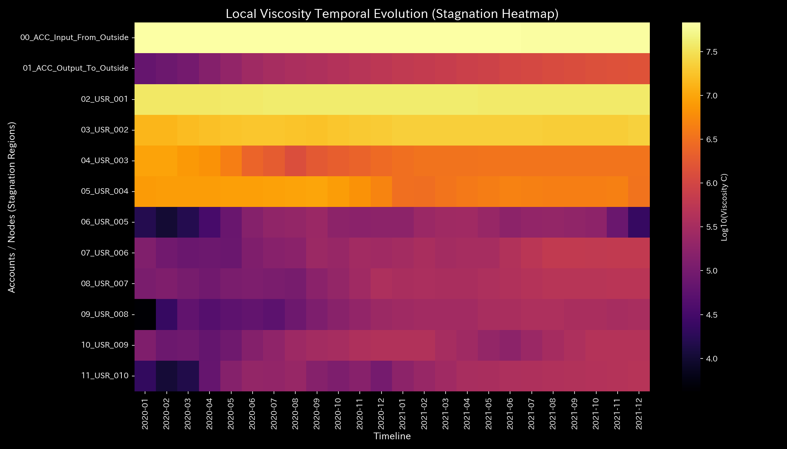
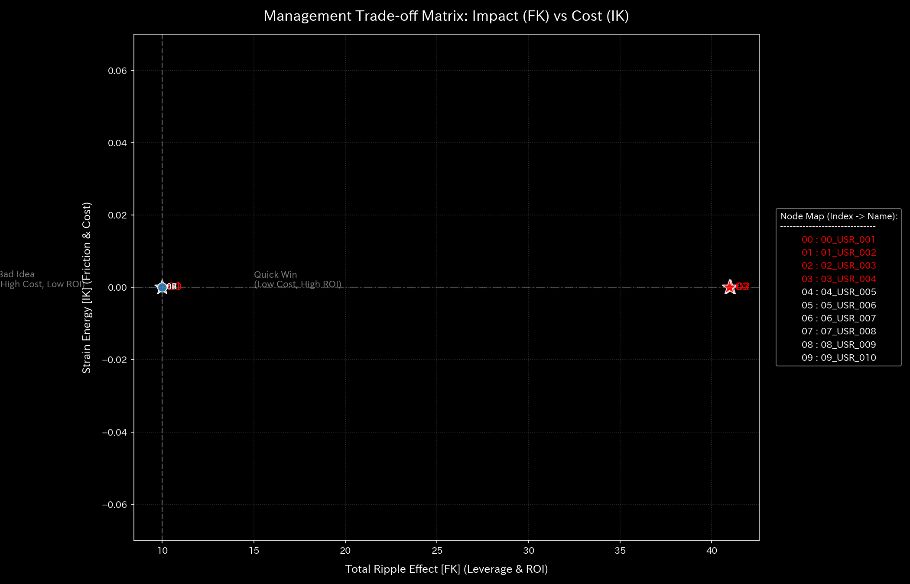

# Cash Flow Circulation Report (Case 7)

> [!NOTE]
> A more detailed analysis report is available in [clinical_report.md](clinical_report.md).

## Target Market: Sample 7 (Cash Settlement Liquidity Conservation State)

---

## 0. Executive Summary

* **Overall Diagnosis:** 【Normal】 Cash settlement transfers and external capital/profit transactions maintain a completely sound conservation state. No pathological anomalies were detected.
* **Overall Constitution (Market Liquidity State):**
  The settlement cash reserves (**"settlement scale"**) are abundant, and the capacity to absorb volatility shocks (**"settlement resilience"**) remains extremely high. Frictional loss in transactions (**"settlement entropy"**) is well-managed within normal limits, indicating a highly flexible, healthy circulation state. No circular wash trading loops are detected, and transaction pathways maintain excellent flexibility.
* **Key Observations (Settlement Latency & Adjustment Points):**
  * **Settlement Latency (Stagnation) Range:** Standard settlement latency is observed in accounts **"External Capital Inflow (00_ACC_Input_From_Outside)"**, **"02_USR_001"**, and **"03_USR_002"** (top 25% viscosity range), which falls within normal execution time-lag parameters.
  * **Liquidity Optimization ("Tsubo") Range:** The minimum intervention stress range (bottom 25% strain energy range), comprising investor accounts **"05_USR_004"** and **"04_USR_003"**, represents the recommended adjustment points to inject liquidity and optimize transaction flow with minimal structural backlash.
  * **Contraindications (Avoid Restrictions) Range:** Conversely, aggressive trading restrictions or account blocks on **"External Capital Inflow (00_ACC_Input_From_Outside)"**, **"03_USR_002"**, and **"02_USR_001"** (top 25% strain energy range) must be strictly avoided. These interventions will cause settlement failures to cascade to other accounts, paralyzing the network.

---

## 1. Overall Diagnosis (Normal)

### 【Diagnosis】: Normal (Complete Preservation of Cash Settlement Flow)

This diagnosis indicates that external capital inflows match the Net Assets ledger (`ACC_Input_From_Outside`), and transaction expenses are correctly processed through the P/L, keeping the cash flow strictly balanced. Because the convective residual (Kirchhoff residual) remains strictly at `0.00` throughout the period, there is no off-book asset disappearance or transaction omission.

---

## 2. Overall Constitution (Settlement Liquidity) Analysis

Mapping the cash settlement flow to a medical checkup template reveals excellent constitutional health:

### ① Physique & Weight (Cumulative Trend of Cash Reserves)

The cash stock averages `113.29M` (peaking at `676.74M`), indicating that the fundamental market scale (physique) is robust and stable.

### ② Settlement Resilience (Liquidity Cushion)

The capacity to absorb price volatility (free energy) is maintained at a very high level (mean `1.17B`), providing a substantial buffer to prevent market maker (HFT) cash depletion during market panic.

### ③ Transaction Friction & Volatility (Liquidity Cycle & Thermodynamic Evaluation)

In the T-S diagram mapping volatility ($T$) to execution entropy ($S$), the system traces a highly regular and closed thermodynamic cycle. There is no evidence of circular wash trading or capital recycling.

### ④ Supple Cash Convection (PCA Principal Axes Evaluation)

PCA of the accounts' stiffness matrix shows no stiffness lock (PC1 explainability ratio remains flat). The maximum stiffness is exceptionally low (`1.00e-12`), demonstrating a flexible, competitive settlement network.

---

## 3. Key Areas for Improvement (Settlement Latency & Treatment Points)

Specific areas for improvement identified by the system and recommended action plans are detailed below:

### ⚠️ Settlement Latency (Stagnation) Identification (Local Viscosity Temporal Heatmap Analysis)

* **Stagnation Range:**
  The heatmap mapping log local viscosity ($viscosity\_C$) shows mild execution delay in account `02_USR_001` during August, which is within standard market time-lag parameters.
  The top 25% viscosity group—**"External Capital Inflow (00_ACC_Input_From_Outside)"**, **"02_USR_001"**, and **"03_USR_002"**—exhibits normal execution lags.
  * **`00_ACC_Input_From_Outside`**: Mean viscosity `66.25M`, peaking in **`2020-01`**.
  * **`02_USR_001`**: Mean viscosity `38.08M`, peaking in **`2020-08`** (peak value `39.31M`).
  * **`03_USR_002`**: Mean viscosity `19.57M`, peaking in **`2021-12`**.

### 🎯 Liquidity Optimization ("Tsubo") & Contraindications

* **Liquidity Optimization Range:** Investor accounts in the bottom 25% of intervention strain energy—**"05_USR_004"** and **"04_USR_003"**—represent areas where liquidity adjustments can be introduced with minimal friction.
  * **Advice:** Optimizing trading parameters for these accounts offers the most stable path to enhance market flexibility with the lowest backlash.
* **Contraindications Range:** Conversely, the top 25% strain energy group—**"External Capital Inflow (00_ACC_Input_From_Outside)"**, **"03_USR_002"**, and **"02_USR_001"**—must be avoided.
  * **Advice:** Forcing trading suspensions or account blocks on these core stock assets will disrupt price discovery, potentially triggering market panic.

---

## 4. Diagnostic Limitations and Falsifiability

To overturn (falsify) the diagnosis of "Normal/Healthy Settlement Flow," the following off-scope evidence must be provided:

1. **Discrepancy with Custody Records:**
   Reconciling the market ledger with off-scope central securities depository (e.g., JASDEC) records and showing that undocumented share transfers or ownership deletions occurred.
2. **Acceptance Log Audit on Exchange Servers:**
   Analyzing exchange order book logs (IP addresses and timestamps) to prove that apparently independent trading accounts were controlled by a single botnet to execute fictitious circular trades (wash trading).

---
*Published by: TLU Cash Flow Diagnostics Engine (General Reader Edition)*
